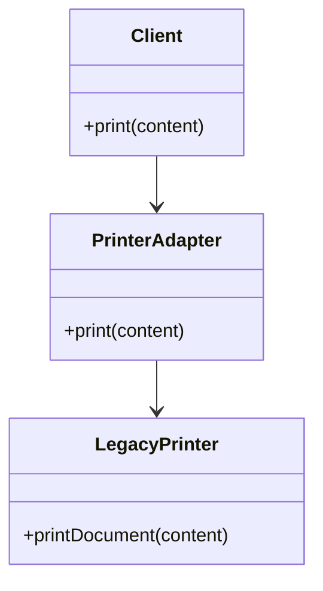

## 4.2.2 Implementation in JavaScript

The Adapter Pattern is a structural design pattern that allows objects with incompatible interfaces to work together. In JavaScript, this pattern is particularly useful due to the language's dynamic typing and prototypal inheritance. In this section, we will explore how to implement the Adapter Pattern in JavaScript, using both class-based and object-based approaches. We will also discuss best practices and common pitfalls to avoid.

### Understanding the Adapter Pattern

Before diving into the implementation, let's briefly revisit the concept of the Adapter Pattern. The primary goal of this pattern is to convert the interface of a class into another interface that a client expects. This allows classes to work together that couldn't otherwise because of incompatible interfaces.

### Class-Based Adapter Implementation

In a class-based approach, we create a new class that wraps the existing class and implements the desired interface. This adapter class translates the calls from the client to the methods of the wrapped class.

#### Example Scenario

Imagine we have a `LegacyPrinter` class that prints documents, but we need it to work with a new `AdvancedPrinter` interface that our application uses.

```javascript
// LegacyPrinter class with an incompatible interface
class LegacyPrinter {
  printDocument(content) {
    console.log(`Printing document: ${content}`);
  }
}

// Desired interface for AdvancedPrinter
class AdvancedPrinter {
  print(content) {
    throw new Error("This method should be overridden!");
  }
}

// Adapter class that makes LegacyPrinter compatible with AdvancedPrinter
class PrinterAdapter extends AdvancedPrinter {
  constructor(legacyPrinter) {
    super();
    this.legacyPrinter = legacyPrinter;
  }

  print(content) {
    // Adapting the method call to the legacy interface
    this.legacyPrinter.printDocument(content);
  }
}

// Client code
const legacyPrinter = new LegacyPrinter();
const printerAdapter = new PrinterAdapter(legacyPrinter);
printerAdapter.print("Hello, world!");
```

In this example, `PrinterAdapter` extends `AdvancedPrinter` and wraps `LegacyPrinter`. It overrides the `print` method to call `printDocument` on the `LegacyPrinter` instance, thus adapting the interface.

### Object-Based Adapter Implementation

JavaScript's dynamic nature allows us to implement the Adapter Pattern using objects without the need for classes. This approach can be more flexible and concise.

#### Example Scenario

Let's adapt the same `LegacyPrinter` to work with a new interface using an object-based approach.

```javascript
// LegacyPrinter object with an incompatible interface
const legacyPrinter = {
  printDocument: function(content) {
    console.log(`Printing document: ${content}`);
  }
};

// Adapter object that makes LegacyPrinter compatible with the new interface
const printerAdapter = {
  print: function(content) {
    // Adapting the method call to the legacy interface
    legacyPrinter.printDocument(content);
  }
};

// Client code
printerAdapter.print("Hello, world!");
```

Here, `printerAdapter` is an object that provides the `print` method, adapting the call to `printDocument` on `legacyPrinter`.

### JavaScript Features Affecting Implementation

JavaScript's prototypal inheritance and dynamic typing offer unique advantages and challenges when implementing the Adapter Pattern.

#### Prototypes

JavaScript's prototype-based inheritance allows us to extend or modify objects at runtime. This can be useful for creating adapters that need to dynamically adapt interfaces.

```javascript
// Modifying the prototype of an existing object
function modifyPrototype(obj) {
  obj.print = function(content) {
    this.printDocument(content);
  };
}

const legacyPrinter = {
  printDocument: function(content) {
    console.log(`Printing document: ${content}`);
  }
};

modifyPrototype(legacyPrinter);
legacyPrinter.print("Hello, world!");
```

In this example, we modify the prototype of `legacyPrinter` to add a `print` method, effectively adapting its interface.

#### Dynamic Typing

JavaScript's dynamic typing allows us to create flexible adapters that can handle different types of objects at runtime. This can be both a strength and a source of potential pitfalls.

### Best Practices and Common Pitfalls

When implementing the Adapter Pattern in JavaScript, keep the following best practices and pitfalls in mind:

- **Encapsulation**: Ensure that the adapter encapsulates the adapted object and does not expose its internal details to the client.
- **Single Responsibility**: The adapter should only be responsible for adapting the interface, not for additional logic.
- **Performance**: Be mindful of performance implications, especially when adapting interfaces in performance-critical applications.
- **Testing**: Thoroughly test adapters to ensure they correctly translate calls between interfaces.

### Try It Yourself

To deepen your understanding, try modifying the code examples above. For instance, add additional methods to the `LegacyPrinter` and adapt them in the `PrinterAdapter`. Experiment with different object structures and see how the adapter pattern can be applied.

### Visualizing the Adapter Pattern

To better understand how the Adapter Pattern works, let's visualize the relationship between the client, adapter, and adaptee using a UML class diagram.



In this diagram, the `Client` interacts with the `PrinterAdapter`, which in turn interacts with the `LegacyPrinter`. The adapter translates the client's calls to the appropriate methods on the adaptee.

### Further Reading

For more information on the Adapter Pattern and its applications, consider exploring the following resources:

- [MDN Web Docs: Classes](https://developer.mozilla.org/en-US/docs/Web/JavaScript/Reference/Classes)
- [MDN Web Docs: Prototypes](https://developer.mozilla.org/en-US/docs/Web/JavaScript/Inheritance_and_the_prototype_chain)
- [Refactoring Guru: Adapter Pattern](https://refactoring.guru/design-patterns/adapter)

### Knowledge Check

To reinforce your understanding, consider the following questions:

1. What is the primary purpose of the Adapter Pattern?
2. How does a class-based adapter differ from an object-based adapter in JavaScript?
3. What are some advantages of using JavaScript's dynamic typing in implementing adapters?
4. Why is it important to encapsulate the adapted object in an adapter?
5. What are some common pitfalls to avoid when implementing adapters?

### Embrace the Journey

Remember, implementing design patterns like the Adapter Pattern is a journey of exploration and learning. As you practice and experiment with these patterns, you'll gain a deeper understanding of how to write maintainable and scalable code. Keep experimenting, stay curious, and enjoy the journey!

## Quiz Time!



### What is the primary purpose of the Adapter Pattern?

- [x] To allow incompatible interfaces to work together
- [ ] To enhance the performance of existing classes
- [ ] To provide a simplified interface to a complex subsystem
- [ ] To create a single instance of a class

> **Explanation:** The Adapter Pattern is used to allow incompatible interfaces to work together by converting the interface of a class into another interface that a client expects.

### How does a class-based adapter differ from an object-based adapter in JavaScript?

- [x] A class-based adapter uses inheritance, while an object-based adapter uses composition
- [ ] A class-based adapter is more flexible than an object-based adapter
- [ ] An object-based adapter cannot adapt multiple interfaces
- [ ] A class-based adapter is always more efficient

> **Explanation:** A class-based adapter typically uses inheritance to extend an interface, while an object-based adapter uses composition to wrap an object and adapt its interface.

### What is a key advantage of using JavaScript's dynamic typing in implementing adapters?

- [x] It allows for flexible adapters that can handle different types of objects at runtime
- [ ] It ensures type safety and prevents runtime errors
- [ ] It simplifies the implementation of complex algorithms
- [ ] It reduces the need for testing

> **Explanation:** JavaScript's dynamic typing allows for flexible adapters that can adapt different types of objects at runtime, making it easier to handle various scenarios.

### Why is it important to encapsulate the adapted object in an adapter?

- [x] To hide the implementation details and provide a consistent interface
- [ ] To improve the performance of the adapted object
- [ ] To allow direct access to the adapted object's methods
- [ ] To simplify the adapter's implementation

> **Explanation:** Encapsulating the adapted object in an adapter hides its implementation details and provides a consistent interface to the client, ensuring better abstraction and design.

### What is a common pitfall to avoid when implementing adapters in JavaScript?

- [x] Exposing the internal details of the adapted object
- [ ] Using prototypes to modify the adapted object
- [ ] Implementing adapters for every class in the system
- [ ] Using dynamic typing to handle different object types

> **Explanation:** A common pitfall is exposing the internal details of the adapted object, which breaks encapsulation and can lead to tight coupling between components.

### In the class-based adapter example, what method does the PrinterAdapter class override?

- [x] print
- [ ] printDocument
- [ ] printContent
- [ ] printAdapter

> **Explanation:** The PrinterAdapter class overrides the print method to adapt the call to the printDocument method of the LegacyPrinter class.

### What is a benefit of using prototypes in JavaScript when implementing the Adapter Pattern?

- [x] It allows for runtime modification of objects to adapt interfaces
- [ ] It ensures type safety and prevents runtime errors
- [ ] It simplifies the implementation of complex algorithms
- [ ] It reduces the need for testing

> **Explanation:** Using prototypes allows for runtime modification of objects, enabling the adaptation of interfaces without the need for additional classes or objects.

### Which of the following is a best practice when implementing the Adapter Pattern?

- [x] Ensure the adapter only adapts the interface and does not add additional logic
- [ ] Use adapters to enhance the performance of existing classes
- [ ] Implement adapters for every class in the system
- [ ] Avoid using encapsulation in adapters

> **Explanation:** A best practice is to ensure that the adapter only adapts the interface and does not add additional logic, maintaining a single responsibility for the adapter.

### What is the role of the PrinterAdapter in the provided class-based example?

- [x] To adapt the interface of LegacyPrinter to be compatible with AdvancedPrinter
- [ ] To enhance the performance of LegacyPrinter
- [ ] To provide a simplified interface to LegacyPrinter
- [ ] To create a single instance of LegacyPrinter

> **Explanation:** The PrinterAdapter adapts the interface of LegacyPrinter to be compatible with AdvancedPrinter, allowing it to work with the client's expected interface.

### True or False: JavaScript's dynamic typing can lead to potential pitfalls when implementing adapters.

- [x] True
- [ ] False

> **Explanation:** True. While dynamic typing offers flexibility, it can also lead to potential pitfalls, such as runtime errors and unexpected behavior if not handled carefully.


