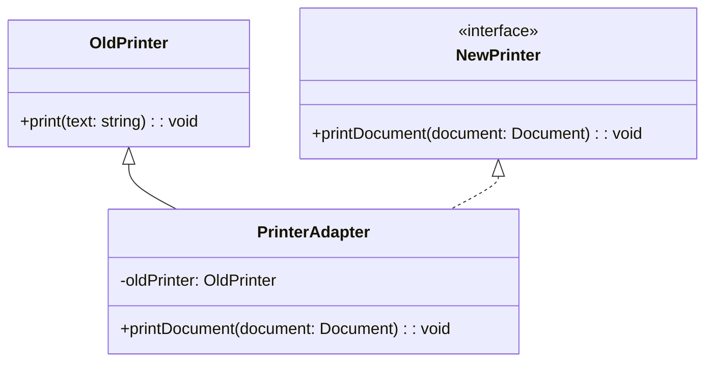

## 4.2.3 Implementation in TypeScript

In this section, we will delve into the implementation of the Adapter Pattern using TypeScript. The Adapter Pattern is a structural design pattern that allows objects with incompatible interfaces to work together. By leveraging TypeScript's powerful type system, we can create robust and maintainable adapter implementations that ensure type safety and enhance code reliability.

### Understanding the Adapter Pattern

Before we dive into the TypeScript implementation, let's briefly revisit the Adapter Pattern. The primary goal of this pattern is to allow two incompatible interfaces to communicate. This is achieved by introducing an adapter that acts as a bridge between the two interfaces.

In TypeScript, we can utilize interfaces and classes to define the expected and existing interfaces, and then create an adapter class that implements the expected interface while internally using the existing interface.

### Defining Interfaces in TypeScript

To implement the Adapter Pattern in TypeScript, we start by defining the interfaces for the existing and expected systems. Let's consider a scenario where we have an `OldPrinter` class with a `print` method, and we want to adapt it to work with a `NewPrinter` interface that expects a `printDocument` method.

```typescript
// Existing interface
class OldPrinter {
  print(text: string): void {
    console.log(`Printing: ${text}`);
  }
}

// Expected interface
interface NewPrinter {
  printDocument(document: string): void;
}
```

### Creating the Adapter Class

Next, we create an adapter class that implements the `NewPrinter` interface and internally uses an instance of `OldPrinter`. The adapter class will translate the `printDocument` call to a `print` call on the `OldPrinter` instance.

```typescript
// Adapter class
class PrinterAdapter implements NewPrinter {
  private oldPrinter: OldPrinter;

  constructor(oldPrinter: OldPrinter) {
    this.oldPrinter = oldPrinter;
  }

  printDocument(document: string): void {
    // Translate the call to the old interface
    this.oldPrinter.print(document);
  }
}
```

### Leveraging TypeScript's Static Typing

TypeScript's static typing plays a crucial role in ensuring that our adapter correctly implements the expected interface. By defining the `NewPrinter` interface, TypeScript enforces that the `PrinterAdapter` class provides a `printDocument` method, reducing the risk of runtime errors.

### Handling Type Compatibility

In some cases, the existing and expected interfaces might have different data types or structures. The adapter must handle these differences by performing necessary transformations. Let's modify our example to demonstrate this:

```typescript
// Modified existing interface
class OldPrinter {
  print(text: string): void {
    console.log(`Printing: ${text}`);
  }
}

// Modified expected interface
interface NewPrinter {
  printDocument(document: Document): void;
}

// Document type
type Document = {
  title: string;
  content: string;
};

// Adapter class with type transformation
class PrinterAdapter implements NewPrinter {
  private oldPrinter: OldPrinter;

  constructor(oldPrinter: OldPrinter) {
    this.oldPrinter = oldPrinter;
  }

  printDocument(document: Document): void {
    // Transform Document to string
    const text = `${document.title}\n${document.content}`;
    this.oldPrinter.print(text);
  }
}
```

### Differences from JavaScript Implementation

In JavaScript, implementing the Adapter Pattern often involves dynamic typing, which can lead to runtime errors if the adapter does not correctly implement the expected interface. TypeScript's static typing mitigates this risk by providing compile-time checks, ensuring that the adapter adheres to the expected interface.

### Visualizing the Adapter Pattern

To better understand the flow of the Adapter Pattern, let's visualize it using a class diagram:



**Figure 1**: The class diagram illustrates how the `PrinterAdapter` class implements the `NewPrinter` interface and uses an instance of `OldPrinter` to fulfill the `printDocument` method.

### Try It Yourself

Now that we've covered the basics of implementing the Adapter Pattern in TypeScript, it's time to experiment. Try modifying the code examples to adapt different interfaces or add additional methods to the adapter class. This hands-on practice will deepen your understanding of the pattern.

### Knowledge Check

- What is the primary purpose of the Adapter Pattern?
- How does TypeScript's static typing enhance the reliability of the Adapter Pattern?
- What role does the adapter class play in the Adapter Pattern?

### Key Takeaways

- The Adapter Pattern allows incompatible interfaces to work together by introducing an adapter.
- TypeScript's static typing ensures that the adapter correctly implements the expected interface.
- Handling type compatibility and transformations is crucial when implementing the Adapter Pattern.

### Further Reading

For more information on the Adapter Pattern and other design patterns, consider exploring the following resources:

- [MDN Web Docs: Design Patterns](https://developer.mozilla.org/en-US/docs/Web/JavaScript/Guide/Design_Patterns)
- [Refactoring Guru: Adapter Pattern](https://refactoring.guru/design-patterns/adapter)
- [TypeScript Official Documentation](https://www.typescriptlang.org/docs/)

## Quiz Time!



### What is the primary purpose of the Adapter Pattern?

- [x] To allow incompatible interfaces to work together
- [ ] To create a single instance of a class
- [ ] To separate the construction of a complex object from its representation
- [ ] To define a family of algorithms

> **Explanation:** The Adapter Pattern is used to allow two incompatible interfaces to communicate by introducing an adapter.

### How does TypeScript's static typing enhance the Adapter Pattern?

- [x] By providing compile-time checks for interface adherence
- [ ] By allowing dynamic method invocation
- [ ] By reducing the need for interfaces
- [ ] By enabling runtime polymorphism

> **Explanation:** TypeScript's static typing ensures that the adapter correctly implements the expected interface, reducing the risk of runtime errors.

### What role does the adapter class play in the Adapter Pattern?

- [x] It acts as a bridge between two incompatible interfaces
- [ ] It creates instances of a class
- [ ] It defines a family of related objects
- [ ] It manages the lifecycle of an object

> **Explanation:** The adapter class translates calls from the expected interface to the existing interface, allowing them to work together.

### In the provided example, what method does the `PrinterAdapter` class implement?

- [x] printDocument
- [ ] print
- [ ] printText
- [ ] printContent

> **Explanation:** The `PrinterAdapter` class implements the `printDocument` method as defined by the `NewPrinter` interface.

### What transformation does the `PrinterAdapter` perform in the modified example?

- [x] Converts a `Document` type to a string
- [ ] Converts a string to a `Document` type
- [ ] Converts a number to a string
- [ ] Converts an array to a string

> **Explanation:** The `PrinterAdapter` converts a `Document` type to a string format suitable for the `OldPrinter` class.

### Which TypeScript feature helps in ensuring that the adapter adheres to the expected interface?

- [x] Interfaces
- [ ] Classes
- [ ] Functions
- [ ] Variables

> **Explanation:** Interfaces in TypeScript define the expected structure, ensuring that the adapter adheres to it.

### What is a key difference between implementing the Adapter Pattern in TypeScript versus JavaScript?

- [x] TypeScript provides static typing for compile-time checks
- [ ] JavaScript supports interfaces natively
- [ ] TypeScript allows dynamic method invocation
- [ ] JavaScript enforces strict type checking

> **Explanation:** TypeScript's static typing provides compile-time checks, which JavaScript lacks due to its dynamic nature.

### What is the main advantage of using TypeScript for implementing design patterns?

- [x] Enhanced code reliability and maintainability
- [ ] Faster runtime performance
- [ ] Smaller code size
- [ ] Automatic code generation

> **Explanation:** TypeScript's static typing and interfaces enhance code reliability and maintainability, especially in design patterns.

### What is the purpose of the `printDocument` method in the `NewPrinter` interface?

- [x] To define the expected method for printing documents
- [ ] To print text directly
- [ ] To create a document
- [ ] To delete a document

> **Explanation:** The `printDocument` method defines the expected interface for printing documents, which the adapter must implement.

### True or False: The Adapter Pattern can only be used with classes in TypeScript.

- [ ] True
- [x] False

> **Explanation:** The Adapter Pattern can be used with both classes and interfaces in TypeScript, allowing for flexible design.



Remember, this is just the beginning. As you progress, you'll build more complex and interactive applications using design patterns. Keep experimenting, stay curious, and enjoy the journey!
