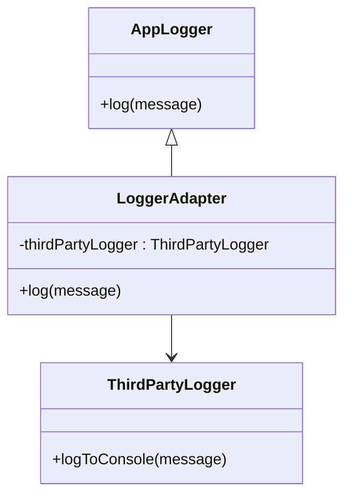

## 4.2.4 Use Cases and Examples

The Adapter pattern is a structural design pattern that allows objects with incompatible interfaces to collaborate. This pattern is particularly useful in scenarios where you need to integrate third-party libraries or APIs that do not match the existing system's interface. In this section, we will delve into the practical applications of the Adapter pattern, providing real-world examples and code snippets to illustrate its utility in JavaScript and TypeScript.

### Real-World Examples of the Adapter Pattern

#### Integrating Third-Party Libraries

Imagine you are developing an application that requires integrating a third-party logging library. Your application has its own logging interface, but the third-party library uses a different interface. The Adapter pattern can bridge this gap, allowing seamless integration without altering the existing codebase.

```javascript
// Existing logging interface
class AppLogger {
  log(message) {
    console.log(`AppLog: ${message}`);
  }
}

// Third-party logging library
class ThirdPartyLogger {
  logToConsole(message) {
    console.log(`ThirdPartyLog: ${message}`);
  }
}

// Adapter class
class LoggerAdapter {
  constructor() {
    this.thirdPartyLogger = new ThirdPartyLogger();
  }

  log(message) {
    this.thirdPartyLogger.logToConsole(message);
  }
}

// Usage
const logger = new LoggerAdapter();
logger.log("This is a log message.");
```

In this example, the `LoggerAdapter` class adapts the `ThirdPartyLogger` to the `AppLogger` interface. This approach allows the application to use the third-party library without modifying its existing logging interface, adhering to the Open/Closed Principle.

#### Working with Different Data Formats

Another common use case for the Adapter pattern is when dealing with data from various sources that need to be unified into a single format. Consider an application that aggregates data from multiple APIs, each providing data in a different format.

```typescript
// Existing data interface
interface UserData {
  name: string;
  age: number;
}

// API response format
interface ApiUserData {
  fullName: string;
  yearsOld: number;
}

// Adapter class
class UserDataAdapter implements UserData {
  private apiUserData: ApiUserData;

  constructor(apiUserData: ApiUserData) {
    this.apiUserData = apiUserData;
  }

  get name(): string {
    return this.apiUserData.fullName;
  }

  get age(): number {
    return this.apiUserData.yearsOld;
  }
}

// Usage
const apiData: ApiUserData = { fullName: "John Doe", yearsOld: 30 };
const userData: UserData = new UserDataAdapter(apiData);
console.log(`Name: ${userData.name}, Age: ${userData.age}`);
```

Here, the `UserDataAdapter` class adapts the `ApiUserData` format to the `UserData` interface, allowing the application to process data uniformly regardless of its source.

### Impact on Code Flexibility

The Adapter pattern significantly enhances code flexibility, especially in large-scale applications. By decoupling the client code from the specific implementations of external systems, the Adapter pattern allows developers to switch out or upgrade components with minimal impact on the overall system. This decoupling is crucial in maintaining a scalable and maintainable codebase.

#### Promoting the Open/Closed Principle

The Adapter pattern exemplifies the Open/Closed Principle by enabling new functionalities to be added without modifying existing code. When a new interface needs to be integrated, developers can create a new adapter rather than altering the existing system. This approach minimizes the risk of introducing bugs and reduces the time and effort required for testing.

### Guidelines for Applying the Adapter Pattern

To effectively apply the Adapter pattern, consider the following guidelines:

1. **Identify Incompatible Interfaces**: Determine where interfaces in your system do not align, especially when integrating third-party components or legacy systems.

2. **Assess the Impact of Change**: Use the Adapter pattern when changes to existing code would be costly or risky. Adapters provide a way to introduce new functionality without altering the core system.

3. **Evaluate the Frequency of Change**: If the external system or interface changes frequently, an adapter can act as a buffer, isolating these changes from the main application logic.

4. **Consider Performance Overhead**: While adapters add an additional layer of abstraction, ensure that the performance overhead is acceptable for your application's requirements.

5. **Maintain Clear Documentation**: Clearly document the purpose and usage of adapters within your codebase to aid future developers in understanding their role and functionality.

### Try It Yourself

To deepen your understanding of the Adapter pattern, try modifying the code examples provided above. For instance, create an adapter for a different third-party library or data format. Experiment with adding new methods to the adapter and observe how it impacts the integration process.

### Visualizing the Adapter Pattern

To further illustrate the Adapter pattern, let's visualize how it operates within a system using a class diagram.



**Diagram Description**: This class diagram shows the relationship between the `AppLogger`, `ThirdPartyLogger`, and `LoggerAdapter`. The `LoggerAdapter` implements the `AppLogger` interface and uses the `ThirdPartyLogger` to fulfill its logging functionality.

### References and Further Reading

- [MDN Web Docs: Adapter Pattern](https://developer.mozilla.org/en-US/docs/Web/JavaScript/Guide/Adapter_Pattern)
- [Refactoring Guru: Adapter Pattern](https://refactoring.guru/design-patterns/adapter)
- [W3Schools: JavaScript Design Patterns](https://www.w3schools.com/js/js_design_patterns.asp)

### Knowledge Check

Before moving on, let's summarize the key takeaways:

- The Adapter pattern allows incompatible interfaces to work together by acting as a bridge.
- It promotes the Open/Closed Principle by enabling new interfaces to be integrated without modifying existing code.
- Adapters enhance code flexibility and maintainability, particularly in large-scale applications.
- Identifying when to use the Adapter pattern involves assessing interface compatibility, change impact, and performance considerations.

## Quiz Time!



### What is the primary purpose of the Adapter pattern?

- [x] To allow incompatible interfaces to work together
- [ ] To create a single instance of a class
- [ ] To separate object construction from its representation
- [ ] To add responsibilities to objects dynamically

> **Explanation:** The Adapter pattern is designed to allow incompatible interfaces to work together by acting as a bridge between them.

### How does the Adapter pattern promote the Open/Closed Principle?

- [x] By allowing new interfaces to be integrated without modifying existing code
- [ ] By ensuring classes have only one responsibility
- [ ] By creating specific interfaces rather than general-purpose ones
- [ ] By relying on abstractions instead of concrete implementations

> **Explanation:** The Adapter pattern promotes the Open/Closed Principle by enabling new functionalities to be added without altering existing code.

### In which scenario is the Adapter pattern most beneficial?

- [x] When integrating third-party libraries with different interfaces
- [ ] When creating a complex object step by step
- [ ] When managing shared objects efficiently
- [ ] When encapsulating requests as objects

> **Explanation:** The Adapter pattern is particularly useful when integrating third-party libraries or APIs that have different interfaces from the existing system.

### What is a key consideration when applying the Adapter pattern?

- [x] Performance overhead
- [ ] Number of classes in the system
- [ ] Complexity of algorithms
- [ ] Number of methods in a class

> **Explanation:** While adapters add an additional layer of abstraction, it's important to ensure that the performance overhead is acceptable for the application's requirements.

### Which of the following is a real-world example of the Adapter pattern?

- [x] Integrating a third-party logging library
- [ ] Creating a facade for a complex subsystem
- [ ] Adding responsibilities to objects dynamically
- [ ] Composing objects into tree structures

> **Explanation:** Integrating a third-party logging library with a different interface is a common real-world example of the Adapter pattern.

### What does the Adapter pattern allow developers to do?

- [x] Switch out or upgrade components with minimal impact
- [ ] Create a single instance of a class
- [ ] Separate object construction from its representation
- [ ] Add responsibilities to objects dynamically

> **Explanation:** The Adapter pattern allows developers to switch out or upgrade components with minimal impact on the overall system.

### How does the Adapter pattern affect code flexibility?

- [x] It enhances code flexibility by decoupling client code from specific implementations
- [ ] It reduces code flexibility by tightly coupling classes
- [ ] It has no impact on code flexibility
- [ ] It makes code more rigid and less adaptable

> **Explanation:** The Adapter pattern enhances code flexibility by decoupling the client code from the specific implementations of external systems.

### What is a guideline for applying the Adapter pattern?

- [x] Identify incompatible interfaces
- [ ] Create a single instance of a class
- [ ] Use inheritance over composition
- [ ] Avoid using interfaces

> **Explanation:** A key guideline for applying the Adapter pattern is to identify where interfaces in your system do not align.

### Which of the following is NOT a benefit of the Adapter pattern?

- [ ] Enhances code flexibility
- [ ] Promotes the Open/Closed Principle
- [ ] Allows incompatible interfaces to work together
- [x] Reduces the number of classes in a system

> **Explanation:** The Adapter pattern does not necessarily reduce the number of classes in a system; it may actually introduce additional classes to bridge interfaces.

### True or False: The Adapter pattern can be used to unify data formats from multiple sources.

- [x] True
- [ ] False

> **Explanation:** The Adapter pattern can be used to unify data formats from multiple sources by adapting them to a single interface.



Remember, this is just the beginning. As you progress, you'll build more complex and interactive applications. Keep experimenting, stay curious, and enjoy the journey!
