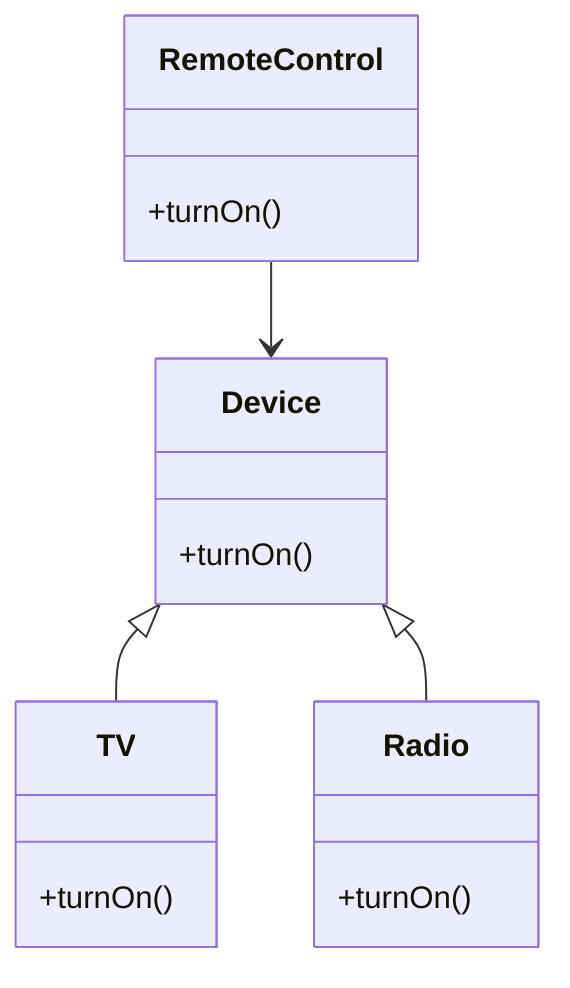

## 4.3.1 Intent and Motivation

In the realm of software design, the Bridge pattern stands out as a powerful tool to decouple abstraction from implementation, allowing both to evolve independently. This separation is crucial for building scalable and flexible systems, especially when dealing with complex applications that need to support multiple platforms or devices. In this section, we will delve into the intent and motivation behind the Bridge pattern, explore its significance, and understand how it can be effectively implemented in JavaScript and TypeScript.

### Understanding the Bridge Pattern

The Bridge pattern is a structural design pattern that aims to separate an abstraction from its implementation so that the two can vary independently. This pattern is particularly useful when a system needs to be extended in multiple ways, such as supporting different platforms or devices. By decoupling the abstraction from the implementation, the Bridge pattern enables developers to change or extend either part without affecting the other.

#### Key Concepts

- **Abstraction**: The high-level control layer of the application that defines the operations that can be performed.
- **Implementation**: The low-level layer that provides the actual functionality for the operations defined by the abstraction.
- **Decoupling**: The process of separating two components so that changes in one do not affect the other.

### The Problem with Tightly Coupled Systems

In traditional object-oriented design, inheritance is often used to extend functionality. However, this approach can lead to tightly coupled systems where the abstraction and implementation are intertwined. This tight coupling can result in several issues:

1. **Rigidity**: Changes in the implementation require changes in the abstraction, making the system difficult to modify.
2. **Limited Flexibility**: Extending the system to support new features or platforms often requires significant changes to the existing codebase.
3. **Increased Complexity**: As the system grows, the inheritance hierarchy can become complex and difficult to manage.

#### Example: Remote Controls and Devices

Consider a scenario where you are designing a system to control various devices, such as TVs and radios, using remote controls. In a tightly coupled system, you might create a separate class for each combination of device and remote control, leading to a proliferation of classes and a complex inheritance hierarchy.

```javascript
// Tightly coupled example
class TVRemote {
  turnOn() {
    console.log("Turning on the TV");
  }
}

class RadioRemote {
  turnOn() {
    console.log("Turning on the Radio");
  }
}
```

In this example, adding a new device or a new type of remote control requires creating additional classes, leading to a rigid and inflexible system.

### The Bridge Pattern Solution

The Bridge pattern addresses these issues by separating the abstraction (remote control) from the implementation (device). This separation allows you to extend both parts independently, leading to a more flexible and scalable system.

#### Implementing the Bridge Pattern

To implement the Bridge pattern, we define an abstraction interface that contains the operations to be performed. The abstraction maintains a reference to an implementation object, which provides the actual functionality.

```javascript
// Abstraction
class RemoteControl {
  constructor(device) {
    this.device = device;
  }

  turnOn() {
    this.device.turnOn();
  }
}

// Implementation
class TV {
  turnOn() {
    console.log("Turning on the TV");
  }
}

class Radio {
  turnOn() {
    console.log("Turning on the Radio");
  }
}

// Usage
const tv = new TV();
const radio = new Radio();

const tvRemote = new RemoteControl(tv);
const radioRemote = new RemoteControl(radio);

tvRemote.turnOn(); // Output: Turning on the TV
radioRemote.turnOn(); // Output: Turning on the Radio
```

In this example, the `RemoteControl` class acts as the abstraction, while the `TV` and `Radio` classes provide the implementation. By decoupling these components, we can easily extend the system to support new devices or remote controls without modifying existing code.

### Advantages of the Bridge Pattern

The Bridge pattern offers several advantages in terms of scalability and flexibility:

1. **Independent Extensibility**: You can extend the abstraction and implementation independently, allowing for greater flexibility in system design.
2. **Reduced Complexity**: By decoupling the abstraction from the implementation, the Bridge pattern reduces the complexity of the system, making it easier to understand and maintain.
3. **Improved Scalability**: The pattern enables you to add new features or support new platforms without affecting existing code, leading to a more scalable system.

### Scenarios for Using the Bridge Pattern

The Bridge pattern is particularly useful in scenarios where a system needs to support multiple platforms or devices. Some common use cases include:

- **Cross-Platform Applications**: Applications that need to run on different operating systems or devices can benefit from the Bridge pattern by separating platform-specific code from the core application logic.
- **Device Control Systems**: Systems that control various devices, such as home automation systems, can use the Bridge pattern to decouple the control logic from the device-specific implementations.
- **Graphics Rendering Engines**: Graphics engines that need to support different rendering APIs, such as OpenGL and DirectX, can use the Bridge pattern to separate the rendering logic from the API-specific code.

### Visualizing the Bridge Pattern

To better understand the Bridge pattern, let's visualize the relationship between the abstraction and implementation using a class diagram.



This diagram illustrates how the `RemoteControl` class maintains a reference to a `Device` object, allowing it to delegate the `turnOn` operation to the specific device implementation.

### Try It Yourself

To gain a deeper understanding of the Bridge pattern, try modifying the code examples provided. Here are some suggestions:

- **Add a New Device**: Implement a new device class, such as `AirConditioner`, and integrate it with the `RemoteControl` class.
- **Extend the Abstraction**: Add a new operation to the `RemoteControl` class, such as `turnOff`, and implement it in the device classes.
- **Experiment with TypeScript**: Convert the JavaScript code examples to TypeScript, taking advantage of TypeScript's type system to enforce the separation between abstraction and implementation.

### Further Reading

For more information on the Bridge pattern and its applications, consider exploring the following resources:

- [Design Patterns: Elements of Reusable Object-Oriented Software](https://en.wikipedia.org/wiki/Design_Patterns) - The seminal book on design patterns by Erich Gamma, Richard Helm, Ralph Johnson, and John Vlissides.
- [MDN Web Docs: JavaScript](https://developer.mozilla.org/en-US/docs/Web/JavaScript) - Comprehensive documentation on JavaScript, including object-oriented programming concepts.
- [TypeScript Handbook](https://www.typescriptlang.org/docs/handbook/intro.html) - Official TypeScript documentation, providing an overview of TypeScript features and usage.

### Knowledge Check

Before we wrap up, let's reinforce our understanding of the Bridge pattern with a few questions:

- What are the key components of the Bridge pattern?
- How does the Bridge pattern improve system flexibility and scalability?
- In what scenarios is the Bridge pattern particularly useful?

### Embrace the Journey

Remember, mastering design patterns is a journey. The Bridge pattern is just one of many tools in your software design toolkit. As you continue to explore and experiment with different patterns, you'll gain a deeper understanding of how to build robust, scalable, and maintainable systems. Keep experimenting, stay curious, and enjoy the journey!

## Quiz Time!



### What is the primary intent of the Bridge pattern?

- [x] To decouple an abstraction from its implementation
- [ ] To combine multiple classes into a single interface
- [ ] To create a single instance of a class
- [ ] To provide a simplified interface to a complex system

> **Explanation:** The Bridge pattern is designed to decouple an abstraction from its implementation, allowing them to vary independently.

### Which of the following is a key advantage of using the Bridge pattern?

- [x] It allows for independent extensibility of abstraction and implementation.
- [ ] It simplifies the inheritance hierarchy.
- [ ] It ensures a single instance of a class.
- [ ] It reduces memory usage by sharing objects.

> **Explanation:** The Bridge pattern allows for independent extensibility of abstraction and implementation, making the system more flexible and scalable.

### In the Bridge pattern, what role does the abstraction play?

- [x] It defines the operations that can be performed.
- [ ] It provides the actual functionality for the operations.
- [ ] It manages shared objects efficiently.
- [ ] It acts as a surrogate for another object.

> **Explanation:** In the Bridge pattern, the abstraction defines the operations that can be performed, while the implementation provides the actual functionality.

### What problem does the Bridge pattern solve in tightly coupled systems?

- [x] It reduces rigidity by decoupling abstraction from implementation.
- [ ] It increases memory efficiency by sharing objects.
- [ ] It simplifies the user interface.
- [ ] It ensures a single instance of a class.

> **Explanation:** The Bridge pattern reduces rigidity in tightly coupled systems by decoupling abstraction from implementation, allowing for independent changes.

### Which of the following scenarios is the Bridge pattern particularly useful for?

- [x] Cross-platform applications
- [ ] Single-instance applications
- [ ] Memory-intensive applications
- [ ] Simplified user interfaces

> **Explanation:** The Bridge pattern is particularly useful for cross-platform applications, where it helps separate platform-specific code from core application logic.

### How does the Bridge pattern improve scalability?

- [x] By allowing new features to be added without affecting existing code
- [ ] By reducing the number of classes in the system
- [ ] By ensuring a single instance of a class
- [ ] By simplifying the user interface

> **Explanation:** The Bridge pattern improves scalability by allowing new features to be added without affecting existing code, thanks to the decoupling of abstraction and implementation.

### What is a common analogy used to explain the Bridge pattern?

- [x] Remote controls and devices
- [ ] Singletons and factories
- [ ] Trees and leaves
- [ ] Proxies and subjects

> **Explanation:** A common analogy for the Bridge pattern is remote controls and devices, where the remote control (abstraction) is decoupled from the device (implementation).

### In the Bridge pattern, what does the implementation provide?

- [x] The actual functionality for the operations defined by the abstraction
- [ ] A simplified interface to a complex system
- [ ] A single instance of a class
- [ ] A surrogate for another object

> **Explanation:** In the Bridge pattern, the implementation provides the actual functionality for the operations defined by the abstraction.

### What is the relationship between the abstraction and implementation in the Bridge pattern?

- [x] The abstraction maintains a reference to the implementation.
- [ ] The implementation maintains a reference to the abstraction.
- [ ] They are combined into a single class.
- [ ] They are completely independent with no interaction.

> **Explanation:** In the Bridge pattern, the abstraction maintains a reference to the implementation, allowing it to delegate operations to the implementation.

### True or False: The Bridge pattern can be used to create a single instance of a class.

- [ ] True
- [x] False

> **Explanation:** False. The Bridge pattern is not used to create a single instance of a class; it is used to decouple abstraction from implementation.


