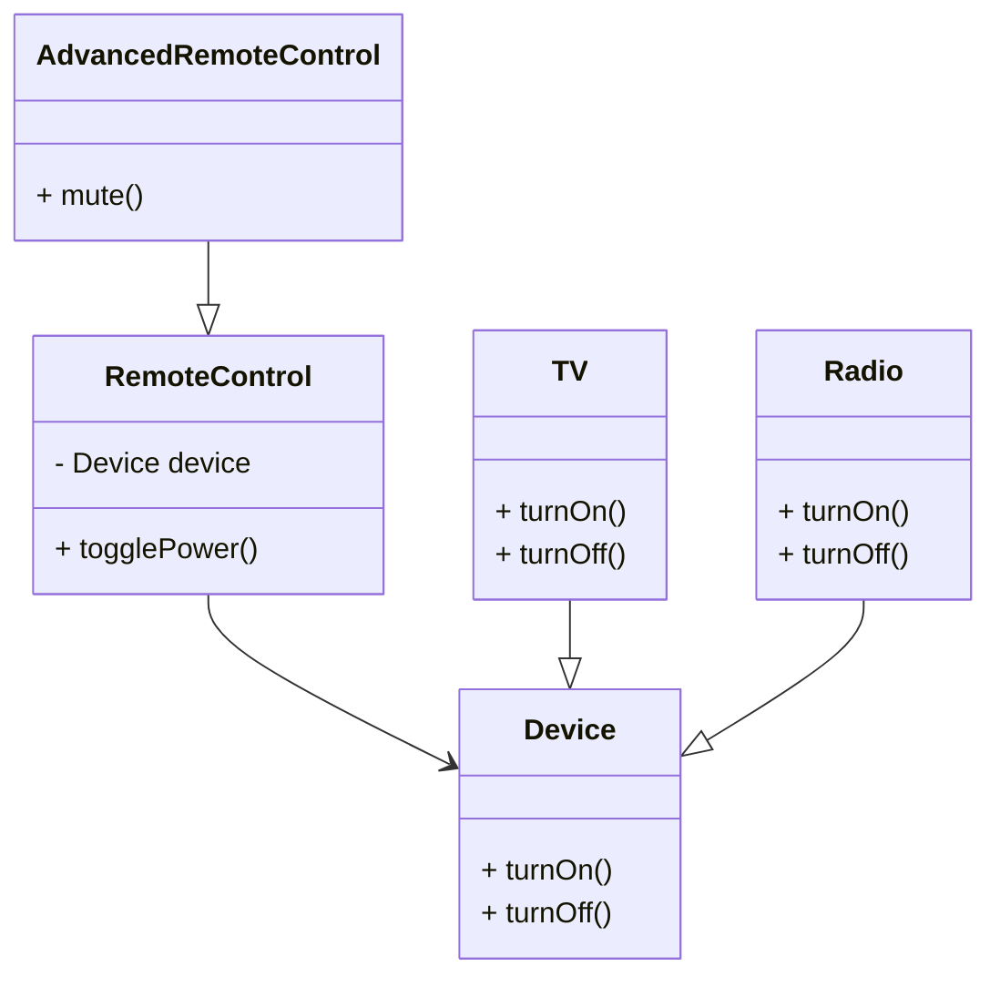

## 4.3.2 Implementation in JavaScript

In the world of software design, the Bridge pattern is a structural pattern that aims to separate an abstraction from its implementation so that the two can vary independently. This pattern is particularly useful when both the abstraction and the implementation may have multiple variations. In this section, we will explore how to implement the Bridge pattern in JavaScript, leveraging its unique features such as prototypal inheritance and first-class functions.

### Understanding the Bridge Pattern

The Bridge pattern decouples an abstraction from its implementation, allowing both to evolve independently. This separation is achieved by defining an interface for the abstraction and another for the implementation. The abstraction maintains a reference to an implementation object, and the two interfaces can be extended without affecting each other.

#### Key Components of the Bridge Pattern

1. **Abstraction**: The high-level control layer that defines the interface for the client.
2. **Refined Abstraction**: A subclass of the abstraction that extends its functionality.
3. **Implementor**: The interface for the implementation classes.
4. **Concrete Implementor**: The actual implementation of the `Implementor` interface.

### Implementing the Bridge Pattern in JavaScript

Let's dive into the implementation of the Bridge pattern in JavaScript. We will create a simple example involving different types of devices and their remote controls. The devices (e.g., TV, Radio) will serve as the implementation, while the remote controls will act as the abstraction.

#### Step 1: Define the Implementor Interface

First, we define the `Implementor` interface. In JavaScript, we can use a class or a function to define this interface. Here, we'll use a class with methods that concrete implementors must define.

```javascript
// Implementor Interface
class Device {
  constructor() {
    if (this.constructor === Device) {
      throw new Error("Cannot instantiate abstract class Device");
    }
  }

  turnOn() {
    throw new Error("Method 'turnOn()' must be implemented.");
  }

  turnOff() {
    throw new Error("Method 'turnOff()' must be implemented.");
  }
}
```

#### Step 2: Create Concrete Implementors

Now, let's create concrete implementors that extend the `Device` class. These classes will provide specific implementations for the `turnOn` and `turnOff` methods.

```javascript
// Concrete Implementor 1
class TV extends Device {
  turnOn() {
    console.log("Turning on the TV.");
  }

  turnOff() {
    console.log("Turning off the TV.");
  }
}

// Concrete Implementor 2
class Radio extends Device {
  turnOn() {
    console.log("Turning on the Radio.");
  }

  turnOff() {
    console.log("Turning off the Radio.");
  }
}
```

#### Step 3: Define the Abstraction

Next, we define the `RemoteControl` class, which acts as the abstraction. This class will maintain a reference to a `Device` object and delegate operations to it.

```javascript
// Abstraction
class RemoteControl {
  constructor(device) {
    this.device = device;
  }

  togglePower() {
    console.log("Toggling power...");
    this.device.turnOn();
    this.device.turnOff();
  }
}
```

#### Step 4: Create Refined Abstractions

We can extend the `RemoteControl` class to create refined abstractions that add more functionality.

```javascript
// Refined Abstraction
class AdvancedRemoteControl extends RemoteControl {
  mute() {
    console.log("Muting the device.");
  }
}
```

#### Step 5: Use the Bridge Pattern

Finally, let's see how we can use the Bridge pattern to control different devices with different remote controls.

```javascript
// Client Code
const tv = new TV();
const radio = new Radio();

const remoteControl = new RemoteControl(tv);
remoteControl.togglePower();

const advancedRemoteControl = new AdvancedRemoteControl(radio);
advancedRemoteControl.togglePower();
advancedRemoteControl.mute();
```

### JavaScript Features Facilitating the Bridge Pattern

JavaScript's prototypal inheritance and first-class functions make it an excellent language for implementing the Bridge pattern. Let's explore how these features facilitate the pattern:

- **Prototypal Inheritance**: JavaScript allows objects to inherit properties and methods from other objects. This feature is useful for creating the abstraction and implementation hierarchies in the Bridge pattern.

- **First-Class Functions**: Functions in JavaScript can be passed around as arguments, returned from other functions, and assigned to variables. This flexibility allows us to easily swap implementations at runtime.

### Maintaining Separation and Avoiding Tight Coupling

To maintain a clean separation between the abstraction and implementation, follow these guidelines:

- **Use Interfaces**: Define clear interfaces for both the abstraction and implementation. This ensures that the two layers remain decoupled.

- **Delegate Operations**: The abstraction should delegate operations to the implementation. Avoid implementing functionality directly in the abstraction.

- **Favor Composition over Inheritance**: Use composition to combine the abstraction and implementation. This approach is more flexible than inheritance and helps avoid tight coupling.

### Visualizing the Bridge Pattern

To better understand how the Bridge pattern separates abstraction from implementation, let's visualize the relationships between the components using a class diagram.



In this diagram, `RemoteControl` and `AdvancedRemoteControl` represent the abstraction and refined abstraction, respectively. `Device`, `TV`, and `Radio` represent the implementor and concrete implementors.

### Try It Yourself

Experiment with the Bridge pattern by modifying the code examples:

- **Add New Devices**: Create additional concrete implementors, such as `SmartLight` or `Speaker`, and implement the `turnOn` and `turnOff` methods.

- **Extend Remote Controls**: Add new methods to the `AdvancedRemoteControl` class, such as `volumeUp` or `volumeDown`.

- **Swap Implementations**: Change the device associated with a remote control at runtime to see how the abstraction remains unaffected.

### Knowledge Check

Before we conclude, let's reinforce our understanding of the Bridge pattern:

- **What is the primary goal of the Bridge pattern?**
- **How does JavaScript's prototypal inheritance facilitate the Bridge pattern?**
- **Why is it important to maintain a separation between abstraction and implementation?**

### Conclusion

The Bridge pattern is a powerful tool for separating abstraction from implementation, allowing both to evolve independently. By leveraging JavaScript's unique features, such as prototypal inheritance and first-class functions, we can implement this pattern effectively. Remember, this is just the beginning. As you progress, you'll build more complex and interactive applications. Keep experimenting, stay curious, and enjoy the journey!

## Quiz Time!



### What is the primary purpose of the Bridge pattern?

- [x] To separate abstraction from implementation
- [ ] To create a single instance of a class
- [ ] To provide a simplified interface to a complex system
- [ ] To allow incompatible interfaces to work together

> **Explanation:** The Bridge pattern aims to separate abstraction from implementation, allowing both to vary independently.

### Which JavaScript feature helps in implementing the Bridge pattern?

- [x] Prototypal inheritance
- [ ] Closures
- [ ] Callback functions
- [ ] Event loop

> **Explanation:** Prototypal inheritance allows objects to inherit properties and methods, facilitating the creation of abstraction and implementation hierarchies.

### What should the abstraction layer do in the Bridge pattern?

- [x] Delegate operations to the implementation
- [ ] Implement all functionality directly
- [ ] Maintain a reference to the client
- [ ] Handle user input

> **Explanation:** The abstraction layer should delegate operations to the implementation to maintain separation and flexibility.

### In the Bridge pattern, what is the role of the `Implementor`?

- [x] To define the interface for implementation classes
- [ ] To provide a default implementation
- [ ] To act as a client interface
- [ ] To manage user sessions

> **Explanation:** The `Implementor` defines the interface that concrete implementors must follow, allowing different implementations.

### How can we maintain a clean separation between abstraction and implementation?

- [x] Use interfaces and delegate operations
- [ ] Implement functionality directly in the abstraction
- [ ] Use global variables for communication
- [ ] Avoid using interfaces

> **Explanation:** Using interfaces and delegating operations helps maintain a clean separation between abstraction and implementation.

### What is a benefit of using the Bridge pattern?

- [x] It allows both abstraction and implementation to evolve independently.
- [ ] It simplifies the code by merging abstraction and implementation.
- [ ] It ensures that only one instance of a class is created.
- [ ] It provides a way to access elements sequentially.

> **Explanation:** The Bridge pattern allows both abstraction and implementation to evolve independently, increasing flexibility.

### Which of the following is a refined abstraction in the Bridge pattern?

- [x] AdvancedRemoteControl
- [ ] TV
- [ ] Device
- [ ] Radio

> **Explanation:** `AdvancedRemoteControl` is a refined abstraction that extends the functionality of the base abstraction.

### What is the role of the `Concrete Implementor` in the Bridge pattern?

- [x] To provide specific implementations of the `Implementor` interface
- [ ] To define the abstraction interface
- [ ] To manage the client interface
- [ ] To handle user input

> **Explanation:** The `Concrete Implementor` provides specific implementations of the `Implementor` interface, allowing different behaviors.

### How does the Bridge pattern differ from the Adapter pattern?

- [x] The Bridge pattern separates abstraction from implementation, while the Adapter pattern allows incompatible interfaces to work together.
- [ ] The Bridge pattern provides a simplified interface, while the Adapter pattern separates abstraction from implementation.
- [ ] The Bridge pattern creates a single instance, while the Adapter pattern allows multiple instances.
- [ ] The Bridge pattern manages user input, while the Adapter pattern handles user sessions.

> **Explanation:** The Bridge pattern separates abstraction from implementation, while the Adapter pattern allows incompatible interfaces to work together.

### True or False: In the Bridge pattern, the abstraction and implementation can be modified independently.

- [x] True
- [ ] False

> **Explanation:** True. The Bridge pattern allows both the abstraction and implementation to be modified independently, providing flexibility and scalability.




