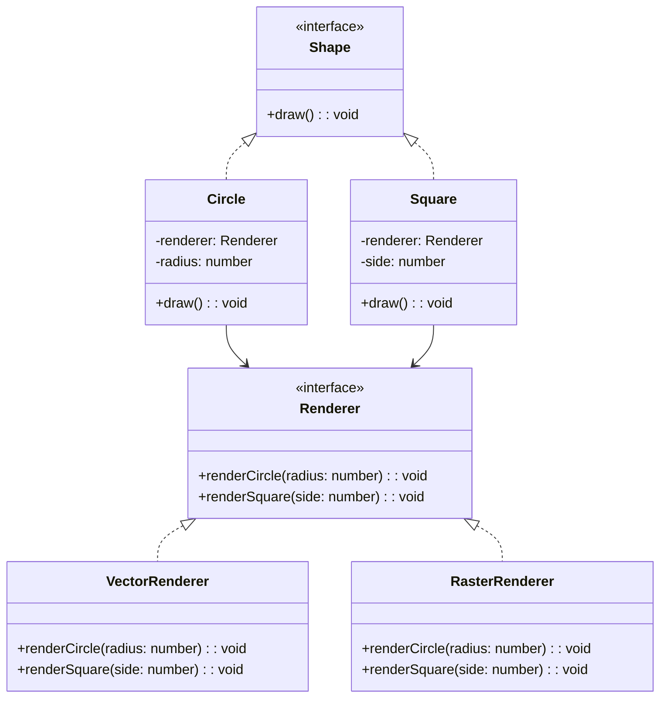

## 4.3.3 Implementation in TypeScript

In this section, we'll delve into the Bridge Pattern and its implementation in TypeScript. The Bridge Pattern is a structural design pattern that decouples an abstraction from its implementation, allowing the two to vary independently. This pattern is particularly useful when you want to avoid a permanent binding between an abstraction and its implementation, making your code more flexible and scalable.

### Understanding the Bridge Pattern

The Bridge Pattern involves two main components: the **Abstraction** and the **Implementation**. The abstraction defines the high-level control logic, while the implementation provides the low-level operations. By using interfaces and classes, TypeScript allows us to define these components clearly and enforce strong typing, which helps prevent runtime errors and ensures that our code adheres to defined contracts.

### Defining Abstraction and Implementation Interfaces

Let's start by defining the interfaces for our abstraction and implementation. In TypeScript, interfaces are used to define the structure of an object, ensuring that any class implementing the interface adheres to its contract.

```typescript
// Define the implementation interface
interface Renderer {
  renderCircle(radius: number): void;
  renderSquare(side: number): void;
}

// Define the abstraction interface
interface Shape {
  draw(): void;
}
```

In this example, the `Renderer` interface defines methods for rendering different shapes, while the `Shape` interface defines a method for drawing a shape. The `Shape` interface will use a `Renderer` to perform the actual rendering.

### Implementing the Bridge Pattern

We can now implement the Bridge Pattern by creating concrete classes that implement these interfaces. We'll create two concrete implementations of the `Renderer` interface and two concrete classes for the `Shape` interface.

```typescript
// Concrete implementation of the Renderer interface for vector graphics
class VectorRenderer implements Renderer {
  renderCircle(radius: number): void {
    console.log(`Drawing a circle with radius ${radius} using vector graphics.`);
  }

  renderSquare(side: number): void {
    console.log(`Drawing a square with side ${side} using vector graphics.`);
  }
}

// Concrete implementation of the Renderer interface for raster graphics
class RasterRenderer implements Renderer {
  renderCircle(radius: number): void {
    console.log(`Drawing a circle with radius ${radius} using raster graphics.`);
  }

  renderSquare(side: number): void {
    console.log(`Drawing a square with side ${side} using raster graphics.`);
  }
}

// Concrete class for the Shape interface
class Circle implements Shape {
  private renderer: Renderer;
  private radius: number;

  constructor(renderer: Renderer, radius: number) {
    this.renderer = renderer;
    this.radius = radius;
  }

  draw(): void {
    this.renderer.renderCircle(this.radius);
  }
}

// Another concrete class for the Shape interface
class Square implements Shape {
  private renderer: Renderer;
  private side: number;

  constructor(renderer: Renderer, side: number) {
    this.renderer = renderer;
    this.side = side;
  }

  draw(): void {
    this.renderer.renderSquare(this.side);
  }
}
```

In this implementation, the `Circle` and `Square` classes represent the abstraction, and they use a `Renderer` to perform the actual rendering. The `VectorRenderer` and `RasterRenderer` classes provide different implementations of the rendering logic.

### Benefits of Static Typing

TypeScript's static typing offers several benefits when implementing the Bridge Pattern:

- **Enforcing Contracts**: Interfaces in TypeScript enforce contracts, ensuring that any class implementing an interface adheres to its structure. This reduces the likelihood of runtime errors due to missing methods or incorrect method signatures.
  
- **Code Completion and Refactoring**: With TypeScript, you get better code completion and refactoring support in your IDE, making it easier to work with large codebases.

- **Improved Readability**: By clearly defining interfaces and classes, TypeScript makes your code more readable and easier to understand.

### Using Generics for Enhanced Flexibility

Generics in TypeScript allow you to write flexible and reusable code. While the Bridge Pattern doesn't inherently require generics, they can be used to enhance flexibility in certain scenarios.

Suppose we want to create a `Shape` class that can work with any type of renderer. We can use generics to achieve this:

```typescript
// Generic shape class
class GenericShape<T extends Renderer> implements Shape {
  private renderer: T;

  constructor(renderer: T) {
    this.renderer = renderer;
  }

  drawCircle(radius: number): void {
    this.renderer.renderCircle(radius);
  }

  drawSquare(side: number): void {
    this.renderer.renderSquare(side);
  }
}

// Usage
const vectorRenderer = new VectorRenderer();
const rasterRenderer = new RasterRenderer();

const vectorCircle = new GenericShape(vectorRenderer);
vectorCircle.drawCircle(5);

const rasterSquare = new GenericShape(rasterRenderer);
rasterSquare.drawSquare(10);
```

In this example, the `GenericShape` class can work with any type of renderer, as long as it implements the `Renderer` interface. This makes the `GenericShape` class more flexible and reusable.

### TypeScript-Specific Features

TypeScript offers several features that simplify the implementation of the Bridge Pattern:

- **Interfaces and Classes**: TypeScript's interfaces and classes provide a clear way to define abstractions and implementations, making it easier to implement the Bridge Pattern.

- **Access Modifiers**: TypeScript allows you to use access modifiers (`public`, `private`, `protected`) to control the visibility of class members, helping you encapsulate implementation details.

- **Type Inference**: TypeScript's type inference reduces the need for explicit type annotations, making your code cleaner and more concise.

### Visualizing the Bridge Pattern

To better understand the Bridge Pattern, let's visualize the relationships between the components using a class diagram.



**Diagram Description**: The diagram shows the `Renderer` interface with two concrete implementations: `VectorRenderer` and `RasterRenderer`. The `Shape` interface is implemented by `Circle` and `Square`, which use a `Renderer` to perform rendering.

### Try It Yourself

Now that we've covered the basics of implementing the Bridge Pattern in TypeScript, it's time to experiment with the code. Here are a few suggestions:

- **Add New Shapes**: Try adding new shapes, such as `Triangle` or `Rectangle`, and implement their rendering logic using the existing renderers.

- **Create Additional Renderers**: Implement additional renderers, such as `SVGRenderer` or `CanvasRenderer`, and use them with the existing shapes.

- **Experiment with Generics**: Modify the `GenericShape` class to support additional operations, such as scaling or rotating shapes, using generics.

### Knowledge Check

Before we wrap up, let's review some key points:

- The Bridge Pattern decouples an abstraction from its implementation, allowing the two to vary independently.
- TypeScript's interfaces and classes provide a clear way to define abstractions and implementations.
- Static typing in TypeScript enforces contracts and prevents runtime errors.
- Generics can enhance the flexibility of the Bridge Pattern by allowing classes to work with different types of implementations.

### Embrace the Journey

Remember, this is just the beginning. As you continue to explore design patterns in TypeScript, you'll build more complex and flexible applications. Keep experimenting, stay curious, and enjoy the journey!

## Quiz Time!



### What is the primary purpose of the Bridge Pattern?

- [x] To decouple an abstraction from its implementation
- [ ] To create a single instance of a class
- [ ] To provide a simplified interface to a complex subsystem
- [ ] To add responsibilities to objects dynamically

> **Explanation:** The Bridge Pattern is used to decouple an abstraction from its implementation, allowing the two to vary independently.

### Which TypeScript feature helps enforce contracts in the Bridge Pattern?

- [x] Interfaces
- [ ] Promises
- [ ] Decorators
- [ ] Modules

> **Explanation:** Interfaces in TypeScript help enforce contracts by ensuring that classes adhere to a defined structure.

### What is a benefit of using static typing in TypeScript?

- [x] Preventing runtime errors
- [ ] Increasing code verbosity
- [ ] Reducing code readability
- [ ] Limiting code flexibility

> **Explanation:** Static typing in TypeScript helps prevent runtime errors by catching type-related issues at compile time.

### How can generics enhance the Bridge Pattern in TypeScript?

- [x] By allowing classes to work with different types of implementations
- [ ] By reducing the number of classes needed
- [ ] By simplifying the code structure
- [ ] By enforcing stricter type checks

> **Explanation:** Generics allow classes to work with different types of implementations, enhancing flexibility and reusability.

### What does the `Renderer` interface define in the example?

- [x] Methods for rendering shapes
- [ ] Methods for drawing lines
- [ ] Methods for calculating areas
- [ ] Methods for transforming shapes

> **Explanation:** The `Renderer` interface defines methods for rendering shapes, such as circles and squares.

### Which class in the example is responsible for drawing a circle?

- [x] Circle
- [ ] Square
- [ ] VectorRenderer
- [ ] RasterRenderer

> **Explanation:** The `Circle` class is responsible for drawing a circle using a `Renderer`.

### What is the role of the `VectorRenderer` class?

- [x] To provide a concrete implementation of the `Renderer` interface for vector graphics
- [ ] To provide a concrete implementation of the `Shape` interface
- [ ] To define a new shape type
- [ ] To manage the rendering of raster graphics

> **Explanation:** The `VectorRenderer` class provides a concrete implementation of the `Renderer` interface for vector graphics.

### What is the benefit of using access modifiers in TypeScript?

- [x] Controlling the visibility of class members
- [ ] Increasing code complexity
- [ ] Reducing code readability
- [ ] Limiting code flexibility

> **Explanation:** Access modifiers in TypeScript help control the visibility of class members, aiding in encapsulation.

### What is the purpose of the `draw` method in the `Shape` interface?

- [x] To define a method for drawing a shape
- [ ] To calculate the area of a shape
- [ ] To transform a shape
- [ ] To render a shape using raster graphics

> **Explanation:** The `draw` method in the `Shape` interface defines a method for drawing a shape.

### True or False: The Bridge Pattern allows the abstraction and implementation to vary independently.

- [x] True
- [ ] False

> **Explanation:** True. The Bridge Pattern decouples the abstraction from its implementation, allowing both to vary independently.


