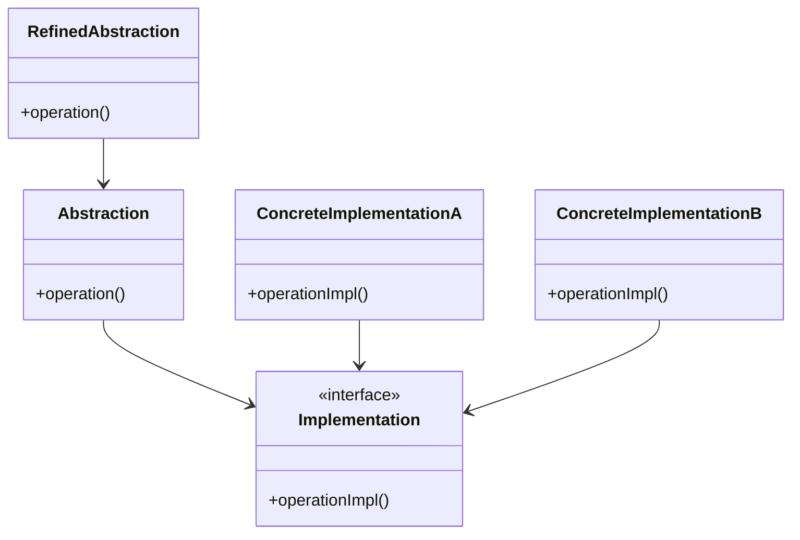

## 4.3.4 Use Cases and Examples

The Bridge pattern is a structural design pattern that decouples an abstraction from its implementation, allowing them to vary independently. This pattern is particularly useful in scenarios where you need to support multiple platforms or devices, or when you want to provide a consistent interface for different implementations. In this section, we will explore practical applications of the Bridge pattern in JavaScript and TypeScript, including developing cross-platform applications and supporting multiple databases. We will also discuss how this pattern enhances code maintainability and extensibility, and provide criteria for determining when to use the Bridge pattern over other patterns.

### Understanding the Bridge Pattern

Before diving into use cases, let's briefly recap the Bridge pattern. The pattern involves two main components: the abstraction and the implementation. The abstraction defines the interface for the client, while the implementation provides the actual functionality. The abstraction holds a reference to the implementation, allowing the two to vary independently.

#### Key Concepts

- **Abstraction**: The high-level interface that clients interact with.
- **Implementation**: The low-level operations that the abstraction delegates to.
- **Decoupling**: Separating the abstraction from the implementation to allow independent variation.

### Use Case 1: Cross-Platform Development

One of the most common applications of the Bridge pattern is in cross-platform development. When developing applications that need to run on multiple platforms (e.g., web, mobile, desktop), the Bridge pattern allows you to separate platform-specific code from the core application logic.

#### Scenario: Cross-Platform Media Player

Imagine you're developing a media player that needs to run on both web and mobile platforms. Each platform has its own way of handling media playback, but you want to provide a consistent interface to the user.

**JavaScript Example:**

```javascript
// Abstraction
class MediaPlayer {
  constructor(implementation) {
    this.implementation = implementation;
  }

  play() {
    this.implementation.play();
  }

  pause() {
    this.implementation.pause();
  }
}

// Implementation for Web
class WebMediaPlayer {
  play() {
    console.log("Playing media on the web.");
  }

  pause() {
    console.log("Pausing media on the web.");
  }
}

// Implementation for Mobile
class MobileMediaPlayer {
  play() {
    console.log("Playing media on mobile.");
  }

  pause() {
    console.log("Pausing media on mobile.");
  }
}

// Client code
const webPlayer = new MediaPlayer(new WebMediaPlayer());
webPlayer.play();
webPlayer.pause();

const mobilePlayer = new MediaPlayer(new MobileMediaPlayer());
mobilePlayer.play();
mobilePlayer.pause();
```

**TypeScript Example:**

```typescript
// Abstraction
interface MediaPlayer {
  play(): void;
  pause(): void;
}

class MediaPlayerAbstraction implements MediaPlayer {
  constructor(private implementation: MediaPlayer) {}

  play(): void {
    this.implementation.play();
  }

  pause(): void {
    this.implementation.pause();
  }
}

// Implementation for Web
class WebMediaPlayer implements MediaPlayer {
  play(): void {
    console.log("Playing media on the web.");
  }

  pause(): void {
    console.log("Pausing media on the web.");
  }
}

// Implementation for Mobile
class MobileMediaPlayer implements MediaPlayer {
  play(): void {
    console.log("Playing media on mobile.");
  }

  pause(): void {
    console.log("Pausing media on mobile.");
  }
}

// Client code
const webPlayer: MediaPlayer = new MediaPlayerAbstraction(new WebMediaPlayer());
webPlayer.play();
webPlayer.pause();

const mobilePlayer: MediaPlayer = new MediaPlayerAbstraction(new MobileMediaPlayer());
mobilePlayer.play();
mobilePlayer.pause();
```

#### Benefits

- **Maintainability**: By separating platform-specific code, you can easily update or replace implementations without affecting the core logic.
- **Extensibility**: Adding support for a new platform is straightforward—simply create a new implementation.

### Use Case 2: Supporting Multiple Databases

Another common use case for the Bridge pattern is supporting multiple databases. In applications that need to interact with different database systems, the Bridge pattern allows you to abstract the database operations and switch between different implementations easily.

#### Scenario: Multi-Database Support for an E-commerce Platform

Consider an e-commerce platform that needs to support both SQL and NoSQL databases. The Bridge pattern can help you provide a consistent interface for database operations while allowing different implementations for each database type.

**JavaScript Example:**

```javascript
// Abstraction
class Database {
  constructor(implementation) {
    this.implementation = implementation;
  }

  connect() {
    this.implementation.connect();
  }

  disconnect() {
    this.implementation.disconnect();
  }
}

// Implementation for SQL Database
class SQLDatabase {
  connect() {
    console.log("Connecting to SQL database.");
  }

  disconnect() {
    console.log("Disconnecting from SQL database.");
  }
}

// Implementation for NoSQL Database
class NoSQLDatabase {
  connect() {
    console.log("Connecting to NoSQL database.");
  }

  disconnect() {
    console.log("Disconnecting from NoSQL database.");
  }
}

// Client code
const sqlDb = new Database(new SQLDatabase());
sqlDb.connect();
sqlDb.disconnect();

const noSqlDb = new Database(new NoSQLDatabase());
noSqlDb.connect();
noSqlDb.disconnect();
```

**TypeScript Example:**

```typescript
// Abstraction
interface Database {
  connect(): void;
  disconnect(): void;
}

class DatabaseAbstraction implements Database {
  constructor(private implementation: Database) {}

  connect(): void {
    this.implementation.connect();
  }

  disconnect(): void {
    this.implementation.disconnect();
  }
}

// Implementation for SQL Database
class SQLDatabase implements Database {
  connect(): void {
    console.log("Connecting to SQL database.");
  }

  disconnect(): void {
    console.log("Disconnecting from SQL database.");
  }
}

// Implementation for NoSQL Database
class NoSQLDatabase implements Database {
  connect(): void {
    console.log("Connecting to NoSQL database.");
  }

  disconnect(): void {
    console.log("Disconnecting from NoSQL database.");
  }
}

// Client code
const sqlDb: Database = new DatabaseAbstraction(new SQLDatabase());
sqlDb.connect();
sqlDb.disconnect();

const noSqlDb: Database = new DatabaseAbstraction(new NoSQLDatabase());
noSqlDb.connect();
noSqlDb.disconnect();
```

#### Benefits

- **Flexibility**: Easily switch between different database systems without changing the application logic.
- **Scalability**: Add support for new databases by implementing a new database class.

### Impact on Code Maintainability and Extensibility

The Bridge pattern significantly enhances code maintainability and extensibility by promoting separation of concerns. By decoupling the abstraction from the implementation, you can modify or extend each independently without affecting the other. This separation allows for easier updates, testing, and integration of new features.

#### Maintainability

- **Isolation of Changes**: Changes to the implementation do not affect the abstraction, reducing the risk of introducing bugs.
- **Simplified Testing**: Each component can be tested independently, improving test coverage and reliability.

#### Extensibility

- **Adding New Features**: New features can be added to either the abstraction or the implementation without affecting the other.
- **Supporting New Platforms**: Easily extend the application to support new platforms or devices by adding new implementations.

### Criteria for Using the Bridge Pattern

While the Bridge pattern offers many benefits, it is not always the best choice. Here are some criteria to help determine when to use the Bridge pattern:

- **Need for Decoupling**: Use the Bridge pattern when you need to decouple an abstraction from its implementation to allow independent variation.
- **Multiple Implementations**: Consider the Bridge pattern when you have multiple implementations for an abstraction and expect them to change independently.
- **Complexity Management**: Use the Bridge pattern to manage complexity by separating platform-specific code from core logic.

### Try It Yourself

To deepen your understanding of the Bridge pattern, try modifying the examples provided. Here are some suggestions:

- **Add a New Platform**: Extend the media player example by adding a new platform, such as a desktop player.
- **Implement a New Database**: Add support for a new database type, such as a graph database, in the e-commerce platform example.
- **Experiment with Interfaces**: Modify the TypeScript examples to use different interfaces or generics.

### Visualizing the Bridge Pattern

To better understand the Bridge pattern, let's visualize the relationship between the abstraction and the implementation using a class diagram.



**Diagram Description**: This class diagram illustrates the Bridge pattern. The `Abstraction` class holds a reference to the `Implementation` interface, allowing different `ConcreteImplementation` classes to provide specific functionality. The `RefinedAbstraction` class extends the `Abstraction` to add additional behavior.

### References and Links

For further reading on the Bridge pattern and its applications, consider the following resources:

- [Bridge Pattern on Refactoring Guru](https://refactoring.guru/design-patterns/bridge)
- [MDN Web Docs: JavaScript Guide](https://developer.mozilla.org/en-US/docs/Web/JavaScript/Guide)
- [TypeScript Handbook](https://www.typescriptlang.org/docs/handbook/intro.html)

### Knowledge Check

To reinforce your understanding of the Bridge pattern, consider these questions:

- How does the Bridge pattern differ from the Adapter pattern?
- What are the benefits of decoupling an abstraction from its implementation?
- In what scenarios would you choose the Bridge pattern over other structural patterns?

### Embrace the Journey

Remember, mastering design patterns is a journey. As you continue to explore and apply these patterns, you'll gain a deeper understanding of how to build maintainable and scalable applications. Keep experimenting, stay curious, and enjoy the process!

## Quiz Time!



### What is the primary purpose of the Bridge pattern?

- [x] To decouple an abstraction from its implementation
- [ ] To provide a simplified interface to a complex subsystem
- [ ] To allow incompatible interfaces to work together
- [ ] To compose objects into tree structures

> **Explanation:** The Bridge pattern is designed to decouple an abstraction from its implementation, allowing them to vary independently.

### In the Bridge pattern, what does the abstraction hold a reference to?

- [x] Implementation
- [ ] Concrete class
- [ ] Interface
- [ ] Adapter

> **Explanation:** The abstraction holds a reference to the implementation, allowing different implementations to be used interchangeably.

### Which scenario is a common use case for the Bridge pattern?

- [x] Cross-platform development
- [ ] Simplifying complex APIs
- [ ] Creating a one-to-many dependency between objects
- [ ] Managing object creation mechanisms

> **Explanation:** Cross-platform development is a common use case for the Bridge pattern, as it allows platform-specific code to be separated from core logic.

### How does the Bridge pattern enhance code maintainability?

- [x] By isolating changes to the implementation from the abstraction
- [ ] By providing a single point of access to a subsystem
- [ ] By allowing objects to be composed into tree structures
- [ ] By encapsulating requests as objects

> **Explanation:** The Bridge pattern enhances maintainability by isolating changes to the implementation from the abstraction, reducing the risk of bugs.

### What is a key benefit of using the Bridge pattern for database support?

- [x] Flexibility in switching between different database systems
- [ ] Simplifying the user interface
- [ ] Reducing memory usage
- [ ] Encapsulating requests as objects

> **Explanation:** The Bridge pattern provides flexibility in switching between different database systems without changing the application logic.

### When should you consider using the Bridge pattern?

- [x] When you need to decouple an abstraction from its implementation
- [ ] When you need to provide a single point of access to a subsystem
- [ ] When you need to manage object creation mechanisms
- [ ] When you need to compose objects into tree structures

> **Explanation:** Consider using the Bridge pattern when you need to decouple an abstraction from its implementation to allow independent variation.

### What is a potential downside of the Bridge pattern?

- [x] Increased complexity due to additional layers
- [ ] Limited flexibility in changing implementations
- [ ] Difficulty in testing individual components
- [ ] Inability to support multiple platforms

> **Explanation:** The Bridge pattern can introduce increased complexity due to the additional layers of abstraction and implementation.

### How does the Bridge pattern differ from the Adapter pattern?

- [x] The Bridge pattern decouples abstraction from implementation, while the Adapter pattern allows incompatible interfaces to work together.
- [ ] The Bridge pattern simplifies complex subsystems, while the Adapter pattern composes objects into tree structures.
- [ ] The Bridge pattern manages object creation, while the Adapter pattern provides a single point of access.
- [ ] The Bridge pattern encapsulates requests as objects, while the Adapter pattern reduces memory usage.

> **Explanation:** The Bridge pattern decouples abstraction from implementation, while the Adapter pattern allows incompatible interfaces to work together.

### What is the role of the RefinedAbstraction in the Bridge pattern?

- [x] To extend the Abstraction and add additional behavior
- [ ] To provide a simplified interface to a complex subsystem
- [ ] To manage object creation mechanisms
- [ ] To encapsulate requests as objects

> **Explanation:** The RefinedAbstraction extends the Abstraction and adds additional behavior, allowing for more specialized functionality.

### True or False: The Bridge pattern is useful for managing object creation mechanisms.

- [ ] True
- [x] False

> **Explanation:** False. The Bridge pattern is not primarily concerned with object creation mechanisms; it focuses on decoupling abstraction from implementation.


