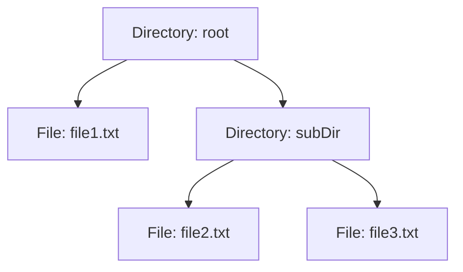

## 4.4.1 Intent and Motivation

In the realm of software design, the Composite Pattern stands as a powerful tool for managing hierarchical data structures. It allows developers to compose objects into tree structures to represent part-whole hierarchies, enabling clients to treat individual objects and compositions uniformly. This section delves into the intent and motivation behind the Composite Pattern, illustrating its application through real-world examples and highlighting its significance in simplifying client code and managing complex structures.

### Understanding the Composite Pattern

The Composite Pattern is a structural design pattern that facilitates the creation of tree-like structures. It allows you to build complex objects by composing simpler ones, treating both individual objects (leaves) and compositions (composites) uniformly. This uniformity is achieved by defining a common interface for both leaf and composite objects, allowing clients to interact with them interchangeably.

#### Real-World Examples

To grasp the essence of the Composite Pattern, consider the following real-world scenarios:

1. **File System Hierarchy**: A file system is a classic example of a hierarchical structure. It consists of files and directories, where directories can contain both files and other directories. The Composite Pattern allows us to treat files and directories uniformly, enabling operations like listing contents or calculating the total size of a directory.

2. **Organizational Chart**: In an organizational chart, employees can be represented as individual nodes, while departments or teams can be represented as composite nodes. This pattern allows us to perform operations like calculating the total number of employees in a department or printing the entire organizational structure.

3. **GUI Components**: Graphical User Interfaces (GUIs) often involve complex hierarchies of components, such as windows, panels, buttons, and text fields. The Composite Pattern enables developers to treat individual components and compositions of components uniformly, simplifying the rendering and event handling processes.

### Problems Addressed by the Composite Pattern

The Composite Pattern addresses several challenges associated with hierarchical data structures:

1. **Uniform Treatment of Leaf and Composite Nodes**: By defining a common interface for both leaf and composite objects, the Composite Pattern allows clients to treat them uniformly. This uniformity simplifies client code, as it eliminates the need for type-specific handling of individual objects and compositions.

2. **Simplified Client Code**: The Composite Pattern abstracts the complexity of hierarchical structures, allowing clients to interact with them at a higher level of abstraction. This simplification reduces the cognitive load on developers and enhances code readability and maintainability.

3. **Scalability and Flexibility**: The Composite Pattern promotes scalability and flexibility by allowing new types of leaf and composite objects to be added without modifying existing client code. This extensibility is achieved through the use of interfaces or abstract classes, which define the common operations for all objects in the hierarchy.

### Benefits of the Composite Pattern

The Composite Pattern offers several benefits that make it a valuable tool in software design:

1. **Simplified Management of Complex Structures**: By representing complex structures as trees, the Composite Pattern simplifies the management of hierarchical data. This simplification is particularly beneficial in scenarios involving nested or recursive structures, such as file systems or organizational charts.

2. **Enhanced Reusability and Extensibility**: The Composite Pattern promotes reusability and extensibility by allowing new types of objects to be added to the hierarchy without modifying existing code. This flexibility is achieved through the use of interfaces or abstract classes, which define the common operations for all objects in the hierarchy.

3. **Improved Maintainability**: By abstracting the complexity of hierarchical structures, the Composite Pattern enhances code maintainability. This abstraction reduces the cognitive load on developers and facilitates the identification and resolution of issues within the codebase.

4. **Relevance in GUI Development**: The Composite Pattern is particularly relevant in GUI development, where complex hierarchies of components are common. By treating individual components and compositions of components uniformly, the Composite Pattern simplifies the rendering and event handling processes, enhancing the overall user experience.

### Implementing the Composite Pattern in JavaScript and TypeScript

To illustrate the implementation of the Composite Pattern, let's consider a simple example involving a file system hierarchy. We'll define a common interface for both files and directories, allowing them to be treated uniformly.

#### JavaScript Implementation

```javascript
// Define the Component interface
class FileSystemComponent {
  constructor(name) {
    this.name = name;
  }

  display() {
    throw new Error('This method must be overridden!');
  }
}

// Define the Leaf class (File)
class File extends FileSystemComponent {
  display() {
    console.log(`File: ${this.name}`);
  }
}

// Define the Composite class (Directory)
class Directory extends FileSystemComponent {
  constructor(name) {
    super(name);
    this.children = [];
  }

  add(component) {
    this.children.push(component);
  }

  remove(component) {
    const index = this.children.indexOf(component);
    if (index !== -1) {
      this.children.splice(index, 1);
    }
  }

  display() {
    console.log(`Directory: ${this.name}`);
    this.children.forEach(child => child.display());
  }
}

// Create a file system hierarchy
const root = new Directory('root');
const file1 = new File('file1.txt');
const file2 = new File('file2.txt');
const subDir = new Directory('subDir');
const file3 = new File('file3.txt');

root.add(file1);
root.add(subDir);
subDir.add(file2);
subDir.add(file3);

// Display the file system hierarchy
root.display();
```

In this example, we define a `FileSystemComponent` class as the common interface for both files and directories. The `File` class represents individual files, while the `Directory` class represents directories that can contain both files and other directories. By defining a common interface, we enable uniform treatment of files and directories, simplifying the client code.

#### TypeScript Implementation

```typescript
// Define the Component interface
interface FileSystemComponent {
  name: string;
  display(): void;
}

// Define the Leaf class (File)
class File implements FileSystemComponent {
  constructor(public name: string) {}

  display(): void {
    console.log(`File: ${this.name}`);
  }
}

// Define the Composite class (Directory)
class Directory implements FileSystemComponent {
  private children: FileSystemComponent[] = [];

  constructor(public name: string) {}

  add(component: FileSystemComponent): void {
    this.children.push(component);
  }

  remove(component: FileSystemComponent): void {
    const index = this.children.indexOf(component);
    if (index !== -1) {
      this.children.splice(index, 1);
    }
  }

  display(): void {
    console.log(`Directory: ${this.name}`);
    this.children.forEach(child => child.display());
  }
}

// Create a file system hierarchy
const root: Directory = new Directory('root');
const file1: File = new File('file1.txt');
const file2: File = new File('file2.txt');
const subDir: Directory = new Directory('subDir');
const file3: File = new File('file3.txt');

root.add(file1);
root.add(subDir);
subDir.add(file2);
subDir.add(file3);

// Display the file system hierarchy
root.display();
```

In the TypeScript implementation, we define an interface `FileSystemComponent` to enforce the contract for both files and directories. The `File` and `Directory` classes implement this interface, allowing them to be treated uniformly. TypeScript's strong typing ensures that the operations are performed correctly, enhancing code reliability and maintainability.

### Visualizing the Composite Pattern

To further enhance our understanding of the Composite Pattern, let's visualize the file system hierarchy using a tree diagram.



This diagram illustrates the hierarchical structure of the file system, with the `root` directory containing `file1` and the `subDir` directory. The `subDir` directory, in turn, contains `file2` and `file3`. This tree structure exemplifies the part-whole hierarchy that the Composite Pattern is designed to handle.

### Try It Yourself

To deepen your understanding of the Composite Pattern, try modifying the code examples provided above. Here are a few suggestions:

1. **Add More Files and Directories**: Extend the file system hierarchy by adding more files and directories. Observe how the `display` method continues to work seamlessly, regardless of the complexity of the hierarchy.

2. **Implement Additional Operations**: Implement additional operations, such as calculating the total size of a directory or searching for a specific file. Consider how the Composite Pattern simplifies the implementation of these operations.

3. **Experiment with Different Hierarchies**: Create different hierarchical structures, such as organizational charts or GUI component trees. Explore how the Composite Pattern can be applied to these scenarios.

### Knowledge Check

Before we conclude, let's reinforce our understanding of the Composite Pattern with a few questions:

- What is the primary purpose of the Composite Pattern?
- How does the Composite Pattern simplify client code?
- In what scenarios is the Composite Pattern particularly beneficial?
- How does the Composite Pattern promote scalability and flexibility?
- What are the key components of the Composite Pattern?

### Embrace the Journey

Remember, the Composite Pattern is just one of many design patterns that can enhance your software development skills. As you continue your journey, keep experimenting with different patterns and exploring their applications in various contexts. Stay curious, and enjoy the process of learning and growing as a developer!

## Quiz Time!



### What is the primary purpose of the Composite Pattern?

- [x] To compose objects into tree structures to represent part-whole hierarchies.
- [ ] To create a single instance of a class.
- [ ] To separate the construction of a complex object from its representation.
- [ ] To provide a simplified interface to a complex subsystem.

> **Explanation:** The Composite Pattern is designed to compose objects into tree structures to represent part-whole hierarchies, allowing clients to treat individual objects and compositions uniformly.

### How does the Composite Pattern simplify client code?

- [x] By allowing clients to treat individual objects and compositions uniformly.
- [ ] By enforcing strict type checking.
- [ ] By reducing the number of classes in the hierarchy.
- [ ] By eliminating the need for interfaces.

> **Explanation:** The Composite Pattern simplifies client code by allowing clients to treat individual objects and compositions uniformly, eliminating the need for type-specific handling.

### In what scenarios is the Composite Pattern particularly beneficial?

- [x] In scenarios involving hierarchical data structures, such as file systems and organizational charts.
- [ ] In scenarios requiring a single instance of a class.
- [ ] In scenarios involving complex mathematical calculations.
- [ ] In scenarios requiring real-time data processing.

> **Explanation:** The Composite Pattern is particularly beneficial in scenarios involving hierarchical data structures, such as file systems, organizational charts, and GUI components.

### How does the Composite Pattern promote scalability and flexibility?

- [x] By allowing new types of leaf and composite objects to be added without modifying existing client code.
- [ ] By enforcing strict type checking.
- [ ] By reducing the number of classes in the hierarchy.
- [ ] By eliminating the need for interfaces.

> **Explanation:** The Composite Pattern promotes scalability and flexibility by allowing new types of leaf and composite objects to be added without modifying existing client code.

### What are the key components of the Composite Pattern?

- [x] Component, Leaf, and Composite.
- [ ] Singleton, Factory, and Builder.
- [ ] Observer, Subject, and Mediator.
- [ ] Client, Server, and Proxy.

> **Explanation:** The key components of the Composite Pattern are Component, Leaf, and Composite, which together enable the uniform treatment of individual objects and compositions.

### Which of the following is a real-world example of the Composite Pattern?

- [x] File system hierarchy.
- [ ] Singleton pattern in a database connection.
- [ ] Factory pattern in object creation.
- [ ] Observer pattern in event handling.

> **Explanation:** A file system hierarchy is a real-world example of the Composite Pattern, where files and directories are treated uniformly.

### What is the role of the Leaf class in the Composite Pattern?

- [x] To represent individual objects in the hierarchy.
- [ ] To compose objects into tree structures.
- [ ] To provide a simplified interface to a complex subsystem.
- [ ] To enforce strict type checking.

> **Explanation:** The Leaf class represents individual objects in the hierarchy, allowing them to be treated uniformly with composite objects.

### How does the Composite Pattern enhance code maintainability?

- [x] By abstracting the complexity of hierarchical structures.
- [ ] By enforcing strict type checking.
- [ ] By reducing the number of classes in the hierarchy.
- [ ] By eliminating the need for interfaces.

> **Explanation:** The Composite Pattern enhances code maintainability by abstracting the complexity of hierarchical structures, reducing the cognitive load on developers.

### What is the significance of the Component interface in the Composite Pattern?

- [x] It defines the common operations for all objects in the hierarchy.
- [ ] It enforces strict type checking.
- [ ] It reduces the number of classes in the hierarchy.
- [ ] It eliminates the need for interfaces.

> **Explanation:** The Component interface defines the common operations for all objects in the hierarchy, enabling uniform treatment of individual objects and compositions.

### True or False: The Composite Pattern is only applicable to file systems.

- [ ] True
- [x] False

> **Explanation:** False. The Composite Pattern is applicable to various hierarchical structures, including file systems, organizational charts, GUI components, and more.




