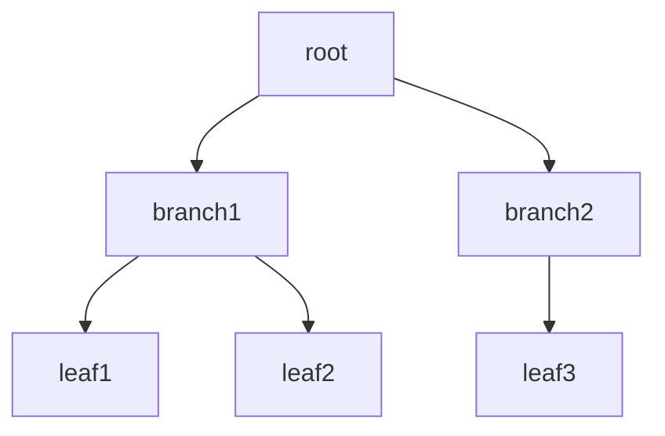

## 4.4.2 Implementation in JavaScript

The Composite Pattern is a structural design pattern that allows you to compose objects into tree structures to represent part-whole hierarchies. This pattern lets clients treat individual objects and compositions of objects uniformly. In this section, we will explore how to implement the Composite Pattern in JavaScript, a language known for its flexibility and dynamic nature.

### Understanding the Composite Pattern

The Composite Pattern is particularly useful when you have a tree structure to represent, where individual objects (leaves) and compositions of objects (composites) need to be treated uniformly. This pattern is often used in graphical user interfaces, file systems, and any scenario where a hierarchical structure is present.

#### Key Concepts

- **Component**: An abstract class or interface that defines the common interface for both leaf and composite objects.
- **Leaf**: Represents the end objects of a composition. A leaf has no children.
- **Composite**: A class that represents a group of components (either leaves or other composites). It implements the component interface and contains child components.

### Implementing the Composite Pattern in JavaScript

Let's dive into the implementation of the Composite Pattern in JavaScript. We'll define the `Component`, `Leaf`, and `Composite` objects, and demonstrate how to use them to manage part-whole hierarchies.

#### Step 1: Define the Component Interface

In JavaScript, we can use a class to define the component interface. This class will declare methods that both leaf and composite objects must implement.

```javascript
// Component class
class Component {
  constructor(name) {
    this.name = name;
  }

  add(component) {
    throw new Error('This method must be overridden!');
  }

  remove(component) {
    throw new Error('This method must be overridden!');
  }

  display(depth) {
    throw new Error('This method must be overridden!');
  }
}
```

#### Step 2: Implement the Leaf Class

The `Leaf` class represents the end objects of a composition. A leaf has no children and implements the component interface.

```javascript
// Leaf class
class Leaf extends Component {
  constructor(name) {
    super(name);
  }

  add(component) {
    console.log('Cannot add to a leaf');
  }

  remove(component) {
    console.log('Cannot remove from a leaf');
  }

  display(depth) {
    console.log('-'.repeat(depth) + this.name);
  }
}
```

#### Step 3: Implement the Composite Class

The `Composite` class represents a group of components. It implements the component interface and contains child components.

```javascript
// Composite class
class Composite extends Component {
  constructor(name) {
    super(name);
    this.children = [];
  }

  add(component) {
    this.children.push(component);
  }

  remove(component) {
    const index = this.children.indexOf(component);
    if (index !== -1) {
      this.children.splice(index, 1);
    }
  }

  display(depth) {
    console.log('-'.repeat(depth) + this.name);
    for (const child of this.children) {
      child.display(depth + 2);
    }
  }
}
```

#### Step 4: Using the Composite Pattern

Now that we have defined our `Component`, `Leaf`, and `Composite` classes, let's see how we can use them to create a tree structure.

```javascript
// Create a tree structure
const root = new Composite('root');
const branch1 = new Composite('branch1');
const branch2 = new Composite('branch2');
const leaf1 = new Leaf('leaf1');
const leaf2 = new Leaf('leaf2');
const leaf3 = new Leaf('leaf3');

// Build the tree
root.add(branch1);
root.add(branch2);
branch1.add(leaf1);
branch1.add(leaf2);
branch2.add(leaf3);

// Display the tree
root.display(1);
```

### Recursive Operations and Traversal

The `display` method in both `Leaf` and `Composite` classes demonstrates the recursive nature of the Composite Pattern. The `Composite` class's `display` method calls the `display` method on each of its children, which can be either leaves or other composites. This recursive call allows the entire tree structure to be traversed and displayed.

#### Recursive Logic Explanation

- **Base Case**: The `Leaf` class's `display` method acts as the base case for the recursion. It simply prints the leaf's name with the appropriate indentation.
- **Recursive Case**: The `Composite` class's `display` method iterates over its children and calls their `display` method, increasing the depth to ensure proper indentation.

### JavaScript-Specific Considerations

JavaScript's dynamic typing and flexible object structures make it a suitable language for implementing the Composite Pattern. Here are some considerations to keep in mind:

- **Dynamic Typing**: JavaScript's dynamic typing allows you to easily add or remove methods from objects. This flexibility can be beneficial when implementing patterns like Composite, where objects can have varying structures.
- **Object Structures**: JavaScript objects are inherently flexible, allowing you to create complex structures without strict type constraints. This can be advantageous when building tree-like structures.

### Visualizing the Composite Pattern

To better understand the Composite Pattern, let's visualize the tree structure we created earlier using a diagram.



**Diagram Description**: This diagram represents the tree structure created using the Composite Pattern. The `root` node contains two branches, `branch1` and `branch2`. `branch1` contains two leaves, `leaf1` and `leaf2`, while `branch2` contains one leaf, `leaf3`.

### Try It Yourself

To deepen your understanding of the Composite Pattern, try modifying the code examples:

- Add more branches and leaves to the tree structure.
- Implement additional methods in the `Component` class, such as `getChild(index)` to retrieve a specific child.
- Experiment with different tree structures and observe how the `display` method adapts.

### Knowledge Check

Before we wrap up, let's reinforce what we've learned with a few questions:

1. What is the primary purpose of the Composite Pattern?
2. How does the `Composite` class differ from the `Leaf` class in terms of functionality?
3. Why is recursion important in the Composite Pattern?

### Summary

In this section, we explored the Composite Pattern and its implementation in JavaScript. We defined the `Component`, `Leaf`, and `Composite` classes, demonstrated recursive operations, and discussed JavaScript-specific considerations. By understanding and implementing the Composite Pattern, you can effectively manage part-whole hierarchies in your applications.

Remember, this is just the beginning. As you progress, you'll build more complex and interactive applications using design patterns. Keep experimenting, stay curious, and enjoy the journey!

## Quiz Time!



### What is the primary purpose of the Composite Pattern?

- [x] To compose objects into tree structures to represent part-whole hierarchies.
- [ ] To create a single instance of a class.
- [ ] To allow incompatible interfaces to work together.
- [ ] To encapsulate requests as objects.

> **Explanation:** The Composite Pattern is used to compose objects into tree structures to represent part-whole hierarchies, allowing clients to treat individual objects and compositions of objects uniformly.

### How does the Composite class differ from the Leaf class in terms of functionality?

- [x] The Composite class can contain child components, while the Leaf class cannot.
- [ ] The Leaf class can contain child components, while the Composite class cannot.
- [ ] Both classes can contain child components.
- [ ] Neither class can contain child components.

> **Explanation:** The Composite class can contain child components, allowing it to represent a group of components, while the Leaf class represents end objects with no children.

### Why is recursion important in the Composite Pattern?

- [x] It allows the entire tree structure to be traversed and displayed.
- [ ] It simplifies the creation of individual objects.
- [ ] It ensures that only one instance of a class is created.
- [ ] It allows incompatible interfaces to work together.

> **Explanation:** Recursion is important in the Composite Pattern because it allows the entire tree structure to be traversed and displayed, enabling uniform treatment of individual and composite objects.

### What is a key benefit of using the Composite Pattern?

- [x] It allows clients to treat individual objects and compositions of objects uniformly.
- [ ] It ensures that a class has only one instance.
- [ ] It provides a simplified interface to a complex subsystem.
- [ ] It reduces memory usage by sharing common parts.

> **Explanation:** A key benefit of the Composite Pattern is that it allows clients to treat individual objects and compositions of objects uniformly, simplifying client code.

### In the Composite Pattern, what role does the Component class play?

- [x] It defines the common interface for both leaf and composite objects.
- [ ] It represents the end objects of a composition.
- [ ] It provides a simplified interface to a complex subsystem.
- [ ] It ensures that a class has only one instance.

> **Explanation:** The Component class defines the common interface for both leaf and composite objects, ensuring that they can be treated uniformly.

### What is a common use case for the Composite Pattern?

- [x] Graphical user interfaces.
- [ ] Singleton instances.
- [ ] Adapter interfaces.
- [ ] Memory optimization.

> **Explanation:** A common use case for the Composite Pattern is graphical user interfaces, where a tree structure of components is often needed.

### How does JavaScript's dynamic typing benefit the implementation of the Composite Pattern?

- [x] It allows for flexible object structures without strict type constraints.
- [ ] It ensures that only one instance of a class is created.
- [ ] It provides a simplified interface to a complex subsystem.
- [ ] It reduces memory usage by sharing common parts.

> **Explanation:** JavaScript's dynamic typing allows for flexible object structures without strict type constraints, making it easier to implement tree-like structures.

### What method in the Composite class is responsible for displaying the tree structure?

- [x] display
- [ ] add
- [ ] remove
- [ ] getChild

> **Explanation:** The `display` method in the Composite class is responsible for displaying the tree structure by recursively calling the `display` method on its children.

### What is the base case for recursion in the Composite Pattern?

- [x] The Leaf class's display method.
- [ ] The Composite class's add method.
- [ ] The Component class's constructor.
- [ ] The Composite class's remove method.

> **Explanation:** The Leaf class's display method acts as the base case for recursion in the Composite Pattern, as it simply prints the leaf's name without further recursion.

### True or False: In the Composite Pattern, a Composite object can contain both Leaf and other Composite objects.

- [x] True
- [ ] False

> **Explanation:** True. In the Composite Pattern, a Composite object can contain both Leaf and other Composite objects, allowing for flexible tree structures.


