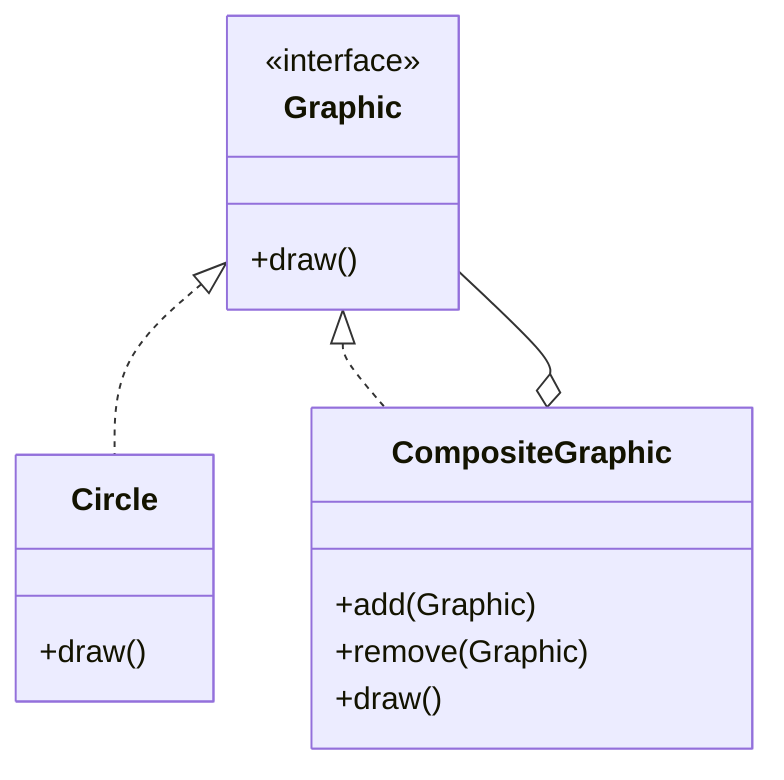

## 4.4.3 Implementation in TypeScript

The Composite Pattern is a structural design pattern that allows you to compose objects into tree structures to represent part-whole hierarchies. It lets clients treat individual objects and compositions of objects uniformly. In TypeScript, the Composite Pattern can be implemented with strong type enforcement, which helps prevent common errors and enhances code reliability.

### Understanding the Composite Pattern

Before diving into the implementation, let's briefly revisit the core concepts of the Composite Pattern:

- **Component**: An interface or abstract class that defines the common operations for both simple and complex objects.
- **Leaf**: Represents the end objects of a composition. A leaf has no children.
- **Composite**: A class that represents a group of objects, which can include both leaves and other composites.

### TypeScript's Role in Composite Pattern

TypeScript, with its static typing and interface capabilities, provides a robust environment for implementing the Composite Pattern. It ensures that all components adhere to a defined structure, reducing runtime errors and improving code maintainability.

### Defining Interfaces and Abstract Classes

In TypeScript, we can use interfaces or abstract classes to define the structure of our components. Let's start by defining an interface for the component:

```typescript
// Define the Component interface
interface Graphic {
  draw(): void;
}
```

This `Graphic` interface declares a `draw` method, which will be implemented by both leaf and composite classes.

### Implementing the Leaf Class

The leaf class implements the `Graphic` interface and represents the simplest form of a component:

```typescript
// Implement the Leaf class
class Circle implements Graphic {
  draw(): void {
    console.log("Drawing a Circle");
  }
}
```

Here, the `Circle` class implements the `draw` method, fulfilling the contract defined by the `Graphic` interface.

### Implementing the Composite Class

The composite class also implements the `Graphic` interface but can contain other `Graphic` objects, allowing for complex compositions:

```typescript
// Implement the Composite class
class CompositeGraphic implements Graphic {
  private children: Graphic[] = [];

  add(graphic: Graphic): void {
    this.children.push(graphic);
  }

  remove(graphic: Graphic): void {
    const index = this.children.indexOf(graphic);
    if (index !== -1) {
      this.children.splice(index, 1);
    }
  }

  draw(): void {
    for (const child of this.children) {
      child.draw();
    }
  }
}
```

In the `CompositeGraphic` class, we maintain a list of child components, allowing us to add or remove components dynamically. The `draw` method iterates over each child and calls its `draw` method, demonstrating the recursive nature of the pattern.

### Advantages of TypeScript in Composite Pattern

TypeScript's static typing offers several advantages when implementing the Composite Pattern:

1. **Type Safety**: TypeScript ensures that all components implement the required methods, reducing runtime errors.
2. **Code Completion**: With TypeScript, IDEs can provide better code completion and navigation, improving developer productivity.
3. **Refactoring Support**: TypeScript's type system makes it easier to refactor code, as changes are propagated throughout the codebase with type checks.

### Differences from JavaScript Implementation

In JavaScript, the Composite Pattern can be implemented using classes and prototypes, but it lacks the static type checking that TypeScript provides. This means that errors such as calling undefined methods may only surface at runtime in JavaScript, whereas TypeScript catches these errors during compilation.

### Visualizing the Composite Pattern

To better understand the structure of the Composite Pattern, let's visualize it using a class diagram:



**Diagram Description**: This diagram illustrates the relationship between the `Graphic` interface, the `Circle` leaf class, and the `CompositeGraphic` composite class. The `CompositeGraphic` class can contain multiple `Graphic` objects, demonstrating the part-whole hierarchy.

### Try It Yourself

Now that we've covered the basics, try modifying the code to include additional shapes, such as `Rectangle` or `Triangle`. Implement these shapes as leaf classes and add them to a `CompositeGraphic` instance to see how the pattern handles different compositions.

### Knowledge Check

Let's reinforce your understanding with a few questions:

- What is the primary purpose of the Composite Pattern?
- How does TypeScript enhance the implementation of the Composite Pattern?
- What are the key differences between implementing the Composite Pattern in JavaScript and TypeScript?

### Conclusion

The Composite Pattern is a powerful tool for managing complex hierarchical structures in software design. By leveraging TypeScript's static typing and interface capabilities, we can implement this pattern with greater reliability and maintainability. As you continue to explore design patterns, remember that TypeScript's features can significantly enhance your ability to write robust and error-free code.

## Quiz Time!



### What is the primary role of the Composite Pattern in software design?

- [x] To compose objects into tree structures to represent part-whole hierarchies.
- [ ] To ensure a class has only one instance.
- [ ] To provide a simplified interface to a complex subsystem.
- [ ] To encapsulate requests as objects.

> **Explanation:** The Composite Pattern allows you to compose objects into tree structures to represent part-whole hierarchies, enabling clients to treat individual objects and compositions uniformly.

### Which TypeScript feature helps prevent common errors in the Composite Pattern?

- [x] Static typing
- [ ] Dynamic typing
- [ ] Prototype inheritance
- [ ] Asynchronous programming

> **Explanation:** TypeScript's static typing ensures that all components adhere to a defined structure, reducing runtime errors and improving code maintainability.

### What method must be implemented by all classes that adhere to the `Graphic` interface?

- [x] draw()
- [ ] add()
- [ ] remove()
- [ ] execute()

> **Explanation:** The `draw()` method is defined in the `Graphic` interface and must be implemented by all classes that adhere to this interface.

### How does the `CompositeGraphic` class manage its child components?

- [x] By maintaining a list of `Graphic` objects
- [ ] By using a single `Graphic` object
- [ ] By storing components in a database
- [ ] By using a global variable

> **Explanation:** The `CompositeGraphic` class maintains a list of `Graphic` objects, allowing it to add or remove components dynamically.

### What is a key difference between implementing the Composite Pattern in JavaScript and TypeScript?

- [x] TypeScript provides static type checking, while JavaScript does not.
- [ ] JavaScript provides static type checking, while TypeScript does not.
- [ ] TypeScript cannot implement the Composite Pattern.
- [ ] JavaScript cannot implement the Composite Pattern.

> **Explanation:** TypeScript provides static type checking, which helps catch errors during compilation, whereas JavaScript lacks this feature.

### In the Composite Pattern, what is the role of the `Leaf` class?

- [x] To represent the end objects of a composition with no children.
- [ ] To manage a group of objects.
- [ ] To provide a simplified interface to a complex subsystem.
- [ ] To encapsulate requests as objects.

> **Explanation:** The `Leaf` class represents the end objects of a composition and has no children, fulfilling the simplest form of a component.

### What advantage does TypeScript offer when refactoring code in the Composite Pattern?

- [x] Type checks propagate changes throughout the codebase.
- [ ] It allows for dynamic typing.
- [ ] It simplifies asynchronous programming.
- [ ] It eliminates the need for interfaces.

> **Explanation:** TypeScript's type system makes it easier to refactor code, as changes are propagated throughout the codebase with type checks.

### Which method in the `CompositeGraphic` class is responsible for executing the `draw` operation on all child components?

- [x] draw()
- [ ] add()
- [ ] remove()
- [ ] execute()

> **Explanation:** The `draw()` method in the `CompositeGraphic` class iterates over each child and calls its `draw` method, demonstrating the recursive nature of the pattern.

### How can TypeScript's code completion feature benefit developers implementing the Composite Pattern?

- [x] By providing better code completion and navigation.
- [ ] By eliminating the need for interfaces.
- [ ] By simplifying asynchronous programming.
- [ ] By allowing for dynamic typing.

> **Explanation:** TypeScript's code completion feature improves developer productivity by providing better code completion and navigation.

### True or False: The Composite Pattern allows clients to treat individual objects and compositions of objects uniformly.

- [x] True
- [ ] False

> **Explanation:** True. The Composite Pattern allows clients to treat individual objects and compositions of objects uniformly, enabling flexible and scalable software design.



Remember, this is just the beginning. As you progress, you'll build more complex and interactive applications using the Composite Pattern. Keep experimenting, stay curious, and enjoy the journey!
