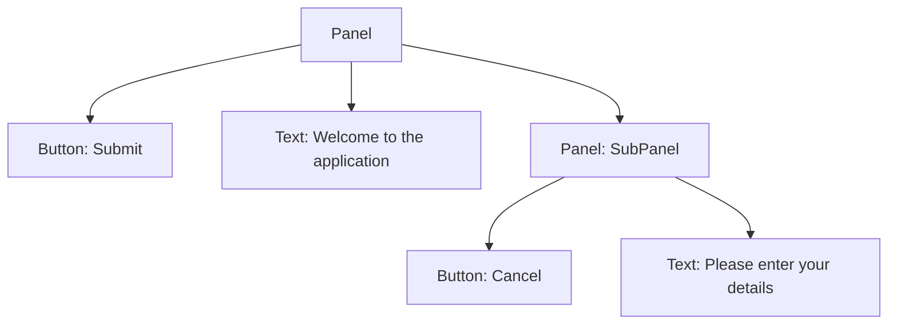

## 4.4.4 Use Cases and Examples

The Composite Pattern is a structural design pattern that allows you to compose objects into tree structures to represent part-whole hierarchies. It lets clients treat individual objects and compositions of objects uniformly. In this section, we will explore real-world use cases where the Composite Pattern is particularly beneficial, such as rendering UI elements, handling XML/HTML documents, and managing game entities. We will also provide detailed code snippets and discuss how this pattern simplifies client interactions and enhances extensibility.

### Rendering UI Elements

One of the most common applications of the Composite Pattern is in rendering user interface (UI) elements. Modern UIs are often composed of nested components, such as buttons, panels, and containers. The Composite Pattern allows us to treat these components uniformly, simplifying the rendering logic.

#### Example: UI Component Tree

Consider a UI library where we have different types of components, such as `Button`, `Panel`, and `Text`. We can use the Composite Pattern to create a component tree where each component can have children.

```typescript
// Component interface
interface UIComponent {
  render(): void;
}

// Leaf component
class Button implements UIComponent {
  constructor(private label: string) {}

  render(): void {
    console.log(`Rendering a button with label: ${this.label}`);
  }
}

// Leaf component
class Text implements UIComponent {
  constructor(private content: string) {}

  render(): void {
    console.log(`Rendering text: ${this.content}`);
  }
}

// Composite component
class Panel implements UIComponent {
  private children: UIComponent[] = [];

  add(component: UIComponent): void {
    this.children.push(component);
  }

  render(): void {
    console.log('Rendering a panel with children:');
    for (const child of this.children) {
      child.render();
    }
  }
}

// Client code
const mainPanel = new Panel();
mainPanel.add(new Button('Submit'));
mainPanel.add(new Text('Welcome to the application'));

const subPanel = new Panel();
subPanel.add(new Button('Cancel'));
subPanel.add(new Text('Please enter your details'));

mainPanel.add(subPanel);

mainPanel.render();
```

**Explanation**: In this example, we have a `Panel` class that can contain other `UIComponent` objects, including other panels. This allows us to build a tree of components and render them recursively. The client code interacts with the composite structure without needing to know whether it is dealing with a single component or a group of components.

### Handling XML/HTML Documents

The Composite Pattern is also useful for handling hierarchical data structures, such as XML or HTML documents. These documents naturally form a tree structure, where elements can contain other elements.

#### Example: XML Document Structure

Let's consider a simple XML document structure where each element can have child elements.

```typescript
// Component interface
interface XMLElement {
  display(indent: string): void;
}

// Leaf component
class XMLText implements XMLElement {
  constructor(private text: string) {}

  display(indent: string): void {
    console.log(`${indent}${this.text}`);
  }
}

// Composite component
class XMLTag implements XMLElement {
  private children: XMLElement[] = [];

  constructor(private name: string) {}

  add(child: XMLElement): void {
    this.children.push(child);
  }

  display(indent: string): void {
    console.log(`${indent}<${this.name}>`);
    for (const child of this.children) {
      child.display(indent + '  ');
    }
    console.log(`${indent}</${this.name}>`);
  }
}

// Client code
const root = new XMLTag('html');
const body = new XMLTag('body');
const paragraph = new XMLTag('p');
paragraph.add(new XMLText('Hello, World!'));

body.add(paragraph);
root.add(body);

root.display('');
```

**Explanation**: In this example, we have an `XMLTag` class that can contain other `XMLElement` objects, allowing us to build a tree structure. The `display` method recursively prints the XML structure with proper indentation. This approach simplifies the manipulation and rendering of XML documents.

### Managing Game Entities

In game development, the Composite Pattern can be used to manage complex game entities that consist of multiple components. For example, a game character might consist of a body, weapons, and armor, each of which can have its own components.

#### Example: Game Entity Hierarchy

Let's create a simple game entity system where entities can be composed of other entities.

```typescript
// Component interface
interface GameEntity {
  update(): void;
}

// Leaf component
class Weapon implements GameEntity {
  constructor(private name: string) {}

  update(): void {
    console.log(`Updating weapon: ${this.name}`);
  }
}

// Leaf component
class Armor implements GameEntity {
  constructor(private type: string) {}

  update(): void {
    console.log(`Updating armor: ${this.type}`);
  }
}

// Composite component
class Character implements GameEntity {
  private components: GameEntity[] = [];

  add(component: GameEntity): void {
    this.components.push(component);
  }

  update(): void {
    console.log('Updating character with components:');
    for (const component of this.components) {
      component.update();
    }
  }
}

// Client code
const hero = new Character();
hero.add(new Weapon('Sword'));
hero.add(new Armor('Shield'));

const sidekick = new Character();
sidekick.add(new Weapon('Bow'));
sidekick.add(new Armor('Leather Armor'));

hero.add(sidekick);

hero.update();
```

**Explanation**: In this example, the `Character` class can contain other `GameEntity` objects, allowing us to build a hierarchy of game entities. The `update` method recursively updates all components of the character, demonstrating how the Composite Pattern can simplify the management of complex game entities.

### Simplifying Client Interactions

The Composite Pattern simplifies client interactions by allowing clients to treat individual objects and compositions uniformly. This means that clients do not need to know whether they are dealing with a single object or a composite of objects, reducing the complexity of client code.

#### Example: Simplified Client Code

Consider a scenario where we have a mix of individual and composite UI components. The client code can interact with these components without worrying about their composition.

```typescript
function renderComponent(component: UIComponent): void {
  component.render();
}

// Client code
const button = new Button('Click Me');
const panel = new Panel();
panel.add(new Text('Panel Content'));

renderComponent(button);
renderComponent(panel);
```

**Explanation**: In this example, the `renderComponent` function can accept any `UIComponent`, whether it is a single component or a composite. This uniform treatment simplifies the client code and makes it more flexible.

### Impact on Extensibility

The Composite Pattern enhances extensibility by allowing new component types to be added without modifying existing code. This is particularly useful in systems where the set of components is expected to grow over time.

#### Example: Adding New Component Types

Let's extend our UI component example by adding a new `Image` component.

```typescript
// New leaf component
class Image implements UIComponent {
  constructor(private src: string) {}

  render(): void {
    console.log(`Rendering image from source: ${this.src}`);
  }
}

// Client code
const image = new Image('logo.png');
const panelWithImage = new Panel();
panelWithImage.add(image);
panelWithImage.add(new Text('Image Panel'));

panelWithImage.render();
```

**Explanation**: In this example, we added a new `Image` component without modifying the existing `UIComponent` interface or the `Panel` class. This demonstrates how the Composite Pattern supports the open/closed principle, allowing for easy extension of the system.

### Identifying Suitable Situations

The Composite Pattern is suitable for situations where you need to represent part-whole hierarchies and treat individual and composite objects uniformly. Here are some guidelines to help identify suitable situations for applying the Composite Pattern:

- **Hierarchical Structures**: Use the Composite Pattern when dealing with hierarchical data structures, such as file systems, organizational charts, or UI component trees.
- **Uniform Treatment**: Apply the pattern when you want to treat individual objects and compositions uniformly, simplifying client code.
- **Extensibility**: Consider the Composite Pattern when you anticipate the need to add new component types without modifying existing code.
- **Complex Entities**: Use the pattern when managing complex entities composed of multiple components, such as game characters or document elements.

### Try It Yourself

To deepen your understanding of the Composite Pattern, try modifying the code examples provided:

- **Experiment with UI Components**: Add new types of UI components, such as `Checkbox` or `Dropdown`, and integrate them into the existing component tree.
- **Extend XML Handling**: Implement additional XML elements, such as attributes or comments, and modify the `display` method to handle them.
- **Enhance Game Entities**: Create new game entity components, such as `Potion` or `Quest`, and incorporate them into the character hierarchy.

By experimenting with these modifications, you'll gain a deeper understanding of how the Composite Pattern can be applied in different contexts.

### Visualizing the Composite Pattern

To better understand the structure and relationships within the Composite Pattern, let's visualize a simple UI component tree using a Mermaid.js diagram.



**Description**: This diagram represents a UI component tree where a `Panel` contains a `Button`, `Text`, and another `Panel` (SubPanel), which in turn contains its own `Button` and `Text`. This visualization helps illustrate the hierarchical structure enabled by the Composite Pattern.

### Further Reading

For more information on the Composite Pattern and its applications, consider exploring the following resources:

- [MDN Web Docs: Composite Pattern](https://developer.mozilla.org/en-US/docs/Web/JavaScript/Guide/Composite_Pattern)
- [Refactoring Guru: Composite Pattern](https://refactoring.guru/design-patterns/composite)
- [Design Patterns: Elements of Reusable Object-Oriented Software](https://en.wikipedia.org/wiki/Design_Patterns)

These resources provide additional insights and examples of the Composite Pattern in practice.

### Key Takeaways

- The Composite Pattern allows you to compose objects into tree structures to represent part-whole hierarchies.
- It simplifies client interactions by allowing uniform treatment of individual and composite objects.
- The pattern enhances extensibility by allowing new component types to be added without modifying existing code.
- Suitable situations for applying the Composite Pattern include hierarchical structures, uniform treatment needs, and complex entities.

Remember, this is just the beginning. As you progress, you'll discover more ways to apply the Composite Pattern to create scalable and maintainable software architectures. Keep experimenting, stay curious, and enjoy the journey!

## Quiz Time!



### Which of the following is a common use case for the Composite Pattern?

- [x] Rendering UI elements
- [ ] Managing database connections
- [ ] Handling user authentication
- [ ] Implementing caching mechanisms

> **Explanation:** The Composite Pattern is commonly used for rendering UI elements, as it allows for the creation of complex component trees.


### What is the primary benefit of using the Composite Pattern in UI design?

- [x] Simplifying client interactions with component hierarchies
- [ ] Reducing memory usage
- [ ] Enhancing security
- [ ] Improving network performance

> **Explanation:** The Composite Pattern simplifies client interactions by allowing uniform treatment of individual and composite components.


### In the provided UI component example, what role does the `Panel` class play?

- [x] Composite component
- [ ] Leaf component
- [ ] Client component
- [ ] Abstract component

> **Explanation:** The `Panel` class acts as a composite component, capable of containing other UI components, including other panels.


### How does the Composite Pattern enhance extensibility?

- [x] By allowing new component types to be added without modifying existing code
- [ ] By reducing the number of classes needed
- [ ] By improving runtime performance
- [ ] By decreasing the complexity of algorithms

> **Explanation:** The Composite Pattern enhances extensibility by supporting the addition of new component types without altering existing structures.


### Which of the following is NOT a suitable situation for applying the Composite Pattern?

- [ ] Hierarchical data structures
- [ ] Complex entities with multiple components
- [x] Simple, flat data structures
- [ ] Uniform treatment of objects

> **Explanation:** The Composite Pattern is not suitable for simple, flat data structures, as it is designed for hierarchical and complex entities.


### What is the role of the `render` method in the UI component example?

- [x] To display the component and its children
- [ ] To initialize the component
- [ ] To update the component's state
- [ ] To handle user input

> **Explanation:** The `render` method is responsible for displaying the component and its children, demonstrating the recursive nature of the Composite Pattern.


### In the game entity example, what is the purpose of the `update` method?

- [x] To recursively update all components of the character
- [ ] To render the game entity
- [ ] To save the game state
- [ ] To handle player input

> **Explanation:** The `update` method recursively updates all components of the character, illustrating the Composite Pattern's ability to manage complex entities.


### How does the Composite Pattern affect client code?

- [x] It simplifies client code by allowing uniform treatment of objects
- [ ] It complicates client code by adding more layers
- [ ] It has no impact on client code
- [ ] It requires significant changes to client code

> **Explanation:** The Composite Pattern simplifies client code by enabling uniform treatment of individual and composite objects.


### What is the main advantage of treating individual and composite objects uniformly?

- [x] It reduces the complexity of client code
- [ ] It increases the speed of execution
- [ ] It enhances security
- [ ] It improves memory management

> **Explanation:** Treating individual and composite objects uniformly reduces the complexity of client code, making it easier to manage.


### True or False: The Composite Pattern is only applicable to UI design.

- [ ] True
- [x] False

> **Explanation:** False. The Composite Pattern is applicable to various domains, including UI design, document handling, and game development.


