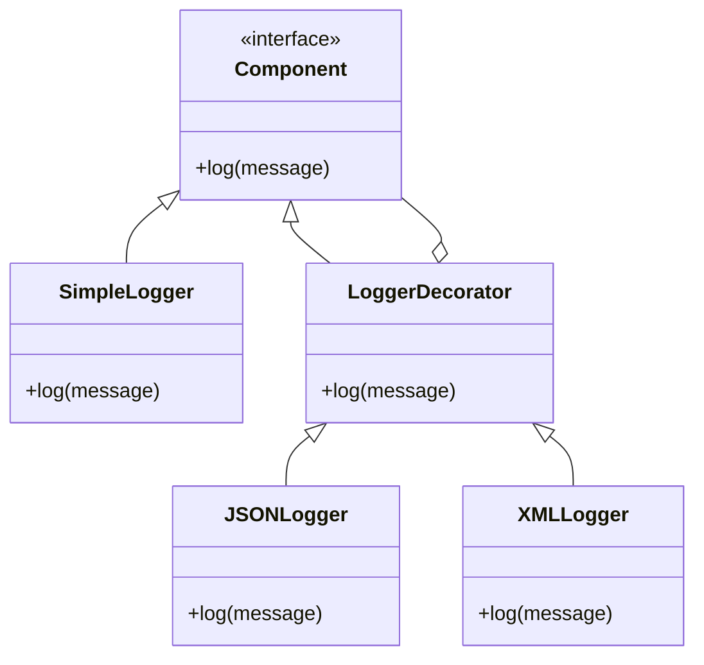

## 4.5.1 Intent and Motivation

In the world of software development, flexibility and scalability are paramount. As applications grow in complexity, the need to extend and modify behavior without altering existing code becomes crucial. The Decorator Pattern is a structural design pattern that addresses this need by allowing additional responsibilities to be attached to an object dynamically. This pattern provides a flexible alternative to subclassing for extending functionality, adhering to the principle of being open for extension but closed for modification.

### Understanding the Decorator Pattern

The Decorator Pattern is akin to adding toppings to ice cream. Imagine you have a simple scoop of vanilla ice cream, and you want to enhance it with chocolate syrup, sprinkles, and a cherry on top. Instead of creating a new ice cream flavor for each combination of toppings, you simply add the desired toppings to the vanilla base. Similarly, the Decorator Pattern allows you to "decorate" an object with new behavior by wrapping it with additional functionality.

#### Key Concepts of the Decorator Pattern

- **Component Interface**: This defines the interface for objects that can have responsibilities added to them dynamically.
- **Concrete Component**: This is the original object to which additional behavior can be added.
- **Decorator**: This is an abstract class that implements the component interface and contains a reference to a component object. It delegates all operations to the component and can add its own behavior.
- **Concrete Decorators**: These are classes that extend the Decorator class and add new behavior to the component.

### The Limitations of Subclassing

Subclassing is a common approach to extend the functionality of a class. However, it has several limitations:

1. **Rigid Hierarchies**: Subclassing leads to rigid class hierarchies that are difficult to modify and extend. Each new behavior requires a new subclass, leading to a proliferation of classes.
2. **Inheritance Overhead**: Inheritance can introduce unnecessary complexity and dependencies, making the code harder to maintain.
3. **Lack of Flexibility**: Subclassing is static, meaning that the behavior is determined at compile time and cannot be changed at runtime.

The Decorator Pattern overcomes these limitations by providing a more flexible way to extend behavior.

### Dynamic Behavior Addition

In modern software applications, the ability to add behavior dynamically is essential. Consider a scenario where you have a logging system that needs to support multiple output formats, such as plain text, JSON, and XML. Instead of creating a separate class for each format, you can use decorators to add the desired output format dynamically.

#### Example: Logging System

```javascript
// Component Interface
class Logger {
  log(message) {
    throw new Error("This method should be overridden");
  }
}

// Concrete Component
class SimpleLogger extends Logger {
  log(message) {
    console.log(message);
  }
}

// Decorator
class LoggerDecorator extends Logger {
  constructor(logger) {
    super();
    this.logger = logger;
  }

  log(message) {
    this.logger.log(message);
  }
}

// Concrete Decorators
class JSONLogger extends LoggerDecorator {
  log(message) {
    super.log(JSON.stringify({ message }));
  }
}

class XMLLogger extends LoggerDecorator {
  log(message) {
    super.log(`<log><message>${message}</message></log>`);
  }
}

// Usage
let logger = new SimpleLogger();
logger = new JSONLogger(logger);
logger = new XMLLogger(logger);

logger.log("Hello, World!");
```

In this example, we start with a `SimpleLogger` and dynamically add JSON and XML formatting capabilities using decorators. This approach allows us to combine different behaviors without altering the original `SimpleLogger` class.

### Open for Extension, Closed for Modification

The Decorator Pattern exemplifies the Open/Closed Principle, one of the SOLID principles of object-oriented design. This principle states that software entities should be open for extension but closed for modification. By using decorators, we can extend the behavior of objects without modifying their existing code, thus maintaining code stability and reducing the risk of introducing bugs.

#### Benefits of the Decorator Pattern

- **Flexibility**: Decorators provide a flexible way to extend object behavior without altering existing code.
- **Reusability**: Decorators can be reused across different components, promoting code reuse.
- **Combining Behaviors**: Multiple decorators can be combined to create complex behavior combinations.
- **Runtime Modification**: Behavior can be added or removed at runtime, offering dynamic flexibility.

### Visualizing the Decorator Pattern

To better understand the Decorator Pattern, let's visualize the structure using a class diagram.



In this diagram, `Component` is the interface that defines the `log` method. `SimpleLogger` is the concrete component that implements this interface. `LoggerDecorator` is the abstract decorator that also implements the `Component` interface and holds a reference to a `Component` object. `JSONLogger` and `XMLLogger` are concrete decorators that extend `LoggerDecorator` and add their own behavior.

### Real-World Applications

The Decorator Pattern is widely used in real-world applications. Here are some common use cases:

- **User Interface Components**: In graphical user interfaces, decorators can be used to add features like borders, scroll bars, and shadows to components dynamically.
- **Stream Processing**: In I/O operations, decorators are used to add functionality like buffering, compression, and encryption to streams.
- **Middleware in Web Applications**: In web development, decorators can be used to add middleware functions such as authentication, logging, and error handling to request handlers.

### Try It Yourself

To gain a deeper understanding of the Decorator Pattern, try modifying the logging system example. Add a new decorator that adds a timestamp to each log message. Experiment with different combinations of decorators to see how they affect the output.

### References and Further Reading

- [MDN Web Docs: Decorator Pattern](https://developer.mozilla.org/en-US/docs/Web/JavaScript/Guide/Decorators)
- [Refactoring Guru: Decorator Pattern](https://refactoring.guru/design-patterns/decorator)
- [Wikipedia: Decorator Pattern](https://en.wikipedia.org/wiki/Decorator_pattern)

### Knowledge Check

Before we wrap up, let's reinforce our understanding of the Decorator Pattern with a few questions:

1. What is the primary purpose of the Decorator Pattern?
2. How does the Decorator Pattern adhere to the Open/Closed Principle?
3. What are the limitations of subclassing that the Decorator Pattern addresses?
4. Can decorators be combined to create complex behavior? How?
5. What are some real-world applications of the Decorator Pattern?

### Conclusion

The Decorator Pattern is a powerful tool in the software developer's arsenal, allowing for dynamic behavior extension without altering the underlying object structure. By understanding and applying this pattern, we can create flexible, scalable, and maintainable code that adheres to the principles of object-oriented design. Remember, this is just the beginning. As you progress, you'll build more complex and interactive applications. Keep experimenting, stay curious, and enjoy the journey!

## Quiz Time!



### What is the primary purpose of the Decorator Pattern?

- [x] To attach additional responsibilities to an object dynamically without altering its structure.
- [ ] To create a new subclass for each new behavior.
- [ ] To modify the existing code of an object to add new features.
- [ ] To replace the need for interfaces in object-oriented design.

> **Explanation:** The Decorator Pattern allows additional responsibilities to be added to an object dynamically without altering its structure, providing a flexible alternative to subclassing.

### How does the Decorator Pattern adhere to the Open/Closed Principle?

- [x] By allowing objects to be extended with new behavior without modifying existing code.
- [ ] By requiring all objects to be closed for modification.
- [ ] By creating new subclasses for each new behavior.
- [ ] By making all classes final and unchangeable.

> **Explanation:** The Decorator Pattern adheres to the Open/Closed Principle by allowing objects to be extended with new behavior without modifying existing code, thus being open for extension but closed for modification.

### What are the limitations of subclassing that the Decorator Pattern addresses?

- [x] Rigid hierarchies, inheritance overhead, and lack of flexibility.
- [ ] Inability to create new classes.
- [ ] Lack of support for dynamic behavior.
- [ ] Difficulty in implementing interfaces.

> **Explanation:** Subclassing leads to rigid hierarchies, inheritance overhead, and lack of flexibility, which the Decorator Pattern addresses by providing a more flexible way to extend behavior.

### Can decorators be combined to create complex behavior? How?

- [x] Yes, by wrapping an object with multiple decorators.
- [ ] No, decorators cannot be combined.
- [ ] Yes, by creating a new subclass for each combination.
- [ ] No, decorators are limited to single behavior extensions.

> **Explanation:** Decorators can be combined by wrapping an object with multiple decorators, allowing for complex behavior combinations.

### What are some real-world applications of the Decorator Pattern?

- [x] User interface components, stream processing, middleware in web applications.
- [ ] Database management, network protocols, file systems.
- [ ] Operating system design, compiler construction, hardware design.
- [ ] Machine learning algorithms, data analysis, scientific computing.

> **Explanation:** The Decorator Pattern is commonly used in user interface components, stream processing, and middleware in web applications to add dynamic behavior.

### What is a key benefit of using the Decorator Pattern?

- [x] It provides a flexible way to extend object behavior without altering existing code.
- [ ] It simplifies the creation of new subclasses.
- [ ] It eliminates the need for interfaces.
- [ ] It reduces the number of classes needed in a program.

> **Explanation:** The Decorator Pattern provides a flexible way to extend object behavior without altering existing code, promoting code reuse and maintainability.

### What is a common analogy used to explain the Decorator Pattern?

- [x] Adding toppings to ice cream.
- [ ] Building a house with bricks.
- [ ] Painting a canvas with colors.
- [ ] Constructing a car engine.

> **Explanation:** The Decorator Pattern is often compared to adding toppings to ice cream, where additional features are added to a base object.

### What is the role of a Concrete Decorator in the Decorator Pattern?

- [x] To extend the behavior of the component by adding new functionality.
- [ ] To define the interface for objects that can have responsibilities added.
- [ ] To serve as the original object to which behavior can be added.
- [ ] To manage the lifecycle of the component.

> **Explanation:** A Concrete Decorator extends the behavior of the component by adding new functionality, implementing the decorator interface.

### How does the Decorator Pattern differ from subclassing?

- [x] It allows behavior to be added dynamically at runtime.
- [ ] It requires creating new subclasses for each behavior.
- [ ] It modifies the existing code of the component.
- [ ] It eliminates the need for interfaces.

> **Explanation:** The Decorator Pattern differs from subclassing by allowing behavior to be added dynamically at runtime, without modifying existing code.

### True or False: The Decorator Pattern can only be used in object-oriented programming languages.

- [ ] True
- [x] False

> **Explanation:** While the Decorator Pattern is commonly used in object-oriented programming, it can also be applied in other paradigms where behavior extension is needed.


