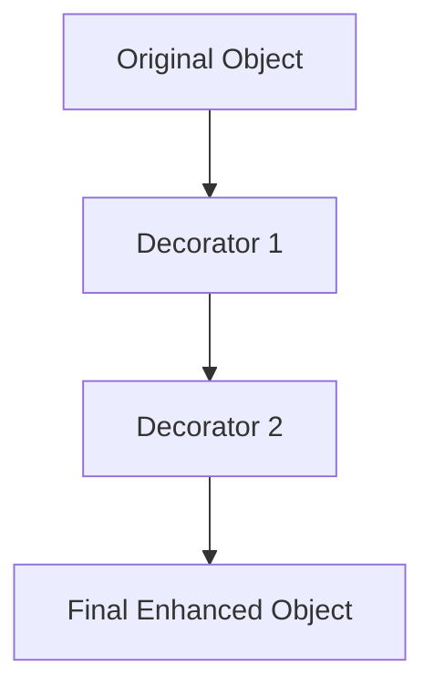

## 4.5.2 Implementation in JavaScript

In this section, we'll delve into the implementation of the Decorator Pattern in JavaScript. This pattern is a structural design pattern that allows behavior to be added to individual objects, either statically or dynamically, without affecting the behavior of other objects from the same class. This is particularly useful in JavaScript, where objects can be extended at runtime.

### Understanding the Decorator Pattern

The Decorator Pattern is used to extend the functionality of objects by wrapping them with additional behavior. This is achieved without altering the original object's code, which is a crucial aspect of maintaining clean and maintainable codebases.

#### Key Concepts

- **Wrapper Objects**: Decorators wrap the original object, adding new behavior.
- **Dynamic Composition**: New functionalities can be composed at runtime.
- **Separation of Concerns**: Each decorator is responsible for a single aspect of behavior enhancement.

Let's explore how we can implement this pattern in JavaScript.

### Implementing Decorators with Functions and Prototypes

JavaScript's flexible nature allows us to implement decorators using functions and prototypes. We'll start with a simple example to illustrate the core concept.

#### Basic Example: Logging Decorator

Imagine we have a simple `Car` object with a `drive` method. We want to add logging functionality to this method without modifying the original `Car` class.

```javascript
// Original Car class
function Car() {}

Car.prototype.drive = function() {
    console.log("The car is driving");
};

// Decorator function
function withLogging(car) {
    const originalDrive = car.drive;
    car.drive = function() {
        console.log("Logging: Car is about to drive");
        originalDrive.apply(car);
        console.log("Logging: Car has finished driving");
    };
    return car;
}

// Usage
const myCar = new Car();
const myCarWithLogging = withLogging(myCar);
myCarWithLogging.drive();
```

**Explanation**:
- We define a `Car` class with a `drive` method.
- The `withLogging` function is a decorator that wraps the `drive` method with additional logging functionality.
- The original `drive` method is preserved and called using `apply`.

### Enhancing Objects Without Modifying Them

The power of decorators lies in their ability to enhance objects without altering the original implementation. This is particularly useful in scenarios where you do not have control over the original code or want to maintain a clean separation of concerns.

#### Example: Adding Features to a Coffee Object

Consider a `Coffee` object that we want to enhance with additional features like milk and sugar.

```javascript
// Original Coffee class
function Coffee() {
    this.cost = 5;
}

Coffee.prototype.getCost = function() {
    return this.cost;
};

// Milk Decorator
function MilkDecorator(coffee) {
    const originalGetCost = coffee.getCost;
    coffee.getCost = function() {
        return originalGetCost.apply(coffee) + 1;
    };
    return coffee;
}

// Sugar Decorator
function SugarDecorator(coffee) {
    const originalGetCost = coffee.getCost;
    coffee.getCost = function() {
        return originalGetCost.apply(coffee) + 0.5;
    };
    return coffee;
}

// Usage
let myCoffee = new Coffee();
myCoffee = MilkDecorator(myCoffee);
myCoffee = SugarDecorator(myCoffee);
console.log("Total cost: $" + myCoffee.getCost());
```

**Explanation**:
- We start with a basic `Coffee` object with a `getCost` method.
- The `MilkDecorator` and `SugarDecorator` functions wrap the `getCost` method to add their respective costs.
- The decorators are applied in sequence, demonstrating how multiple decorators can be composed.

### Using Higher-Order Functions and Closures

JavaScript's support for higher-order functions and closures makes it an ideal language for implementing decorators. These features allow us to create flexible and reusable decorators.

#### Example: Timing Decorator

Let's create a decorator that measures the execution time of a function.

```javascript
// Timing Decorator
function timingDecorator(fn) {
    return function(...args) {
        const start = performance.now();
        const result = fn.apply(this, args);
        const end = performance.now();
        console.log(`Execution time: ${end - start} ms`);
        return result;
    };
}

// Example function
function computeFactorial(n) {
    if (n === 0) return 1;
    return n * computeFactorial(n - 1);
}

// Usage
const timedFactorial = timingDecorator(computeFactorial);
console.log(timedFactorial(5));
```

**Explanation**:
- The `timingDecorator` function takes a function `fn` and returns a new function that wraps `fn`.
- The wrapper function measures the execution time using `performance.now`.
- This approach demonstrates the use of closures to capture the original function and extend its behavior.

### Decorating Objects at Runtime

One of the key advantages of the Decorator Pattern in JavaScript is the ability to apply decorators at runtime. This allows for dynamic behavior modification based on the application's state or user interactions.

#### Example: Dynamic Styling in a UI Component

Consider a UI component that can be styled dynamically based on user preferences.

```javascript
// Base Component
function Component() {
    this.style = "default";
}

Component.prototype.render = function() {
    console.log(`Rendering component with ${this.style} style`);
};

// Style Decorator
function styleDecorator(component, style) {
    const originalRender = component.render;
    component.render = function() {
        this.style = style;
        originalRender.apply(component);
    };
    return component;
}

// Usage
const myComponent = new Component();
const styledComponent = styleDecorator(myComponent, "dark");
styledComponent.render();
```

**Explanation**:
- The `Component` class has a `render` method that outputs the current style.
- The `styleDecorator` function dynamically changes the style of the component at runtime.
- This example illustrates how decorators can adapt to changing conditions.

### JavaScript-Specific Features and Challenges

JavaScript's prototypal inheritance and dynamic typing offer both advantages and challenges when implementing the Decorator Pattern.

#### Advantages

- **Flexibility**: JavaScript's dynamic nature allows for easy extension of objects.
- **Higher-Order Functions**: These functions enable powerful and reusable decorators.
- **Closures**: Closures provide a way to encapsulate and extend behavior.

#### Challenges

- **Lack of Built-in Support**: Unlike some languages, JavaScript does not have native support for decorators, requiring manual implementation.
- **Complexity**: Overusing decorators can lead to complex and hard-to-maintain code.

### Visualizing the Decorator Pattern

To better understand the flow of the Decorator Pattern, let's visualize how decorators wrap around the original object.



**Diagram Explanation**:
- The original object is wrapped by `Decorator 1`, which is then wrapped by `Decorator 2`.
- The final enhanced object is the result of applying all decorators.

### Try It Yourself

To solidify your understanding of the Decorator Pattern, try modifying the examples above:

- **Experiment with Different Decorators**: Create additional decorators for the `Coffee` example, such as `VanillaDecorator` or `CaramelDecorator`.
- **Combine Multiple Decorators**: Apply multiple decorators to a single object and observe the behavior.
- **Create a New Example**: Implement a decorator for a different scenario, such as adding caching to a data-fetching function.

### Knowledge Check

Before we wrap up, let's review some key points:

- **What is the primary benefit of using the Decorator Pattern?**
  - It allows for dynamic behavior extension without modifying the original object.
- **How do higher-order functions facilitate decorators in JavaScript?**
  - They allow functions to be passed as arguments and returned, enabling flexible behavior wrapping.
- **What are some challenges of using decorators in JavaScript?**
  - Complexity and lack of built-in support can make decorators difficult to manage.

### Conclusion

The Decorator Pattern is a powerful tool in JavaScript for enhancing object functionality dynamically. By leveraging functions, prototypes, and closures, we can create flexible and reusable decorators that maintain clean and maintainable codebases. Remember, this is just the beginning. As you progress, you'll build more complex and interactive applications. Keep experimenting, stay curious, and enjoy the journey!

## Quiz Time!



### What is the primary purpose of the Decorator Pattern?

- [x] To add behavior to objects dynamically without modifying their code
- [ ] To create new classes from existing ones
- [ ] To manage object lifecycles
- [ ] To enforce strict typing

> **Explanation:** The Decorator Pattern allows for dynamic behavior extension without altering the original object's code.

### Which JavaScript feature is most useful for implementing decorators?

- [x] Higher-order functions
- [ ] Promises
- [ ] Event loops
- [ ] Strict mode

> **Explanation:** Higher-order functions allow functions to be passed as arguments and returned, enabling flexible behavior wrapping.

### What is a potential downside of using decorators in JavaScript?

- [x] Increased complexity
- [ ] Improved performance
- [ ] Reduced code reusability
- [ ] Enhanced security

> **Explanation:** Overusing decorators can lead to complex and hard-to-maintain code.

### How can decorators be applied in JavaScript?

- [x] By wrapping functions or objects with additional behavior
- [ ] By modifying the original class directly
- [ ] By creating subclasses
- [ ] By using built-in JavaScript decorators

> **Explanation:** Decorators wrap functions or objects to add behavior without modifying the original implementation.

### In the Coffee example, what does the MilkDecorator do?

- [x] Adds an additional cost to the coffee
- [ ] Changes the coffee's flavor
- [ ] Alters the coffee's size
- [ ] Modifies the coffee's temperature

> **Explanation:** The MilkDecorator wraps the `getCost` method to add an additional cost for milk.

### What is a key advantage of using decorators?

- [x] They allow for separation of concerns
- [ ] They enforce strict typing
- [ ] They simplify code
- [ ] They reduce memory usage

> **Explanation:** Decorators allow each decorator to be responsible for a single aspect of behavior enhancement, promoting separation of concerns.

### How does the timingDecorator measure execution time?

- [x] By using `performance.now()`
- [ ] By using `Date.now()`
- [ ] By using `setTimeout()`
- [ ] By using `console.time()`

> **Explanation:** The timingDecorator uses `performance.now()` to measure the execution time of a function.

### What is the result of applying multiple decorators to an object?

- [x] The object gains all the behaviors of the applied decorators
- [ ] The object loses its original behavior
- [ ] The object becomes immutable
- [ ] The object is converted to a string

> **Explanation:** Applying multiple decorators allows the object to gain all the behaviors of the applied decorators.

### True or False: JavaScript has built-in support for decorators.

- [ ] True
- [x] False

> **Explanation:** JavaScript does not have native support for decorators, requiring manual implementation.

### Which of the following is NOT a benefit of using decorators?

- [ ] Dynamic behavior extension
- [ ] Separation of concerns
- [x] Native JavaScript support
- [ ] Reusability

> **Explanation:** JavaScript does not have native support for decorators, which is not a benefit.


