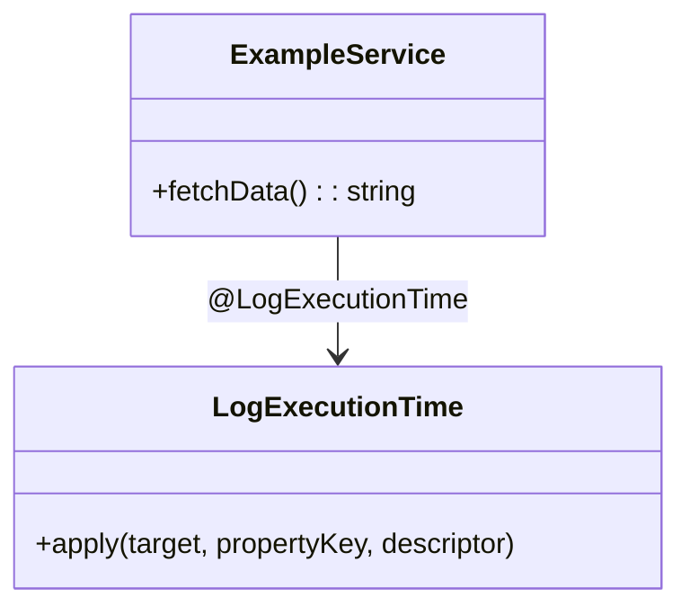

## 4.5.3 Implementation in TypeScript

In this section, we will delve into the implementation of the Decorator pattern in TypeScript. As expert developers, you're likely familiar with the concept of decorators in programming. TypeScript, with its robust type system and syntactical sugar, offers a powerful way to implement decorators, allowing us to add functionality to classes and their members while preserving type safety.

### Understanding TypeScript's Built-in Support for Decorators

TypeScript provides built-in support for decorators, which are special kinds of declarations that can be attached to classes, methods, accessors, properties, or parameters. Decorators are a stage 2 proposal for JavaScript and are available as an experimental feature in TypeScript. To enable decorators, you must set the `experimentalDecorators` compiler option to `true` in your `tsconfig.json`.

```json
{
  "compilerOptions": {
    "experimentalDecorators": true
  }
}
```

#### Types of Decorators in TypeScript

1. **Class Decorators**: Applied to the constructor of the class. They can be used to modify or replace the class definition.
2. **Method Decorators**: Applied to methods within a class. They can be used to modify the method's behavior.
3. **Accessor Decorators**: Applied to getters and setters of a class. They can modify the accessors.
4. **Property Decorators**: Applied to properties within a class. They can modify property metadata.
5. **Parameter Decorators**: Applied to parameters of a method. They can be used to modify parameter metadata.

### Creating Custom Decorators with Type Annotations

Let's explore how to create custom decorators in TypeScript. We'll start with a simple method decorator that logs the execution time of a method.

#### Method Decorator Example

```typescript
function LogExecutionTime(target: Object, propertyKey: string, descriptor: PropertyDescriptor) {
  const originalMethod = descriptor.value;

  descriptor.value = function (...args: any[]) {
    console.log(`Method ${propertyKey} execution started`);
    const start = performance.now();
    const result = originalMethod.apply(this, args);
    const end = performance.now();
    console.log(`Method ${propertyKey} execution finished in ${end - start}ms`);
    return result;
  };

  return descriptor;
}

class ExampleService {
  @LogExecutionTime
  fetchData() {
    // Simulate a network request
    for (let i = 0; i < 1e6; i++) {}
    return "Data fetched";
  }
}

const service = new ExampleService();
service.fetchData();
```

In this example, the `LogExecutionTime` decorator is applied to the `fetchData` method. This decorator logs the start and end time of the method execution, providing insights into performance.

### Leveraging TypeScript's Type System

TypeScript's type system allows us to create decorators that are both powerful and type-safe. Let's create a property decorator that validates if a property is a non-empty string.

#### Property Decorator Example

```typescript
function NonEmptyString(target: Object, propertyKey: string) {
  let value: string;

  const getter = function () {
    return value;
  };

  const setter = function (newVal: string) {
    if (!newVal || newVal.trim().length === 0) {
      throw new Error(`Property ${propertyKey} cannot be empty`);
    }
    value = newVal;
  };

  Object.defineProperty(target, propertyKey, {
    get: getter,
    set: setter,
    enumerable: true,
    configurable: true
  });
}

class User {
  @NonEmptyString
  name: string;

  constructor(name: string) {
    this.name = name;
  }
}

const user = new User("John Doe");
console.log(user.name); // John Doe
// user.name = ""; // Throws error: Property name cannot be empty
```

This example demonstrates a `NonEmptyString` decorator that ensures a property is never set to an empty string. If an empty string is assigned, an error is thrown.

### Modifying and Augmenting Classes with Decorators

Decorators can also be used to modify or augment classes. Let's create a class decorator that adds a static method to a class.

#### Class Decorator Example

```typescript
function AddStaticMethod(target: Function) {
  target.prototype.newStaticMethod = function () {
    console.log("New static method added!");
  };
}

@AddStaticMethod
class MyClass {}

const myInstance = new MyClass();
(myInstance as any).newStaticMethod(); // New static method added!
```

In this example, the `AddStaticMethod` decorator adds a new static method to `MyClass`. This demonstrates how decorators can be used to enhance class functionality dynamically.

### Best Practices for Using Decorators in TypeScript

1. **Use Decorators Judiciously**: While decorators are powerful, overusing them can lead to code that is difficult to understand and maintain. Use them when they provide clear benefits.
2. **Maintain Type Safety**: Ensure that your decorators preserve TypeScript's type safety. Use type annotations and interfaces to enforce type constraints.
3. **Document Decorators**: Clearly document the purpose and behavior of your decorators. This helps other developers understand their impact.
4. **Test Decorators Thoroughly**: Since decorators can alter class behavior, it's crucial to test them thoroughly to ensure they work as expected.
5. **Avoid Side Effects**: Decorators should ideally not introduce side effects that are not obvious from their usage.

### Try It Yourself

Experiment with the provided code examples by modifying them. For instance, try creating a decorator that logs method arguments or a class decorator that tracks the number of instances created.

### Visualizing Decorators in TypeScript

To better understand how decorators interact with classes and methods, let's visualize the flow using a diagram.



**Diagram Description**: This class diagram illustrates the relationship between the `ExampleService` class and the `LogExecutionTime` decorator. The decorator is applied to the `fetchData` method, enhancing its functionality.

### References and Links

- [TypeScript Decorators Documentation](https://www.typescriptlang.org/docs/handbook/decorators.html)
- [MDN Web Docs on Decorators](https://developer.mozilla.org/en-US/docs/Web/JavaScript/Reference/Statements/decorator)
- [W3Schools TypeScript Tutorial](https://www.w3schools.com/typescript/)

### Knowledge Check

- **Question**: What is the primary purpose of a method decorator in TypeScript?
- **Exercise**: Create a parameter decorator that validates if a parameter is a positive number.

### Embrace the Journey

Remember, this is just the beginning. As you progress, you'll discover more ways to leverage decorators for enhancing your TypeScript applications. Keep experimenting, stay curious, and enjoy the journey!

### Summary

In this section, we explored how to implement the Decorator pattern in TypeScript using its built-in support for decorators. We covered various types of decorators, provided code examples, and discussed best practices. By leveraging TypeScript's type system, we can create decorators that are both powerful and type-safe.

## Quiz Time!



### What is the primary purpose of a class decorator in TypeScript?

- [x] To modify or replace the class definition
- [ ] To modify method behavior
- [ ] To validate property values
- [ ] To log parameter values

> **Explanation:** Class decorators are used to modify or replace the class definition itself.


### Which TypeScript compiler option must be enabled to use decorators?

- [x] experimentalDecorators
- [ ] allowJs
- [ ] noImplicitAny
- [ ] strictNullChecks

> **Explanation:** The `experimentalDecorators` option must be enabled in `tsconfig.json` to use decorators.


### What does the `LogExecutionTime` decorator do in the provided example?

- [x] Logs the start and end time of method execution
- [ ] Validates method parameters
- [ ] Modifies the method's return value
- [ ] Adds a new method to the class

> **Explanation:** The `LogExecutionTime` decorator logs the start and end time of the method execution.


### How can decorators enhance class functionality?

- [x] By adding new methods or properties
- [ ] By removing existing methods
- [ ] By changing the class name
- [ ] By altering the class constructor

> **Explanation:** Decorators can enhance class functionality by adding new methods or properties.


### What is a best practice when using decorators in TypeScript?

- [x] Document the purpose and behavior of decorators
- [ ] Use decorators for every method
- [ ] Avoid using type annotations
- [ ] Introduce side effects

> **Explanation:** Documenting the purpose and behavior of decorators helps other developers understand their impact.


### What is the role of a property decorator?

- [x] To modify property metadata
- [ ] To change method parameters
- [ ] To replace class constructors
- [ ] To log method execution time

> **Explanation:** Property decorators are used to modify property metadata.


### What should be avoided when creating decorators?

- [x] Introducing side effects
- [ ] Using type annotations
- [ ] Documenting decorators
- [ ] Testing decorators

> **Explanation:** Introducing side effects should be avoided to maintain clear and predictable behavior.


### How can decorators preserve TypeScript's type safety?

- [x] By using type annotations and interfaces
- [ ] By avoiding type annotations
- [ ] By using any type
- [ ] By modifying the TypeScript compiler

> **Explanation:** Using type annotations and interfaces helps preserve TypeScript's type safety.


### What is a parameter decorator used for?

- [x] To modify parameter metadata
- [ ] To change method return types
- [ ] To replace class methods
- [ ] To log class instantiation

> **Explanation:** Parameter decorators are used to modify parameter metadata.


### True or False: Decorators can only be applied to classes in TypeScript.

- [ ] True
- [x] False

> **Explanation:** Decorators can be applied to classes, methods, accessors, properties, and parameters.


