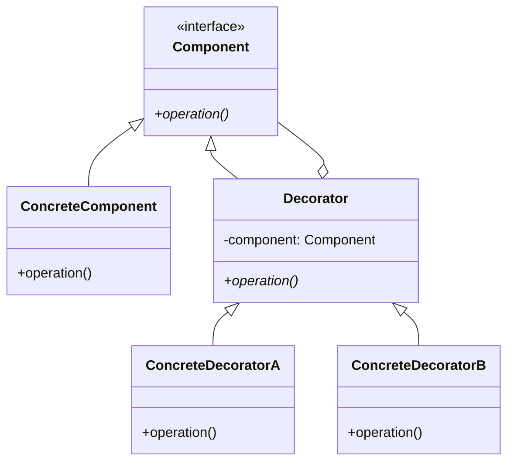
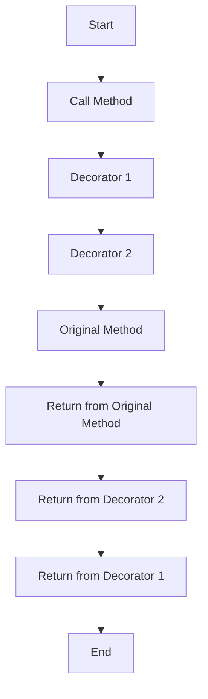

## 4.5.4 Use Cases and Examples

The Decorator pattern is a structural design pattern that allows behavior to be added to individual objects, either statically or dynamically, without affecting the behavior of other objects from the same class. This pattern is particularly useful in scenarios where you need to add responsibilities to objects without modifying their code, thus adhering to the Open/Closed Principle. In this section, we'll explore practical applications of the Decorator pattern in JavaScript and TypeScript, including logging, validation, and security enhancements.

### Understanding the Decorator Pattern

Before diving into use cases, let's briefly revisit what the Decorator pattern entails. The pattern involves a set of decorator classes that are used to wrap concrete components. Decorators provide a flexible alternative to subclassing for extending functionality.

Here's a simple UML diagram to illustrate the Decorator pattern:



In this diagram:
- `Component` is an interface or abstract class defining the operation.
- `ConcreteComponent` is a class that implements the `Component` interface.
- `Decorator` is an abstract class that implements the `Component` interface and contains a reference to a `Component` object.
- `ConcreteDecoratorA` and `ConcreteDecoratorB` are classes that extend `Decorator` and add additional behavior.

### Use Case 1: Logging

Logging is a common requirement in software development, and the Decorator pattern provides an elegant solution for adding logging functionality to existing methods or classes without altering their structure.

#### JavaScript Example: Logging Decorator

```javascript
class UserService {
    getUser(id) {
        return { id, name: "John Doe" };
    }
}

function loggingDecorator(originalMethod) {
    return function (...args) {
        console.log(`Calling ${originalMethod.name} with arguments: ${JSON.stringify(args)}`);
        const result = originalMethod.apply(this, args);
        console.log(`Result: ${JSON.stringify(result)}`);
        return result;
    };
}

UserService.prototype.getUser = loggingDecorator(UserService.prototype.getUser);

const userService = new UserService();
userService.getUser(1);
```

In this example, the `loggingDecorator` function wraps the `getUser` method, adding logging before and after the method execution.

#### TypeScript Example: Logging Decorator

```typescript
class UserService {
    getUser(id: number): { id: number; name: string } {
        return { id, name: "John Doe" };
    }
}

function loggingDecorator<T extends Function>(originalMethod: T): T {
    return function (...args: any[]) {
        console.log(`Calling ${originalMethod.name} with arguments: ${JSON.stringify(args)}`);
        const result = originalMethod.apply(this, args);
        console.log(`Result: ${JSON.stringify(result)}`);
        return result;
    } as T;
}

UserService.prototype.getUser = loggingDecorator(UserService.prototype.getUser);

const userService = new UserService();
userService.getUser(1);
```

### Use Case 2: Validation

Validation is another area where the Decorator pattern shines. By using decorators, we can add validation logic to methods without cluttering the core business logic.

#### JavaScript Example: Validation Decorator

```javascript
class OrderService {
    placeOrder(order) {
        console.log("Order placed:", order);
    }
}

function validationDecorator(originalMethod) {
    return function (order) {
        if (!order || !order.item || order.quantity <= 0) {
            throw new Error("Invalid order");
        }
        return originalMethod.apply(this, arguments);
    };
}

OrderService.prototype.placeOrder = validationDecorator(OrderService.prototype.placeOrder);

const orderService = new OrderService();
orderService.placeOrder({ item: "Laptop", quantity: 1 });
```

#### TypeScript Example: Validation Decorator

```typescript
interface Order {
    item: string;
    quantity: number;
}

class OrderService {
    placeOrder(order: Order): void {
        console.log("Order placed:", order);
    }
}

function validationDecorator<T extends Function>(originalMethod: T): T {
    return function (order: Order) {
        if (!order || !order.item || order.quantity <= 0) {
            throw new Error("Invalid order");
        }
        return originalMethod.apply(this, arguments);
    } as T;
}

OrderService.prototype.placeOrder = validationDecorator(OrderService.prototype.placeOrder);

const orderService = new OrderService();
orderService.placeOrder({ item: "Laptop", quantity: 1 });
```

### Use Case 3: Security

Security features such as authentication and authorization can be seamlessly integrated using the Decorator pattern. This allows for flexible security implementations that can be easily adjusted as requirements change.

#### JavaScript Example: Security Decorator

```javascript
class DocumentService {
    viewDocument(docId) {
        console.log(`Viewing document ${docId}`);
    }
}

function securityDecorator(originalMethod) {
    return function (docId) {
        if (!this.isAuthenticated) {
            throw new Error("User not authenticated");
        }
        return originalMethod.apply(this, arguments);
    };
}

DocumentService.prototype.viewDocument = securityDecorator(DocumentService.prototype.viewDocument);

const documentService = new DocumentService();
documentService.isAuthenticated = true;
documentService.viewDocument(123);
```

#### TypeScript Example: Security Decorator

```typescript
class DocumentService {
    isAuthenticated: boolean = false;

    viewDocument(docId: number): void {
        console.log(`Viewing document ${docId}`);
    }
}

function securityDecorator<T extends Function>(originalMethod: T): T {
    return function (docId: number) {
        if (!this.isAuthenticated) {
            throw new Error("User not authenticated");
        }
        return originalMethod.apply(this, arguments);
    } as T;
}

DocumentService.prototype.viewDocument = securityDecorator(DocumentService.prototype.viewDocument);

const documentService = new DocumentService();
documentService.isAuthenticated = true;
documentService.viewDocument(123);
```

### Advantages Over Subclassing

The Decorator pattern offers several advantages over subclassing:

1. **Flexibility**: Decorators provide a flexible alternative to subclassing for extending functionality. You can add or remove responsibilities dynamically at runtime.
2. **Reduced Class Proliferation**: By using decorators, you avoid the explosion of subclasses that can occur when trying to cover all combinations of features.
3. **Adherence to the Single Responsibility Principle**: Each decorator class is responsible for a specific behavior, making the code easier to maintain and understand.

### Managing Multiple Decorators

When using multiple decorators, the order of execution can significantly impact the behavior of the decorated object. It's essential to manage the order in which decorators are applied to ensure the desired outcome.

#### Example: Combining Multiple Decorators

```javascript
class ProductService {
    getProduct(productId) {
        return { id: productId, name: "Product A" };
    }
}

function loggingDecorator(originalMethod) {
    return function (...args) {
        console.log(`Calling ${originalMethod.name} with arguments: ${JSON.stringify(args)}`);
        const result = originalMethod.apply(this, args);
        console.log(`Result: ${JSON.stringify(result)}`);
        return result;
    };
}

function cacheDecorator(originalMethod) {
    const cache = {};
    return function (productId) {
        if (cache[productId]) {
            console.log("Returning cached result");
            return cache[productId];
        }
        const result = originalMethod.apply(this, arguments);
        cache[productId] = result;
        return result;
    };
}

ProductService.prototype.getProduct = loggingDecorator(cacheDecorator(ProductService.prototype.getProduct));

const productService = new ProductService();
productService.getProduct(1);
productService.getProduct(1);
```

In this example, the `cacheDecorator` is applied before the `loggingDecorator`. As a result, the logging will occur every time the method is called, regardless of whether the result is cached.

### Try It Yourself

To deepen your understanding of the Decorator pattern, try modifying the examples above:

- **Add a new decorator** that measures the execution time of a method.
- **Experiment with the order** of decorators to see how it affects the behavior.
- **Create a decorator** that adds retry logic to a method that might fail intermittently.

### Visualizing Decorator Pattern Execution

To better understand how decorators work in sequence, consider the following flowchart, which represents the execution flow of a method wrapped by multiple decorators:



This flowchart illustrates how the call flows through each decorator before reaching the original method and then returns through each decorator in reverse order.

### References and Further Reading

- [MDN Web Docs: Decorator Pattern](https://developer.mozilla.org/en-US/docs/Web/JavaScript/Guide/Decorators)
- [Refactoring Guru: Decorator Pattern](https://refactoring.guru/design-patterns/decorator)
- [TypeScript Handbook: Decorators](https://www.typescriptlang.org/docs/handbook/decorators.html)

### Knowledge Check

- What are the key benefits of using the Decorator pattern over subclassing?
- How does the order of decorators affect the behavior of the decorated object?
- Can you think of a scenario where using decorators might not be the best choice?

### Embrace the Journey

Remember, mastering design patterns is a journey. The Decorator pattern is just one tool in your toolkit. As you continue to explore and apply these patterns, you'll find new ways to write more maintainable and scalable code. Keep experimenting, stay curious, and enjoy the journey!

## Quiz Time!



### What is the primary purpose of the Decorator pattern?

- [x] To add responsibilities to objects dynamically
- [ ] To create a single instance of a class
- [ ] To define a family of algorithms
- [ ] To separate an abstraction from its implementation

> **Explanation:** The Decorator pattern is used to add responsibilities to objects dynamically without affecting other instances of the same class.

### How does the Decorator pattern adhere to the Single Responsibility Principle?

- [x] Each decorator class is responsible for a specific behavior
- [ ] It reduces the number of classes in a system
- [ ] It allows for multiple inheritance
- [ ] It uses interfaces to define behavior

> **Explanation:** Each decorator class in the Decorator pattern is responsible for a specific behavior, thus adhering to the Single Responsibility Principle.

### What is a key advantage of using decorators over subclassing?

- [x] Reduced class proliferation
- [ ] Increased performance
- [ ] Simplified code structure
- [ ] Enhanced security

> **Explanation:** Decorators reduce class proliferation by allowing behavior to be added dynamically without creating numerous subclasses.

### In the provided JavaScript example, what does the `loggingDecorator` do?

- [x] Logs method calls and results
- [ ] Validates input data
- [ ] Caches method results
- [ ] Authenticates users

> **Explanation:** The `loggingDecorator` logs method calls and their results, providing insight into method execution.

### What happens if the order of decorators is changed?

- [x] The behavior of the decorated object may change
- [ ] The decorators will not work
- [ ] The original method will be called twice
- [ ] The decorators will be ignored

> **Explanation:** Changing the order of decorators can affect the behavior of the decorated object, as each decorator may modify the input or output of the method.

### Which of the following is a practical use case for the Decorator pattern?

- [x] Adding logging functionality
- [ ] Implementing a singleton
- [ ] Creating a factory method
- [ ] Defining an interface

> **Explanation:** Adding logging functionality is a practical use case for the Decorator pattern, as it allows logging to be added without modifying the original method.

### What is the role of the `securityDecorator` in the TypeScript example?

- [x] To check if the user is authenticated before allowing method execution
- [ ] To log method execution time
- [ ] To validate method parameters
- [ ] To cache method results

> **Explanation:** The `securityDecorator` checks if the user is authenticated before allowing the method to execute, adding a layer of security.

### How can decorators be managed effectively?

- [x] By carefully controlling their order of application
- [ ] By using multiple inheritance
- [ ] By defining them in a separate module
- [ ] By avoiding their use in complex systems

> **Explanation:** Managing the order of decorators is crucial, as it can significantly impact the behavior of the decorated object.

### True or False: Decorators can only be used in TypeScript.

- [ ] True
- [x] False

> **Explanation:** Decorators can be used in both JavaScript and TypeScript, although TypeScript provides additional support for decorators.

### What is a potential downside of using too many decorators?

- [x] Increased complexity and potential for errors
- [ ] Reduced flexibility
- [ ] Decreased code readability
- [ ] Limited scalability

> **Explanation:** Using too many decorators can increase complexity and the potential for errors, as it may become difficult to track the flow of execution.


