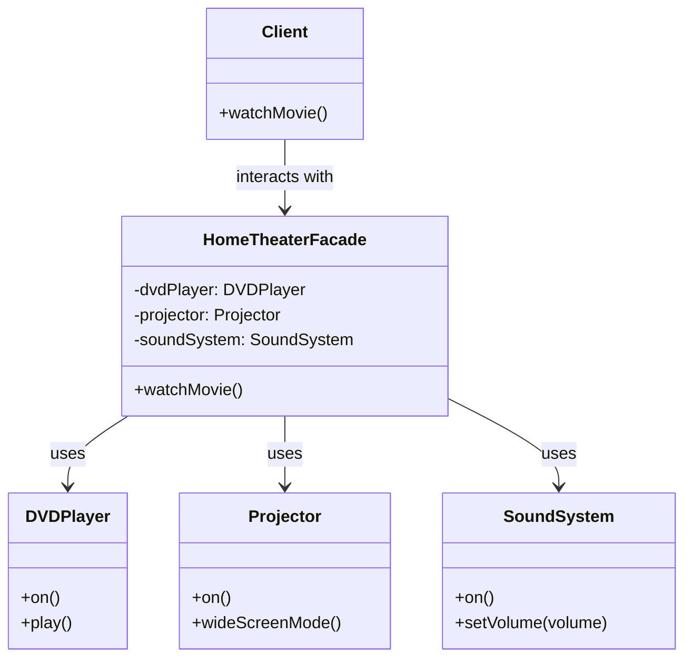

## 4.6.1 Intent and Motivation

In the world of software development, complexity is a constant companion. As systems grow, they often become intricate webs of interconnected components, each with its own interface and set of functionalities. This complexity can make it challenging for developers to interact with the system efficiently. Enter the **Facade Pattern**, a structural design pattern that provides a simplified interface to a complex subsystem, making it easier for clients to interact with the subsystem.

### Understanding the Facade Pattern

The Facade Pattern is akin to a customer service desk in a large organization. Imagine walking into a bustling company with numerous departments, each handling different aspects of the business. As a visitor, you might feel overwhelmed trying to navigate this complex environment. However, the customer service desk acts as a single point of contact, directing you to the right department and simplifying your interaction with the organization.

In software, the Facade Pattern serves a similar purpose. It provides a unified interface to a set of interfaces in a subsystem, making the subsystem easier to use. By doing so, it reduces the complexity that clients need to deal with, allowing them to focus on their primary tasks without getting bogged down by the intricacies of the subsystem.

### The Problem of Tightly Coupled and Complex Subsystem Interfaces

Complex systems often consist of multiple components that interact with each other through various interfaces. These interfaces can be complex, requiring clients to understand and manage multiple interactions. This complexity can lead to tightly coupled code, where changes in one part of the system necessitate changes in others, making the system difficult to maintain and extend.

Consider a scenario where an application needs to interact with a third-party library for processing payments. The library might expose several classes and methods for handling different payment methods, currencies, and transaction types. Without a Facade, the application would need to interact directly with these classes, leading to a tightly coupled system that is difficult to manage.

### Benefits of the Facade Pattern

The Facade Pattern addresses these challenges by providing a simplified interface that hides the complexities of the subsystem. Here are some key benefits:

1. **Simplified Client Interaction**: The Facade Pattern abstracts the complexities of the subsystem, allowing clients to interact with a single, simplified interface. This reduces the learning curve and makes the system easier to use.

2. **Reduced Coupling**: By providing a unified interface, the Facade Pattern decouples the client from the subsystem. This makes the system more flexible and easier to maintain, as changes in the subsystem do not directly affect the client.

3. **Enhanced Readability and Maintainability**: The Facade Pattern improves the readability of the code by hiding the complex interactions within the subsystem. This makes the codebase easier to understand and maintain, especially for new developers joining the project.

4. **Improved System Organization**: The Facade Pattern can help organize the system by grouping related functionalities under a single interface. This makes it easier to manage and extend the system as new features are added.

### Implementing the Facade Pattern

Let's explore how the Facade Pattern can be implemented in JavaScript and TypeScript. We'll use an example of a home theater system, which consists of multiple components such as a DVD player, a projector, and a sound system. The goal is to provide a simplified interface for turning on the home theater system.

#### JavaScript Implementation

```javascript
// Subsystem components
class DVDPlayer {
    on() {
        console.log("DVD Player is on.");
    }
    play() {
        console.log("DVD is playing.");
    }
}

class Projector {
    on() {
        console.log("Projector is on.");
    }
    wideScreenMode() {
        console.log("Projector is in widescreen mode.");
    }
}

class SoundSystem {
    on() {
        console.log("Sound System is on.");
    }
    setVolume(volume) {
        console.log(`Volume set to ${volume}.`);
    }
}

// Facade
class HomeTheaterFacade {
    constructor(dvdPlayer, projector, soundSystem) {
        this.dvdPlayer = dvdPlayer;
        this.projector = projector;
        this.soundSystem = soundSystem;
    }

    watchMovie() {
        console.log("Get ready to watch a movie...");
        this.dvdPlayer.on();
        this.dvdPlayer.play();
        this.projector.on();
        this.projector.wideScreenMode();
        this.soundSystem.on();
        this.soundSystem.setVolume(10);
    }
}

// Client code
const dvdPlayer = new DVDPlayer();
const projector = new Projector();
const soundSystem = new SoundSystem();
const homeTheater = new HomeTheaterFacade(dvdPlayer, projector, soundSystem);

homeTheater.watchMovie();
```

In this example, the `HomeTheaterFacade` class provides a simplified interface for turning on the home theater system. The client code interacts with the `HomeTheaterFacade` class, which internally manages the interactions with the subsystem components.

#### TypeScript Implementation

```typescript
// Subsystem components
class DVDPlayer {
    on(): void {
        console.log("DVD Player is on.");
    }
    play(): void {
        console.log("DVD is playing.");
    }
}

class Projector {
    on(): void {
        console.log("Projector is on.");
    }
    wideScreenMode(): void {
        console.log("Projector is in widescreen mode.");
    }
}

class SoundSystem {
    on(): void {
        console.log("Sound System is on.");
    }
    setVolume(volume: number): void {
        console.log(`Volume set to ${volume}.`);
    }
}

// Facade
class HomeTheaterFacade {
    private dvdPlayer: DVDPlayer;
    private projector: Projector;
    private soundSystem: SoundSystem;

    constructor(dvdPlayer: DVDPlayer, projector: Projector, soundSystem: SoundSystem) {
        this.dvdPlayer = dvdPlayer;
        this.projector = projector;
        this.soundSystem = soundSystem;
    }

    watchMovie(): void {
        console.log("Get ready to watch a movie...");
        this.dvdPlayer.on();
        this.dvdPlayer.play();
        this.projector.on();
        this.projector.wideScreenMode();
        this.soundSystem.on();
        this.soundSystem.setVolume(10);
    }
}

// Client code
const dvdPlayer = new DVDPlayer();
const projector = new Projector();
const soundSystem = new SoundSystem();
const homeTheater = new HomeTheaterFacade(dvdPlayer, projector, soundSystem);

homeTheater.watchMovie();
```

In the TypeScript implementation, we use type annotations to ensure type safety. The `HomeTheaterFacade` class provides the same simplified interface, allowing the client code to interact with the home theater system without dealing with the complexities of the subsystem components.

### Visualizing the Facade Pattern

To better understand the Facade Pattern, let's visualize the interactions between the client, the facade, and the subsystem components.



In this diagram, the `Client` interacts with the `HomeTheaterFacade`, which in turn interacts with the `DVDPlayer`, `Projector`, and `SoundSystem` components. The facade simplifies the client's interaction with the subsystem by providing a single point of contact.

### Try It Yourself

To deepen your understanding of the Facade Pattern, try modifying the code examples provided. Here are a few suggestions:

1. **Add a New Component**: Introduce a new component, such as a `StreamingService`, and update the facade to include this component in the `watchMovie` method.

2. **Enhance the Facade**: Add new methods to the `HomeTheaterFacade` class, such as `endMovie`, to turn off the components after watching a movie.

3. **Refactor the Subsystem**: Experiment with changing the internal implementation of the subsystem components. Notice how the facade shields the client from these changes.

### Knowledge Check

Before we conclude, let's review some key takeaways:

- The Facade Pattern provides a simplified interface to a complex subsystem, reducing the complexity that clients need to deal with.
- It helps decouple the client from the subsystem, improving the system's flexibility and maintainability.
- The pattern enhances code readability by hiding the complex interactions within the subsystem.
- By organizing related functionalities under a single interface, the Facade Pattern improves system organization.

### Embrace the Journey

Remember, mastering design patterns is a journey. The Facade Pattern is just one of many tools in your software development toolkit. As you continue to explore and apply design patterns, you'll find new ways to simplify complex systems and improve your codebase. Keep experimenting, stay curious, and enjoy the journey!

### References and Links

For further reading on the Facade Pattern and other design patterns, consider exploring the following resources:

- [MDN Web Docs: Design Patterns](https://developer.mozilla.org/en-US/docs/Web/JavaScript/Guide/Design_Patterns)
- [Refactoring Guru: Facade Pattern](https://refactoring.guru/design-patterns/facade)
- [W3Schools: JavaScript Design Patterns](https://www.w3schools.com/js/js_design_patterns.asp)

## Quiz Time!



### What is the primary purpose of the Facade Pattern?

- [x] To provide a simplified interface to a complex subsystem.
- [ ] To increase the complexity of a subsystem.
- [ ] To directly expose all subsystem interfaces to the client.
- [ ] To eliminate the need for subsystem components.

> **Explanation:** The Facade Pattern is designed to provide a simplified interface to a complex subsystem, making it easier for clients to interact with the subsystem.

### How does the Facade Pattern benefit system maintainability?

- [x] By decoupling the client from the subsystem.
- [ ] By tightly coupling the client to the subsystem.
- [ ] By exposing all subsystem details to the client.
- [ ] By eliminating the need for subsystem components.

> **Explanation:** The Facade Pattern decouples the client from the subsystem, making the system more flexible and easier to maintain.

### Which analogy is commonly used to describe the Facade Pattern?

- [x] A customer service desk in a large organization.
- [ ] A complex mathematical equation.
- [ ] A detailed map of a city.
- [ ] A direct line to the CEO of a company.

> **Explanation:** The Facade Pattern is often compared to a customer service desk, which provides a single point of contact in a complex organization.

### What is a key benefit of using the Facade Pattern in software design?

- [x] Simplified client interaction with complex systems.
- [ ] Increased complexity of client code.
- [ ] Direct access to all subsystem components.
- [ ] Elimination of subsystem components.

> **Explanation:** The Facade Pattern simplifies client interaction by providing a unified interface to complex systems.

### In the provided code example, what role does the `HomeTheaterFacade` class play?

- [x] It acts as a simplified interface for interacting with the home theater system.
- [ ] It directly exposes all subsystem components to the client.
- [ ] It eliminates the need for the DVD player, projector, and sound system.
- [ ] It increases the complexity of the home theater system.

> **Explanation:** The `HomeTheaterFacade` class provides a simplified interface for interacting with the home theater system, hiding the complexities of the subsystem components.

### What is a common problem with tightly coupled subsystem interfaces?

- [x] They make the system difficult to maintain and extend.
- [ ] They simplify client interaction.
- [ ] They eliminate the need for a facade.
- [ ] They increase system flexibility.

> **Explanation:** Tightly coupled subsystem interfaces make the system difficult to maintain and extend, as changes in one part of the system can affect others.

### How does the Facade Pattern improve code readability?

- [x] By hiding complex interactions within the subsystem.
- [ ] By exposing all subsystem details to the client.
- [ ] By increasing the complexity of client code.
- [ ] By eliminating the need for subsystem components.

> **Explanation:** The Facade Pattern improves code readability by hiding complex interactions within the subsystem, making the codebase easier to understand.

### What is a potential modification you can try with the provided code example?

- [x] Add a new component, such as a `StreamingService`.
- [ ] Remove the `HomeTheaterFacade` class.
- [ ] Directly expose all subsystem components to the client.
- [ ] Eliminate the need for the DVD player, projector, and sound system.

> **Explanation:** You can add a new component, such as a `StreamingService`, to the provided code example to deepen your understanding of the Facade Pattern.

### True or False: The Facade Pattern eliminates the need for subsystem components.

- [x] False
- [ ] True

> **Explanation:** The Facade Pattern does not eliminate the need for subsystem components; it provides a simplified interface to interact with them.

### What is a key takeaway from learning about the Facade Pattern?

- [x] It simplifies complex systems by providing a unified interface.
- [ ] It increases the complexity of client code.
- [ ] It eliminates the need for subsystem components.
- [ ] It directly exposes all subsystem interfaces to the client.

> **Explanation:** A key takeaway from learning about the Facade Pattern is that it simplifies complex systems by providing a unified interface, making them easier to use and maintain.


