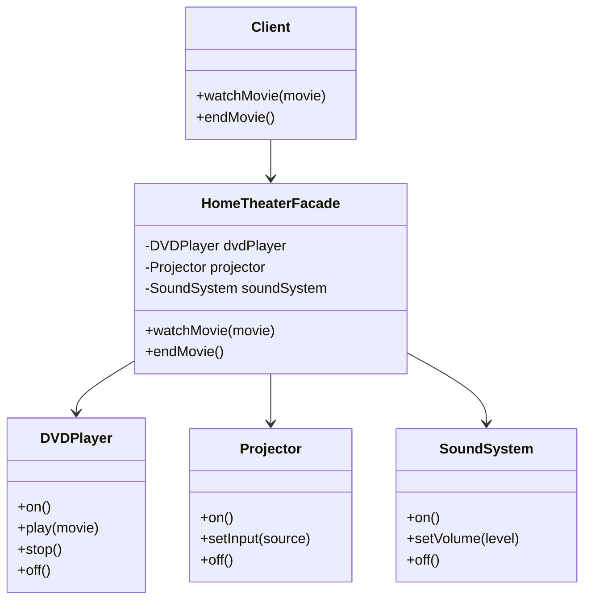

## 4.6.2 Implementation in JavaScript

In this section, we will delve into the implementation of the Facade pattern in JavaScript. This pattern is essential for providing a simplified interface to a complex subsystem, making it easier for clients to interact with it. By the end of this guide, you will understand how to create a Facade class that encapsulates the complexity of subsystem classes, thereby reducing dependencies and enhancing code maintainability.

### Understanding the Facade Pattern

The Facade pattern is a structural design pattern that provides a unified interface to a set of interfaces in a subsystem. It defines a higher-level interface that makes the subsystem easier to use. This pattern is particularly useful when dealing with complex systems that have multiple interdependent classes.

#### Key Concepts

- **Subsystem Classes**: These are the complex classes that perform the actual work. They often have intricate interfaces that can be cumbersome for clients to use directly.
- **Facade Class**: This class provides a simplified interface to the subsystem. It delegates client requests to the appropriate subsystem classes.
- **Client**: The client interacts with the Facade rather than the subsystem directly, simplifying its interaction with the system.

### Implementing the Facade Pattern in JavaScript

Let's explore how to implement the Facade pattern in JavaScript through a practical example. We'll create a simple home theater system with various components like a DVD player, projector, and sound system. The Facade will provide a straightforward interface to control these components.

#### Subsystem Classes

First, we'll define the subsystem classes. These classes represent the individual components of the home theater system.

```javascript
// Subsystem class: DVD Player
class DVDPlayer {
    on() {
        console.log("DVD Player is on.");
    }

    play(movie) {
        console.log(`Playing movie: ${movie}`);
    }

    stop() {
        console.log("Stopping the DVD Player.");
    }

    off() {
        console.log("DVD Player is off.");
    }
}

// Subsystem class: Projector
class Projector {
    on() {
        console.log("Projector is on.");
    }

    setInput(source) {
        console.log(`Projector input set to ${source}.`);
    }

    off() {
        console.log("Projector is off.");
    }
}

// Subsystem class: Sound System
class SoundSystem {
    on() {
        console.log("Sound System is on.");
    }

    setVolume(level) {
        console.log(`Sound System volume set to ${level}.`);
    }

    off() {
        console.log("Sound System is off.");
    }
}
```

#### Creating the Facade Class

Next, we'll create the Facade class. This class will provide a simple interface for the client to interact with the home theater system.

```javascript
// Facade class: HomeTheaterFacade
class HomeTheaterFacade {
    constructor(dvdPlayer, projector, soundSystem) {
        this.dvdPlayer = dvdPlayer;
        this.projector = projector;
        this.soundSystem = soundSystem;
    }

    watchMovie(movie) {
        console.log("Get ready to watch a movie...");
        this.dvdPlayer.on();
        this.dvdPlayer.play(movie);
        this.projector.on();
        this.projector.setInput("DVD");
        this.soundSystem.on();
        this.soundSystem.setVolume(10);
    }

    endMovie() {
        console.log("Shutting down the home theater...");
        this.dvdPlayer.stop();
        this.dvdPlayer.off();
        this.projector.off();
        this.soundSystem.off();
    }
}
```

#### Simplifying the Client Interface

The Facade class simplifies the client interface by providing methods like `watchMovie` and `endMovie`. These methods encapsulate the complex interactions with the subsystem classes.

```javascript
// Client code
const dvdPlayer = new DVDPlayer();
const projector = new Projector();
const soundSystem = new SoundSystem();

const homeTheater = new HomeTheaterFacade(dvdPlayer, projector, soundSystem);

// Watching a movie
homeTheater.watchMovie("Inception");

// Ending the movie
homeTheater.endMovie();
```

### Benefits of Using the Facade Pattern

The Facade pattern offers several advantages:

1. **Simplified Interface**: Clients interact with a single, simplified interface rather than multiple complex interfaces.
2. **Reduced Dependencies**: Clients are decoupled from the subsystem classes, making the system easier to maintain and modify.
3. **Improved Code Organization**: The Facade class organizes and encapsulates the interactions with the subsystem, leading to cleaner code.

### Visualizing the Facade Pattern

To better understand the Facade pattern, let's visualize the interaction between the client, the Facade, and the subsystem classes.



### Try It Yourself

Now that we've covered the basics, try modifying the code to add more components to the home theater system, such as a streaming device or a lighting system. Implement methods in the Facade class to control these new components.

### References and Further Reading

- [MDN Web Docs: JavaScript Classes](https://developer.mozilla.org/en-US/docs/Web/JavaScript/Reference/Classes)
- [W3Schools: JavaScript Design Patterns](https://www.w3schools.com/js/js_design_patterns.asp)

### Knowledge Check

- What is the primary purpose of the Facade pattern?
- How does the Facade pattern reduce dependencies between the client and subsystem?
- Why is it beneficial to use a Facade class in complex systems?

### Embrace the Journey

Remember, mastering design patterns is a journey. As you continue to explore and implement these patterns, you'll find new ways to simplify and enhance your code. Keep experimenting, stay curious, and enjoy the process!

## Quiz Time!



### What is the main purpose of the Facade pattern?

- [x] To provide a simplified interface to a complex subsystem
- [ ] To create a new subsystem
- [ ] To increase the complexity of the system
- [ ] To replace the existing subsystem

> **Explanation:** The Facade pattern is designed to provide a simplified interface to a complex subsystem, making it easier for clients to interact with it.

### Which of the following is a benefit of using the Facade pattern?

- [x] Simplified client interface
- [ ] Increased subsystem complexity
- [ ] More direct client access to subsystem classes
- [ ] Increased number of classes

> **Explanation:** The Facade pattern simplifies the client interface by providing a unified interface to the subsystem, reducing complexity for the client.

### In the provided example, what role does the `HomeTheaterFacade` class play?

- [x] It acts as a simplified interface for the client to interact with the home theater system
- [ ] It replaces the DVD player
- [ ] It is a subsystem class
- [ ] It is a client class

> **Explanation:** The `HomeTheaterFacade` class acts as a simplified interface for the client, encapsulating the interactions with the subsystem classes.

### How does the Facade pattern help in reducing dependencies?

- [x] By decoupling the client from the subsystem classes
- [ ] By increasing the number of subsystem classes
- [ ] By making the client directly interact with subsystem classes
- [ ] By removing the need for subsystem classes

> **Explanation:** The Facade pattern reduces dependencies by decoupling the client from the subsystem classes, allowing the client to interact with a single interface.

### What is the role of the subsystem classes in the Facade pattern?

- [x] They perform the actual work and have complex interfaces
- [ ] They provide a simplified interface for the client
- [ ] They are not used in the Facade pattern
- [ ] They replace the Facade class

> **Explanation:** Subsystem classes perform the actual work and have complex interfaces, which the Facade pattern simplifies for the client.

### Which method in the `HomeTheaterFacade` class starts the movie?

- [x] watchMovie
- [ ] endMovie
- [ ] playMovie
- [ ] startMovie

> **Explanation:** The `watchMovie` method in the `HomeTheaterFacade` class starts the movie by interacting with the subsystem classes.

### What does the `endMovie` method in the `HomeTheaterFacade` class do?

- [x] It shuts down the home theater system
- [ ] It starts the movie
- [ ] It plays the movie
- [ ] It sets the volume

> **Explanation:** The `endMovie` method in the `HomeTheaterFacade` class shuts down the home theater system by interacting with the subsystem classes.

### What is the advantage of using a Facade class in terms of code organization?

- [x] It organizes and encapsulates interactions with the subsystem
- [ ] It increases the number of subsystem classes
- [ ] It makes the code more complex
- [ ] It removes the need for subsystem classes

> **Explanation:** The Facade class organizes and encapsulates interactions with the subsystem, leading to cleaner and more maintainable code.

### How can the Facade pattern improve code maintainability?

- [x] By providing a single point of interaction for the client
- [ ] By increasing the complexity of the subsystem
- [ ] By removing subsystem classes
- [ ] By making the client directly interact with subsystem classes

> **Explanation:** The Facade pattern improves code maintainability by providing a single point of interaction for the client, simplifying the code structure.

### True or False: The Facade pattern can be used to increase the complexity of the system.

- [ ] True
- [x] False

> **Explanation:** False. The Facade pattern is used to simplify the system by providing a unified interface to a complex subsystem, not to increase complexity.



By understanding and implementing the Facade pattern in JavaScript, you can significantly simplify interactions with complex subsystems, making your code more maintainable and easier to understand. Keep exploring and applying these patterns to enhance your software design skills!
