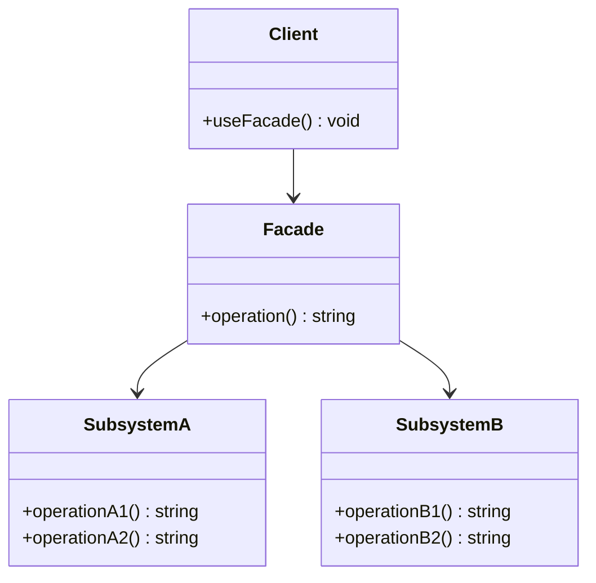

## 4.6.3 Implementation in TypeScript

In this section, we will explore how to implement the Facade Pattern in TypeScript. The Facade Pattern is a structural design pattern that provides a simplified interface to a complex subsystem. By utilizing TypeScript's features, we can ensure type safety and maintainability, which is essential for managing large and intricate systems.

### Understanding the Facade Pattern

The Facade Pattern is designed to hide the complexities of a subsystem by providing a unified interface. This pattern is particularly useful when dealing with complex libraries or frameworks, where you want to offer a simpler API to the client code.

#### Key Concepts

- **Facade**: A single class that provides a simplified interface to a set of interfaces in a subsystem.
- **Subsystems**: The complex components or classes that the Facade interacts with.
- **Client**: The code that uses the Facade to interact with the subsystem.

### Why Use TypeScript for the Facade Pattern?

TypeScript offers static typing, which helps catch errors at compile time rather than at runtime. This feature is particularly beneficial when implementing the Facade Pattern, as it ensures that the interactions between the Facade and the subsystems are well-defined and error-free.

#### Benefits of TypeScript in Facade Pattern

- **Type Safety**: Ensures that the Facade and subsystems interact correctly.
- **Improved Maintainability**: Easier to manage and refactor large codebases.
- **Better Documentation**: Type annotations serve as a form of documentation for developers.

### Implementing the Facade Pattern in TypeScript

Let's dive into the implementation of the Facade Pattern in TypeScript. We'll start by defining interfaces for the Facade and the subsystems, then implement the Facade class, and finally demonstrate how TypeScript's static typing ensures correct usage.

#### Step 1: Define Interfaces for Subsystem Components

First, we need to define interfaces for the subsystem components. These interfaces will outline the methods that each component provides.

```typescript
// Interface for Subsystem A
interface SubsystemA {
    operationA1(): string;
    operationA2(): string;
}

// Interface for Subsystem B
interface SubsystemB {
    operationB1(): string;
    operationB2(): string;
}
```

#### Step 2: Implement Subsystem Components

Next, we implement the subsystem components based on the interfaces defined above.

```typescript
// Implementation of Subsystem A
class ConcreteSubsystemA implements SubsystemA {
    operationA1(): string {
        return "Subsystem A, Method A1";
    }

    operationA2(): string {
        return "Subsystem A, Method A2";
    }
}

// Implementation of Subsystem B
class ConcreteSubsystemB implements SubsystemB {
    operationB1(): string {
        return "Subsystem B, Method B1";
    }

    operationB2(): string {
        return "Subsystem B, Method B2";
    }
}
```

#### Step 3: Define the Facade Interface

Now, let's define an interface for the Facade. This interface will specify the methods that the Facade will expose to the client.

```typescript
// Interface for the Facade
interface Facade {
    operation(): string;
}
```

#### Step 4: Implement the Facade Class

The Facade class will implement the Facade interface and interact with the subsystem components.

```typescript
// Implementation of the Facade
class ConcreteFacade implements Facade {
    private subsystemA: SubsystemA;
    private subsystemB: SubsystemB;

    constructor(subsystemA: SubsystemA, subsystemB: SubsystemB) {
        this.subsystemA = subsystemA;
        this.subsystemB = subsystemB;
    }

    operation(): string {
        const resultA = this.subsystemA.operationA1();
        const resultB = this.subsystemB.operationB1();
        return `Facade results: ${resultA}, ${resultB}`;
    }
}
```

#### Step 5: Use the Facade in Client Code

Finally, let's see how the client code can use the Facade to interact with the subsystems.

```typescript
// Client code
const subsystemA = new ConcreteSubsystemA();
const subsystemB = new ConcreteSubsystemB();
const facade = new ConcreteFacade(subsystemA, subsystemB);

console.log(facade.operation());
```

### Handling Complexity with the Facade Pattern

The Facade Pattern helps manage complexity by providing a simple interface to a complex subsystem. This approach is particularly useful in large applications where multiple subsystems need to work together.

#### Simplifying Interactions

By using a Facade, we can simplify the interactions between the client code and the subsystem. The client only needs to interact with the Facade, which internally manages the interactions with the subsystem components.

#### Encapsulation of Subsystem Details

The Facade Pattern encapsulates the details of the subsystem, allowing the client to focus on the high-level operations. This encapsulation makes it easier to change the subsystem implementation without affecting the client code.

### TypeScript's Role in Maintaining Large Subsystems

TypeScript's static typing plays a crucial role in maintaining large subsystems. By defining interfaces and using type annotations, we can ensure that the interactions between different components are well-defined and error-free.

#### Catching Errors at Compile Time

TypeScript allows us to catch errors at compile time, reducing the likelihood of runtime errors. This feature is particularly beneficial in large codebases where changes can have far-reaching effects.

#### Easier Refactoring

With TypeScript, refactoring becomes easier and safer. The type system ensures that changes in one part of the code do not inadvertently break other parts.

### Visualizing the Facade Pattern

To better understand the Facade Pattern, let's visualize the relationships between the Facade, subsystems, and client code using a class diagram.



**Diagram Description**: This class diagram illustrates the relationships between the Facade, SubsystemA, SubsystemB, and the Client. The Facade interacts with the subsystems and provides a simplified interface to the client.

### Try It Yourself

Now that we've covered the basics of implementing the Facade Pattern in TypeScript, it's time to experiment with the code. Here are some suggestions for modifications:

- **Add More Subsystems**: Introduce additional subsystem components and extend the Facade to interact with them.
- **Enhance the Facade Interface**: Add more methods to the Facade interface and implement them in the Facade class.
- **Refactor Subsystem Implementations**: Change the implementation details of the subsystem components and observe how the Facade shields the client from these changes.

### Knowledge Check

Before we conclude, let's reinforce what we've learned with a few questions:

- What is the primary purpose of the Facade Pattern?
- How does TypeScript's static typing benefit the implementation of the Facade Pattern?
- In what scenarios would you consider using the Facade Pattern?

### Embrace the Journey

Remember, mastering design patterns is a journey. As you continue to explore and implement different patterns, you'll gain a deeper understanding of how to structure and organize your code effectively. Keep experimenting, stay curious, and enjoy the journey!

## Quiz Time!



### What is the primary role of the Facade Pattern in software design?

- [x] To provide a simplified interface to a complex subsystem
- [ ] To enhance the performance of a system
- [ ] To increase the complexity of a system
- [ ] To replace existing subsystems

> **Explanation:** The Facade Pattern is used to provide a simplified interface to a complex subsystem, making it easier for clients to interact with the system.

### How does TypeScript's static typing benefit the implementation of the Facade Pattern?

- [x] It ensures type safety and reduces runtime errors
- [ ] It makes the code run faster
- [ ] It increases the complexity of the code
- [ ] It eliminates the need for interfaces

> **Explanation:** TypeScript's static typing ensures type safety, allowing developers to catch errors at compile time and reducing the likelihood of runtime errors.

### What is a key advantage of using the Facade Pattern?

- [x] It simplifies interactions with complex subsystems
- [ ] It increases the number of classes in a system
- [ ] It makes the system more difficult to understand
- [ ] It requires more resources to implement

> **Explanation:** The Facade Pattern simplifies interactions with complex subsystems by providing a unified interface, making it easier for clients to use the system.

### In the Facade Pattern, what is the role of the subsystem?

- [x] To perform the actual work behind the scenes
- [ ] To provide a simplified interface to the client
- [ ] To act as the main entry point for the application
- [ ] To replace the Facade

> **Explanation:** The subsystem performs the actual work behind the scenes, while the Facade provides a simplified interface to the client.

### Which of the following is a benefit of using TypeScript for implementing design patterns?

- [x] Improved maintainability and refactoring
- [ ] Increased runtime performance
- [ ] Reduced code complexity
- [ ] Elimination of all runtime errors

> **Explanation:** TypeScript improves maintainability and refactoring by providing static typing and better documentation through type annotations.

### What is the relationship between the Facade and the subsystems in the Facade Pattern?

- [x] The Facade interacts with the subsystems to provide a simplified interface
- [ ] The Facade replaces the subsystems entirely
- [ ] The Facade and subsystems operate independently
- [ ] The Facade is a part of the subsystems

> **Explanation:** The Facade interacts with the subsystems to provide a simplified interface to the client, encapsulating the complexity of the subsystems.

### How can the Facade Pattern help in managing large codebases?

- [x] By encapsulating complexity and providing a unified interface
- [ ] By increasing the number of classes and interfaces
- [ ] By making the code more difficult to understand
- [ ] By eliminating the need for documentation

> **Explanation:** The Facade Pattern helps manage large codebases by encapsulating complexity and providing a unified interface, making the system easier to understand and use.

### What is a potential drawback of using the Facade Pattern?

- [x] It can hide too much functionality from the client
- [ ] It always increases the complexity of the system
- [ ] It requires more resources to implement
- [ ] It eliminates the need for subsystems

> **Explanation:** A potential drawback of the Facade Pattern is that it can hide too much functionality from the client, limiting their ability to use specific features of the subsystem.

### How does the Facade Pattern affect the client code?

- [x] It simplifies the client code by providing a unified interface
- [ ] It complicates the client code by adding more classes
- [ ] It has no effect on the client code
- [ ] It requires the client code to interact directly with the subsystems

> **Explanation:** The Facade Pattern simplifies the client code by providing a unified interface, reducing the need for the client to interact directly with the complex subsystems.

### True or False: The Facade Pattern can be used to replace existing subsystems.

- [ ] True
- [x] False

> **Explanation:** False. The Facade Pattern does not replace existing subsystems; instead, it provides a simplified interface to interact with them.


