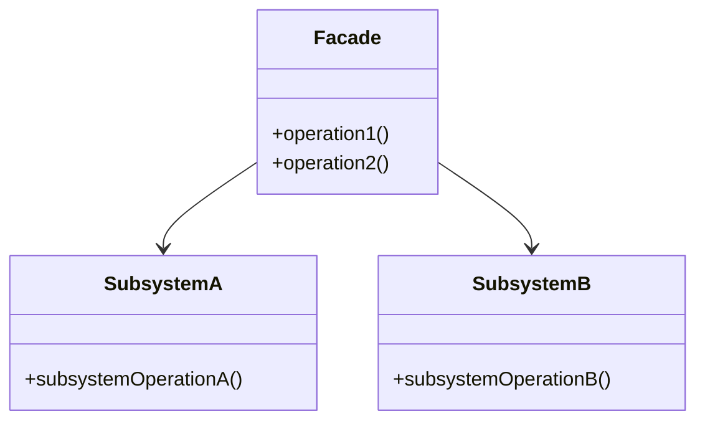

## 4.6.4 Use Cases and Examples

In the world of software development, complexity is a constant companion. As systems grow, they often become intricate webs of interconnected components. The Facade pattern emerges as a powerful ally in managing this complexity by providing a simplified interface to a complex subsystem. In this section, we will explore real-world scenarios where the Facade pattern shines, delve into code examples in JavaScript and TypeScript, and discuss the benefits of integrating this pattern into your projects.

### Understanding the Facade Pattern

Before we dive into specific use cases, let's briefly revisit what the Facade pattern is. The Facade pattern is a structural design pattern that provides a simplified interface to a complex subsystem. It acts as a "front door" to the system, allowing clients to interact with it without needing to understand its intricacies. This pattern is particularly useful when dealing with complex libraries, APIs, or legacy systems.

### Real-World Scenarios for the Facade Pattern

#### Scenario 1: Multimedia Conversion Library

Imagine you are developing a multimedia application that needs to convert various audio and video formats. The underlying library you are using is powerful but complex, with numerous classes and methods for handling different formats, codecs, and conversion settings. Integrating this library directly into your application could lead to a tangled mess of code, making it difficult to maintain and extend.

**Solution**: Implement a Facade that provides a simple interface for common conversion tasks, such as converting an audio file to MP3 or a video file to MP4. This facade will internally manage the interactions with the complex library, allowing your application to focus on its core functionality.

```javascript
// Facade for multimedia conversion
class MediaConverterFacade {
    constructor() {
        this.audioConverter = new AudioConverter();
        this.videoConverter = new VideoConverter();
    }

    convertAudioToMP3(file) {
        // Simplified method for audio conversion
        return this.audioConverter.convert(file, 'mp3');
    }

    convertVideoToMP4(file) {
        // Simplified method for video conversion
        return this.videoConverter.convert(file, 'mp4');
    }
}

// Usage
const converter = new MediaConverterFacade();
converter.convertAudioToMP3('song.wav');
converter.convertVideoToMP4('movie.avi');
```

In this example, the `MediaConverterFacade` class provides a straightforward interface for converting audio and video files, hiding the complexity of the underlying conversion library.

#### Scenario 2: Complex API Integration

Consider a scenario where your application needs to interact with a third-party API that offers a wide range of services, such as user authentication, data retrieval, and analytics. Directly integrating with this API can lead to scattered code and potential errors due to the complexity of the API's structure.

**Solution**: Create a Facade that consolidates the API's services into a single, cohesive interface. This facade will handle the intricacies of API requests, authentication, and error handling, allowing your application to interact with the API seamlessly.

```typescript
// Facade for complex API integration
class ApiFacade {
    private authService: AuthService;
    private dataService: DataService;
    private analyticsService: AnalyticsService;

    constructor() {
        this.authService = new AuthService();
        this.dataService = new DataService();
        this.analyticsService = new AnalyticsService();
    }

    login(username: string, password: string): Promise<User> {
        return this.authService.authenticate(username, password);
    }

    fetchData(endpoint: string): Promise<Data> {
        return this.dataService.getData(endpoint);
    }

    trackEvent(event: string): void {
        this.analyticsService.track(event);
    }
}

// Usage
const api = new ApiFacade();
api.login('user', 'pass').then(user => console.log(user));
api.fetchData('/data').then(data => console.log(data));
api.trackEvent('page_view');
```

Here, the `ApiFacade` class simplifies interactions with a complex API by providing a unified interface for authentication, data retrieval, and event tracking.

### Legacy Code Integration

Legacy systems often pose a significant challenge when integrating new features or components. These systems may have outdated architectures, lack documentation, or be built with technologies that are no longer in use. The Facade pattern can be instrumental in bridging the gap between legacy code and modern applications.

#### Scenario 3: Legacy System Integration

Suppose you are tasked with integrating a modern web application with a legacy system that manages customer data. The legacy system uses an outdated protocol and has a complex data structure that is difficult to work with directly.

**Solution**: Develop a Facade that abstracts the legacy system's complexities, providing a modern interface that your web application can interact with. This facade will handle data conversion, protocol translation, and any necessary transformations.

```javascript
// Facade for legacy system integration
class LegacySystemFacade {
    constructor() {
        this.legacySystem = new LegacySystem();
    }

    getCustomerData(customerId) {
        // Convert modern request to legacy format
        const legacyRequest = this.convertToLegacyRequest(customerId);
        const legacyResponse = this.legacySystem.fetchData(legacyRequest);
        // Convert legacy response to modern format
        return this.convertToModernResponse(legacyResponse);
    }

    convertToLegacyRequest(customerId) {
        // Implementation for converting request
        return `LEGACY_REQ:${customerId}`;
    }

    convertToModernResponse(legacyResponse) {
        // Implementation for converting response
        return JSON.parse(legacyResponse.replace('LEGACY_RES:', ''));
    }
}

// Usage
const legacyFacade = new LegacySystemFacade();
const customerData = legacyFacade.getCustomerData('12345');
console.log(customerData);
```

In this example, the `LegacySystemFacade` class provides a modern interface for retrieving customer data from a legacy system, handling the necessary conversions and translations internally.

### Benefits of the Facade Pattern

The Facade pattern offers several benefits that can significantly enhance your codebase:

1. **Simplified Interface**: By providing a simplified interface, the Facade pattern reduces the complexity of interacting with a subsystem, making it easier to use and understand.

2. **Reduced Client-Side Errors**: With a clear and concise interface, the likelihood of client-side errors decreases, as clients no longer need to manage the intricacies of the subsystem.

3. **Improved Code Clarity**: The Facade pattern promotes cleaner and more organized code by encapsulating complex interactions within a single class.

4. **Legacy Code Integration**: The Facade pattern facilitates the integration of legacy systems by providing a modern interface that abstracts outdated protocols and data structures.

5. **Enhanced Maintainability**: By decoupling the client from the subsystem, the Facade pattern makes it easier to maintain and update the subsystem without affecting the client code.

### When to Introduce a Facade

Deciding when to introduce a Facade in your project can be crucial for maintaining a clean and efficient codebase. Here are some guidelines to consider:

- **Complex Subsystems**: If you are dealing with a subsystem that has a complex API or requires multiple steps to perform a task, a Facade can simplify interactions.

- **Legacy Systems**: When integrating with legacy systems, a Facade can provide a modern interface that abstracts outdated technologies.

- **Frequent Changes**: If the subsystem is subject to frequent changes, a Facade can shield the client code from these changes, reducing the impact on the overall system.

- **Multiple Clients**: When multiple clients need to interact with the same subsystem, a Facade can provide a consistent interface, ensuring uniformity across the application.

- **Code Clarity**: If the client code becomes cluttered with subsystem interactions, a Facade can encapsulate these interactions, improving code clarity and readability.

### Try It Yourself

To truly grasp the power of the Facade pattern, we encourage you to experiment with the code examples provided. Try modifying the Facade classes to add new functionality or integrate additional subsystems. Consider creating a Facade for a library or API you frequently use in your projects. By doing so, you'll gain a deeper understanding of how the Facade pattern can simplify complex interactions and enhance your codebase.

### Visualizing the Facade Pattern

To further illustrate the Facade pattern, let's visualize its structure using a class diagram. This diagram represents the relationship between the Facade class and the subsystem components it interacts with.



In this diagram, the `Facade` class provides a simplified interface (`operation1` and `operation2`) that internally interacts with `SubsystemA` and `SubsystemB` through their respective operations. This encapsulation hides the complexity of the subsystems from the client.

### Conclusion

The Facade pattern is a powerful tool for managing complexity in software systems. By providing a simplified interface to complex subsystems, it enhances code clarity, reduces errors, and facilitates integration with legacy systems. As you continue to develop and maintain software, consider incorporating the Facade pattern to streamline interactions and improve the overall quality of your codebase.

## Quiz Time!



### What is the primary purpose of the Facade pattern?

- [x] To provide a simplified interface to a complex subsystem.
- [ ] To increase the complexity of a system.
- [ ] To replace the existing system with a new one.
- [ ] To add more features to a system.

> **Explanation:** The Facade pattern is designed to provide a simplified interface to a complex subsystem, making it easier for clients to interact with it.

### In which scenario is the Facade pattern most beneficial?

- [x] When dealing with complex subsystems.
- [ ] When the system is already simple.
- [ ] When there is no need for a user interface.
- [ ] When the system has no legacy code.

> **Explanation:** The Facade pattern is most beneficial when dealing with complex subsystems, as it simplifies interactions and hides complexity.

### How does the Facade pattern improve code clarity?

- [x] By encapsulating complex interactions within a single class.
- [ ] By adding more classes to the system.
- [ ] By removing all comments from the code.
- [ ] By increasing the number of methods in a class.

> **Explanation:** The Facade pattern improves code clarity by encapsulating complex interactions within a single class, making the code easier to understand and maintain.

### What is a key benefit of using the Facade pattern with legacy systems?

- [x] It provides a modern interface that abstracts outdated protocols.
- [ ] It completely replaces the legacy system.
- [ ] It makes the legacy system more complex.
- [ ] It removes the need for any integration.

> **Explanation:** The Facade pattern provides a modern interface that abstracts outdated protocols, facilitating integration with legacy systems.

### When should you consider introducing a Facade in your project?

- [x] When the subsystem is subject to frequent changes.
- [ ] When the system is already optimized.
- [ ] When there are no clients interacting with the subsystem.
- [ ] When the subsystem is simple and straightforward.

> **Explanation:** A Facade should be considered when the subsystem is subject to frequent changes, as it shields the client code from these changes.

### What is the role of the Facade class in the pattern?

- [x] To provide a simplified interface to the subsystem.
- [ ] To add complexity to the subsystem.
- [ ] To replace the subsystem entirely.
- [ ] To remove functionality from the subsystem.

> **Explanation:** The Facade class provides a simplified interface to the subsystem, making it easier for clients to interact with it.

### How does the Facade pattern reduce client-side errors?

- [x] By providing a clear and concise interface.
- [ ] By increasing the complexity of the client code.
- [ ] By removing error handling from the client code.
- [ ] By adding more methods to the client code.

> **Explanation:** The Facade pattern reduces client-side errors by providing a clear and concise interface, minimizing the need for clients to manage subsystem intricacies.

### What is a potential drawback of using the Facade pattern?

- [x] It may hide important functionality of the subsystem.
- [ ] It makes the system more complex.
- [ ] It increases the number of classes in the system.
- [ ] It reduces the maintainability of the system.

> **Explanation:** A potential drawback of the Facade pattern is that it may hide important functionality of the subsystem, which might be needed by some clients.

### Can the Facade pattern be used with modern APIs?

- [x] True
- [ ] False

> **Explanation:** True. The Facade pattern can be used with modern APIs to simplify interactions and provide a unified interface.

### Does the Facade pattern always require changes to the subsystem?

- [x] False
- [ ] True

> **Explanation:** False. The Facade pattern does not always require changes to the subsystem; it can be implemented as an additional layer that interacts with the existing subsystem.


