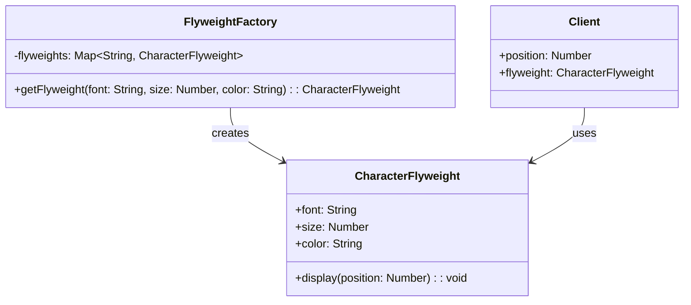

## 4.7.1 Intent and Motivation

In the realm of software development, particularly when dealing with object-oriented programming, managing resources efficiently is paramount. As applications grow in complexity, the number of objects they handle can skyrocket, leading to increased memory consumption and potential performance bottlenecks. This is where the Flyweight Pattern comes into play, offering a sophisticated solution to optimize resource usage by sharing data among similar objects. In this section, we'll delve into the intent and motivation behind the Flyweight Pattern, exploring its significance in reducing memory footprints and enhancing application performance.

### Understanding the Flyweight Pattern

The Flyweight Pattern is a structural design pattern that focuses on minimizing memory usage by sharing as much data as possible with other similar objects. This is achieved by storing shared data in a single place and referencing it from multiple objects. The pattern is particularly useful in scenarios where a large number of objects are required, but the objects themselves contain a significant amount of shared data.

#### Importance of Resource Optimization

In modern software applications, especially those running in constrained environments like mobile devices or embedded systems, optimizing resource usage is crucial. Excessive memory consumption can lead to sluggish performance, increased battery usage, and even application crashes. By employing the Flyweight Pattern, developers can significantly reduce the memory footprint of their applications, leading to more efficient and responsive software.

### The Problem: Handling Large Numbers of Similar Objects

Imagine a text editor that needs to display thousands of characters on the screen. Each character could be represented as an object, containing properties such as font, size, color, and position. If each character object stores all these properties independently, the memory consumption can become substantial, especially when dealing with large documents.

#### Example: Characters in a Text Editor

Consider a scenario where a text editor needs to render a document containing thousands of characters. Each character might have properties like:

- **Font**: The typeface used for the character.
- **Size**: The size of the character.
- **Color**: The color of the character.
- **Position**: The position of the character on the screen.

If each character object stores all these properties, the memory usage can quickly escalate. However, in reality, many characters share the same font, size, and color. The only unique property is often the position. This is where the Flyweight Pattern can be applied to optimize resource usage.

### Intrinsic and Extrinsic State

The Flyweight Pattern distinguishes between two types of state: intrinsic and extrinsic. Understanding these concepts is key to implementing the pattern effectively.

#### Intrinsic State

Intrinsic state refers to the information that is shared among multiple objects. This state is independent of the context in which the object is used and can be stored in a shared object. In the text editor example, intrinsic state might include the font, size, and color of the characters, as these properties are often shared among many characters.

#### Extrinsic State

Extrinsic state, on the other hand, is context-specific and cannot be shared. It is unique to each object and must be stored externally. In the text editor example, the position of each character is extrinsic, as it varies from one character to another.

By separating intrinsic and extrinsic state, the Flyweight Pattern allows multiple objects to share the same intrinsic state, significantly reducing memory usage.

### Implementing the Flyweight Pattern

To implement the Flyweight Pattern, we need to follow a few key steps:

1. **Identify Shared State**: Determine which parts of the object's state can be shared (intrinsic state) and which parts are unique (extrinsic state).
2. **Create Flyweight Objects**: Implement a Flyweight class to represent the shared state. This class should be lightweight and contain only the intrinsic state.
3. **Use a Factory**: Implement a factory to manage the creation and reuse of Flyweight objects. The factory should ensure that shared objects are reused rather than duplicated.
4. **Store Extrinsic State Externally**: Keep the extrinsic state separate from the Flyweight objects, passing it to them as needed.

#### Code Example: Flyweight Pattern in JavaScript

Let's explore a simple implementation of the Flyweight Pattern in JavaScript using the text editor example:

```javascript
// Flyweight class to represent shared state
class CharacterFlyweight {
  constructor(font, size, color) {
    this.font = font;
    this.size = size;
    this.color = color;
  }

  display(position) {
    console.log(`Character at position ${position} with font: ${this.font}, size: ${this.size}, color: ${this.color}`);
  }
}

// Flyweight factory to manage flyweight objects
class FlyweightFactory {
  constructor() {
    this.flyweights = {};
  }

  getFlyweight(font, size, color) {
    const key = `${font}-${size}-${color}`;
    if (!this.flyweights[key]) {
      this.flyweights[key] = new CharacterFlyweight(font, size, color);
    }
    return this.flyweights[key];
  }
}

// Client code
const factory = new FlyweightFactory();

// Create flyweight objects
const flyweight1 = factory.getFlyweight('Arial', 12, 'black');
const flyweight2 = factory.getFlyweight('Arial', 12, 'black');

// Display characters with shared state
flyweight1.display(1);
flyweight2.display(2);
```

In this example, the `CharacterFlyweight` class represents the shared state (font, size, color), while the `FlyweightFactory` manages the creation and reuse of flyweight objects. The client code demonstrates how multiple characters can share the same intrinsic state, reducing memory usage.

### Try It Yourself

To gain a deeper understanding of the Flyweight Pattern, try modifying the code example above. Experiment with different fonts, sizes, and colors to see how the Flyweight Factory manages shared objects. Consider adding additional properties to the flyweight objects and observe how the pattern helps optimize resource usage.

### Visualizing the Flyweight Pattern

To better understand the Flyweight Pattern, let's visualize the relationship between intrinsic and extrinsic state using a class diagram.



This diagram illustrates how the `FlyweightFactory` creates and manages `CharacterFlyweight` objects, which are then used by the client code. The intrinsic state (font, size, color) is stored in the `CharacterFlyweight` class, while the extrinsic state (position) is managed by the client.

### Benefits of the Flyweight Pattern

The Flyweight Pattern offers several benefits, particularly in scenarios where memory usage is a concern:

- **Reduced Memory Usage**: By sharing intrinsic state among multiple objects, the Flyweight Pattern significantly reduces memory consumption.
- **Improved Performance**: With less memory usage, applications can perform more efficiently, especially when dealing with large numbers of objects.
- **Simplified Object Management**: The pattern simplifies the management of objects by centralizing shared state in flyweight objects.

### Challenges and Considerations

While the Flyweight Pattern offers significant benefits, it also comes with certain challenges and considerations:

- **Complexity**: Implementing the Flyweight Pattern can introduce additional complexity, particularly in managing the separation of intrinsic and extrinsic state.
- **Trade-offs**: The pattern may not be suitable for all scenarios. It's important to weigh the benefits of reduced memory usage against the complexity of implementation.
- **State Management**: Careful management of intrinsic and extrinsic state is crucial to ensure the pattern is applied effectively.

### Real-World Applications

The Flyweight Pattern is widely used in various real-world applications, particularly those involving large numbers of similar objects. Some common use cases include:

- **Text Rendering**: As demonstrated in the text editor example, the Flyweight Pattern is ideal for rendering large amounts of text with shared formatting properties.
- **Graphics and Game Development**: In graphics applications and games, the pattern can be used to manage shared resources like textures and sprites.
- **Data Caching**: The Flyweight Pattern can be applied to cache shared data, reducing the need for redundant data storage.

### Further Reading

For more information on the Flyweight Pattern and its applications, consider exploring the following resources:

- [MDN Web Docs: JavaScript Design Patterns](https://developer.mozilla.org/en-US/docs/Web/JavaScript/Guide/Design_Patterns)
- [Refactoring Guru: Flyweight Pattern](https://refactoring.guru/design-patterns/flyweight)
- [W3Schools: JavaScript Design Patterns](https://www.w3schools.com/js/js_design_patterns.asp)

### Embrace the Journey

Remember, mastering design patterns like the Flyweight Pattern is a journey. As you continue to explore and experiment with different patterns, you'll gain a deeper understanding of how to optimize resource usage and enhance application performance. Keep experimenting, stay curious, and enjoy the journey!

## Quiz Time!



### What is the primary goal of the Flyweight Pattern?

- [x] To reduce memory usage by sharing data among similar objects
- [ ] To increase the speed of object creation
- [ ] To simplify the code structure
- [ ] To enhance security features

> **Explanation:** The Flyweight Pattern is primarily aimed at reducing memory usage by sharing as much data as possible with similar objects.

### Which of the following is an example of intrinsic state in the Flyweight Pattern?

- [x] Font type
- [ ] Character position
- [ ] Document length
- [ ] User input

> **Explanation:** Intrinsic state refers to shared properties like font type, which can be shared among multiple objects.

### What is the role of the Flyweight Factory?

- [x] To manage the creation and reuse of flyweight objects
- [ ] To store extrinsic state
- [ ] To handle user input
- [ ] To render graphics

> **Explanation:** The Flyweight Factory is responsible for managing the creation and reuse of flyweight objects, ensuring shared objects are reused.

### In the text editor example, which property is considered extrinsic state?

- [x] Character position
- [ ] Font size
- [ ] Font color
- [ ] Font type

> **Explanation:** Extrinsic state is context-specific and unique to each object, such as the character position in a text editor.

### What is a potential challenge of implementing the Flyweight Pattern?

- [x] Increased complexity in managing intrinsic and extrinsic state
- [ ] Reduced performance
- [ ] Increased memory usage
- [ ] Simplified object management

> **Explanation:** Implementing the Flyweight Pattern can introduce complexity in managing the separation of intrinsic and extrinsic state.

### How does the Flyweight Pattern improve performance?

- [x] By reducing memory usage
- [ ] By increasing CPU usage
- [ ] By simplifying algorithms
- [ ] By enhancing security

> **Explanation:** The Flyweight Pattern improves performance by reducing memory usage, which can lead to more efficient applications.

### Which of the following is a real-world application of the Flyweight Pattern?

- [x] Text rendering in a document editor
- [ ] User authentication
- [ ] Network communication
- [ ] Database management

> **Explanation:** The Flyweight Pattern is commonly used in text rendering to manage shared formatting properties.

### What is the relationship between intrinsic and extrinsic state in the Flyweight Pattern?

- [x] Intrinsic state is shared, while extrinsic state is unique to each object
- [ ] Both are shared among all objects
- [ ] Both are unique to each object
- [ ] Intrinsic state is unique, while extrinsic state is shared

> **Explanation:** Intrinsic state is shared among multiple objects, whereas extrinsic state is unique to each object.

### What is a key benefit of using the Flyweight Pattern?

- [x] Reduced memory usage
- [ ] Increased code complexity
- [ ] Simplified user interfaces
- [ ] Enhanced security

> **Explanation:** A key benefit of the Flyweight Pattern is reduced memory usage by sharing data among similar objects.

### True or False: The Flyweight Pattern is suitable for all scenarios.

- [ ] True
- [x] False

> **Explanation:** The Flyweight Pattern is not suitable for all scenarios; it is best used when there is a significant amount of shared data among objects.




