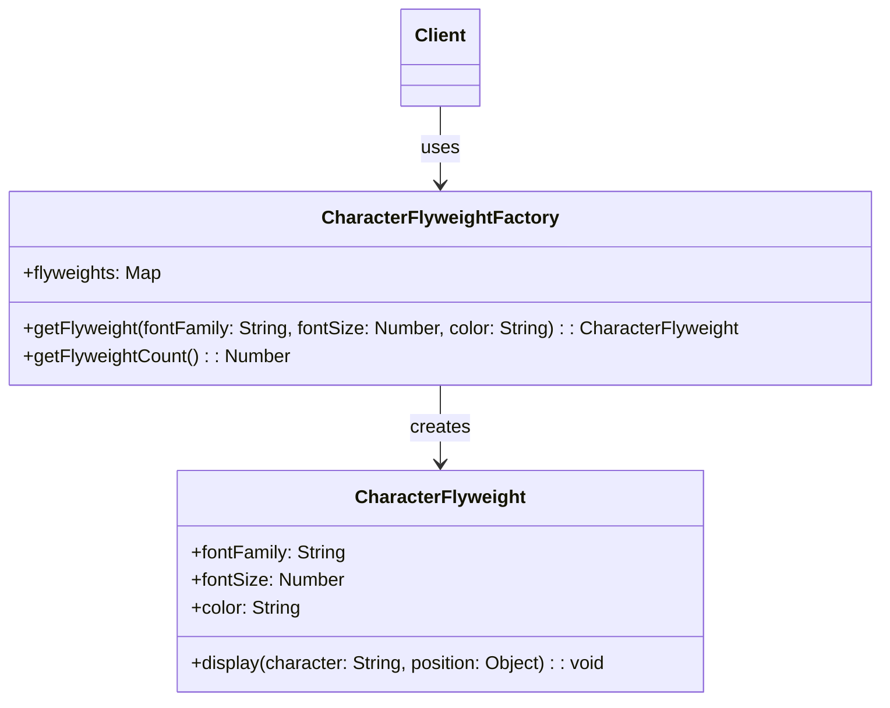

## 4.7.2 Implementation in JavaScript

The Flyweight pattern is a structural design pattern that focuses on minimizing memory usage by sharing as much data as possible with similar objects. This is particularly useful when dealing with a large number of objects that share common data. In this section, we will delve into the implementation of the Flyweight pattern in JavaScript, exploring how to separate intrinsic and extrinsic state, manage a pool of shared objects, and utilize factories or managers to handle flyweight instances.

### Understanding the Flyweight Pattern

Before diving into the implementation, let's briefly revisit the core concepts of the Flyweight pattern. The pattern is designed to reduce memory usage by sharing common parts of object states among multiple objects. It achieves this by separating the intrinsic state, which is shared, from the extrinsic state, which is unique to each object.

- **Intrinsic State**: This is the part of the object's state that is shared among many objects. It is stored in the flyweight object and is immutable.
- **Extrinsic State**: This is the part of the object's state that is unique to each object. It is passed to the flyweight methods when needed.

### Implementing the Flyweight Pattern in JavaScript

Let's explore how to implement the Flyweight pattern in JavaScript with a practical example. We'll use a scenario where we need to create a large number of similar objects, such as characters in a text editor, where the font style can be shared among multiple characters.

#### Step 1: Define the Flyweight Class

The Flyweight class will contain the intrinsic state. It will be shared among multiple objects to minimize memory usage.

```javascript
// Flyweight class
class CharacterFlyweight {
  constructor(fontFamily, fontSize, color) {
    this.fontFamily = fontFamily;
    this.fontSize = fontSize;
    this.color = color;
  }

  // Method to display character with extrinsic state
  display(character, position) {
    console.log(`Character: ${character}, Position: ${position}, Font: ${this.fontFamily}, Size: ${this.fontSize}, Color: ${this.color}`);
  }
}
```

In this example, `fontFamily`, `fontSize`, and `color` are intrinsic states that are shared among characters.

#### Step 2: Create a Flyweight Factory

The Flyweight Factory is responsible for managing the pool of flyweight objects. It ensures that flyweights are shared and reused.

```javascript
// Flyweight Factory
class CharacterFlyweightFactory {
  constructor() {
    this.flyweights = {};
  }

  // Method to get a flyweight
  getFlyweight(fontFamily, fontSize, color) {
    const key = `${fontFamily}-${fontSize}-${color}`;
    if (!this.flyweights[key]) {
      this.flyweights[key] = new CharacterFlyweight(fontFamily, fontSize, color);
    }
    return this.flyweights[key];
  }

  // Method to get the count of flyweights
  getFlyweightCount() {
    return Object.keys(this.flyweights).length;
  }
}
```

The `CharacterFlyweightFactory` class manages the creation and reuse of flyweight objects. It uses a key to identify unique combinations of intrinsic states.

#### Step 3: Use the Flyweight Factory

Now, let's see how we can use the Flyweight Factory to create and manage characters.

```javascript
// Client code
const factory = new CharacterFlyweightFactory();

// Create characters with shared flyweight
const characterA = factory.getFlyweight('Arial', 12, 'black');
characterA.display('A', { x: 10, y: 20 });

const characterB = factory.getFlyweight('Arial', 12, 'black');
characterB.display('B', { x: 15, y: 25 });

const characterC = factory.getFlyweight('Times New Roman', 14, 'blue');
characterC.display('C', { x: 20, y: 30 });

console.log(`Total flyweights created: ${factory.getFlyweightCount()}`);
```

In this example, characters A and B share the same flyweight because they have the same intrinsic state. Character C, however, has a different intrinsic state and thus a different flyweight.

### Managing a Pool of Shared Objects

The Flyweight Factory plays a crucial role in managing the pool of shared objects. It ensures that flyweights are reused whenever possible, reducing memory usage. This is particularly important in scenarios where creating a large number of objects can lead to performance issues.

#### Memory Usage Reduction

By sharing intrinsic states among multiple objects, the Flyweight pattern significantly reduces memory usage. This is especially beneficial in applications with a large number of similar objects, such as graphical applications, text editors, and games.

### Challenges in JavaScript

Implementing the Flyweight pattern in JavaScript comes with its own set of challenges, particularly related to garbage collection. JavaScript's garbage collector automatically manages memory, which can sometimes interfere with the manual management of shared objects.

- **Garbage Collection**: JavaScript's garbage collector may not immediately reclaim memory from unused objects, which can lead to memory leaks if flyweights are not managed properly.
- **Object Identity**: Since flyweights are shared, it is important to ensure that they are used correctly to avoid unintended side effects.

### Visualizing the Flyweight Pattern

To better understand the Flyweight pattern, let's visualize the relationship between the flyweight objects and the client objects.



In this diagram, the `CharacterFlyweightFactory` is responsible for creating and managing `CharacterFlyweight` instances. The client code interacts with the factory to obtain flyweights.

### Try It Yourself

To deepen your understanding of the Flyweight pattern, try modifying the code examples provided. Here are a few suggestions:

- **Change the Intrinsic State**: Modify the intrinsic state properties (e.g., font size, color) and observe how the Flyweight Factory manages different flyweights.
- **Add More Characters**: Create additional characters with varying intrinsic and extrinsic states to see how the pattern handles them.
- **Implement a Different Scenario**: Apply the Flyweight pattern to a different scenario, such as managing graphical shapes or UI components.

### References and Further Reading

- [MDN Web Docs: Memory Management](https://developer.mozilla.org/en-US/docs/Web/JavaScript/Memory_Management)
- [W3Schools: JavaScript Objects](https://www.w3schools.com/js/js_objects.asp)
- [Refactoring Guru: Flyweight Pattern](https://refactoring.guru/design-patterns/flyweight)

### Knowledge Check

To reinforce your understanding of the Flyweight pattern, consider the following questions:

- What are the benefits of separating intrinsic and extrinsic states in the Flyweight pattern?
- How does the Flyweight Factory manage the pool of shared objects?
- What challenges might arise when implementing the Flyweight pattern in JavaScript?

### Embrace the Journey

Remember, mastering design patterns like the Flyweight pattern is a journey. As you continue to explore and experiment with these patterns, you'll gain a deeper understanding of how to optimize your code for performance and memory efficiency. Keep experimenting, stay curious, and enjoy the journey!

## Quiz Time!



### What is the primary purpose of the Flyweight pattern?

- [x] To reduce memory usage by sharing common state among objects.
- [ ] To increase the speed of object creation.
- [ ] To simplify the code structure.
- [ ] To enhance the security of the application.

> **Explanation:** The Flyweight pattern is primarily used to reduce memory usage by sharing common state among objects, which is particularly useful when dealing with a large number of similar objects.

### In the Flyweight pattern, what is the intrinsic state?

- [x] The part of the object's state that is shared among many objects.
- [ ] The part of the object's state that is unique to each object.
- [ ] The part of the object's state that is mutable.
- [ ] The part of the object's state that is stored in the client.

> **Explanation:** The intrinsic state is the part of the object's state that is shared among many objects and is stored in the flyweight object.

### What role does the Flyweight Factory play in the Flyweight pattern?

- [x] It manages the creation and reuse of flyweight objects.
- [ ] It stores the extrinsic state of the objects.
- [ ] It creates unique objects for each request.
- [ ] It handles the garbage collection of flyweight objects.

> **Explanation:** The Flyweight Factory is responsible for managing the creation and reuse of flyweight objects, ensuring that they are shared and reused whenever possible.

### How does the Flyweight pattern reduce memory usage?

- [x] By sharing intrinsic states among multiple objects.
- [ ] By creating new objects for each request.
- [ ] By storing all object states in the client.
- [ ] By using complex data structures.

> **Explanation:** The Flyweight pattern reduces memory usage by sharing intrinsic states among multiple objects, which minimizes the amount of memory needed to store similar objects.

### What is a potential challenge when implementing the Flyweight pattern in JavaScript?

- [x] Managing garbage collection of shared objects.
- [ ] Creating unique objects for each request.
- [ ] Handling complex data structures.
- [ ] Increasing the speed of object creation.

> **Explanation:** A potential challenge when implementing the Flyweight pattern in JavaScript is managing the garbage collection of shared objects, as JavaScript's garbage collector may not immediately reclaim memory from unused objects.

### What is the extrinsic state in the Flyweight pattern?

- [x] The part of the object's state that is unique to each object.
- [ ] The part of the object's state that is shared among many objects.
- [ ] The part of the object's state that is immutable.
- [ ] The part of the object's state that is stored in the flyweight.

> **Explanation:** The extrinsic state is the part of the object's state that is unique to each object and is passed to the flyweight methods when needed.

### What is the benefit of using a Flyweight Factory?

- [x] It ensures that flyweights are reused and shared.
- [ ] It creates new objects for each request.
- [ ] It simplifies the code structure.
- [ ] It enhances the security of the application.

> **Explanation:** The benefit of using a Flyweight Factory is that it ensures that flyweights are reused and shared, which helps in reducing memory usage.

### How can you visualize the relationship between flyweight objects and client objects?

- [x] Using a class diagram.
- [ ] Using a flowchart.
- [ ] Using a sequence diagram.
- [ ] Using a pie chart.

> **Explanation:** A class diagram is an effective way to visualize the relationship between flyweight objects and client objects, showing how the factory creates and manages flyweights.

### What is a key consideration when using flyweights in JavaScript?

- [x] Ensuring that flyweights are used correctly to avoid unintended side effects.
- [ ] Creating unique objects for each request.
- [ ] Storing all object states in the client.
- [ ] Using complex data structures.

> **Explanation:** A key consideration when using flyweights in JavaScript is ensuring that they are used correctly to avoid unintended side effects, as they are shared among multiple objects.

### True or False: The Flyweight pattern is useful for applications with a small number of unique objects.

- [ ] True
- [x] False

> **Explanation:** False. The Flyweight pattern is particularly useful for applications with a large number of similar objects, where sharing common state can significantly reduce memory usage.


