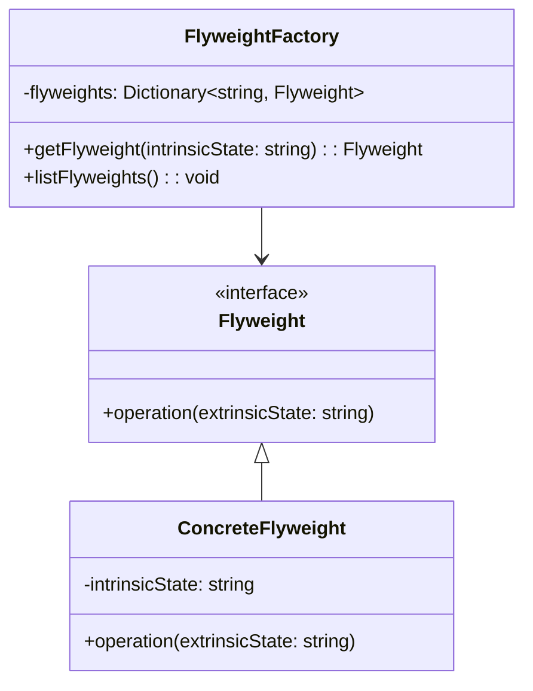

## 4.7.3 Implementation in TypeScript

The Flyweight Pattern is a structural design pattern that focuses on minimizing memory usage by sharing as much data as possible with similar objects. This pattern is particularly useful when dealing with a large number of objects that share common data. In this section, we will explore how to implement the Flyweight Pattern in TypeScript, leveraging its static typing features for better resource management and type safety.

### Understanding the Flyweight Pattern

Before diving into TypeScript implementation, let's briefly revisit the Flyweight Pattern's core concepts. The pattern is based on the idea of sharing common parts of an object state among multiple objects to reduce memory consumption. It involves:

- **Intrinsic State**: Shared among objects and stored in the Flyweight object.
- **Extrinsic State**: Unique to each object and stored outside the Flyweight.

The Flyweight Pattern is often used in scenarios where a large number of similar objects are needed, such as in graphics applications, text editors, or any application where memory optimization is crucial.

### Implementing Flyweight Pattern in TypeScript

TypeScript, with its static typing and class-based object-oriented features, provides an excellent platform for implementing the Flyweight Pattern. We will use classes and interfaces to define flyweight objects with type safety, ensuring that our implementation is both efficient and robust.

#### Step 1: Define the Flyweight Interface

First, we need to define an interface for our flyweight objects. This interface will ensure that all flyweight objects have a consistent structure and behavior.

```typescript
interface Flyweight {
  operation(extrinsicState: string): void;
}
```

The `operation` method takes an `extrinsicState` parameter, which represents the state unique to each object instance.

#### Step 2: Create Concrete Flyweight Class

Next, we create a concrete class that implements the `Flyweight` interface. This class will store the intrinsic state and implement the shared behavior.

```typescript
class ConcreteFlyweight implements Flyweight {
  private intrinsicState: string;

  constructor(intrinsicState: string) {
    this.intrinsicState = intrinsicState;
  }

  public operation(extrinsicState: string): void {
    console.log(`Intrinsic State: ${this.intrinsicState}, Extrinsic State: ${extrinsicState}`);
  }
}
```

In this example, `ConcreteFlyweight` stores the intrinsic state and implements the `operation` method, which combines intrinsic and extrinsic states.

#### Step 3: Implement the Flyweight Factory

The Flyweight Factory is responsible for creating and managing flyweight objects. It ensures that flyweight objects are shared properly and that new objects are created only when necessary.

```typescript
class FlyweightFactory {
  private flyweights: { [key: string]: Flyweight } = {};

  public getFlyweight(intrinsicState: string): Flyweight {
    if (!this.flyweights[intrinsicState]) {
      this.flyweights[intrinsicState] = new ConcreteFlyweight(intrinsicState);
      console.log(`Creating new flyweight for state: ${intrinsicState}`);
    } else {
      console.log(`Reusing existing flyweight for state: ${intrinsicState}`);
    }
    return this.flyweights[intrinsicState];
  }

  public listFlyweights(): void {
    const count = Object.keys(this.flyweights).length;
    console.log(`FlyweightFactory: I have ${count} flyweights.`);
  }
}
```

The `FlyweightFactory` class maintains a pool of flyweight objects and provides a method to retrieve them. If a flyweight with the requested intrinsic state does not exist, it creates a new one.

#### Step 4: Use the Flyweight Pattern

Now that we have our flyweight structure set up, let's see how to use it in practice.

```typescript
const factory = new FlyweightFactory();

const flyweight1 = factory.getFlyweight("SharedState1");
flyweight1.operation("UniqueStateA");

const flyweight2 = factory.getFlyweight("SharedState2");
flyweight2.operation("UniqueStateB");

const flyweight3 = factory.getFlyweight("SharedState1");
flyweight3.operation("UniqueStateC");

factory.listFlyweights();
```

In this example, we create a `FlyweightFactory` and use it to obtain flyweight objects. Notice how `flyweight1` and `flyweight3` share the same intrinsic state, demonstrating the Flyweight Pattern's memory efficiency.

### Controlling Access to Flyweight Instances

One of the key aspects of the Flyweight Pattern is controlling access to flyweight instances. The factory pattern plays a crucial role here by managing the creation and reuse of flyweight objects. By encapsulating the creation logic within the factory, we ensure that clients do not create unnecessary instances, thus maintaining the pattern's efficiency.

### Benefits of TypeScript in Flyweight Pattern

TypeScript offers several advantages when implementing the Flyweight Pattern:

1. **Type Safety**: TypeScript's static typing ensures that flyweight objects are used correctly. Interfaces and classes enforce consistent behavior and structure, reducing runtime errors.

2. **IntelliSense and Autocompletion**: TypeScript's integration with modern IDEs provides powerful features like IntelliSense and autocompletion, making development faster and reducing the likelihood of errors.

3. **Prevention of Incorrect State Assignment**: TypeScript prevents incorrect external state assignment by enforcing type checks at compile time. This ensures that only valid data is passed to flyweight objects.

4. **Enhanced Readability and Maintainability**: TypeScript's type annotations and interfaces make the code more readable and easier to maintain, especially in large projects.

### Differences from JavaScript Implementation

While the Flyweight Pattern can be implemented in JavaScript, TypeScript offers additional benefits due to its static typing and class-based structure. In JavaScript, developers must rely on conventions and runtime checks to ensure correct usage, whereas TypeScript enforces these rules at compile time.

### Visualizing the Flyweight Pattern

To better understand the Flyweight Pattern, let's visualize the relationship between the factory, flyweight objects, and their states.



This diagram illustrates the Flyweight Pattern's structure, showing how the `FlyweightFactory` manages `ConcreteFlyweight` instances, which implement the `Flyweight` interface.

### Try It Yourself

Experiment with the Flyweight Pattern implementation by modifying the code examples. Here are some suggestions:

- **Add More Intrinsic States**: Extend the `ConcreteFlyweight` class to handle additional intrinsic states and observe how the factory manages them.
- **Implement a New Flyweight Type**: Create a new class that implements the `Flyweight` interface and use it alongside the existing implementation.
- **Optimize Factory Logic**: Enhance the `FlyweightFactory` to include additional logic for managing flyweight instances, such as caching strategies.

### Knowledge Check

To reinforce your understanding of the Flyweight Pattern in TypeScript, consider the following questions:

- How does the Flyweight Pattern reduce memory usage?
- What role does the Flyweight Factory play in the pattern?
- How does TypeScript enhance the Flyweight Pattern implementation compared to JavaScript?

### Conclusion

The Flyweight Pattern is a powerful tool for optimizing memory usage in applications that require a large number of similar objects. By leveraging TypeScript's static typing and class-based features, we can implement this pattern with greater efficiency and reliability. As you continue to explore design patterns, remember that the Flyweight Pattern is just one of many tools available to you. Keep experimenting, stay curious, and enjoy the journey!

## Quiz Time!



### What is the primary purpose of the Flyweight Pattern?

- [x] To minimize memory usage by sharing data among similar objects.
- [ ] To enhance the performance of algorithms.
- [ ] To improve the readability of code.
- [ ] To simplify the user interface.

> **Explanation:** The Flyweight Pattern is designed to minimize memory usage by sharing as much data as possible with similar objects.

### In the Flyweight Pattern, what is the term used for the state that is shared among objects?

- [x] Intrinsic State
- [ ] Extrinsic State
- [ ] Shared State
- [ ] Common State

> **Explanation:** The intrinsic state is the part of the object state that is shared among multiple objects in the Flyweight Pattern.

### What is the role of the Flyweight Factory in the Flyweight Pattern?

- [x] To manage the creation and reuse of flyweight objects.
- [ ] To store extrinsic states.
- [ ] To perform operations on flyweight objects.
- [ ] To handle user interactions.

> **Explanation:** The Flyweight Factory is responsible for managing the creation and reuse of flyweight objects, ensuring efficient memory usage.

### How does TypeScript enhance the implementation of the Flyweight Pattern compared to JavaScript?

- [x] By providing static typing and type safety.
- [ ] By allowing dynamic typing.
- [ ] By enabling runtime type checks.
- [ ] By simplifying object creation.

> **Explanation:** TypeScript enhances the Flyweight Pattern implementation by providing static typing and type safety, which helps prevent errors and ensures consistent usage.

### What method is typically included in the Flyweight interface?

- [x] operation(extrinsicState: string): void
- [ ] createFlyweight(): Flyweight
- [ ] manageState(): void
- [ ] listFlyweights(): void

> **Explanation:** The `operation` method is typically included in the Flyweight interface to perform actions using both intrinsic and extrinsic states.

### What is the benefit of using TypeScript's interfaces in the Flyweight Pattern?

- [x] They enforce consistent structure and behavior in flyweight objects.
- [ ] They allow for dynamic object creation.
- [ ] They simplify the user interface.
- [ ] They enhance runtime performance.

> **Explanation:** TypeScript's interfaces enforce consistent structure and behavior in flyweight objects, ensuring that they adhere to a defined contract.

### What is the main difference between intrinsic and extrinsic states in the Flyweight Pattern?

- [x] Intrinsic state is shared, while extrinsic state is unique to each object.
- [ ] Intrinsic state is unique, while extrinsic state is shared.
- [ ] Both are shared among objects.
- [ ] Both are unique to each object.

> **Explanation:** In the Flyweight Pattern, intrinsic state is shared among objects, while extrinsic state is unique to each object instance.

### How does the Flyweight Pattern contribute to memory optimization?

- [x] By sharing common data among similar objects.
- [ ] By reducing the number of objects created.
- [ ] By simplifying object creation.
- [ ] By enhancing algorithm performance.

> **Explanation:** The Flyweight Pattern contributes to memory optimization by sharing common data among similar objects, reducing the overall memory footprint.

### What is a potential modification you can try with the Flyweight Pattern implementation?

- [x] Add more intrinsic states to the ConcreteFlyweight class.
- [ ] Remove the Flyweight interface.
- [ ] Eliminate the Flyweight Factory.
- [ ] Use dynamic typing instead of static typing.

> **Explanation:** Adding more intrinsic states to the ConcreteFlyweight class is a potential modification to explore how the Flyweight Pattern manages additional shared data.

### True or False: The Flyweight Pattern is only applicable in graphical applications.

- [ ] True
- [x] False

> **Explanation:** False. While the Flyweight Pattern is often used in graphical applications, it can be applied in any scenario where memory optimization is needed for a large number of similar objects.


