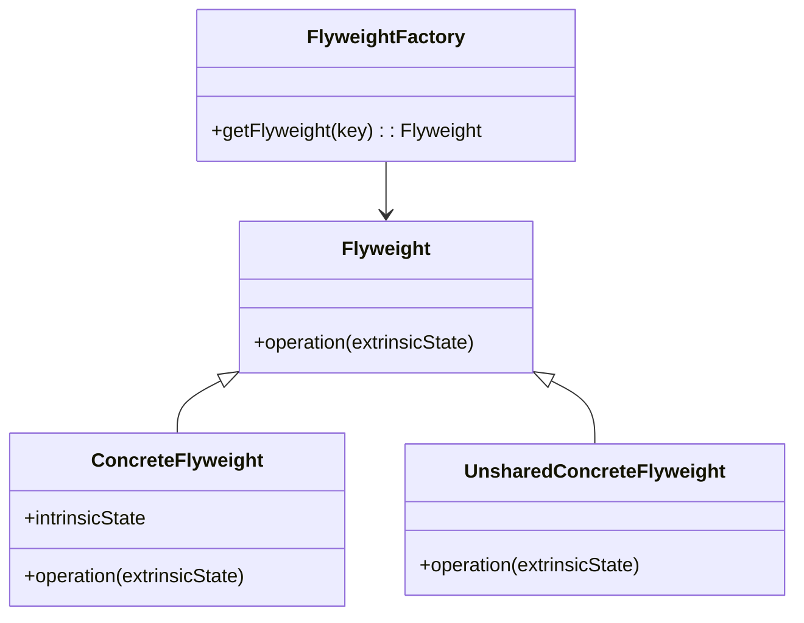

## 4.7.4 Use Cases and Examples

In this section, we delve into practical scenarios where the Flyweight pattern proves advantageous. The Flyweight pattern is a structural design pattern that focuses on minimizing memory usage by sharing as much data as possible with similar objects. This is particularly useful in scenarios where a large number of objects need to be created, but their memory footprint can be reduced by sharing common data.

### Understanding the Flyweight Pattern

Before we explore specific use cases, let's briefly recap the Flyweight pattern's core concept. The Flyweight pattern is used to reduce the number of objects created and to decrease memory usage and increase performance. It achieves this by sharing common parts of the object state among multiple objects, instead of keeping all data in each object.

In essence, the Flyweight pattern separates intrinsic state (shared) from extrinsic state (unique to each object). The intrinsic state is stored in the Flyweight object and shared among multiple objects, while the extrinsic state is stored or computed by the client code.

### Use Cases for the Flyweight Pattern

#### 1. Rendering Large Numbers of Graphic Elements

One of the most common use cases for the Flyweight pattern is in rendering large numbers of graphic elements, such as in a graphical user interface (GUI) or a game. In such scenarios, many objects may share similar properties, such as color, shape, or texture. By using the Flyweight pattern, these properties can be shared among multiple objects, significantly reducing memory consumption.

**Example: Rendering Trees in a Forest**

Imagine a game where you need to render a forest with thousands of trees. Each tree has properties like type, color, and texture. Instead of creating a new object for each tree, we can use the Flyweight pattern to share these properties among trees of the same type.

```javascript
// Flyweight class
class TreeType {
  constructor(name, color, texture) {
    this.name = name;
    this.color = color;
    this.texture = texture;
  }

  draw(canvas, x, y) {
    // Draw the tree on the canvas at position (x, y)
    console.log(`Drawing ${this.name} tree at (${x}, ${y}) with color ${this.color}`);
  }
}

// Flyweight Factory
class TreeFactory {
  constructor() {
    this.treeTypes = {};
  }

  getTreeType(name, color, texture) {
    const key = `${name}_${color}_${texture}`;
    if (!this.treeTypes[key]) {
      this.treeTypes[key] = new TreeType(name, color, texture);
    }
    return this.treeTypes[key];
  }
}

// Context class
class Tree {
  constructor(x, y, type) {
    this.x = x;
    this.y = y;
    this.type = type;
  }

  draw(canvas) {
    this.type.draw(canvas, this.x, this.y);
  }
}

// Client code
const treeFactory = new TreeFactory();
const forest = [];

function plantTree(x, y, name, color, texture) {
  const type = treeFactory.getTreeType(name, color, texture);
  const tree = new Tree(x, y, type);
  forest.push(tree);
}

// Planting trees
plantTree(10, 20, 'Oak', 'Green', 'OakTexture');
plantTree(30, 40, 'Pine', 'Dark Green', 'PineTexture');
plantTree(50, 60, 'Oak', 'Green', 'OakTexture');

// Drawing the forest
forest.forEach(tree => tree.draw('canvas'));
```

In this example, the `TreeType` class represents the Flyweight, and the `TreeFactory` ensures that only one instance of each `TreeType` is created. The `Tree` class represents the context that uses these Flyweights.

#### 2. Managing Cached Data

Another common use case for the Flyweight pattern is managing cached data. When dealing with large datasets, caching can improve performance by storing frequently accessed data in memory. The Flyweight pattern can help reduce the memory footprint of the cache by sharing common data among cache entries.

**Example: Caching User Sessions**

Consider a web application that manages user sessions. Each session may have common properties, such as user roles or permissions, which can be shared among multiple sessions.

```typescript
// Flyweight class
class UserRole {
  constructor(public role: string, public permissions: string[]) {}

  getPermissions() {
    return this.permissions;
  }
}

// Flyweight Factory
class UserRoleFactory {
  private roles: { [key: string]: UserRole } = {};

  getRole(role: string, permissions: string[]): UserRole {
    if (!this.roles[role]) {
      this.roles[role] = new UserRole(role, permissions);
    }
    return this.roles[role];
  }
}

// Context class
class UserSession {
  constructor(public userId: string, public role: UserRole) {}

  getUserPermissions() {
    return this.role.getPermissions();
  }
}

// Client code
const roleFactory = new UserRoleFactory();
const sessions: UserSession[] = [];

function createUserSession(userId: string, role: string, permissions: string[]) {
  const userRole = roleFactory.getRole(role, permissions);
  const session = new UserSession(userId, userRole);
  sessions.push(session);
}

// Creating user sessions
createUserSession('user1', 'admin', ['read', 'write', 'delete']);
createUserSession('user2', 'editor', ['read', 'write']);
createUserSession('user3', 'admin', ['read', 'write', 'delete']);

// Getting permissions
sessions.forEach(session => console.log(`User ${session.userId} has permissions: ${session.getUserPermissions()}`));
```

In this TypeScript example, the `UserRole` class acts as the Flyweight, and the `UserRoleFactory` ensures that only one instance of each role is created. The `UserSession` class represents the context that uses these Flyweights.

### Trade-offs Between Performance and Complexity

While the Flyweight pattern can significantly reduce memory usage and improve performance, it comes with trade-offs. The pattern introduces additional complexity in the codebase, as it requires managing shared and unique states separately. This can make the code harder to understand and maintain.

**Performance vs. Complexity**

- **Performance**: The Flyweight pattern can improve performance by reducing memory usage and speeding up object creation. This is particularly beneficial in scenarios with a large number of similar objects.
- **Complexity**: The pattern introduces complexity by separating intrinsic and extrinsic states. Developers need to carefully manage these states to ensure the pattern's effectiveness.

### Monitoring and Ensuring Effectiveness

To ensure the Flyweight pattern is effective, it's crucial to monitor its impact on memory usage and performance. Here are some strategies to achieve this:

1. **Profiling Tools**: Use profiling tools to measure memory usage and performance before and after implementing the Flyweight pattern. Tools like Chrome DevTools or Node.js's built-in profiler can provide insights into memory consumption and execution time.

2. **Unit Tests**: Write unit tests to verify that the Flyweight pattern is correctly implemented and that shared states are managed properly. This helps ensure that the pattern does not introduce bugs or unexpected behavior.

3. **Logging**: Implement logging to track the creation of Flyweight objects and monitor their usage. This can help identify potential issues or areas for optimization.

### Identifying Opportunities to Apply the Flyweight Pattern

To identify opportunities for applying the Flyweight pattern, look for scenarios where:

- **Large Numbers of Similar Objects**: If your application needs to create a large number of similar objects, consider using the Flyweight pattern to share common data and reduce memory usage.

- **Shared Properties**: If multiple objects share common properties or data, the Flyweight pattern can help reduce redundancy and improve performance.

- **Memory Constraints**: In memory-constrained environments, such as mobile devices or embedded systems, the Flyweight pattern can help optimize memory usage and improve application performance.

### Try It Yourself

To deepen your understanding of the Flyweight pattern, try modifying the code examples provided:

- **Experiment with Different Properties**: Add new properties to the `TreeType` or `UserRole` classes and observe how the Flyweight pattern handles these changes.

- **Measure Performance**: Use profiling tools to measure the performance and memory usage of the code before and after implementing the Flyweight pattern.

- **Implement in a Real-World Project**: Identify a part of your application where the Flyweight pattern could be beneficial and implement it. Monitor the impact on performance and memory usage.

### Visualizing the Flyweight Pattern

To better understand the Flyweight pattern, let's visualize its structure using a class diagram:



**Diagram Description**: This class diagram illustrates the Flyweight pattern's structure. The `Flyweight` interface defines the method for performing operations with extrinsic states. `ConcreteFlyweight` implements the `Flyweight` interface and stores intrinsic states. The `FlyweightFactory` manages Flyweight instances and ensures that shared instances are reused.

### Conclusion

The Flyweight pattern is a powerful tool for optimizing memory usage and improving performance in applications with large numbers of similar objects. By sharing common data among objects, the pattern reduces redundancy and enhances efficiency. However, it introduces complexity, requiring careful management of shared and unique states.

As you explore the Flyweight pattern, remember to monitor its impact on performance and memory usage. Use profiling tools, unit tests, and logging to ensure its effectiveness. Look for opportunities to apply the pattern in scenarios with large numbers of similar objects or shared properties.

Remember, this is just the beginning. As you progress, you'll discover more opportunities to apply the Flyweight pattern and other design patterns in your projects. Keep experimenting, stay curious, and enjoy the journey!

## Quiz Time!



### What is the primary goal of the Flyweight pattern?

- [x] To minimize memory usage by sharing data among similar objects.
- [ ] To increase the speed of object creation.
- [ ] To simplify the codebase by reducing the number of classes.
- [ ] To enhance security by isolating object states.

> **Explanation:** The Flyweight pattern aims to minimize memory usage by sharing common data among similar objects, thus reducing redundancy.

### In the Flyweight pattern, what is the role of the Flyweight Factory?

- [x] To manage and provide shared Flyweight instances.
- [ ] To create new Flyweight instances for each request.
- [ ] To store extrinsic states of objects.
- [ ] To handle the destruction of Flyweight instances.

> **Explanation:** The Flyweight Factory manages and provides shared Flyweight instances, ensuring that common data is reused.

### Which of the following is a trade-off when using the Flyweight pattern?

- [x] Increased complexity in managing shared and unique states.
- [ ] Decreased performance due to additional object creation.
- [ ] Reduced flexibility in changing object properties.
- [ ] Increased memory usage due to shared data.

> **Explanation:** The Flyweight pattern introduces complexity by separating shared (intrinsic) and unique (extrinsic) states, which requires careful management.

### How can you monitor the effectiveness of the Flyweight pattern?

- [x] Use profiling tools to measure memory usage and performance.
- [ ] Increase the number of Flyweight instances.
- [ ] Simplify the code by removing extrinsic states.
- [ ] Use static analysis to detect shared data.

> **Explanation:** Profiling tools can help measure memory usage and performance, providing insights into the pattern's effectiveness.

### What is an example of a scenario where the Flyweight pattern is beneficial?

- [x] Rendering a large number of similar graphic elements.
- [ ] Managing a small set of unique user profiles.
- [ ] Implementing a simple calculator application.
- [ ] Developing a single-page web application.

> **Explanation:** The Flyweight pattern is beneficial in scenarios with a large number of similar objects, such as rendering graphic elements.

### What is the intrinsic state in the Flyweight pattern?

- [x] The shared state stored in the Flyweight object.
- [ ] The unique state stored in each object instance.
- [ ] The state managed by the Flyweight Factory.
- [ ] The state that changes frequently during runtime.

> **Explanation:** The intrinsic state is the shared state stored in the Flyweight object, which is reused among multiple objects.

### What is the extrinsic state in the Flyweight pattern?

- [x] The unique state stored or computed by the client code.
- [ ] The shared state stored in the Flyweight object.
- [ ] The state managed by the Flyweight Factory.
- [ ] The state that is constant across all objects.

> **Explanation:** The extrinsic state is the unique state stored or computed by the client code, specific to each object instance.

### Which of the following is NOT a benefit of the Flyweight pattern?

- [ ] Reduced memory usage.
- [ ] Improved performance.
- [ ] Simplified codebase.
- [x] Increased object creation speed.

> **Explanation:** The Flyweight pattern reduces memory usage and improves performance, but it does not necessarily increase the speed of object creation.

### What should you consider when deciding to use the Flyweight pattern?

- [x] The number of similar objects and shared properties.
- [ ] The complexity of the user interface.
- [ ] The security requirements of the application.
- [ ] The need for real-time data processing.

> **Explanation:** Consider the number of similar objects and shared properties to determine if the Flyweight pattern is suitable.

### True or False: The Flyweight pattern is only applicable to graphical applications.

- [ ] True
- [x] False

> **Explanation:** False. The Flyweight pattern is applicable to various scenarios, including managing cached data and optimizing memory usage in non-graphical applications.


