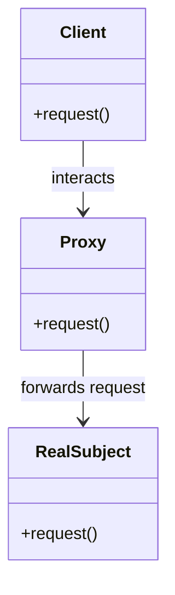

## 4.8.1 Intent and Motivation

In the realm of software design patterns, the Proxy Pattern stands out as a powerful tool for controlling access to objects. Its primary intent is to provide a surrogate or placeholder for another object to control access, reduce cost, or add additional functionality. This pattern is particularly useful in scenarios where direct access to an object might be costly or undesirable. Let's delve into the intricacies of the Proxy Pattern, exploring its intent, motivation, and various types, all while illustrating its application in JavaScript and TypeScript.

### Understanding the Proxy Pattern

The Proxy Pattern acts as an intermediary between a client and an object, controlling the interactions between them. Imagine a personal assistant managing access to a busy executive. The assistant filters requests, schedules meetings, and handles minor tasks, allowing the executive to focus on more critical responsibilities. Similarly, a proxy controls access to an object, adding a layer of abstraction that can manage, enhance, or restrict interactions.

#### Key Concepts of the Proxy Pattern

- **Surrogate or Placeholder**: The proxy serves as a stand-in for the real object, managing its interactions with clients.
- **Control Access**: Proxies can restrict or modify access to the object, ensuring that only authorized or necessary interactions occur.
- **Add Functionality**: Beyond access control, proxies can introduce additional behavior, such as logging, caching, or lazy initialization.

### Types of Proxies

The Proxy Pattern can be implemented in various forms, each serving a unique purpose. Let's explore the different types of proxies and their respective use cases.

#### 1. Virtual Proxy

A Virtual Proxy is used to manage the creation and initialization of resource-intensive objects. It acts as a placeholder, deferring the creation of the actual object until it is needed. This approach is particularly beneficial in scenarios where the cost of creating an object is high, and it may not be used immediately.

**Example Use Case**: Consider an application that displays high-resolution images. Loading all images at once can be resource-intensive and slow. A virtual proxy can be used to load and display images only when they are needed, improving performance and responsiveness.

```javascript
// Virtual Proxy Example in JavaScript

class Image {
  constructor(filename) {
    this.filename = filename;
    this.loadImage();
  }

  loadImage() {
    console.log(`Loading image from ${this.filename}`);
  }

  display() {
    console.log(`Displaying image ${this.filename}`);
  }
}

class ImageProxy {
  constructor(filename) {
    this.filename = filename;
    this.realImage = null;
  }

  display() {
    if (!this.realImage) {
      this.realImage = new Image(this.filename);
    }
    this.realImage.display();
  }
}

// Usage
const image = new ImageProxy('high_res_image.jpg');
image.display(); // Loading image from high_res_image.jpg
image.display(); // Displaying image high_res_image.jpg
```

#### 2. Remote Proxy

A Remote Proxy provides a local representative for an object that resides in a different address space, such as on a different server or network. This type of proxy handles communication between the client and the remote object, abstracting the complexities of network communication.

**Example Use Case**: In a distributed system, a remote proxy can be used to interact with services hosted on different servers, allowing clients to access remote resources as if they were local.

```typescript
// Remote Proxy Example in TypeScript

interface Service {
  request(): void;
}

class RealService implements Service {
  request(): void {
    console.log('Request handled by RealService');
  }
}

class RemoteProxy implements Service {
  private realService: RealService;

  constructor() {
    this.realService = new RealService();
  }

  request(): void {
    console.log('RemoteProxy: Forwarding request to RealService');
    this.realService.request();
  }
}

// Usage
const service: Service = new RemoteProxy();
service.request(); // RemoteProxy: Forwarding request to RealService
                   // Request handled by RealService
```

#### 3. Protective Proxy

A Protective Proxy controls access to an object based on access rights or permissions. It acts as a gatekeeper, ensuring that only authorized clients can interact with the object.

**Example Use Case**: In a system with multiple user roles, a protective proxy can restrict access to certain functionalities based on the user's permissions.

```javascript
// Protective Proxy Example in JavaScript

class Document {
  constructor(content) {
    this.content = content;
  }

  display() {
    console.log(`Document Content: ${this.content}`);
  }
}

class DocumentProxy {
  constructor(document, userRole) {
    this.document = document;
    this.userRole = userRole;
  }

  display() {
    if (this.userRole === 'admin') {
      this.document.display();
    } else {
      console.log('Access Denied: Insufficient permissions');
    }
  }
}

// Usage
const document = new Document('Confidential Document');
const adminProxy = new DocumentProxy(document, 'admin');
const userProxy = new DocumentProxy(document, 'user');

adminProxy.display(); // Document Content: Confidential Document
userProxy.display();  // Access Denied: Insufficient permissions
```

### Problems Solved by the Proxy Pattern

The Proxy Pattern addresses several common challenges in software design, making it a valuable tool for developers.

#### 1. Lazy Initialization

Lazy initialization is a technique used to defer the creation of an object until it is needed. This approach can significantly improve performance, especially for resource-intensive objects. A virtual proxy is an ideal solution for implementing lazy initialization, as it acts as a placeholder that creates the real object only when required.

#### 2. Access Control

In systems with multiple users or components, controlling access to certain objects or functionalities is crucial. A protective proxy can enforce access control policies, ensuring that only authorized clients can interact with sensitive objects.

#### 3. Cost Reduction

By managing the creation and initialization of objects, the Proxy Pattern can reduce the cost associated with resource-intensive operations. This is particularly beneficial in scenarios where objects are expensive to create or maintain.

#### 4. Network Communication

In distributed systems, communication between clients and remote objects can be complex and error-prone. A remote proxy simplifies this process by handling the intricacies of network communication, allowing clients to interact with remote objects as if they were local.

### Visualizing the Proxy Pattern

To better understand the Proxy Pattern, let's visualize its structure and interactions using a class diagram.



**Diagram Description**: In this class diagram, the `Client` interacts with the `Proxy`, which in turn forwards the request to the `RealSubject`. The proxy acts as an intermediary, controlling access and potentially adding additional functionality.

### Try It Yourself

To deepen your understanding of the Proxy Pattern, try modifying the code examples provided. Here are some suggestions:

- **Virtual Proxy**: Implement a caching mechanism in the virtual proxy to store and reuse loaded images.
- **Remote Proxy**: Simulate network latency in the remote proxy to observe its impact on client interactions.
- **Protective Proxy**: Add logging functionality to the protective proxy to track access attempts and permissions.

### References and Further Reading

For more information on the Proxy Pattern and its applications, consider exploring the following resources:

- [MDN Web Docs: Proxy](https://developer.mozilla.org/en-US/docs/Web/JavaScript/Reference/Global_Objects/Proxy)
- [Refactoring Guru: Proxy Pattern](https://refactoring.guru/design-patterns/proxy)
- [Design Patterns: Elements of Reusable Object-Oriented Software](https://en.wikipedia.org/wiki/Design_Patterns)

### Knowledge Check

To reinforce your understanding of the Proxy Pattern, consider the following questions:

- What are the primary purposes of the Proxy Pattern?
- How does a virtual proxy differ from a remote proxy?
- In what scenarios would a protective proxy be most beneficial?

### Embrace the Journey

Remember, mastering design patterns is a journey. As you continue to explore and implement the Proxy Pattern, you'll gain valuable insights into controlling object interactions and enhancing your software designs. Keep experimenting, stay curious, and enjoy the journey!

## Quiz Time!



### What is the primary intent of the Proxy Pattern?

- [x] To provide a surrogate or placeholder for another object to control access, reduce cost, or add additional functionality.
- [ ] To create a family of related or dependent objects.
- [ ] To define a one-to-many dependency between objects.
- [ ] To encapsulate a request as an object.

> **Explanation:** The Proxy Pattern provides a surrogate or placeholder for another object to control access, reduce cost, or add additional functionality.

### Which type of proxy is used to manage the creation and initialization of resource-intensive objects?

- [x] Virtual Proxy
- [ ] Remote Proxy
- [ ] Protective Proxy
- [ ] Cache Proxy

> **Explanation:** A Virtual Proxy is used to manage the creation and initialization of resource-intensive objects, deferring their creation until needed.

### What is the role of a Protective Proxy?

- [ ] To handle network communication between clients and remote objects.
- [x] To control access to an object based on access rights or permissions.
- [ ] To manage the creation of objects in a factory.
- [ ] To provide a simplified interface to a complex subsystem.

> **Explanation:** A Protective Proxy controls access to an object based on access rights or permissions, acting as a gatekeeper.

### In a distributed system, which proxy type is most suitable for interacting with remote services?

- [ ] Virtual Proxy
- [x] Remote Proxy
- [ ] Protective Proxy
- [ ] Logging Proxy

> **Explanation:** A Remote Proxy provides a local representative for an object that resides in a different address space, such as on a different server or network.

### Which problem does the Proxy Pattern address by managing the creation and initialization of objects?

- [x] Lazy Initialization
- [ ] Data Serialization
- [ ] Event Handling
- [ ] Memory Leaks

> **Explanation:** The Proxy Pattern addresses lazy initialization by managing the creation and initialization of objects, deferring their creation until needed.

### How does a Remote Proxy simplify network communication?

- [x] By handling the intricacies of network communication and allowing clients to interact with remote objects as if they were local.
- [ ] By caching network requests and responses.
- [ ] By encrypting all network traffic.
- [ ] By reducing the number of network requests.

> **Explanation:** A Remote Proxy simplifies network communication by handling the intricacies of network communication, allowing clients to interact with remote objects as if they were local.

### Which of the following is NOT a type of proxy?

- [ ] Virtual Proxy
- [ ] Remote Proxy
- [ ] Protective Proxy
- [x] Abstract Proxy

> **Explanation:** Abstract Proxy is not a recognized type of proxy. The common types include Virtual, Remote, and Protective Proxies.

### What additional functionality can a proxy introduce besides controlling access?

- [x] Logging, caching, or lazy initialization.
- [ ] Data encryption.
- [ ] User authentication.
- [ ] Database transactions.

> **Explanation:** Besides controlling access, a proxy can introduce additional functionality such as logging, caching, or lazy initialization.

### True or False: A proxy always improves the performance of a system.

- [ ] True
- [x] False

> **Explanation:** False. While a proxy can improve performance in certain scenarios, such as lazy initialization, it can also introduce overhead and complexity, potentially impacting performance.

### Which design pattern involves providing a surrogate or placeholder for another object?

- [x] Proxy Pattern
- [ ] Singleton Pattern
- [ ] Observer Pattern
- [ ] Factory Pattern

> **Explanation:** The Proxy Pattern involves providing a surrogate or placeholder for another object to control access, reduce cost, or add additional functionality.


