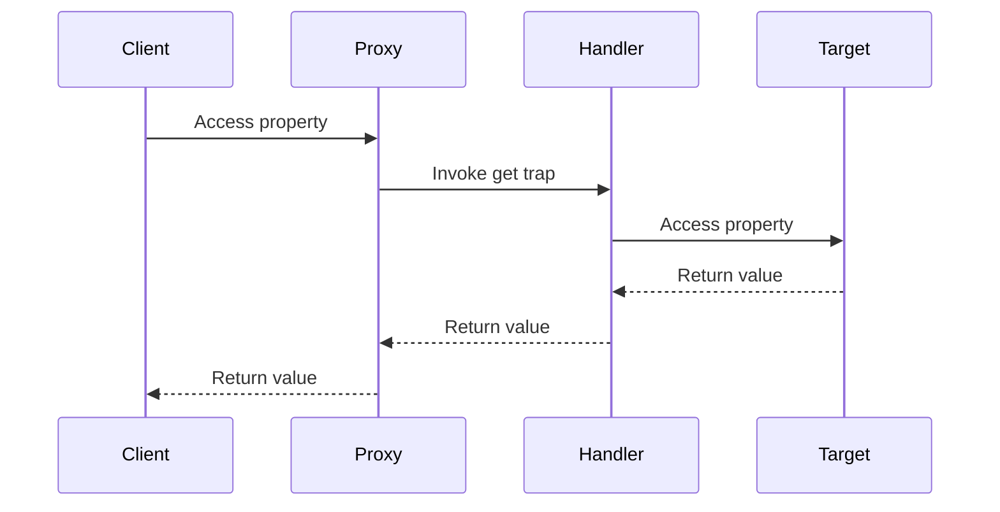

## 4.8.2 Implementation in JavaScript

In this section, we delve into the Proxy pattern, a powerful design pattern in JavaScript that allows us to control access to objects. By using the ES6 `Proxy` object, we can intercept and redefine fundamental operations for objects, such as property access, assignment, enumeration, function invocation, and more. This capability opens up a myriad of possibilities for enhancing functionality, including logging, validation, and lazy loading. Let's explore how to implement the Proxy pattern in JavaScript, understand its practical applications, and consider its limitations.

### Understanding the Proxy Pattern

The Proxy pattern involves creating a surrogate or placeholder object that controls access to another object, known as the target. In JavaScript, the `Proxy` object allows us to define custom behavior for fundamental operations on the target object through handler functions, known as traps. These traps can intercept operations such as getting or setting properties, invoking functions, and more.

### Creating a Basic Proxy

Let's start by creating a simple proxy in JavaScript. We'll use the `Proxy` constructor, which takes two arguments: the target object and a handler object. The handler object contains traps that define custom behavior for operations on the target.

```javascript
// Define a target object
const target = {
  message: "Hello, World!"
};

// Define a handler with a get trap
const handler = {
  get: function(target, property) {
    console.log(`Accessing property: ${property}`);
    return target[property];
  }
};

// Create a proxy for the target object
const proxy = new Proxy(target, handler);

// Access a property through the proxy
console.log(proxy.message); // Output: Accessing property: message
                            //         Hello, World!
```

In this example, we define a target object with a `message` property. The handler object contains a `get` trap, which intercepts property access on the proxy. When we access `proxy.message`, the `get` trap logs the property being accessed and returns the corresponding value from the target object.

### Defining Handler Functions for Traps

The `Proxy` object supports various traps that allow us to intercept different operations. Here are some commonly used traps:

- **`get(target, property, receiver)`**: Intercepts property access.
- **`set(target, property, value, receiver)`**: Intercepts property assignment.
- **`apply(target, thisArg, argumentsList)`**: Intercepts function calls.
- **`construct(target, argumentsList, newTarget)`**: Intercepts object instantiation.
- **`has(target, property)`**: Intercepts the `in` operator.
- **`deleteProperty(target, property)`**: Intercepts property deletion.

Let's explore how to use these traps to add functionality to our proxy.

#### Intercepting Property Access with `get`

The `get` trap allows us to intercept property access on the proxy. We can use this trap to implement logging, validation, or other custom behavior.

```javascript
const handler = {
  get: function(target, property) {
    if (property in target) {
      console.log(`Accessing property: ${property}`);
      return target[property];
    } else {
      console.warn(`Property ${property} does not exist.`);
      return undefined;
    }
  }
};

const proxy = new Proxy(target, handler);

console.log(proxy.message); // Output: Accessing property: message
                            //         Hello, World!
console.log(proxy.nonExistent); // Output: Property nonExistent does not exist.
                                //         undefined
```

In this example, the `get` trap checks if the requested property exists in the target object. If it does, it logs the access and returns the value. Otherwise, it logs a warning and returns `undefined`.

#### Intercepting Property Assignment with `set`

The `set` trap allows us to intercept property assignment on the proxy. We can use this trap to implement validation or enforce constraints on property values.

```javascript
const handler = {
  set: function(target, property, value) {
    if (typeof value === "string") {
      target[property] = value;
      console.log(`Property ${property} set to ${value}`);
      return true;
    } else {
      console.error(`Invalid value for property ${property}. Must be a string.`);
      return false;
    }
  }
};

const proxy = new Proxy(target, handler);

proxy.message = "Hello, Proxy!"; // Output: Property message set to Hello, Proxy!
proxy.message = 42; // Output: Invalid value for property message. Must be a string.
```

In this example, the `set` trap checks if the assigned value is a string. If it is, the trap sets the property on the target object and logs the assignment. Otherwise, it logs an error and returns `false` to indicate the assignment failed.

#### Intercepting Function Calls with `apply`

The `apply` trap allows us to intercept function calls on the proxy. We can use this trap to implement logging, modify arguments, or change the return value.

```javascript
function greet(name) {
  return `Hello, ${name}!`;
}

const handler = {
  apply: function(target, thisArg, argumentsList) {
    console.log(`Calling function with arguments: ${argumentsList}`);
    return target.apply(thisArg, argumentsList);
  }
};

const proxy = new Proxy(greet, handler);

console.log(proxy("World")); // Output: Calling function with arguments: World
                             //         Hello, World!
```

In this example, the `apply` trap logs the arguments passed to the function and then calls the original function using `target.apply`.

### Practical Applications of Proxies

Proxies offer a versatile tool for enhancing functionality in JavaScript applications. Let's explore some practical applications of proxies.

#### Logging and Monitoring

Proxies can be used to log and monitor operations on objects, providing valuable insights into application behavior.

```javascript
const handler = {
  get: function(target, property) {
    console.log(`Accessing property: ${property}`);
    return target[property];
  },
  set: function(target, property, value) {
    console.log(`Setting property ${property} to ${value}`);
    target[property] = value;
    return true;
  }
};

const proxy = new Proxy(target, handler);

proxy.message = "Hello, Logging!"; // Output: Setting property message to Hello, Logging!
console.log(proxy.message); // Output: Accessing property: message
                            //         Hello, Logging!
```

In this example, both the `get` and `set` traps log property access and assignment, providing a comprehensive view of interactions with the target object.

#### Validation and Constraints

Proxies can enforce validation and constraints on object properties, ensuring data integrity.

```javascript
const handler = {
  set: function(target, property, value) {
    if (property === "age" && (value < 0 || value > 120)) {
      console.error("Invalid age value.");
      return false;
    }
    target[property] = value;
    return true;
  }
};

const person = { name: "Alice", age: 30 };
const proxy = new Proxy(person, handler);

proxy.age = 25; // Valid assignment
proxy.age = 150; // Output: Invalid age value.
```

In this example, the `set` trap enforces a constraint on the `age` property, ensuring it falls within a valid range.

#### Lazy Loading

Proxies can implement lazy loading, deferring the initialization of expensive resources until they are needed.

```javascript
const heavyResource = {
  load: function() {
    console.log("Loading heavy resource...");
    return { data: "Resource data" };
  }
};

const handler = {
  get: function(target, property) {
    if (!target[property]) {
      target[property] = heavyResource.load();
    }
    return target[property];
  }
};

const proxy = new Proxy({}, handler);

console.log(proxy.data); // Output: Loading heavy resource...
                         //         Resource data
console.log(proxy.data); // Output: Resource data
```

In this example, the `get` trap initializes the `data` property only when it is accessed for the first time, deferring the loading of the heavy resource.

### Practical Considerations and Limitations

While proxies offer powerful capabilities, there are practical considerations and limitations to keep in mind:

- **Performance Overhead**: Proxies introduce additional overhead due to the interception of operations. Consider the performance impact when using proxies extensively.
- **Compatibility**: Proxies are not supported in older browsers. Ensure compatibility with your target environment.
- **Reflect API**: Use the `Reflect` API to perform default operations within traps, ensuring consistent behavior with native operations.
- **Non-Configurable Properties**: Proxies cannot intercept operations on non-configurable properties. Be mindful of this limitation when designing proxies.

### Visualizing Proxy Interception

To better understand how proxies intercept operations, let's visualize the interaction between the proxy, handler, and target object.



In this sequence diagram, the client accesses a property on the proxy. The proxy invokes the `get` trap in the handler, which accesses the property on the target and returns the value to the client.

### Try It Yourself

Now that we've explored the Proxy pattern in JavaScript, try experimenting with the code examples. Here are some suggestions:

- Modify the `set` trap to enforce different constraints on property values.
- Implement a proxy that logs the time taken for function calls using the `apply` trap.
- Create a proxy that caches the results of expensive computations.

### References and Further Reading

- [MDN Web Docs: Proxy](https://developer.mozilla.org/en-US/docs/Web/JavaScript/Reference/Global_Objects/Proxy)
- [MDN Web Docs: Reflect](https://developer.mozilla.org/en-US/docs/Web/JavaScript/Reference/Global_Objects/Reflect)
- [JavaScript.info: Proxy and Reflect](https://javascript.info/proxy)

### Knowledge Check

Let's reinforce our understanding of the Proxy pattern with some questions and exercises.

## Quiz Time!



### What is the primary purpose of the Proxy pattern in JavaScript?

- [x] To intercept and control operations on objects
- [ ] To create new objects from existing ones
- [ ] To manage memory usage
- [ ] To optimize performance

> **Explanation:** The Proxy pattern allows us to intercept and control operations on objects, providing custom behavior for property access, assignment, and more.

### Which trap is used to intercept property access on a proxy?

- [x] get
- [ ] set
- [ ] apply
- [ ] construct

> **Explanation:** The `get` trap is used to intercept property access on a proxy, allowing us to define custom behavior for retrieving property values.

### How can proxies be used to implement lazy loading?

- [x] By deferring resource initialization until accessed
- [ ] By preloading all resources at startup
- [ ] By caching resources in memory
- [ ] By using asynchronous operations

> **Explanation:** Proxies can implement lazy loading by deferring the initialization of expensive resources until they are accessed for the first time.

### What is a limitation of proxies in JavaScript?

- [x] They cannot intercept operations on non-configurable properties
- [ ] They cannot be used with functions
- [ ] They are not supported in modern browsers
- [ ] They cannot be used with objects

> **Explanation:** Proxies cannot intercept operations on non-configurable properties, which is a limitation to consider when designing proxies.

### Which API can be used to perform default operations within traps?

- [x] Reflect
- [ ] Proxy
- [ ] Object
- [ ] Function

> **Explanation:** The `Reflect` API can be used to perform default operations within traps, ensuring consistent behavior with native operations.

### What is the role of the handler object in a proxy?

- [x] To define traps that intercept operations
- [ ] To store the target object
- [ ] To manage memory usage
- [ ] To optimize performance

> **Explanation:** The handler object defines traps that intercept operations on the proxy, allowing us to customize behavior for property access, assignment, and more.

### How can proxies be used for logging and monitoring?

- [x] By intercepting operations and logging details
- [ ] By creating new log files
- [ ] By optimizing performance
- [ ] By managing memory usage

> **Explanation:** Proxies can intercept operations and log details, providing valuable insights into application behavior for logging and monitoring purposes.

### Which trap is used to intercept function calls on a proxy?

- [x] apply
- [ ] get
- [ ] set
- [ ] construct

> **Explanation:** The `apply` trap is used to intercept function calls on a proxy, allowing us to define custom behavior for function invocation.

### What is a practical consideration when using proxies extensively?

- [x] Performance overhead
- [ ] Lack of functionality
- [ ] Incompatibility with objects
- [ ] Limited browser support

> **Explanation:** Proxies introduce additional overhead due to the interception of operations, so it's important to consider the performance impact when using them extensively.

### Proxies can be used to enforce validation and constraints on object properties.

- [x] True
- [ ] False

> **Explanation:** Proxies can enforce validation and constraints on object properties by intercepting property assignments and applying custom logic.



Remember, this is just the beginning. As you progress, you'll discover more advanced applications of the Proxy pattern and other design patterns in JavaScript. Keep experimenting, stay curious, and enjoy the journey!
