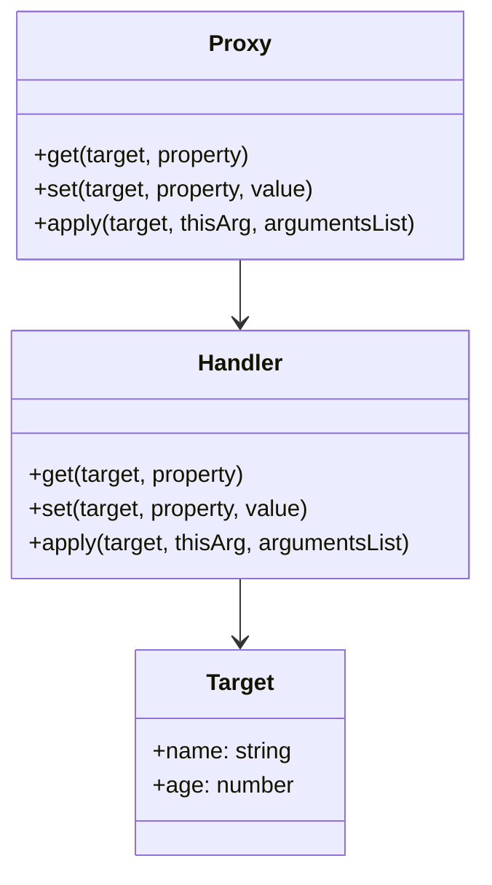

## 4.8.3 Implementation in TypeScript

The Proxy Pattern is a structural design pattern that provides an object representing another object. It acts as an intermediary, controlling access to the target object. In TypeScript, the Proxy Pattern can be implemented with additional type safety, leveraging TypeScript's type system to catch errors at compile time. This section will guide you through implementing the Proxy Pattern in TypeScript, focusing on type enforcement, method calls, and property accesses.

### Understanding the Proxy Pattern

The Proxy Pattern is useful in various scenarios, such as:

- **Lazy Initialization**: Deferring the creation of expensive objects until they are needed.
- **Access Control**: Restricting access to certain properties or methods.
- **Logging**: Keeping track of operations performed on an object.
- **Caching**: Storing results of expensive operations to avoid redundant calculations.

### TypeScript's Proxy and Type Enforcement

TypeScript provides a built-in `Proxy` object that allows you to define custom behavior for fundamental operations (e.g., property lookup, assignment, enumeration, function invocation, etc.). By defining types for proxy handlers and target objects, we can enforce type checks and ensure that our proxies behave as expected.

#### Defining Types for Proxy Handlers and Target Objects

In TypeScript, you can define types for both the target object and the proxy handler. This ensures that the operations performed on the proxy are type-safe.

```typescript
interface User {
  name: string;
  age: number;
}

const user: User = {
  name: "Alice",
  age: 30,
};

const handler: ProxyHandler<User> = {
  get(target, property) {
    if (property in target) {
      return target[property as keyof User];
    } else {
      throw new Error(`Property ${String(property)} does not exist.`);
    }
  },
};

const proxyUser = new Proxy(user, handler);

console.log(proxyUser.name); // Output: Alice
console.log(proxyUser.age);  // Output: 30
```

In this example, we define a `User` interface and a `ProxyHandler` for the `User` type. The `get` trap checks if the property exists on the target object, ensuring type safety.

### Handling Method Calls and Property Accesses

The Proxy Pattern allows you to intercept and redefine operations on objects. You can handle method calls and property accesses using traps such as `get`, `set`, and `apply`.

#### Handling Property Accesses

The `get` and `set` traps allow you to intercept property accesses and assignments.

```typescript
const handlerWithLogging: ProxyHandler<User> = {
  get(target, property) {
    console.log(`Getting ${String(property)}`);
    return target[property as keyof User];
  },
  set(target, property, value) {
    console.log(`Setting ${String(property)} to ${value}`);
    target[property as keyof User] = value;
    return true;
  },
};

const proxyUserWithLogging = new Proxy(user, handlerWithLogging);

proxyUserWithLogging.name = "Bob"; // Logs: Setting name to Bob
console.log(proxyUserWithLogging.name); // Logs: Getting name, Output: Bob
```

Here, we extend the previous example by adding logging functionality to the `get` and `set` traps. This allows us to track property accesses and assignments.

#### Handling Method Calls

The `apply` trap is used to intercept function calls.

```typescript
type GreetFunction = (greeting: string) => string;

const greet: GreetFunction = (greeting) => `${greeting}, ${user.name}`;

const handlerForFunction: ProxyHandler<GreetFunction> = {
  apply(target, thisArg, argumentsList) {
    console.log(`Calling function with arguments: ${argumentsList}`);
    return target.apply(thisArg, argumentsList);
  },
};

const proxyGreet = new Proxy(greet, handlerForFunction);

console.log(proxyGreet("Hello")); // Logs: Calling function with arguments: Hello, Output: Hello, Bob
```

In this example, we define a `GreetFunction` type and a proxy for it. The `apply` trap logs the arguments passed to the function and then calls the original function.

### Benefits of Using TypeScript with the Proxy Pattern

Using TypeScript to implement the Proxy Pattern offers several benefits:

- **Type Safety**: TypeScript's type system helps catch errors at compile time, reducing runtime errors.
- **IntelliSense Support**: With defined types, you get better IntelliSense support in IDEs, making development more efficient.
- **Code Readability**: Explicit types make the code more readable and easier to understand.

### Complexities Introduced by TypeScript's Type System

While TypeScript provides many benefits, it also introduces some complexities:

- **Type Inference**: TypeScript's type inference may not always work as expected, requiring explicit type annotations.
- **Union Types**: Handling union types in proxies can be challenging, as you need to account for all possible types.
- **Generic Types**: Using generics with proxies can add complexity, especially when dealing with complex type hierarchies.

### Visualizing the Proxy Pattern in TypeScript

To better understand how the Proxy Pattern works in TypeScript, let's visualize the interactions between the proxy, handler, and target object.



This diagram illustrates the relationship between the proxy, handler, and target object. The proxy delegates operations to the handler, which then interacts with the target object.

### Try It Yourself

To gain a deeper understanding of the Proxy Pattern in TypeScript, try modifying the code examples:

1. **Add Validation**: Modify the `set` trap to validate the age property, ensuring it is a positive number.
2. **Extend Functionality**: Add a new method to the `User` interface and handle it in the proxy.
3. **Experiment with Generics**: Create a generic proxy handler that can work with different types of objects.

### References and Further Reading

- [MDN Web Docs: Proxy](https://developer.mozilla.org/en-US/docs/Web/JavaScript/Reference/Global_Objects/Proxy)
- [TypeScript Handbook: Generics](https://www.typescriptlang.org/docs/handbook/2/generics.html)
- [TypeScript Handbook: Interfaces](https://www.typescriptlang.org/docs/handbook/interfaces.html)

### Knowledge Check

- What are some use cases for the Proxy Pattern?
- How does TypeScript's type system enhance the Proxy Pattern?
- What are the main traps used in the Proxy Pattern?
- How can you handle method calls in a proxy?
- What are some complexities introduced by TypeScript's type system?

### Embrace the Journey

Remember, mastering the Proxy Pattern in TypeScript is just one step in your journey as a developer. Keep experimenting, stay curious, and enjoy the process of learning and growing. The skills you develop here will serve you well in building robust, scalable applications.

## Quiz Time!



### What is the primary purpose of the Proxy Pattern?

- [x] To provide an object representing another object.
- [ ] To create a new instance of an object.
- [ ] To enforce strict typing in TypeScript.
- [ ] To manage memory usage in applications.

> **Explanation:** The Proxy Pattern provides an object that acts as an intermediary for another object, controlling access to it.

### Which TypeScript feature helps catch errors at compile time when using the Proxy Pattern?

- [x] Type system
- [ ] Generics
- [ ] Interfaces
- [ ] Modules

> **Explanation:** TypeScript's type system helps catch errors at compile time, ensuring type safety when using proxies.

### Which trap is used to intercept function calls in a proxy?

- [ ] get
- [ ] set
- [x] apply
- [ ] construct

> **Explanation:** The `apply` trap is used to intercept function calls in a proxy.

### What is a benefit of using TypeScript with the Proxy Pattern?

- [x] Type safety
- [ ] Faster execution
- [ ] Reduced memory usage
- [ ] Simplified syntax

> **Explanation:** TypeScript provides type safety, which helps catch errors at compile time and improves code readability.

### What is a complexity introduced by TypeScript's type system when using proxies?

- [x] Handling union types
- [ ] Increased runtime errors
- [ ] Lack of IntelliSense support
- [ ] Reduced code readability

> **Explanation:** Handling union types in proxies can be challenging, as you need to account for all possible types.

### Which trap is used to intercept property accesses in a proxy?

- [x] get
- [ ] set
- [ ] apply
- [ ] construct

> **Explanation:** The `get` trap is used to intercept property accesses in a proxy.

### How can you handle property assignments in a proxy?

- [ ] Using the get trap
- [x] Using the set trap
- [ ] Using the apply trap
- [ ] Using the construct trap

> **Explanation:** The `set` trap is used to intercept property assignments in a proxy.

### What is a use case for the Proxy Pattern?

- [x] Lazy initialization
- [ ] Object cloning
- [ ] Memory management
- [ ] Data serialization

> **Explanation:** The Proxy Pattern can be used for lazy initialization, deferring the creation of expensive objects until needed.

### What is the relationship between a proxy, handler, and target object?

- [x] The proxy delegates operations to the handler, which interacts with the target object.
- [ ] The handler creates the proxy and target object.
- [ ] The target object manages the proxy and handler.
- [ ] The proxy and handler are independent of the target object.

> **Explanation:** The proxy delegates operations to the handler, which then interacts with the target object.

### True or False: TypeScript's type system can help reduce runtime errors when using proxies.

- [x] True
- [ ] False

> **Explanation:** TypeScript's type system helps catch errors at compile time, reducing the likelihood of runtime errors.


