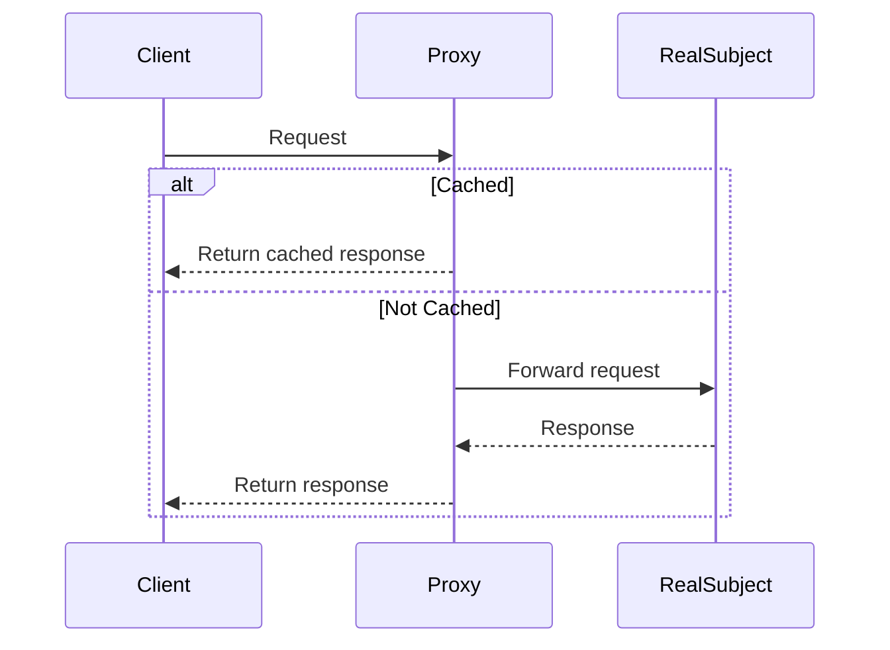

## 4.8.4 Use Cases and Examples

The Proxy Pattern is a structural design pattern that provides a surrogate or placeholder for another object to control access to it. This pattern is particularly useful in scenarios where direct access to an object is either undesirable or impossible. By using a proxy, we can introduce additional functionality to an object without changing its code. In this section, we'll explore various real-world applications of the Proxy Pattern in JavaScript and TypeScript, such as lazy loading resources, access control, and remote services. We'll also provide code snippets to illustrate these concepts and discuss the advantages in terms of security, performance, and resource management.

### Lazy Loading Resources

Lazy loading is a design pattern commonly used in programming to defer initialization of an object until the point at which it is needed. This can significantly improve performance and resource management, especially in applications that deal with large amounts of data or complex computations.

#### Example: Lazy Loading Images

In web development, lazy loading images can improve page load times by only loading images as they are needed. Let's see how the Proxy Pattern can be used to implement lazy loading for images in JavaScript.

```javascript
class Image {
  constructor(filename) {
    this.filename = filename;
    console.log(`Loading image from ${filename}`);
  }

  display() {
    console.log(`Displaying ${this.filename}`);
  }
}

class ProxyImage {
  constructor(filename) {
    this.filename = filename;
    this.realImage = null;
  }

  display() {
    if (this.realImage === null) {
      this.realImage = new Image(this.filename);
    }
    this.realImage.display();
  }
}

// Usage
const image = new ProxyImage('photo.jpg');
image.display(); // Loads and displays the image
image.display(); // Displays the image without loading it again
```

In this example, the `ProxyImage` class acts as a proxy for the `Image` class. The image is only loaded when the `display` method is called for the first time, which demonstrates the lazy loading concept.

#### Advantages of Lazy Loading

- **Performance**: Reduces initial load time by deferring the loading of resources.
- **Resource Management**: Minimizes memory usage by loading resources only when necessary.

### Access Control

Access control is another common use case for the Proxy Pattern. By using a proxy, we can control access to an object, ensuring that only authorized users can perform certain actions.

#### Example: Access Control in a Banking System

Consider a banking system where only authorized personnel can access certain account details. We can use a proxy to enforce access control.

```typescript
interface BankAccount {
  getBalance(): number;
  deposit(amount: number): void;
  withdraw(amount: number): void;
}

class RealBankAccount implements BankAccount {
  private balance: number;

  constructor(initialBalance: number) {
    this.balance = initialBalance;
  }

  getBalance(): number {
    return this.balance;
  }

  deposit(amount: number): void {
    this.balance += amount;
  }

  withdraw(amount: number): void {
    if (amount <= this.balance) {
      this.balance -= amount;
    } else {
      console.log('Insufficient funds');
    }
  }
}

class BankAccountProxy implements BankAccount {
  private realBankAccount: RealBankAccount;
  private isAuthorized: boolean;

  constructor(initialBalance: number, isAuthorized: boolean) {
    this.realBankAccount = new RealBankAccount(initialBalance);
    this.isAuthorized = isAuthorized;
  }

  getBalance(): number {
    if (this.isAuthorized) {
      return this.realBankAccount.getBalance();
    } else {
      throw new Error('Unauthorized access');
    }
  }

  deposit(amount: number): void {
    if (this.isAuthorized) {
      this.realBankAccount.deposit(amount);
    } else {
      throw new Error('Unauthorized access');
    }
  }

  withdraw(amount: number): void {
    if (this.isAuthorized) {
      this.realBankAccount.withdraw(amount);
    } else {
      throw new Error('Unauthorized access');
    }
  }
}

// Usage
const accountProxy = new BankAccountProxy(1000, false);
try {
  console.log(accountProxy.getBalance());
} catch (error) {
  console.error(error.message); // Unauthorized access
}
```

In this example, the `BankAccountProxy` class checks if the user is authorized before allowing access to the `RealBankAccount` methods.

#### Advantages of Access Control

- **Security**: Ensures that only authorized users can access sensitive data.
- **Encapsulation**: Hides the complexity of access control from the client.

### Remote Services

The Proxy Pattern can also be used to represent remote services. This is particularly useful in distributed systems where objects are located on different servers.

#### Example: Remote Service Proxy

Let's consider a scenario where we need to interact with a remote weather service. We can use a proxy to handle the communication with the remote server.

```typescript
interface WeatherService {
  getWeather(city: string): Promise<string>;
}

class RealWeatherService implements WeatherService {
  async getWeather(city: string): Promise<string> {
    // Simulate a network request
    return new Promise((resolve) => {
      setTimeout(() => {
        resolve(`Weather in ${city}: Sunny`);
      }, 2000);
    });
  }
}

class WeatherServiceProxy implements WeatherService {
  private realWeatherService: RealWeatherService;
  private cache: Map<string, string>;

  constructor() {
    this.realWeatherService = new RealWeatherService();
    this.cache = new Map();
  }

  async getWeather(city: string): Promise<string> {
    if (this.cache.has(city)) {
      return Promise.resolve(this.cache.get(city)!);
    }
    const weather = await this.realWeatherService.getWeather(city);
    this.cache.set(city, weather);
    return weather;
  }
}

// Usage
const weatherService = new WeatherServiceProxy();
weatherService.getWeather('New York').then(console.log); // Fetches from remote
weatherService.getWeather('New York').then(console.log); // Fetches from cache
```

In this example, the `WeatherServiceProxy` caches the weather data to avoid unnecessary network requests.

#### Advantages of Remote Service Proxy

- **Performance**: Reduces network latency by caching responses.
- **Reliability**: Provides a fallback mechanism in case of network failures.

### Combining Proxy with Other Patterns

The Proxy Pattern can be combined with other design patterns to enhance functionality. For example, it can be used with the Decorator Pattern to add additional behavior to objects dynamically.

#### Example: Proxy and Decorator

Consider a scenario where we want to log every access to a bank account. We can use a proxy to log the access and a decorator to add additional behavior.

```typescript
interface Account {
  getBalance(): number;
}

class RealAccount implements Account {
  private balance: number;

  constructor(balance: number) {
    this.balance = balance;
  }

  getBalance(): number {
    return this.balance;
  }
}

class AccountProxy implements Account {
  private realAccount: RealAccount;

  constructor(realAccount: RealAccount) {
    this.realAccount = realAccount;
  }

  getBalance(): number {
    console.log('Accessing account balance');
    return this.realAccount.getBalance();
  }
}

class AccountDecorator implements Account {
  protected account: Account;

  constructor(account: Account) {
    this.account = account;
  }

  getBalance(): number {
    return this.account.getBalance();
  }
}

class LoggingAccountDecorator extends AccountDecorator {
  getBalance(): number {
    console.log('Logging access to account balance');
    return super.getBalance();
  }
}

// Usage
const realAccount = new RealAccount(1000);
const proxy = new AccountProxy(realAccount);
const loggingDecorator = new LoggingAccountDecorator(proxy);

console.log(loggingDecorator.getBalance());
```

In this example, the `AccountProxy` logs access to the account balance, and the `LoggingAccountDecorator` adds additional logging behavior.

### Common Pitfalls and Best Practices

While the Proxy Pattern offers many advantages, there are some common pitfalls to be aware of:

- **Overhead**: Introducing a proxy can add overhead, especially if the proxy is not optimized.
- **Complexity**: Proxies can make the system more complex, especially if used excessively.
- **Latency**: In remote service proxies, network latency can be an issue.

#### Best Practices

- **Use Caching**: Implement caching in proxies to improve performance.
- **Limit Usage**: Use proxies only when necessary to avoid unnecessary complexity.
- **Combine Patterns**: Combine the Proxy Pattern with other patterns to enhance functionality.

### Visualizing the Proxy Pattern

To better understand how the Proxy Pattern works, let's visualize the interaction between the client, proxy, and real subject.



This sequence diagram illustrates how the Proxy Pattern handles requests by either returning a cached response or forwarding the request to the real subject.

### Try It Yourself

Experiment with the code examples provided in this section. Try modifying the `ProxyImage` example to load different types of media, such as videos or audio files. Implement additional access control checks in the `BankAccountProxy` example. Explore how caching can be optimized in the `WeatherServiceProxy` example by setting expiration times for cached data.

### References and Links

- [MDN Web Docs: Proxy](https://developer.mozilla.org/en-US/docs/Web/JavaScript/Reference/Global_Objects/Proxy)
- [Design Patterns: Elements of Reusable Object-Oriented Software](https://en.wikipedia.org/wiki/Design_Patterns)
- [W3Schools: JavaScript Proxy](https://www.w3schools.com/js/js_object_proxies.asp)

### Knowledge Check

As you explore the Proxy Pattern, consider the following questions:

- How does the Proxy Pattern improve performance in lazy loading scenarios?
- What are the security benefits of using a proxy for access control?
- How can caching be implemented in a remote service proxy?
- What are the potential drawbacks of using the Proxy Pattern?

### Embrace the Journey

Remember, mastering design patterns is a journey. The Proxy Pattern is just one of many patterns that can help you write more maintainable and scalable code. Keep experimenting, stay curious, and enjoy the journey!

## Quiz Time!



### What is a primary benefit of using the Proxy Pattern for lazy loading?

- [x] It defers resource loading until necessary, improving performance.
- [ ] It simplifies code by removing the need for conditional checks.
- [ ] It increases security by hiding implementation details.
- [ ] It allows for dynamic method invocation.

> **Explanation:** Lazy loading defers the loading of resources until they are needed, which can significantly improve performance by reducing initial load times.

### How does the Proxy Pattern enhance security in access control scenarios?

- [x] By restricting access to sensitive operations based on authorization.
- [ ] By encrypting data before sending it to the client.
- [ ] By logging all operations performed on the object.
- [ ] By providing a simplified interface to the client.

> **Explanation:** The Proxy Pattern can enforce access control by checking user authorization before allowing access to sensitive operations, thus enhancing security.

### In the context of remote services, what advantage does a proxy provide?

- [x] It can cache responses to reduce network latency.
- [ ] It can encrypt data to ensure secure transmission.
- [ ] It can automatically retry failed requests.
- [ ] It can dynamically change the service endpoint.

> **Explanation:** A proxy can cache responses from remote services, reducing the need for repeated network requests and thus decreasing latency.

### What is a potential drawback of using the Proxy Pattern?

- [x] It can introduce additional complexity and overhead.
- [ ] It always requires network access to function.
- [ ] It limits the flexibility of the underlying object.
- [ ] It prevents the use of other design patterns.

> **Explanation:** While the Proxy Pattern offers many benefits, it can also introduce additional complexity and overhead, which should be considered when deciding to use it.

### How can the Proxy Pattern be combined with the Decorator Pattern?

- [x] By using a proxy to log access and a decorator to add behavior.
- [ ] By using a proxy to encrypt data and a decorator to decrypt it.
- [ ] By using a proxy to cache data and a decorator to invalidate it.
- [ ] By using a proxy to authenticate users and a decorator to authorize them.

> **Explanation:** The Proxy Pattern can be used to log access to an object, while the Decorator Pattern can add additional behavior, such as logging, to the object.

### What is a common use case for the Proxy Pattern in web development?

- [x] Lazy loading of images and other resources.
- [ ] Encrypting data before transmission.
- [ ] Implementing complex algorithms.
- [ ] Managing user sessions.

> **Explanation:** In web development, the Proxy Pattern is commonly used for lazy loading images and other resources to improve performance.

### What is the role of a proxy in a distributed system?

- [x] To represent remote objects and manage communication.
- [ ] To encrypt data before transmission.
- [ ] To handle user authentication and authorization.
- [ ] To provide a user-friendly interface.

> **Explanation:** In distributed systems, a proxy can represent remote objects and manage communication between clients and these objects.

### How does caching in a proxy improve performance?

- [x] By reducing the need for repeated network requests.
- [ ] By compressing data before sending it to the client.
- [ ] By encrypting data to ensure secure transmission.
- [ ] By dynamically changing the service endpoint.

> **Explanation:** Caching in a proxy reduces the need for repeated network requests by storing responses, which improves performance by decreasing latency.

### What is a best practice when implementing the Proxy Pattern?

- [x] Use caching to improve performance.
- [ ] Always encrypt data before transmission.
- [ ] Avoid using other design patterns with proxies.
- [ ] Use proxies only for user authentication.

> **Explanation:** A best practice when implementing the Proxy Pattern is to use caching to improve performance by reducing the need for repeated operations.

### True or False: The Proxy Pattern can only be used for access control.

- [ ] True
- [x] False

> **Explanation:** False. The Proxy Pattern can be used for various purposes, including lazy loading, access control, and representing remote services.


