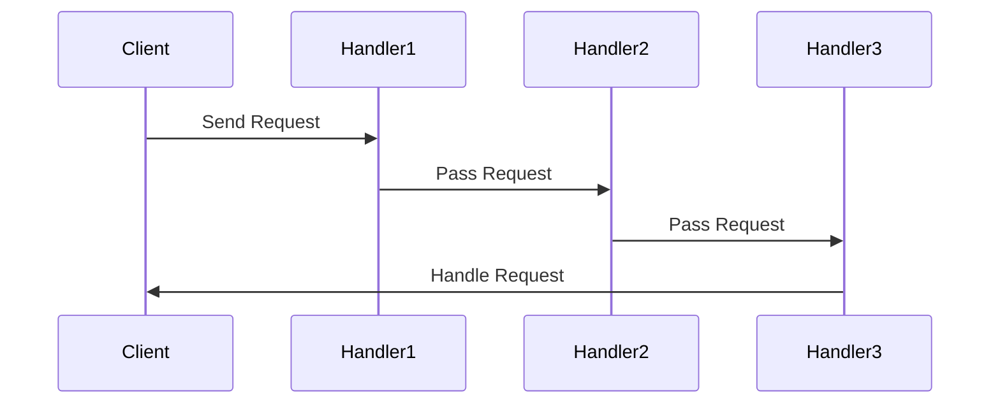

## 5.1 Overview of Behavioral Patterns

In the realm of software design, behavioral design patterns play a pivotal role in defining how objects interact and communicate with each other. These patterns focus on the responsibilities of objects and how they collaborate to achieve complex tasks. In this section, we will explore the essence of behavioral patterns, their significance in object-oriented design, and provide a brief overview of the key patterns that will be covered in detail in subsequent sections.

### Understanding Behavioral Design Patterns

Behavioral design patterns are concerned with algorithms and the assignment of responsibilities between objects. They help in defining how objects communicate and interact, ensuring that the system is both flexible and maintainable. These patterns encapsulate behavior in a way that allows for dynamic changes, making it easier to extend and modify the system without affecting other parts.

Behavioral patterns are crucial in scenarios where the interaction between objects is complex and needs to be managed efficiently. They provide a way to decouple the sender of a request from its receiver, allowing for more flexible and reusable code. By focusing on the communication between objects, these patterns help in distributing responsibilities and managing dependencies effectively.

### The Role of Behavioral Patterns in Object-Oriented Design

In object-oriented design, behavioral patterns are instrumental in achieving a clean separation of concerns. They enable developers to define clear interfaces for interaction, allowing objects to communicate without being tightly coupled. This separation is vital for creating systems that are easy to understand, modify, and extend.

Behavioral patterns also facilitate the implementation of complex algorithms by breaking them down into smaller, manageable components. This modular approach not only enhances code readability but also makes it easier to test and debug individual components.

### Key Behavioral Patterns

Let's take a brief look at the behavioral patterns that will be covered in detail in this guide:

1. **Chain of Responsibility Pattern**: This pattern allows a request to be passed along a chain of handlers. Each handler decides whether to process the request or pass it to the next handler in the chain. This pattern is useful for scenarios where multiple objects can handle a request, but the specific handler is determined at runtime.

2. **Command Pattern**: The command pattern encapsulates a request as an object, allowing for parameterization of clients with queues, requests, and operations. This pattern is particularly useful for implementing undo/redo functionality and for decoupling the sender of a request from its receiver.

3. **Iterator Pattern**: This pattern provides a way to access the elements of an aggregate object sequentially without exposing its underlying representation. It is commonly used in collections and data structures to provide a standard way to traverse elements.

4. **Mediator Pattern**: The mediator pattern reduces the complexity of communication between multiple objects by introducing a mediator object. This pattern is useful for scenarios where objects interact in complex ways, and direct communication would lead to tight coupling.

5. **Memento Pattern**: The memento pattern captures and externalizes an object's internal state, allowing it to be restored later without violating encapsulation. This pattern is commonly used in scenarios where undo functionality is required.

6. **Observer Pattern**: The observer pattern defines a one-to-many dependency between objects, allowing multiple observers to be notified of changes in a subject. This pattern is widely used in event handling and reactive programming.

7. **State Pattern**: The state pattern allows an object to alter its behavior when its internal state changes. This pattern is useful for implementing state machines and managing state transitions in a clean and organized manner.

8. **Strategy Pattern**: The strategy pattern defines a family of algorithms, encapsulates each one, and makes them interchangeable. This pattern is useful for scenarios where multiple algorithms can be applied to a problem, and the choice of algorithm is determined at runtime.

9. **Template Method Pattern**: The template method pattern defines the skeleton of an algorithm in a method, deferring some steps to subclasses. This pattern is useful for scenarios where a common algorithm structure is shared among multiple implementations.

10. **Visitor Pattern**: The visitor pattern represents an operation to be performed on elements of an object structure. This pattern is useful for scenarios where new operations need to be added to a class hierarchy without modifying the classes.

### Importance of Behavioral Patterns in JavaScript and TypeScript

Behavioral patterns are essential for writing flexible and maintainable JavaScript and TypeScript code. They provide a structured approach to managing complex interactions between objects, making it easier to extend and modify the system. By encapsulating behavior and defining clear interfaces for interaction, these patterns help in reducing dependencies and improving code readability.

In JavaScript and TypeScript, behavioral patterns are particularly useful for managing asynchronous operations, event handling, and state management. They provide a way to organize code in a way that is both efficient and easy to understand, making it easier to build scalable and robust applications.

### Visualizing Behavioral Patterns

To better understand the role of behavioral patterns, let's visualize the interaction between objects using a sequence diagram. This diagram illustrates how objects communicate and collaborate to achieve a common goal.

**Diagram Description**: This sequence diagram represents the Chain of Responsibility pattern, where a request is passed along a chain of handlers until it is processed. Each handler decides whether to handle the request or pass it to the next handler in the chain.

### Conclusion

Behavioral design patterns are a fundamental aspect of object-oriented design, providing a structured approach to managing interactions between objects. By encapsulating behavior and defining clear interfaces for communication, these patterns help in creating flexible and maintainable systems. In JavaScript and TypeScript, behavioral patterns are essential for managing complex interactions, asynchronous operations, and state management, making them a valuable tool for developers.

As we delve deeper into each pattern in the following sections, we will explore their implementation in JavaScript and TypeScript, providing practical examples and use cases to illustrate their significance in software design. Remember, mastering these patterns is a journey, and each step you take will bring you closer to writing more efficient and maintainable code. Keep experimenting, stay curious, and enjoy the journey!

## Quiz Time!



### What is the primary focus of behavioral design patterns?

- [x] Communication between objects
- [ ] Object creation mechanisms
- [ ] Structural relationships
- [ ] Data storage

> **Explanation:** Behavioral design patterns focus on communication and interaction between objects, managing algorithms, and distributing responsibilities.

### Which pattern encapsulates a request as an object?

- [ ] Observer Pattern
- [x] Command Pattern
- [ ] State Pattern
- [ ] Strategy Pattern

> **Explanation:** The Command Pattern encapsulates a request as an object, allowing for parameterization of clients with queues, requests, and operations.

### What does the Iterator Pattern provide?

- [ ] A way to alter an object's behavior
- [x] A way to access elements sequentially
- [ ] A way to capture an object's state
- [ ] A way to notify observers of changes

> **Explanation:** The Iterator Pattern provides a way to access the elements of an aggregate object sequentially without exposing its underlying representation.

### Which pattern introduces a mediator object to reduce complexity?

- [ ] Chain of Responsibility Pattern
- [ ] Memento Pattern
- [x] Mediator Pattern
- [ ] Visitor Pattern

> **Explanation:** The Mediator Pattern reduces the complexity of communication between multiple objects by introducing a mediator object.

### What is the purpose of the Memento Pattern?

- [ ] To define a family of algorithms
- [ ] To provide a simplified interface
- [x] To capture and restore an object's state
- [ ] To decouple an abstraction from its implementation

> **Explanation:** The Memento Pattern captures and externalizes an object's internal state, allowing it to be restored later without violating encapsulation.

### How does the Observer Pattern define dependencies?

- [x] One-to-many dependency
- [ ] One-to-one dependency
- [ ] Many-to-one dependency
- [ ] Many-to-many dependency

> **Explanation:** The Observer Pattern defines a one-to-many dependency between objects, allowing multiple observers to be notified of changes in a subject.

### Which pattern allows an object to alter its behavior based on its state?

- [ ] Template Method Pattern
- [ ] Visitor Pattern
- [ ] Command Pattern
- [x] State Pattern

> **Explanation:** The State Pattern allows an object to alter its behavior when its internal state changes.

### What does the Strategy Pattern define?

- [ ] A way to traverse elements
- [ ] A way to capture an object's state
- [x] A family of algorithms
- [ ] A way to notify observers

> **Explanation:** The Strategy Pattern defines a family of algorithms, encapsulates each one, and makes them interchangeable.

### Which pattern defines the skeleton of an algorithm?

- [ ] State Pattern
- [ ] Observer Pattern
- [x] Template Method Pattern
- [ ] Command Pattern

> **Explanation:** The Template Method Pattern defines the skeleton of an algorithm in a method, deferring some steps to subclasses.

### True or False: The Visitor Pattern allows new operations to be added to a class hierarchy without modifying the classes.

- [x] True
- [ ] False

> **Explanation:** The Visitor Pattern represents an operation to be performed on elements of an object structure, allowing new operations to be added without modifying the classes.


