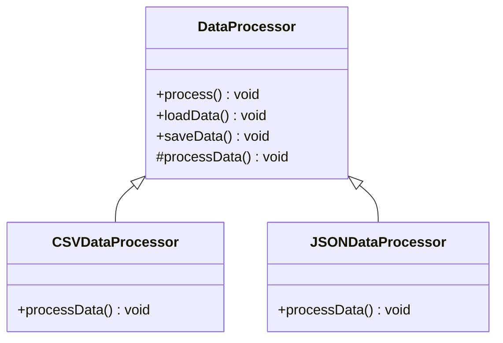

## 5.10.1 Intent and Motivation

In the world of software development, the Template Method Pattern stands as a beacon of structured flexibility. It elegantly balances the need for a consistent algorithmic framework with the desire for customizable implementation details. This pattern is particularly useful when you have multiple algorithms that share a common structure but differ in certain steps. By defining the skeleton of an algorithm in a base class and allowing subclasses to override specific steps, the Template Method Pattern promotes code reuse and flexibility.

### Understanding the Template Method Pattern

The Template Method Pattern is a behavioral design pattern that defines the program's skeleton in a base class, allowing subclasses to redefine certain steps of the algorithm without changing its overall structure. Imagine it as a recipe where the sequence of steps is fixed, but some ingredients or techniques can vary based on the chef's preference. This analogy helps us understand how the pattern works: the recipe (algorithm) remains the same, but the specific ingredients (steps) can be customized.

#### Key Concepts

- **Algorithm Skeleton**: The fixed sequence of steps that define the overall process.
- **Hook Methods**: The customizable parts of the algorithm that subclasses can override.
- **Concrete Methods**: The non-overridable parts of the algorithm that provide a consistent framework.

### The Problem: Code Duplication in Similar Algorithms

In software development, it's common to encounter algorithms that share a similar structure but differ in specific details. Without a structured approach, this can lead to code duplication, where similar code is repeated across multiple classes or methods. This not only increases the maintenance burden but also makes the codebase more error-prone, as changes need to be replicated across all instances.

Consider a scenario where you're developing a series of data processing algorithms. Each algorithm follows the same basic steps: load data, process data, and save results. However, the specifics of data processing can vary significantly. Without the Template Method Pattern, you might end up duplicating the load and save logic in each algorithm, leading to redundancy and potential inconsistencies.

### The Solution: Template Method Pattern

The Template Method Pattern addresses this problem by encapsulating the common algorithm structure in a base class and allowing subclasses to implement the variable parts. This approach not only reduces code duplication but also enhances flexibility, as new variations of the algorithm can be introduced by simply creating new subclasses.

#### Benefits of the Template Method Pattern

1. **Code Reuse**: By centralizing the common algorithm structure in a base class, the Template Method Pattern promotes code reuse and reduces duplication.

2. **Flexibility**: Subclasses can customize specific steps of the algorithm without affecting the overall structure, allowing for easy extension and modification.

3. **Consistency**: The fixed algorithm skeleton ensures that all variations follow the same basic process, enhancing consistency across the codebase.

4. **Maintainability**: Changes to the common algorithm structure can be made in one place, reducing the risk of errors and simplifying maintenance.

### Implementing the Template Method Pattern

Let's explore how the Template Method Pattern can be implemented in JavaScript and TypeScript, using a practical example to illustrate its application.

#### JavaScript Implementation

```javascript
// Abstract class defining the template method
class DataProcessor {
  // Template method defining the skeleton of the algorithm
  process() {
    this.loadData();
    this.processData();
    this.saveData();
  }

  // Concrete method with a fixed implementation
  loadData() {
    console.log('Loading data...');
  }

  // Hook method to be overridden by subclasses
  processData() {
    throw new Error('processData() must be implemented by subclass');
  }

  // Concrete method with a fixed implementation
  saveData() {
    console.log('Saving data...');
  }
}

// Subclass implementing the hook method
class CSVDataProcessor extends DataProcessor {
  processData() {
    console.log('Processing CSV data...');
  }
}

// Subclass implementing the hook method
class JSONDataProcessor extends DataProcessor {
  processData() {
    console.log('Processing JSON data...');
  }
}

// Usage
const csvProcessor = new CSVDataProcessor();
csvProcessor.process();

const jsonProcessor = new JSONDataProcessor();
jsonProcessor.process();
```

In this example, the `DataProcessor` class defines the template method `process`, which outlines the steps of the algorithm. The `processData` method is a hook method that subclasses `CSVDataProcessor` and `JSONDataProcessor` override to provide specific implementations.

#### TypeScript Implementation

TypeScript enhances the Template Method Pattern by providing strong typing and interfaces, ensuring that subclasses adhere to the expected structure.

```typescript
// Abstract class defining the template method
abstract class DataProcessor {
  // Template method defining the skeleton of the algorithm
  public process(): void {
    this.loadData();
    this.processData();
    this.saveData();
  }

  // Concrete method with a fixed implementation
  protected loadData(): void {
    console.log('Loading data...');
  }

  // Hook method to be overridden by subclasses
  protected abstract processData(): void;

  // Concrete method with a fixed implementation
  protected saveData(): void {
    console.log('Saving data...');
  }
}

// Subclass implementing the hook method
class CSVDataProcessor extends DataProcessor {
  protected processData(): void {
    console.log('Processing CSV data...');
  }
}

// Subclass implementing the hook method
class JSONDataProcessor extends DataProcessor {
  protected processData(): void {
    console.log('Processing JSON data...');
  }
}

// Usage
const csvProcessor = new CSVDataProcessor();
csvProcessor.process();

const jsonProcessor = new JSONDataProcessor();
jsonProcessor.process();
```

In this TypeScript example, the `DataProcessor` class is abstract, and the `processData` method is defined as an abstract method. This ensures that any subclass must implement the `processData` method, providing compile-time checks for consistency.

### Visualizing the Template Method Pattern

To better understand the Template Method Pattern, let's visualize the relationship between the base class and its subclasses using a class diagram.



This diagram illustrates how the `DataProcessor` class defines the template method `process`, while the `CSVDataProcessor` and `JSONDataProcessor` classes provide specific implementations for the `processData` method.

### Try It Yourself

To deepen your understanding of the Template Method Pattern, try modifying the code examples to introduce new data formats, such as XML or YAML. Implement new subclasses that extend the `DataProcessor` class and provide custom implementations for the `processData` method. Experiment with different variations to see how easily the pattern accommodates new requirements.

### Knowledge Check

- **What is the primary purpose of the Template Method Pattern?**
  - To define the skeleton of an algorithm and allow subclasses to customize specific steps.

- **How does the Template Method Pattern promote code reuse?**
  - By centralizing the common algorithm structure in a base class, reducing duplication.

- **What are hook methods in the context of the Template Method Pattern?**
  - Customizable parts of the algorithm that subclasses can override.

- **How does TypeScript enhance the Template Method Pattern?**
  - By providing strong typing and interfaces, ensuring consistency and compile-time checks.

### Embrace the Journey

Remember, mastering design patterns like the Template Method Pattern is a journey. As you continue to explore and apply these patterns, you'll gain a deeper understanding of how to create flexible, maintainable, and reusable code. Keep experimenting, stay curious, and enjoy the journey!

## Quiz Time!



### What is the primary purpose of the Template Method Pattern?

- [x] To define the skeleton of an algorithm and allow subclasses to customize specific steps.
- [ ] To provide a way to create objects without specifying the exact class.
- [ ] To ensure a class has only one instance.
- [ ] To allow incompatible interfaces to work together.

> **Explanation:** The Template Method Pattern defines the skeleton of an algorithm in a base class, allowing subclasses to customize specific steps without altering the algorithm's structure.

### How does the Template Method Pattern promote code reuse?

- [x] By centralizing the common algorithm structure in a base class, reducing duplication.
- [ ] By creating a single instance of a class.
- [ ] By allowing subclasses to alter the type of objects that will be created.
- [ ] By providing a simplified interface to a complex subsystem.

> **Explanation:** The Template Method Pattern promotes code reuse by encapsulating the common algorithm structure in a base class, allowing subclasses to focus on the variable parts.

### What are hook methods in the context of the Template Method Pattern?

- [x] Customizable parts of the algorithm that subclasses can override.
- [ ] Methods that ensure a class has only one instance.
- [ ] Methods that allow incompatible interfaces to work together.
- [ ] Methods that provide a simplified interface to a complex subsystem.

> **Explanation:** Hook methods are the customizable parts of the algorithm that subclasses can override to provide specific implementations.

### How does TypeScript enhance the Template Method Pattern?

- [x] By providing strong typing and interfaces, ensuring consistency and compile-time checks.
- [ ] By allowing subclasses to alter the type of objects that will be created.
- [ ] By ensuring a class has only one instance.
- [ ] By providing a simplified interface to a complex subsystem.

> **Explanation:** TypeScript enhances the Template Method Pattern by providing strong typing and interfaces, ensuring that subclasses adhere to the expected structure and providing compile-time checks for consistency.

### Which of the following is a benefit of the Template Method Pattern?

- [x] Code Reuse
- [x] Flexibility
- [ ] Singleton Instance
- [ ] Incompatible Interfaces

> **Explanation:** The Template Method Pattern promotes code reuse and flexibility by centralizing the common algorithm structure and allowing subclasses to customize specific steps.

### What is the role of the abstract class in the Template Method Pattern?

- [x] To define the template method and provide a consistent algorithm structure.
- [ ] To ensure a class has only one instance.
- [ ] To allow incompatible interfaces to work together.
- [ ] To provide a simplified interface to a complex subsystem.

> **Explanation:** The abstract class defines the template method and provides a consistent algorithm structure, allowing subclasses to implement the variable parts.

### What is the relationship between the base class and its subclasses in the Template Method Pattern?

- [x] The base class defines the algorithm skeleton, and subclasses implement specific steps.
- [ ] The base class ensures a class has only one instance.
- [ ] The base class allows incompatible interfaces to work together.
- [ ] The base class provides a simplified interface to a complex subsystem.

> **Explanation:** In the Template Method Pattern, the base class defines the algorithm skeleton, and subclasses implement specific steps, providing flexibility and customization.

### How can the Template Method Pattern reduce code duplication?

- [x] By encapsulating the common algorithm structure in a base class.
- [ ] By ensuring a class has only one instance.
- [ ] By allowing incompatible interfaces to work together.
- [ ] By providing a simplified interface to a complex subsystem.

> **Explanation:** The Template Method Pattern reduces code duplication by encapsulating the common algorithm structure in a base class, allowing subclasses to focus on the variable parts.

### What is the role of concrete methods in the Template Method Pattern?

- [x] To provide a consistent framework for the algorithm.
- [ ] To ensure a class has only one instance.
- [ ] To allow incompatible interfaces to work together.
- [ ] To provide a simplified interface to a complex subsystem.

> **Explanation:** Concrete methods provide a consistent framework for the algorithm, ensuring that the fixed parts of the process remain unchanged.

### True or False: The Template Method Pattern allows for easy extension and modification of algorithms.

- [x] True
- [ ] False

> **Explanation:** True. The Template Method Pattern allows for easy extension and modification of algorithms by allowing subclasses to customize specific steps without altering the overall structure.




