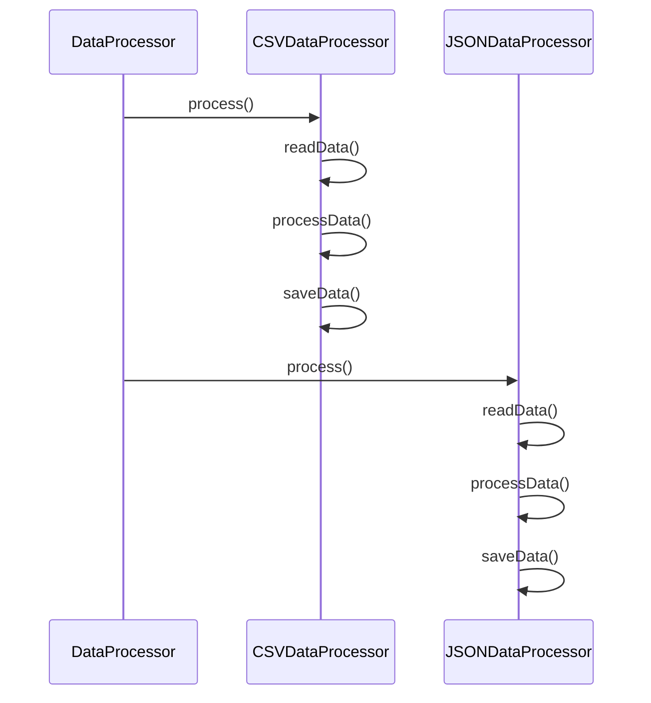

## 5.10.2 Implementation in JavaScript

The Template Method pattern is a behavioral design pattern that defines the skeleton of an algorithm in a method, deferring some steps to subclasses. This pattern lets subclasses redefine certain steps of an algorithm without changing its structure. In this section, we will explore how to implement the Template Method pattern in JavaScript, using both classes and prototypes to define template methods and override abstract methods in subclasses.

### Understanding the Template Method Pattern

Before diving into the implementation, let's clarify the core concepts of the Template Method pattern:

- **Template Method**: A method that defines the algorithm's structure, calling abstract methods that subclasses will implement.
- **Abstract Methods**: Methods that are declared but not implemented in the base class. Subclasses must provide concrete implementations.
- **Algorithm Structure**: The sequence of steps that make up the algorithm, some of which are fixed in the base class and others are customizable in subclasses.

### Implementing the Template Method Pattern in JavaScript

JavaScript does not have built-in support for abstract classes or methods, but we can simulate this behavior using classes and prototypes. We'll start by implementing the pattern using ES6 classes and then explore how to achieve the same using prototypes.

#### Using ES6 Classes

Let's consider a scenario where we have a `DataProcessor` class that defines a template method for processing data. Subclasses like `CSVDataProcessor` and `JSONDataProcessor` will implement specific steps of the algorithm.

```javascript
// Base class with the template method
class DataProcessor {
  // Template method
  process() {
    this.readData();
    this.processData();
    this.saveData();
  }

  // Abstract methods
  readData() {
    throw new Error('readData() must be implemented');
  }

  processData() {
    throw new Error('processData() must be implemented');
  }

  saveData() {
    throw new Error('saveData() must be implemented');
  }
}

// Subclass for processing CSV data
class CSVDataProcessor extends DataProcessor {
  readData() {
    console.log('Reading CSV data...');
    // Logic to read CSV data
  }

  processData() {
    console.log('Processing CSV data...');
    // Logic to process CSV data
  }

  saveData() {
    console.log('Saving CSV data...');
    // Logic to save CSV data
  }
}

// Subclass for processing JSON data
class JSONDataProcessor extends DataProcessor {
  readData() {
    console.log('Reading JSON data...');
    // Logic to read JSON data
  }

  processData() {
    console.log('Processing JSON data...');
    // Logic to process JSON data
  }

  saveData() {
    console.log('Saving JSON data...');
    // Logic to save JSON data
  }
}

// Usage
const csvProcessor = new CSVDataProcessor();
csvProcessor.process();

const jsonProcessor = new JSONDataProcessor();
jsonProcessor.process();
```

In this example, the `DataProcessor` class defines the `process` method, which serves as the template method. It calls three abstract methods: `readData`, `processData`, and `saveData`. These methods are implemented in the subclasses `CSVDataProcessor` and `JSONDataProcessor`.

#### Using Prototypes

JavaScript's prototype-based inheritance can also be used to implement the Template Method pattern. This approach is more traditional in JavaScript, especially before the introduction of ES6 classes.

```javascript
// Base class constructor
function DataProcessor() {}

// Template method
DataProcessor.prototype.process = function() {
  this.readData();
  this.processData();
  this.saveData();
};

// Abstract methods
DataProcessor.prototype.readData = function() {
  throw new Error('readData() must be implemented');
};

DataProcessor.prototype.processData = function() {
  throw new Error('processData() must be implemented');
};

DataProcessor.prototype.saveData = function() {
  throw new Error('saveData() must be implemented');
};

// Subclass for processing CSV data
function CSVDataProcessor() {}
CSVDataProcessor.prototype = Object.create(DataProcessor.prototype);
CSVDataProcessor.prototype.constructor = CSVDataProcessor;

CSVDataProcessor.prototype.readData = function() {
  console.log('Reading CSV data...');
  // Logic to read CSV data
};

CSVDataProcessor.prototype.processData = function() {
  console.log('Processing CSV data...');
  // Logic to process CSV data
};

CSVDataProcessor.prototype.saveData = function() {
  console.log('Saving CSV data...');
  // Logic to save CSV data
};

// Subclass for processing JSON data
function JSONDataProcessor() {}
JSONDataProcessor.prototype = Object.create(DataProcessor.prototype);
JSONDataProcessor.prototype.constructor = JSONDataProcessor;

JSONDataProcessor.prototype.readData = function() {
  console.log('Reading JSON data...');
  // Logic to read JSON data
};

JSONDataProcessor.prototype.processData = function() {
  console.log('Processing JSON data...');
  // Logic to process JSON data
};

JSONDataProcessor.prototype.saveData = function() {
  console.log('Saving JSON data...');
  // Logic to save JSON data
};

// Usage
var csvProcessor = new CSVDataProcessor();
csvProcessor.process();

var jsonProcessor = new JSONDataProcessor();
jsonProcessor.process();
```

In this prototype-based implementation, we define the template method `process` on the `DataProcessor` prototype. The abstract methods are also defined on the prototype, and subclasses like `CSVDataProcessor` and `JSONDataProcessor` override these methods with their specific implementations.

### Enforcing the Algorithm Structure

The Template Method pattern enforces the algorithm's structure by defining the sequence of method calls in the template method. This ensures that the overall process remains consistent, while allowing subclasses to customize specific steps.

### JavaScript-Specific Considerations

JavaScript's lack of built-in abstract classes requires us to simulate abstract methods by throwing errors in the base class. This approach ensures that subclasses must implement these methods, maintaining the integrity of the pattern.

### Visualizing the Template Method Pattern

To better understand the flow of the Template Method pattern, let's visualize the interaction between the base class and subclasses using a sequence diagram.



This diagram illustrates how the `process` method in the base class (`DataProcessor`) calls the overridden methods in the subclasses (`CSVDataProcessor` and `JSONDataProcessor`).

### Try It Yourself

To deepen your understanding of the Template Method pattern, try modifying the code examples:

1. **Add a New Subclass**: Create a new subclass for processing XML data. Implement the `readData`, `processData`, and `saveData` methods with XML-specific logic.

2. **Extend the Template Method**: Add a new step to the template method, such as `validateData`, and implement it in the subclasses.

3. **Experiment with Error Handling**: Modify the abstract methods to include error handling logic, ensuring that subclasses handle errors appropriately.

### Knowledge Check

- What is the primary purpose of the Template Method pattern?
- How does JavaScript simulate abstract methods in the absence of built-in support?
- Why is it important to enforce the algorithm's structure in the Template Method pattern?

### Further Reading

For more information on the Template Method pattern and other design patterns, consider exploring the following resources:

- [MDN Web Docs: Classes](https://developer.mozilla.org/en-US/docs/Web/JavaScript/Reference/Classes)
- [JavaScript Info: Prototypes](https://javascript.info/prototype-inheritance)
- [Refactoring Guru: Template Method Pattern](https://refactoring.guru/design-patterns/template-method)

### Embrace the Journey

Remember, mastering design patterns like the Template Method pattern is a journey. As you continue to explore and experiment with these patterns, you'll gain a deeper understanding of how to create flexible and maintainable code. Keep experimenting, stay curious, and enjoy the journey!

## Quiz Time!



### What is the primary purpose of the Template Method pattern?

- [x] To define the skeleton of an algorithm, deferring some steps to subclasses.
- [ ] To encapsulate a request as an object.
- [ ] To allow an object to alter its behavior when its internal state changes.
- [ ] To provide a way to access the elements of an aggregate object sequentially.

> **Explanation:** The Template Method pattern defines the skeleton of an algorithm, allowing subclasses to override specific steps without changing the overall structure.

### How does JavaScript simulate abstract methods?

- [x] By throwing errors in the base class methods.
- [ ] By using the `abstract` keyword.
- [ ] By defining methods with no implementation.
- [ ] By using interfaces.

> **Explanation:** JavaScript simulates abstract methods by throwing errors in the base class methods, ensuring that subclasses must implement them.

### What is the role of the template method in the Template Method pattern?

- [x] It defines the sequence of steps in an algorithm.
- [ ] It encapsulates a request as an object.
- [ ] It allows subclasses to alter the algorithm's structure.
- [ ] It provides a way to access elements sequentially.

> **Explanation:** The template method defines the sequence of steps in an algorithm, ensuring a consistent structure while allowing customization.

### Why is it important to enforce the algorithm's structure in the Template Method pattern?

- [x] To maintain consistency across different implementations.
- [ ] To allow subclasses to change the algorithm's structure.
- [ ] To encapsulate requests as objects.
- [ ] To provide sequential access to elements.

> **Explanation:** Enforcing the algorithm's structure ensures consistency across different implementations, while allowing specific steps to be customized.

### Which of the following is a JavaScript-specific consideration when implementing the Template Method pattern?

- [x] Lack of built-in abstract classes.
- [ ] Use of interfaces.
- [ ] Built-in support for abstract methods.
- [ ] Automatic error handling in abstract methods.

> **Explanation:** JavaScript lacks built-in support for abstract classes, requiring developers to simulate abstract methods by throwing errors.

### In the provided code examples, what is the purpose of the `process` method?

- [x] It serves as the template method, defining the algorithm's structure.
- [ ] It encapsulates a request as an object.
- [ ] It allows subclasses to alter the algorithm's structure.
- [ ] It provides a way to access elements sequentially.

> **Explanation:** The `process` method serves as the template method, defining the algorithm's structure and calling abstract methods.

### How can you extend the template method in the provided examples?

- [x] By adding a new step to the template method and implementing it in subclasses.
- [ ] By changing the algorithm's structure in the base class.
- [ ] By encapsulating requests as objects.
- [ ] By providing sequential access to elements.

> **Explanation:** You can extend the template method by adding a new step and implementing it in subclasses, allowing further customization.

### What is the benefit of using prototypes in JavaScript for the Template Method pattern?

- [x] It allows for traditional inheritance patterns before ES6 classes.
- [ ] It provides built-in support for abstract methods.
- [ ] It automatically enforces the algorithm's structure.
- [ ] It encapsulates requests as objects.

> **Explanation:** Using prototypes allows for traditional inheritance patterns in JavaScript, especially before the introduction of ES6 classes.

### What is a potential modification you can try in the provided examples?

- [x] Create a new subclass for processing XML data.
- [ ] Remove the template method from the base class.
- [ ] Change the algorithm's structure in the base class.
- [ ] Encapsulate requests as objects.

> **Explanation:** A potential modification is to create a new subclass for processing XML data, implementing the abstract methods with XML-specific logic.

### True or False: The Template Method pattern allows subclasses to change the overall structure of the algorithm.

- [ ] True
- [x] False

> **Explanation:** False. The Template Method pattern enforces the overall structure of the algorithm, allowing subclasses to customize specific steps without altering the structure.


