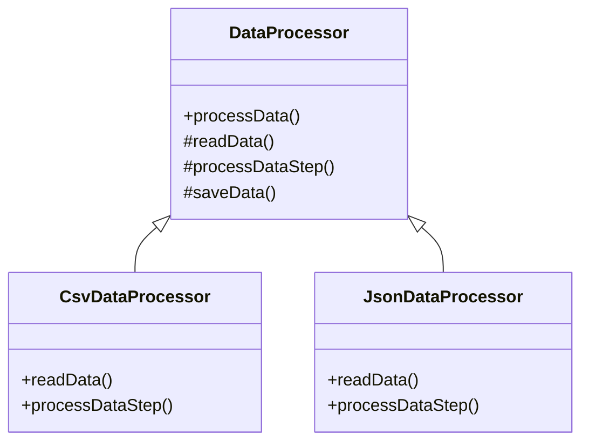

## 5.10.3 Implementation in TypeScript

The Template Method pattern is a behavioral design pattern that defines the skeleton of an algorithm in an operation, deferring some steps to subclasses. It allows subclasses to redefine certain steps of an algorithm without changing the algorithm's structure. In TypeScript, this pattern is elegantly implemented using abstract classes and methods, which provide a robust framework for enforcing method implementation and ensuring type safety.

### Understanding the Template Method Pattern

Before diving into TypeScript specifics, let's briefly recap the core concept of the Template Method pattern. The pattern involves:

- **Abstract Class**: This class contains the template method, which outlines the algorithm's structure. It may also contain default implementations for some steps.
- **Template Method**: A method defined in the abstract class that uses other methods (some of which are abstract) to perform its task.
- **Concrete Subclasses**: These subclasses implement the abstract methods defined in the abstract class, providing specific behavior for the algorithm's steps.

### Implementing the Template Method Pattern in TypeScript

TypeScript's support for abstract classes and methods makes it an ideal language for implementing the Template Method pattern. Let's walk through the process step by step.

#### Step 1: Define an Abstract Class with the Template Method

First, we define an abstract class that includes the template method. This method will call other methods, some of which will be abstract and must be implemented by subclasses.

```typescript
abstract class DataProcessor {
    // The template method
    public processData(): void {
        this.readData();
        this.processDataStep();
        this.saveData();
    }

    // Abstract methods to be implemented by subclasses
    protected abstract readData(): void;
    protected abstract processDataStep(): void;

    // A concrete method with a default implementation
    protected saveData(): void {
        console.log('Data has been saved.');
    }
}
```

In this example, `DataProcessor` is an abstract class with a `processData` method that defines the algorithm's structure. The `readData` and `processDataStep` methods are abstract, meaning they must be implemented by any subclass. The `saveData` method is a concrete method with a default implementation.

#### Step 2: Implement Concrete Subclasses

Next, we create concrete subclasses that implement the abstract methods. Each subclass will provide specific behavior for the algorithm's steps.

```typescript
class CsvDataProcessor extends DataProcessor {
    protected readData(): void {
        console.log('Reading data from a CSV file.');
    }

    protected processDataStep(): void {
        console.log('Processing CSV data.');
    }
}

class JsonDataProcessor extends DataProcessor {
    protected readData(): void {
        console.log('Reading data from a JSON file.');
    }

    protected processDataStep(): void {
        console.log('Processing JSON data.');
    }
}
```

Here, `CsvDataProcessor` and `JsonDataProcessor` are concrete subclasses of `DataProcessor`. They provide specific implementations for the `readData` and `processDataStep` methods.

#### Step 3: Utilize the Template Method

Now that we have our abstract class and concrete subclasses, we can use the template method to process data.

```typescript
const csvProcessor = new CsvDataProcessor();
csvProcessor.processData();

const jsonProcessor = new JsonDataProcessor();
jsonProcessor.processData();
```

Running this code will output:

```
Reading data from a CSV file.
Processing CSV data.
Data has been saved.
Reading data from a JSON file.
Processing JSON data.
Data has been saved.
```

### Benefits of Using TypeScript for the Template Method Pattern

TypeScript offers several advantages when implementing the Template Method pattern:

1. **Type Safety**: TypeScript's static typing ensures that the methods are implemented correctly and that the data types are consistent across the application. This reduces runtime errors and improves code reliability.

2. **Enforced Method Implementation**: Abstract classes in TypeScript enforce the implementation of abstract methods in subclasses. This ensures that all necessary steps of the algorithm are defined, maintaining the integrity of the pattern.

3. **Better Tooling Support**: TypeScript's integration with modern IDEs provides enhanced tooling support, including autocompletion, refactoring tools, and error checking, which streamline the development process.

4. **Improved Code Organization**: The Template Method pattern helps organize code by separating the algorithm's structure from its implementation details. This leads to cleaner, more maintainable code.

### Visualizing the Template Method Pattern

To better understand the Template Method pattern, let's visualize the relationships between the abstract class and its concrete subclasses using a class diagram.



**Diagram Description**: This class diagram illustrates the Template Method pattern. `DataProcessor` is the abstract class with the template method `processData`. `CsvDataProcessor` and `JsonDataProcessor` are concrete subclasses that implement the abstract methods `readData` and `processDataStep`.

### Try It Yourself

To deepen your understanding, try modifying the code examples:

- **Add a New Data Format**: Create a new subclass for another data format, such as XML, and implement the necessary methods.
- **Modify the Algorithm**: Change the order of operations in the `processData` method or add new steps to the algorithm.
- **Override the Concrete Method**: In one of the subclasses, override the `saveData` method to provide a different implementation.

### Knowledge Check

Let's reinforce what we've learned with a few questions:

1. What is the primary purpose of the Template Method pattern?
2. How does TypeScript enforce the implementation of abstract methods?
3. What are the benefits of using TypeScript for the Template Method pattern?

### Embrace the Journey

Remember, mastering design patterns is a journey. As you continue to explore and implement these patterns, you'll gain a deeper understanding of how to structure your code for maintainability and scalability. Keep experimenting, stay curious, and enjoy the process!

### References and Links

- [MDN Web Docs: Classes](https://developer.mozilla.org/en-US/docs/Web/JavaScript/Reference/Classes)
- [TypeScript Handbook: Classes](https://www.typescriptlang.org/docs/handbook/classes.html)

## Quiz Time!



### What is the main purpose of the Template Method pattern?

- [x] To define the skeleton of an algorithm, allowing subclasses to redefine certain steps.
- [ ] To encapsulate requests as objects.
- [ ] To provide a way to access elements of a collection sequentially.
- [ ] To allow incompatible interfaces to work together.

> **Explanation:** The Template Method pattern defines the skeleton of an algorithm in a method, deferring some steps to subclasses.

### How does TypeScript enforce the implementation of abstract methods?

- [x] By using abstract classes that require subclasses to implement abstract methods.
- [ ] By using interfaces that require method implementation.
- [ ] By using concrete classes with default method implementations.
- [ ] By using decorators to enforce method implementation.

> **Explanation:** TypeScript uses abstract classes to enforce that subclasses implement all abstract methods.

### What is a benefit of using TypeScript for the Template Method pattern?

- [x] Type safety ensures consistent data types and reduces runtime errors.
- [ ] It allows for dynamic typing and flexibility.
- [ ] It eliminates the need for method implementation.
- [ ] It provides a way to create private methods.

> **Explanation:** TypeScript's type safety ensures that data types are consistent, reducing runtime errors and improving reliability.

### Which of the following is an abstract method in the `DataProcessor` class?

- [x] `readData()`
- [ ] `processData()`
- [ ] `saveData()`
- [ ] `logData()`

> **Explanation:** `readData()` is an abstract method that must be implemented by subclasses.

### What does the `processData()` method in the `DataProcessor` class represent?

- [x] The template method that defines the algorithm's structure.
- [ ] An abstract method that needs implementation.
- [ ] A concrete method with default behavior.
- [ ] A utility method for logging data.

> **Explanation:** `processData()` is the template method that outlines the algorithm's structure.

### In the Template Method pattern, what is the role of concrete subclasses?

- [x] To implement the abstract methods defined in the abstract class.
- [ ] To define the template method.
- [ ] To provide default implementations for all methods.
- [ ] To encapsulate data and provide getters and setters.

> **Explanation:** Concrete subclasses implement the abstract methods, providing specific behavior for the algorithm's steps.

### What is a key advantage of using abstract classes in TypeScript?

- [x] They enforce the implementation of abstract methods in subclasses.
- [ ] They allow for multiple inheritance.
- [ ] They eliminate the need for interfaces.
- [ ] They provide runtime polymorphism.

> **Explanation:** Abstract classes enforce that subclasses implement all abstract methods, ensuring the pattern's integrity.

### Which method in the `DataProcessor` class has a default implementation?

- [x] `saveData()`
- [ ] `readData()`
- [ ] `processDataStep()`
- [ ] `initializeData()`

> **Explanation:** `saveData()` has a default implementation that can be used or overridden by subclasses.

### How can you modify the `processData()` method to change the algorithm?

- [x] By changing the order of operations or adding new steps.
- [ ] By implementing new abstract methods.
- [ ] By overriding the method in subclasses.
- [ ] By using decorators to modify behavior.

> **Explanation:** Modifying the `processData()` method allows you to change the algorithm's structure by altering the order of operations or adding new steps.

### True or False: The Template Method pattern allows subclasses to change the algorithm's structure.

- [ ] True
- [x] False

> **Explanation:** False. The Template Method pattern allows subclasses to redefine certain steps of the algorithm, but the overall structure is defined by the template method.




