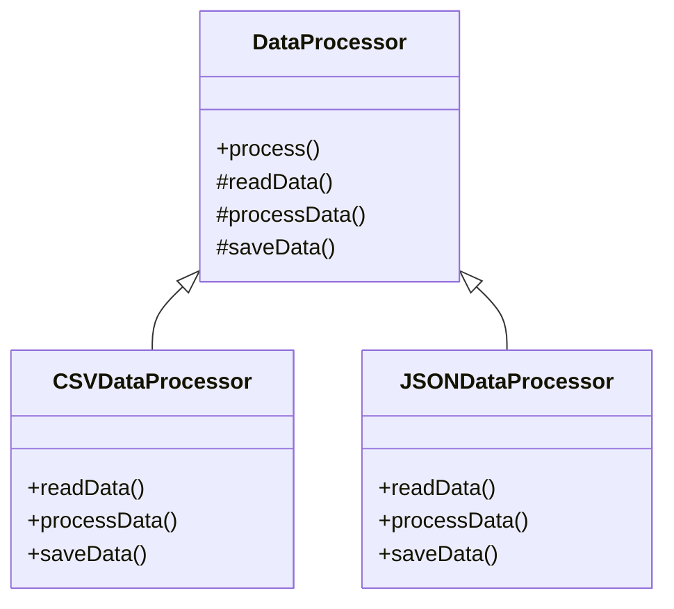

## 5.10.4 Use Cases and Examples

The Template Method pattern is a behavioral design pattern that defines the skeleton of an algorithm in a method, deferring some steps to subclasses. This pattern allows subclasses to redefine certain steps of an algorithm without changing its structure. In this section, we will explore various real-world applications of the Template Method pattern in JavaScript and TypeScript, such as data processing pipelines, game turn sequences, and file parsers. We will also discuss how this pattern promotes code reuse and simplifies maintenance, when to choose it over other patterns, and tips for avoiding potential pitfalls like the fragile base class problem.

### Understanding the Template Method Pattern

Before diving into the use cases, let's briefly recap the Template Method pattern. This pattern is particularly useful when you have an algorithm that consists of several steps, and you want to allow subclasses to provide specific implementations for some of these steps. The main idea is to define the invariant parts of the algorithm in a base class and allow subclasses to implement the variable parts.

Here's a simple example in TypeScript to illustrate the Template Method pattern:

```typescript
abstract class DataProcessor {
    // Template method
    public process(): void {
        this.readData();
        this.processData();
        this.saveData();
    }

    protected abstract readData(): void;
    protected abstract processData(): void;
    protected abstract saveData(): void;
}

class CSVDataProcessor extends DataProcessor {
    protected readData(): void {
        console.log("Reading data from CSV file.");
    }

    protected processData(): void {
        console.log("Processing CSV data.");
    }

    protected saveData(): void {
        console.log("Saving processed CSV data.");
    }
}

class JSONDataProcessor extends DataProcessor {
    protected readData(): void {
        console.log("Reading data from JSON file.");
    }

    protected processData(): void {
        console.log("Processing JSON data.");
    }

    protected saveData(): void {
        console.log("Saving processed JSON data.");
    }
}

// Usage
const csvProcessor = new CSVDataProcessor();
csvProcessor.process();

const jsonProcessor = new JSONDataProcessor();
jsonProcessor.process();
```

In this example, `DataProcessor` defines the template method `process`, which outlines the steps of the algorithm. The subclasses `CSVDataProcessor` and `JSONDataProcessor` provide specific implementations for the abstract methods.

### Use Case 1: Data Processing Pipelines

Data processing pipelines are a perfect fit for the Template Method pattern. These pipelines often involve a series of steps, such as data extraction, transformation, and loading (ETL). By using the Template Method pattern, you can define the overall structure of the pipeline and allow different data sources or formats to customize the specific steps.

#### Example: ETL Pipeline

Consider an ETL (Extract, Transform, Load) pipeline that processes data from various sources. We can use the Template Method pattern to define the common steps and allow subclasses to implement the specifics for each data source.

```typescript
abstract class ETLPipeline {
    public run(): void {
        this.extract();
        this.transform();
        this.load();
    }

    protected abstract extract(): void;
    protected abstract transform(): void;
    protected abstract load(): void;
}

class MySQLPipeline extends ETLPipeline {
    protected extract(): void {
        console.log("Extracting data from MySQL database.");
    }

    protected transform(): void {
        console.log("Transforming MySQL data.");
    }

    protected load(): void {
        console.log("Loading data into data warehouse.");
    }
}

class APIPipeline extends ETLPipeline {
    protected extract(): void {
        console.log("Extracting data from API.");
    }

    protected transform(): void {
        console.log("Transforming API data.");
    }

    protected load(): void {
        console.log("Loading data into data warehouse.");
    }
}

// Usage
const mysqlPipeline = new MySQLPipeline();
mysqlPipeline.run();

const apiPipeline = new APIPipeline();
apiPipeline.run();
```

In this example, `ETLPipeline` defines the template method `run`, which outlines the ETL process. The subclasses `MySQLPipeline` and `APIPipeline` provide specific implementations for extracting, transforming, and loading data.

### Use Case 2: Game Turn Sequences

In game development, managing turn sequences can become complex, especially when different types of players or entities have unique actions. The Template Method pattern allows you to define a generic turn sequence and let subclasses implement specific actions for each type of player or entity.

#### Example: Turn-Based Game

Let's consider a turn-based game where different types of players (e.g., human, AI) have different actions during their turn. We can use the Template Method pattern to define the turn sequence and allow subclasses to implement the specific actions.

```typescript
abstract class Player {
    public takeTurn(): void {
        this.startTurn();
        this.play();
        this.endTurn();
    }

    protected abstract startTurn(): void;
    protected abstract play(): void;
    protected abstract endTurn(): void;
}

class HumanPlayer extends Player {
    protected startTurn(): void {
        console.log("Human player starts turn.");
    }

    protected play(): void {
        console.log("Human player makes a move.");
    }

    protected endTurn(): void {
        console.log("Human player ends turn.");
    }
}

class AIPlayer extends Player {
    protected startTurn(): void {
        console.log("AI player starts turn.");
    }

    protected play(): void {
        console.log("AI player calculates move.");
    }

    protected endTurn(): void {
        console.log("AI player ends turn.");
    }
}

// Usage
const humanPlayer = new HumanPlayer();
humanPlayer.takeTurn();

const aiPlayer = new AIPlayer();
aiPlayer.takeTurn();
```

In this example, `Player` defines the template method `takeTurn`, which outlines the turn sequence. The subclasses `HumanPlayer` and `AIPlayer` provide specific implementations for starting, playing, and ending their turn.

### Use Case 3: File Parsers

File parsing often involves reading a file, processing its contents, and generating some output. The Template Method pattern can be used to define the structure of the parsing process and allow subclasses to implement the specifics for different file formats.

#### Example: Parsing Different File Formats

Consider a scenario where you need to parse different file formats, such as XML and JSON. We can use the Template Method pattern to define the parsing process and allow subclasses to implement the specifics for each format.

```typescript
abstract class FileParser {
    public parse(): void {
        this.openFile();
        this.readFile();
        this.closeFile();
    }

    protected abstract openFile(): void;
    protected abstract readFile(): void;
    protected abstract closeFile(): void;
}

class XMLParser extends FileParser {
    protected openFile(): void {
        console.log("Opening XML file.");
    }

    protected readFile(): void {
        console.log("Reading XML file.");
    }

    protected closeFile(): void {
        console.log("Closing XML file.");
    }
}

class JSONParser extends FileParser {
    protected openFile(): void {
        console.log("Opening JSON file.");
    }

    protected readFile(): void {
        console.log("Reading JSON file.");
    }

    protected closeFile(): void {
        console.log("Closing JSON file.");
    }
}

// Usage
const xmlParser = new XMLParser();
xmlParser.parse();

const jsonParser = new JSONParser();
jsonParser.parse();
```

In this example, `FileParser` defines the template method `parse`, which outlines the parsing process. The subclasses `XMLParser` and `JSONParser` provide specific implementations for opening, reading, and closing files.

### Promoting Code Reuse and Simplifying Maintenance

The Template Method pattern promotes code reuse by allowing you to define common steps of an algorithm in a base class and letting subclasses implement the specifics. This approach reduces code duplication and makes it easier to maintain and extend the codebase.

For example, if you need to add a new step to the algorithm, you can do so in the base class without modifying the subclasses. This makes the code more maintainable and reduces the risk of introducing bugs.

### Choosing the Template Method Pattern

The Template Method pattern is a good choice when you have an algorithm with invariant steps and you want to allow subclasses to provide specific implementations for some of these steps. It is particularly useful when:

- You have multiple classes that share the same algorithm structure but differ in some specific steps.
- You want to avoid code duplication by defining the common steps in a base class.
- You want to make it easy to add new variations of the algorithm by creating new subclasses.

However, it's important to be aware of potential pitfalls, such as the fragile base class problem. This problem occurs when changes to the base class inadvertently affect subclasses. To avoid this, ensure that the base class is stable and well-tested before creating subclasses.

### Tips for Avoiding Potential Pitfalls

1. **Keep the Base Class Stable**: Ensure that the base class is stable and well-tested before creating subclasses. Avoid making frequent changes to the base class, as this can lead to the fragile base class problem.

2. **Use Composition Over Inheritance**: Consider using composition over inheritance when possible. This can help reduce the dependency on the base class and make the code more flexible.

3. **Limit the Number of Abstract Methods**: Try to limit the number of abstract methods in the base class. This can make it easier to create new subclasses and reduce the risk of errors.

4. **Provide Default Implementations**: Consider providing default implementations for some of the abstract methods. This can make it easier to create new subclasses and reduce the amount of code that needs to be written.

5. **Document the Base Class**: Ensure that the base class is well-documented, including the purpose of each abstract method and any assumptions or constraints. This can help developers understand how to create new subclasses and avoid common pitfalls.

### Visualizing the Template Method Pattern

To better understand the Template Method pattern, let's visualize the relationship between the base class and its subclasses using a class diagram.



In this diagram, `DataProcessor` is the base class that defines the template method `process`. The subclasses `CSVDataProcessor` and `JSONDataProcessor` inherit from `DataProcessor` and provide specific implementations for the abstract methods.

### Try It Yourself

Now that we've explored the Template Method pattern and its use cases, it's time to try it yourself. Here are some suggestions for experimenting with the pattern:

1. **Create a New Data Processor**: Extend the `DataProcessor` class to create a new data processor for a different file format, such as XML or YAML. Implement the abstract methods to handle the specific file format.

2. **Add a New Step to the Algorithm**: Modify the `DataProcessor` class to add a new step to the algorithm, such as data validation. Update the subclasses to implement the new step.

3. **Refactor an Existing Codebase**: Identify a part of an existing codebase that could benefit from the Template Method pattern. Refactor the code to use the pattern and observe the improvements in code reuse and maintainability.

4. **Experiment with Composition Over Inheritance**: Try using composition instead of inheritance to implement the Template Method pattern. Compare the two approaches and consider the benefits and drawbacks of each.

### Knowledge Check

To reinforce your understanding of the Template Method pattern, here are some questions and exercises:

- What are the main benefits of using the Template Method pattern?
- How does the Template Method pattern promote code reuse and simplify maintenance?
- When should you choose the Template Method pattern over other design patterns?
- What are some potential pitfalls of the Template Method pattern, and how can you avoid them?
- Implement a new use case for the Template Method pattern, such as a report generation system or a notification system.

### Conclusion

The Template Method pattern is a powerful tool for defining the skeleton of an algorithm and allowing subclasses to implement specific steps. By promoting code reuse and simplifying maintenance, this pattern can help you create more flexible and maintainable codebases. As you continue to explore design patterns, remember to experiment with different approaches and consider the unique needs of your projects.

## Quiz Time!



### What is the main purpose of the Template Method pattern?

- [x] To define the skeleton of an algorithm and allow subclasses to implement specific steps.
- [ ] To create a single instance of a class.
- [ ] To provide a simplified interface to a complex subsystem.
- [ ] To allow incompatible interfaces to work together.

> **Explanation:** The Template Method pattern is used to define the skeleton of an algorithm, allowing subclasses to implement specific steps without changing the overall structure.

### Which of the following is a use case for the Template Method pattern?

- [x] Data processing pipelines
- [ ] Singleton pattern
- [ ] Adapter pattern
- [ ] Facade pattern

> **Explanation:** Data processing pipelines are a common use case for the Template Method pattern, as they involve a series of steps that can be customized for different data sources.

### What is a potential pitfall of the Template Method pattern?

- [x] The fragile base class problem
- [ ] Excessive memory usage
- [ ] Lack of flexibility
- [ ] Difficulty in understanding

> **Explanation:** The fragile base class problem occurs when changes to the base class inadvertently affect subclasses, making the codebase fragile.

### How can you avoid the fragile base class problem?

- [x] Keep the base class stable and well-tested.
- [ ] Use global variables.
- [ ] Avoid using abstract methods.
- [ ] Implement all methods in subclasses.

> **Explanation:** Keeping the base class stable and well-tested helps avoid the fragile base class problem by ensuring that changes do not inadvertently affect subclasses.

### What is a benefit of using the Template Method pattern?

- [x] Promotes code reuse
- [ ] Increases code duplication
- [ ] Makes the code harder to maintain
- [ ] Reduces flexibility

> **Explanation:** The Template Method pattern promotes code reuse by allowing common steps to be defined in a base class, reducing code duplication and simplifying maintenance.

### When should you choose the Template Method pattern over other patterns?

- [x] When you have an algorithm with invariant steps and want to allow subclasses to provide specific implementations.
- [ ] When you need to create a single instance of a class.
- [ ] When you need to provide a simplified interface to a complex subsystem.
- [ ] When you need to allow incompatible interfaces to work together.

> **Explanation:** The Template Method pattern is suitable when you have an algorithm with invariant steps and want to allow subclasses to provide specific implementations for some of these steps.

### What is a common use case for the Template Method pattern?

- [x] Game turn sequences
- [ ] Singleton pattern
- [ ] Adapter pattern
- [ ] Facade pattern

> **Explanation:** Game turn sequences are a common use case for the Template Method pattern, as they involve a series of steps that can be customized for different types of players or entities.

### How does the Template Method pattern promote code reuse?

- [x] By defining common steps of an algorithm in a base class and letting subclasses implement specifics.
- [ ] By creating a single instance of a class.
- [ ] By providing a simplified interface to a complex subsystem.
- [ ] By allowing incompatible interfaces to work together.

> **Explanation:** The Template Method pattern promotes code reuse by defining common steps in a base class, allowing subclasses to implement specifics without duplicating code.

### What is a tip for avoiding potential pitfalls of the Template Method pattern?

- [x] Provide default implementations for some abstract methods.
- [ ] Use global variables.
- [ ] Avoid using abstract methods.
- [ ] Implement all methods in subclasses.

> **Explanation:** Providing default implementations for some abstract methods can make it easier to create new subclasses and reduce the amount of code that needs to be written.

### True or False: The Template Method pattern is only suitable for large projects.

- [ ] True
- [x] False

> **Explanation:** The Template Method pattern is suitable for projects of any size where there is a need to define the skeleton of an algorithm and allow subclasses to implement specific steps.



Remember, this is just the beginning. As you progress, you'll build more complex and interactive applications. Keep experimenting, stay curious, and enjoy the journey!
