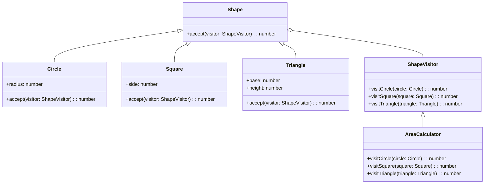

## 5.11.1 Intent and Motivation

In the realm of software design, the Visitor pattern stands out as a powerful tool for extending the functionality of object structures without altering their classes. This pattern is particularly useful when you need to perform operations across a set of diverse objects, allowing you to define new operations without changing the objects themselves. Let's delve into the intent and motivation behind the Visitor pattern, understand its purpose, and explore how it can be effectively implemented in JavaScript and TypeScript.

### Understanding the Visitor Pattern

The Visitor pattern is a behavioral design pattern that represents an operation to be performed on elements of an object structure. It allows you to add new operations to existing object structures without modifying the objects' classes. This is achieved by separating the algorithm from the objects it operates on, encapsulating it in a separate visitor object.

#### Purpose of the Visitor Pattern

The primary purpose of the Visitor pattern is to define new operations on an object structure without altering the classes of the elements on which it operates. This is particularly beneficial in scenarios where the object structure is stable, but the operations on it are subject to frequent changes.

### An Analogy: The Tax Auditor

To better understand the Visitor pattern, consider the analogy of a tax auditor visiting different business units within a company. Each business unit has its own unique set of financial records and operations. The tax auditor, representing the visitor, performs a specific operation—auditing—on each business unit without altering the internal workings of the units themselves.

In this analogy, the business units are akin to the elements of an object structure, and the tax auditor is the visitor that performs operations on these elements. The auditor can be replaced or updated to perform different types of audits without changing the structure of the business units.

### The Problem: Adding New Operations

In traditional object-oriented design, adding new operations to an object structure often requires modifying the classes of the objects involved. This can lead to a violation of the Open/Closed Principle, which states that classes should be open for extension but closed for modification.

Consider a scenario where you have a collection of different shapes, such as circles, squares, and triangles. You may want to perform various operations on these shapes, such as calculating the area, drawing them on a canvas, or exporting them to a file format. Adding each new operation would typically require modifying the shape classes, leading to tightly coupled code and reduced maintainability.

### The Solution: Separating Algorithms from Objects

The Visitor pattern addresses this problem by separating the algorithms from the objects they operate on. It introduces a visitor interface that declares a visit method for each type of element in the object structure. Concrete visitor classes implement these methods to define specific operations.

Here's a high-level overview of how the Visitor pattern works:

1. **Element Interface**: Defines an `accept` method that takes a visitor as an argument.
2. **Concrete Element Classes**: Implement the `accept` method to call the visitor's corresponding visit method.
3. **Visitor Interface**: Declares visit methods for each type of element.
4. **Concrete Visitor Classes**: Implement the visit methods to perform specific operations.

### Code Example: Visitor Pattern in JavaScript

Let's explore a practical example of the Visitor pattern in JavaScript. We'll create a simple object structure representing different types of shapes and implement a visitor to calculate their areas.

```javascript
// Visitor Interface
class ShapeVisitor {
  visitCircle(circle) {}
  visitSquare(square) {}
  visitTriangle(triangle) {}
}

// Concrete Visitor
class AreaCalculator extends ShapeVisitor {
  visitCircle(circle) {
    return Math.PI * Math.pow(circle.radius, 2);
  }

  visitSquare(square) {
    return Math.pow(square.side, 2);
  }

  visitTriangle(triangle) {
    return 0.5 * triangle.base * triangle.height;
  }
}

// Element Interface
class Shape {
  accept(visitor) {}
}

// Concrete Elements
class Circle extends Shape {
  constructor(radius) {
    super();
    this.radius = radius;
  }

  accept(visitor) {
    return visitor.visitCircle(this);
  }
}

class Square extends Shape {
  constructor(side) {
    super();
    this.side = side;
  }

  accept(visitor) {
    return visitor.visitSquare(this);
  }
}

class Triangle extends Shape {
  constructor(base, height) {
    super();
    this.base = base;
    this.height = height;
  }

  accept(visitor) {
    return visitor.visitTriangle(this);
  }
}

// Usage
const shapes = [
  new Circle(5),
  new Square(4),
  new Triangle(3, 6)
];

const areaCalculator = new AreaCalculator();

shapes.forEach(shape => {
  console.log(`Area: ${shape.accept(areaCalculator)}`);
});
```

### Code Example: Visitor Pattern in TypeScript

Now, let's implement the same example in TypeScript, leveraging its strong typing capabilities.

```typescript
// Visitor Interface
interface ShapeVisitor {
  visitCircle(circle: Circle): number;
  visitSquare(square: Square): number;
  visitTriangle(triangle: Triangle): number;
}

// Concrete Visitor
class AreaCalculator implements ShapeVisitor {
  visitCircle(circle: Circle): number {
    return Math.PI * Math.pow(circle.radius, 2);
  }

  visitSquare(square: Square): number {
    return Math.pow(square.side, 2);
  }

  visitTriangle(triangle: Triangle): number {
    return 0.5 * triangle.base * triangle.height;
  }
}

// Element Interface
interface Shape {
  accept(visitor: ShapeVisitor): number;
}

// Concrete Elements
class Circle implements Shape {
  constructor(public radius: number) {}

  accept(visitor: ShapeVisitor): number {
    return visitor.visitCircle(this);
  }
}

class Square implements Shape {
  constructor(public side: number) {}

  accept(visitor: ShapeVisitor): number {
    return visitor.visitSquare(this);
  }
}

class Triangle implements Shape {
  constructor(public base: number, public height: number) {}

  accept(visitor: ShapeVisitor): number {
    return visitor.visitTriangle(this);
  }
}

// Usage
const shapes: Shape[] = [
  new Circle(5),
  new Square(4),
  new Triangle(3, 6)
];

const areaCalculator = new AreaCalculator();

shapes.forEach(shape => {
  console.log(`Area: ${shape.accept(areaCalculator)}`);
});
```

### Benefits of the Visitor Pattern

The Visitor pattern offers several advantages:

1. **Open/Closed Principle**: It adheres to the Open/Closed Principle by allowing new operations to be added without modifying existing classes.
2. **Separation of Concerns**: It separates the algorithm from the object structure, leading to cleaner and more maintainable code.
3. **Flexibility**: It provides flexibility in adding new operations by simply creating new visitor classes.
4. **Centralized Operations**: It centralizes operations in visitor classes, making it easier to manage and update them.

### Visualizing the Visitor Pattern

To better understand the Visitor pattern, let's visualize its structure using a class diagram.



**Diagram Description**: This class diagram illustrates the relationship between the `Shape` elements and the `ShapeVisitor`. The `Circle`, `Square`, and `Triangle` classes implement the `Shape` interface, and the `AreaCalculator` class implements the `ShapeVisitor` interface.

### Try It Yourself

To deepen your understanding of the Visitor pattern, try modifying the code examples:

- **Add a New Visitor**: Create a new visitor class to perform a different operation, such as calculating the perimeter of each shape.
- **Extend the Object Structure**: Add a new shape class, such as `Rectangle`, and update the visitor classes to handle it.
- **Experiment with TypeScript**: Use TypeScript's advanced features, such as generics, to enhance the visitor pattern implementation.

### References and Further Reading

For more information on the Visitor pattern and related concepts, consider exploring the following resources:

- [MDN Web Docs: JavaScript](https://developer.mozilla.org/en-US/docs/Web/JavaScript)
- [TypeScript Handbook](https://www.typescriptlang.org/docs/handbook/intro.html)
- [Refactoring Guru: Visitor Pattern](https://refactoring.guru/design-patterns/visitor)

### Knowledge Check

To reinforce your understanding of the Visitor pattern, consider the following questions:

1. What is the primary purpose of the Visitor pattern?
2. How does the Visitor pattern adhere to the Open/Closed Principle?
3. What are the key components of the Visitor pattern?
4. How can the Visitor pattern improve code maintainability?
5. What are some potential drawbacks of using the Visitor pattern?

### Embrace the Journey

Remember, mastering design patterns is a journey that requires practice and experimentation. As you continue to explore the Visitor pattern and other design patterns, you'll gain valuable insights into creating more flexible and maintainable software. Keep experimenting, stay curious, and enjoy the journey!

## Quiz Time!



### What is the primary purpose of the Visitor pattern?

- [x] To define new operations on an object structure without altering the classes of the elements.
- [ ] To modify the classes of the elements to add new operations.
- [ ] To encapsulate object creation logic.
- [ ] To manage object relationships.

> **Explanation:** The Visitor pattern allows new operations to be defined without changing the classes of the elements, adhering to the Open/Closed Principle.

### How does the Visitor pattern adhere to the Open/Closed Principle?

- [x] By allowing new operations to be added without modifying existing classes.
- [ ] By requiring changes to existing classes for new operations.
- [ ] By encapsulating object creation logic.
- [ ] By managing object relationships.

> **Explanation:** The Visitor pattern enables new operations to be added by creating new visitor classes, thus keeping existing classes closed for modification.

### What is a key component of the Visitor pattern?

- [x] Visitor Interface
- [ ] Singleton Class
- [ ] Factory Method
- [ ] Observer Interface

> **Explanation:** The Visitor pattern includes a Visitor Interface that declares visit methods for each type of element.

### How can the Visitor pattern improve code maintainability?

- [x] By separating algorithms from the objects they operate on.
- [ ] By tightly coupling algorithms with object structures.
- [ ] By requiring frequent modifications to object classes.
- [ ] By centralizing all logic in a single class.

> **Explanation:** The Visitor pattern improves maintainability by separating algorithms from object structures, leading to cleaner and more modular code.

### What is a potential drawback of using the Visitor pattern?

- [x] It can lead to complex visitor hierarchies.
- [ ] It simplifies object structures.
- [ ] It reduces the number of classes needed.
- [ ] It eliminates the need for interfaces.

> **Explanation:** The Visitor pattern can result in complex visitor hierarchies, especially in large systems with many operations.

### In the Visitor pattern, what role does the `accept` method play?

- [x] It allows an element to accept a visitor and call its corresponding visit method.
- [ ] It creates a new visitor instance.
- [ ] It modifies the element's internal state.
- [ ] It manages object relationships.

> **Explanation:** The `accept` method enables an element to accept a visitor and invoke the appropriate visit method for the operation.

### Which of the following is an example of a concrete visitor in the Visitor pattern?

- [x] AreaCalculator
- [ ] Shape
- [ ] Singleton
- [ ] Observer

> **Explanation:** `AreaCalculator` is an example of a concrete visitor that implements the visitor interface to perform specific operations.

### What is the benefit of centralizing operations in visitor classes?

- [x] It makes it easier to manage and update operations.
- [ ] It requires frequent modifications to object classes.
- [ ] It reduces code readability.
- [ ] It eliminates the need for interfaces.

> **Explanation:** Centralizing operations in visitor classes simplifies management and updates, enhancing maintainability.

### How does the Visitor pattern handle new operations?

- [x] By creating new visitor classes.
- [ ] By modifying existing element classes.
- [ ] By encapsulating object creation logic.
- [ ] By managing object relationships.

> **Explanation:** The Visitor pattern handles new operations by introducing new visitor classes, keeping element classes unchanged.

### True or False: The Visitor pattern is useful when the object structure is stable, but operations are subject to frequent changes.

- [x] True
- [ ] False

> **Explanation:** The Visitor pattern is ideal for scenarios where the object structure remains stable, but operations need to be added or changed frequently.


