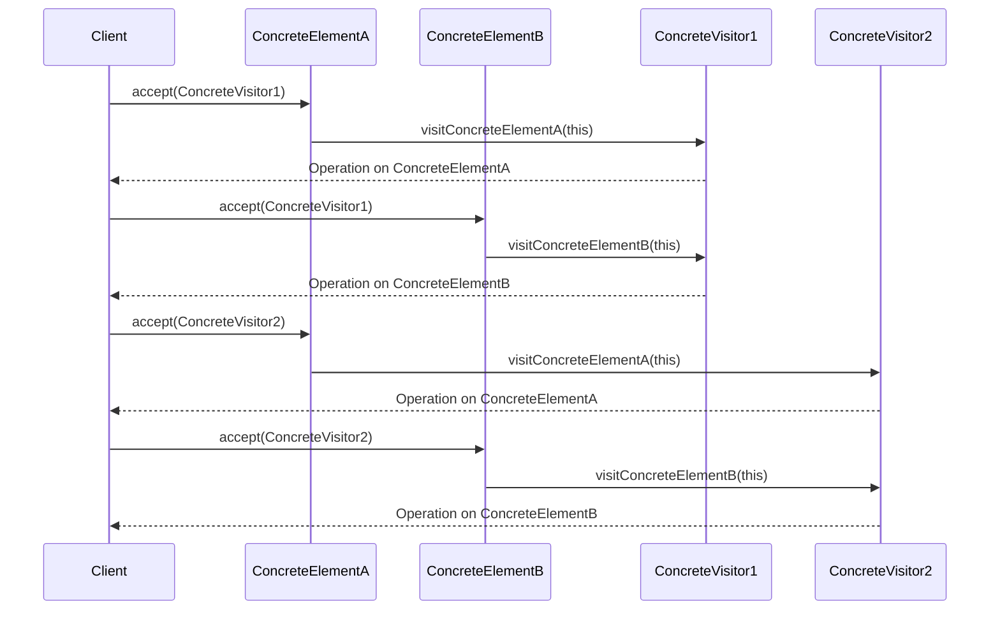

## 5.11.2 Implementation in JavaScript

The Visitor pattern is a powerful design pattern that allows you to separate algorithms from the objects on which they operate. This separation can lead to a more organized and maintainable codebase, especially when dealing with complex object structures. In this section, we will explore how to implement the Visitor pattern in JavaScript, providing code examples and explanations to help you understand and apply this pattern effectively.

### Understanding the Visitor Pattern

The Visitor pattern involves two main components: the **Visitor** and the **Element**. The Visitor defines a new operation to be performed on elements of an object structure, while the Element represents the objects that can be "visited" by the Visitor. This pattern is particularly useful when you have a stable set of operations that need to be performed on a variety of objects.

### Key Concepts

- **Visitor Interface**: Defines a visit operation for each type of Element.
- **Element Interface**: Declares an `accept` method that takes a Visitor as an argument.
- **Concrete Visitors**: Implement the Visitor interface and define operations for each Element type.
- **Concrete Elements**: Implement the Element interface and define the `accept` method to call the appropriate Visitor method.

### Implementing the Visitor Pattern in JavaScript

Let's dive into the implementation of the Visitor pattern in JavaScript. We'll start by defining the interfaces for Visitors and Elements, then move on to creating concrete implementations.

#### Step 1: Define Visitor and Element Interfaces

In JavaScript, interfaces are typically represented using comments or conventions, as JavaScript does not have a built-in interface construct. However, we can define the expected methods using comments:

```javascript
// Visitor interface
class Visitor {
  visitConcreteElementA(element) {
    throw new Error("This method should be overridden!");
  }

  visitConcreteElementB(element) {
    throw new Error("This method should be overridden!");
  }
}

// Element interface
class Element {
  accept(visitor) {
    throw new Error("This method should be overridden!");
  }
}
```

#### Step 2: Create Concrete Elements

Concrete Elements implement the Element interface and define the `accept` method, which calls the appropriate method on the Visitor.

```javascript
class ConcreteElementA extends Element {
  accept(visitor) {
    visitor.visitConcreteElementA(this);
  }

  operationA() {
    return "ConcreteElementA";
  }
}

class ConcreteElementB extends Element {
  accept(visitor) {
    visitor.visitConcreteElementB(this);
  }

  operationB() {
    return "ConcreteElementB";
  }
}
```

#### Step 3: Implement Concrete Visitors

Concrete Visitors implement the Visitor interface and define operations for each type of Element.

```javascript
class ConcreteVisitor1 extends Visitor {
  visitConcreteElementA(element) {
    console.log(`${element.operationA()} visited by ConcreteVisitor1`);
  }

  visitConcreteElementB(element) {
    console.log(`${element.operationB()} visited by ConcreteVisitor1`);
  }
}

class ConcreteVisitor2 extends Visitor {
  visitConcreteElementA(element) {
    console.log(`${element.operationA()} visited by ConcreteVisitor2`);
  }

  visitConcreteElementB(element) {
    console.log(`${element.operationB()} visited by ConcreteVisitor2`);
  }
}
```

#### Step 4: Traversing Object Structures

To demonstrate the Visitor pattern, we need to create a structure that contains multiple elements and allows visitors to traverse it.

```javascript
class ObjectStructure {
  constructor() {
    this.elements = [];
  }

  addElement(element) {
    this.elements.push(element);
  }

  accept(visitor) {
    for (const element of this.elements) {
      element.accept(visitor);
    }
  }
}

// Usage
const structure = new ObjectStructure();
structure.addElement(new ConcreteElementA());
structure.addElement(new ConcreteElementB());

const visitor1 = new ConcreteVisitor1();
const visitor2 = new ConcreteVisitor2();

structure.accept(visitor1);
structure.accept(visitor2);
```

### Explanation of Code

- **Visitor Interface**: We define a `Visitor` class with methods that should be overridden by concrete visitors. This ensures that each visitor can handle different types of elements.
- **Element Interface**: The `Element` class has an `accept` method that takes a visitor as an argument. Concrete elements override this method to call the appropriate visitor method.
- **Concrete Elements**: `ConcreteElementA` and `ConcreteElementB` implement the `accept` method, allowing visitors to perform operations on them.
- **Concrete Visitors**: `ConcreteVisitor1` and `ConcreteVisitor2` implement the visitor methods, defining specific operations for each element type.
- **Object Structure**: The `ObjectStructure` class manages a collection of elements and provides a method to accept visitors, allowing them to traverse the structure.

### Considerations for Adding New Elements or Visitors

One of the main advantages of the Visitor pattern is its flexibility in adding new operations (visitors) without modifying the existing element classes. However, adding new element types requires updating all existing visitors to handle the new element. This trade-off should be considered when deciding to use the Visitor pattern.

#### Adding New Visitors

To add a new visitor, simply create a new class that implements the Visitor interface and defines operations for each element type. This does not require changes to the existing element classes.

#### Adding New Elements

Adding a new element involves creating a new class that implements the Element interface and updating all existing visitors to handle the new element. This can be more cumbersome, but it allows for a clear separation of operations and elements.

### Visualizing the Visitor Pattern

To better understand the interaction between Visitors and Elements, let's visualize the process using a sequence diagram.



### Try It Yourself

To gain a deeper understanding of the Visitor pattern, try modifying the code examples:

1. **Add a New Element**: Create a new concrete element class and update the existing visitors to handle it.
2. **Add a New Visitor**: Implement a new visitor class that performs different operations on the elements.
3. **Experiment with Traversal**: Modify the `ObjectStructure` class to traverse elements in a different order or apply additional logic during traversal.

### References and Further Reading

- [MDN Web Docs: Classes](https://developer.mozilla.org/en-US/docs/Web/JavaScript/Reference/Classes)
- [Refactoring Guru: Visitor Pattern](https://refactoring.guru/design-patterns/visitor)
- [JavaScript Info: Prototypes, inheritance](https://javascript.info/prototype-inheritance)

### Knowledge Check

Before moving on, let's review some key concepts:

- What are the main components of the Visitor pattern?
- How does the Visitor pattern separate algorithms from the objects they operate on?
- What are the trade-offs of using the Visitor pattern?

### Embrace the Journey

Remember, mastering design patterns like the Visitor pattern is a journey. As you continue to explore and experiment with these patterns, you'll gain a deeper understanding of how to create flexible and maintainable code. Keep experimenting, stay curious, and enjoy the journey!

## Quiz Time!



### What is the primary purpose of the Visitor pattern?

- [x] To separate algorithms from the objects on which they operate
- [ ] To encapsulate object creation
- [ ] To define a one-to-many dependency between objects
- [ ] To allow incompatible interfaces to work together

> **Explanation:** The Visitor pattern is used to separate algorithms from the objects on which they operate, allowing new operations to be added without modifying the objects.

### Which method must be implemented by concrete elements in the Visitor pattern?

- [x] accept(visitor)
- [ ] visit(visitor)
- [ ] execute(visitor)
- [ ] handle(visitor)

> **Explanation:** Concrete elements must implement the `accept(visitor)` method, which allows a visitor to perform operations on the element.

### What is a key advantage of the Visitor pattern?

- [x] It allows new operations to be added without modifying existing elements
- [ ] It simplifies object creation
- [ ] It reduces the number of classes needed
- [ ] It enhances encapsulation of object state

> **Explanation:** The Visitor pattern allows new operations to be added without modifying existing elements, making it flexible for extending functionality.

### What is a potential drawback of the Visitor pattern?

- [x] Adding new elements requires updating all existing visitors
- [ ] It increases the complexity of object creation
- [ ] It limits the number of operations that can be performed
- [ ] It makes objects less reusable

> **Explanation:** A potential drawback of the Visitor pattern is that adding new elements requires updating all existing visitors to handle the new element type.

### How can you add a new operation in the Visitor pattern?

- [x] By creating a new visitor class
- [ ] By modifying existing element classes
- [ ] By adding a new method to the Element interface
- [ ] By changing the object structure

> **Explanation:** To add a new operation in the Visitor pattern, you create a new visitor class that implements the Visitor interface.

### In the Visitor pattern, what does the `accept` method do?

- [x] It allows a visitor to perform operations on an element
- [ ] It creates a new instance of a visitor
- [ ] It initializes the object structure
- [ ] It defines the traversal order of elements

> **Explanation:** The `accept` method in the Visitor pattern allows a visitor to perform operations on an element by calling the appropriate visitor method.

### What is the role of the Object Structure in the Visitor pattern?

- [x] To manage a collection of elements and allow visitors to traverse them
- [ ] To define the operations that can be performed on elements
- [ ] To encapsulate the state of elements
- [ ] To provide a simplified interface to a complex system

> **Explanation:** The Object Structure in the Visitor pattern manages a collection of elements and provides a method for visitors to traverse and operate on them.

### How does the Visitor pattern handle new element types?

- [x] By updating all existing visitors to handle the new element
- [ ] By modifying the Object Structure
- [ ] By adding new methods to the Visitor interface
- [ ] By changing the implementation of existing elements

> **Explanation:** When adding new element types in the Visitor pattern, all existing visitors must be updated to handle the new element, which can be a drawback.

### What is a common use case for the Visitor pattern?

- [x] Performing operations on a complex object structure
- [ ] Simplifying object creation
- [ ] Managing object state transitions
- [ ] Allowing incompatible interfaces to work together

> **Explanation:** The Visitor pattern is commonly used to perform operations on a complex object structure, allowing for flexibility in adding new operations.

### True or False: The Visitor pattern allows new elements to be added without modifying existing visitors.

- [ ] True
- [x] False

> **Explanation:** False. Adding new elements in the Visitor pattern requires modifying existing visitors to handle the new element type.


