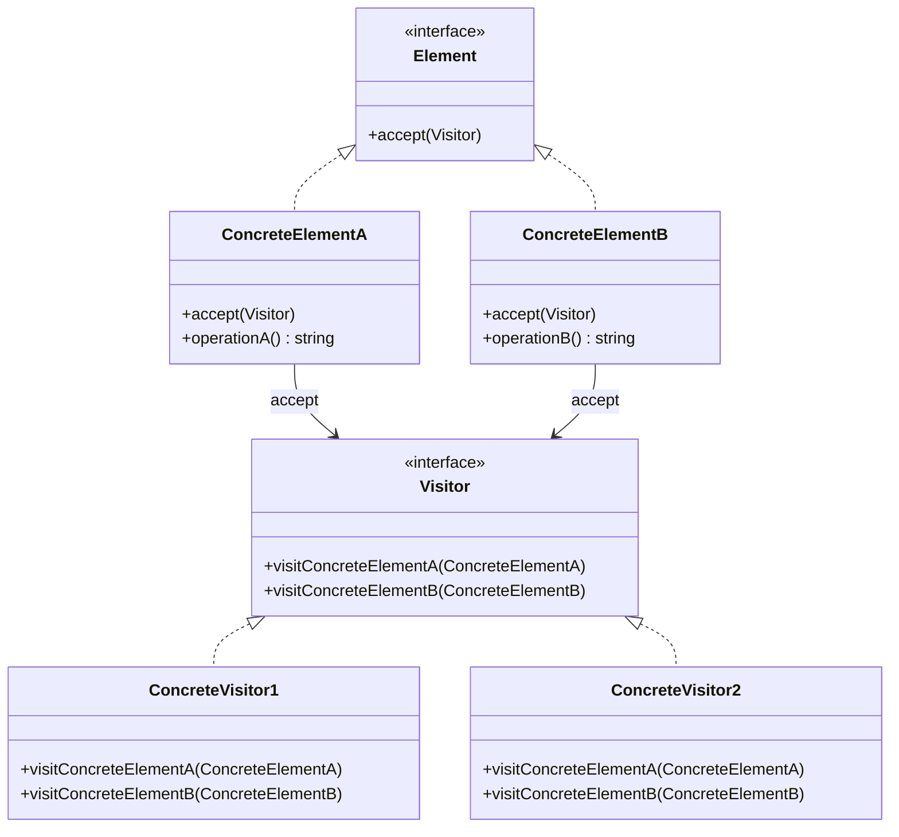

## 5.11.3 Implementation in TypeScript

The Visitor Pattern is a behavioral design pattern that allows us to separate algorithms from the objects on which they operate. This pattern is particularly useful when dealing with complex object structures, as it promotes the addition of new operations without modifying the objects themselves. In this section, we will explore how to implement the Visitor Pattern in TypeScript, leveraging its strong typing and interface enforcement to create robust and maintainable code.

### Understanding the Visitor Pattern

Before diving into the TypeScript implementation, let's briefly recap the core components of the Visitor Pattern:

1. **Visitor Interface**: Defines a visit operation for each type of element in the object structure.
2. **Concrete Visitor**: Implements the operations defined in the Visitor interface.
3. **Element Interface**: Declares an `accept` method that takes a visitor as an argument.
4. **Concrete Element**: Implements the `accept` method, which calls the visitor's operation corresponding to the element's class.

### Defining Interfaces and Abstract Classes

In TypeScript, we can define the Visitor and Element interfaces with type annotations to ensure that all necessary methods are implemented. This is one of the key advantages of using TypeScript, as it enforces method signatures and helps catch errors at compile time.

```typescript
// Visitor interface
interface Visitor {
  visitConcreteElementA(element: ConcreteElementA): void;
  visitConcreteElementB(element: ConcreteElementB): void;
}

// Element interface
interface Element {
  accept(visitor: Visitor): void;
}
```

### Implementing Concrete Elements

Concrete elements implement the `accept` method, which calls the appropriate visitor method. This setup allows the visitor to perform operations on the element without the element needing to know the details of those operations.

```typescript
// Concrete Element A
class ConcreteElementA implements Element {
  accept(visitor: Visitor): void {
    visitor.visitConcreteElementA(this);
  }

  operationA(): string {
    return "ConcreteElementA operation";
  }
}

// Concrete Element B
class ConcreteElementB implements Element {
  accept(visitor: Visitor): void {
    visitor.visitConcreteElementB(this);
  }

  operationB(): string {
    return "ConcreteElementB operation";
  }
}
```

### Implementing Concrete Visitors

Concrete visitors implement the Visitor interface and define the operations to be performed on each type of element. This separation allows us to add new operations without altering the element classes.

```typescript
// Concrete Visitor 1
class ConcreteVisitor1 implements Visitor {
  visitConcreteElementA(element: ConcreteElementA): void {
    console.log(`ConcreteVisitor1: ${element.operationA()}`);
  }

  visitConcreteElementB(element: ConcreteElementB): void {
    console.log(`ConcreteVisitor1: ${element.operationB()}`);
  }
}

// Concrete Visitor 2
class ConcreteVisitor2 implements Visitor {
  visitConcreteElementA(element: ConcreteElementA): void {
    console.log(`ConcreteVisitor2: ${element.operationA()}`);
  }

  visitConcreteElementB(element: ConcreteElementB): void {
    console.log(`ConcreteVisitor2: ${element.operationB()}`);
  }
}
```

### Using the Visitor Pattern

With the elements and visitors defined, we can now demonstrate how to use the Visitor Pattern. The client code will create instances of elements and visitors, and then iterate over the elements, applying visitors to them.

```typescript
// Client code
const elements: Element[] = [new ConcreteElementA(), new ConcreteElementB()];

const visitor1 = new ConcreteVisitor1();
const visitor2 = new ConcreteVisitor2();

elements.forEach(element => {
  element.accept(visitor1);
  element.accept(visitor2);
});
```

### Advantages of Using TypeScript

TypeScript offers several advantages when implementing the Visitor Pattern:

1. **Strong Typing**: TypeScript's type system ensures that all methods are implemented correctly, reducing runtime errors.
2. **Interface Enforcement**: Interfaces in TypeScript enforce method signatures, ensuring consistency across implementations.
3. **Maintainability**: By separating operations from the elements, the Visitor Pattern makes it easier to maintain and extend the codebase.
4. **Generics**: Although not used in this example, TypeScript's generics can be leveraged to create more flexible and reusable visitor implementations.

### Visualizing the Visitor Pattern

Let's visualize the interaction between elements and visitors using a class diagram:



### Try It Yourself

To deepen your understanding, try modifying the code examples:

- **Add a new Concrete Element**: Implement a new element class and update the visitors to handle it.
- **Create a new Concrete Visitor**: Define a visitor that performs a different operation on the elements.
- **Use Generics**: Experiment with TypeScript generics to create a more flexible visitor interface.

### Knowledge Check

- **Why is the Visitor Pattern useful for complex object structures?**
- **How does TypeScript's type system enhance the implementation of the Visitor Pattern?**
- **What are the benefits of separating operations from the elements in the Visitor Pattern?**

### Conclusion

The Visitor Pattern is a powerful tool for managing complex object structures, and TypeScript's strong typing and interface enforcement make it an ideal language for implementing this pattern. By separating operations from the elements, we can add new functionality without altering existing code, leading to more maintainable and scalable software.

Remember, this is just the beginning. As you progress, you'll build more complex and interactive applications. Keep experimenting, stay curious, and enjoy the journey!

## Quiz Time!



### What is the primary purpose of the Visitor Pattern?

- [x] To separate algorithms from the objects on which they operate
- [ ] To encapsulate object creation
- [ ] To manage object lifecycles
- [ ] To provide a simplified interface to a complex subsystem

> **Explanation:** The Visitor Pattern allows us to separate algorithms from the objects on which they operate, making it easier to add new operations without modifying the objects.

### How does TypeScript enforce method signatures in the Visitor Pattern?

- [x] Through interfaces
- [ ] Through abstract classes only
- [ ] Through dynamic typing
- [ ] Through runtime checks

> **Explanation:** TypeScript uses interfaces to enforce method signatures, ensuring that all necessary methods are implemented correctly.

### Which of the following is a key advantage of using TypeScript for the Visitor Pattern?

- [x] Strong typing
- [ ] Dynamic typing
- [ ] Lack of interfaces
- [ ] Weak typing

> **Explanation:** TypeScript's strong typing ensures that all methods are implemented correctly, reducing runtime errors.

### What method do elements implement in the Visitor Pattern?

- [x] accept
- [ ] visit
- [ ] execute
- [ ] perform

> **Explanation:** Elements implement the `accept` method, which takes a visitor as an argument and calls the appropriate visitor method.

### What is the role of a Concrete Visitor in the Visitor Pattern?

- [x] To define operations to be performed on each type of element
- [ ] To create elements
- [ ] To manage element lifecycles
- [ ] To provide a simplified interface to elements

> **Explanation:** Concrete Visitors implement the Visitor interface and define the operations to be performed on each type of element.

### How can you add new operations to elements in the Visitor Pattern?

- [x] By creating new Concrete Visitors
- [ ] By modifying existing elements
- [ ] By creating new elements
- [ ] By modifying existing visitors

> **Explanation:** New operations can be added by creating new Concrete Visitors, without modifying existing elements.

### What is a potential modification you can try in the provided code examples?

- [x] Add a new Concrete Element
- [ ] Remove all visitors
- [ ] Use dynamic typing
- [ ] Remove all elements

> **Explanation:** You can add a new Concrete Element and update the visitors to handle it, enhancing the pattern's flexibility.

### What is the benefit of separating operations from elements in the Visitor Pattern?

- [x] It makes the codebase more maintainable and scalable
- [ ] It reduces the number of classes
- [ ] It simplifies object creation
- [ ] It increases coupling between classes

> **Explanation:** Separating operations from elements makes the codebase more maintainable and scalable, as new functionality can be added without altering existing code.

### What is a key feature of TypeScript that enhances the Visitor Pattern?

- [x] Interface enforcement
- [ ] Lack of type safety
- [ ] Dynamic typing
- [ ] Lack of interfaces

> **Explanation:** TypeScript's interface enforcement ensures consistency across implementations, enhancing the Visitor Pattern.

### True or False: The Visitor Pattern allows for the addition of new operations without modifying the existing elements.

- [x] True
- [ ] False

> **Explanation:** True. The Visitor Pattern allows for the addition of new operations by creating new visitors, without modifying the existing elements.


