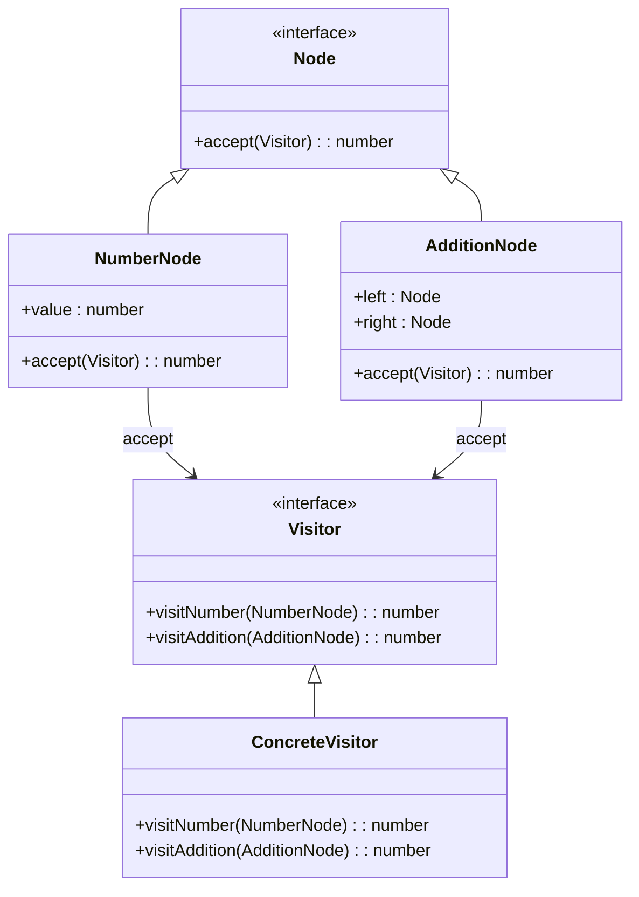

## 5.11.4 Use Cases and Examples

The Visitor pattern is a powerful behavioral design pattern that allows you to separate algorithms from the objects on which they operate. This separation makes it easier to add new operations without modifying the objects themselves, which is particularly useful in scenarios where the object structure is stable but the operations applied to them are subject to change. In this section, we will explore practical use cases of the Visitor pattern, including compilers processing syntax trees, file system operations, and applying operations to composite objects. We will also provide code snippets in JavaScript and TypeScript to illustrate these use cases, discuss the benefits and trade-offs of using the Visitor pattern, and offer tips for effective implementation and maintenance.

### Understanding the Visitor Pattern

Before diving into specific use cases, let's briefly recap the Visitor pattern's core concept. The pattern involves two main components:

1. **Visitor Interface**: Defines a visit method for each type of element in the object structure.
2. **Concrete Visitor**: Implements the visitor interface and defines the operations to be performed on the elements.
3. **Element Interface**: Defines an accept method that takes a visitor as an argument.
4. **Concrete Element**: Implements the element interface and calls the visitor's visit method.

This structure allows you to define new operations on elements without changing their classes, adhering to the open/closed principle.

### Use Case 1: Compilers and Syntax Trees

Compilers are a classic example of the Visitor pattern in action. In a compiler, the source code is parsed into an abstract syntax tree (AST), where each node represents a construct in the source language. The Visitor pattern is used to traverse the AST and perform various operations, such as type checking, code generation, and optimization.

#### Code Example: Syntax Tree Traversal

Let's consider a simple example of an AST with nodes representing different expressions. We'll use the Visitor pattern to evaluate these expressions.

```typescript
// Define the Visitor interface
interface Visitor {
  visitNumber(node: NumberNode): number;
  visitAddition(node: AdditionNode): number;
}

// Define the Element interface
interface Node {
  accept(visitor: Visitor): number;
}

// Concrete Element: NumberNode
class NumberNode implements Node {
  constructor(public value: number) {}

  accept(visitor: Visitor): number {
    return visitor.visitNumber(this);
  }
}

// Concrete Element: AdditionNode
class AdditionNode implements Node {
  constructor(public left: Node, public right: Node) {}

  accept(visitor: Visitor): number {
    return visitor.visitAddition(this);
  }
}

// Concrete Visitor: Evaluator
class Evaluator implements Visitor {
  visitNumber(node: NumberNode): number {
    return node.value;
  }

  visitAddition(node: AdditionNode): number {
    return node.left.accept(this) + node.right.accept(this);
  }
}

// Usage
const tree: Node = new AdditionNode(new NumberNode(1), new NumberNode(2));
const evaluator = new Evaluator();
console.log(`Result: ${tree.accept(evaluator)}`); // Output: Result: 3
```

In this example, the `Evaluator` visitor traverses the syntax tree and computes the result of the expression. This approach makes it easy to add new operations, such as printing or optimizing expressions, by simply creating new visitors.

### Use Case 2: File System Operations

Another practical application of the Visitor pattern is in file system operations. Consider a scenario where you need to perform different operations on files and directories, such as calculating their size, listing their contents, or applying permissions.

#### Code Example: File System Visitor

Let's implement a simple file system visitor that calculates the total size of files in a directory.

```typescript
// Define the Visitor interface
interface FileSystemVisitor {
  visitFile(file: File): number;
  visitDirectory(directory: Directory): number;
}

// Define the Element interface
interface FileSystemElement {
  accept(visitor: FileSystemVisitor): number;
}

// Concrete Element: File
class File implements FileSystemElement {
  constructor(public name: string, public size: number) {}

  accept(visitor: FileSystemVisitor): number {
    return visitor.visitFile(this);
  }
}

// Concrete Element: Directory
class Directory implements FileSystemElement {
  private elements: FileSystemElement[] = [];

  constructor(public name: string) {}

  add(element: FileSystemElement) {
    this.elements.push(element);
  }

  accept(visitor: FileSystemVisitor): number {
    return visitor.visitDirectory(this);
  }

  getElements(): FileSystemElement[] {
    return this.elements;
  }
}

// Concrete Visitor: SizeCalculator
class SizeCalculator implements FileSystemVisitor {
  visitFile(file: File): number {
    return file.size;
  }

  visitDirectory(directory: Directory): number {
    return directory.getElements().reduce((total, element) => {
      return total + element.accept(this);
    }, 0);
  }
}

// Usage
const root = new Directory('root');
const file1 = new File('file1.txt', 100);
const file2 = new File('file2.txt', 200);
const subDir = new Directory('subDir');
subDir.add(new File('file3.txt', 300));
root.add(file1);
root.add(file2);
root.add(subDir);

const sizeCalculator = new SizeCalculator();
console.log(`Total size: ${root.accept(sizeCalculator)} bytes`); // Output: Total size: 600 bytes
```

In this example, the `SizeCalculator` visitor traverses the file system structure and calculates the total size of all files. This pattern allows for easy addition of new operations, such as counting files or applying security checks, by implementing new visitors.

### Use Case 3: Operations on Composite Objects

The Visitor pattern is also useful for applying operations to composite objects. Consider a graphics application where you have shapes like circles, rectangles, and groups of shapes. You might want to perform operations like rendering, calculating area, or exporting to different formats.

#### Code Example: Graphics Visitor

Let's implement a visitor that calculates the total area of a group of shapes.

```typescript
// Define the Visitor interface
interface ShapeVisitor {
  visitCircle(circle: Circle): number;
  visitRectangle(rectangle: Rectangle): number;
  visitGroup(group: Group): number;
}

// Define the Element interface
interface Shape {
  accept(visitor: ShapeVisitor): number;
}

// Concrete Element: Circle
class Circle implements Shape {
  constructor(public radius: number) {}

  accept(visitor: ShapeVisitor): number {
    return visitor.visitCircle(this);
  }
}

// Concrete Element: Rectangle
class Rectangle implements Shape {
  constructor(public width: number, public height: number) {}

  accept(visitor: ShapeVisitor): number {
    return visitor.visitRectangle(this);
  }
}

// Concrete Element: Group
class Group implements Shape {
  private shapes: Shape[] = [];

  add(shape: Shape) {
    this.shapes.push(shape);
  }

  accept(visitor: ShapeVisitor): number {
    return visitor.visitGroup(this);
  }

  getShapes(): Shape[] {
    return this.shapes;
  }
}

// Concrete Visitor: AreaCalculator
class AreaCalculator implements ShapeVisitor {
  visitCircle(circle: Circle): number {
    return Math.PI * circle.radius * circle.radius;
  }

  visitRectangle(rectangle: Rectangle): number {
    return rectangle.width * rectangle.height;
  }

  visitGroup(group: Group): number {
    return group.getShapes().reduce((total, shape) => {
      return total + shape.accept(this);
    }, 0);
  }
}

// Usage
const circle = new Circle(5);
const rectangle = new Rectangle(4, 6);
const group = new Group();
group.add(circle);
group.add(rectangle);

const areaCalculator = new AreaCalculator();
console.log(`Total area: ${group.accept(areaCalculator)}`); // Output: Total area: 103.53981633974483
```

In this example, the `AreaCalculator` visitor computes the total area of all shapes in a group. This pattern allows for easy extension to support new shapes or operations, such as perimeter calculation or rendering.

### Benefits of the Visitor Pattern

The Visitor pattern offers several advantages:

- **Ease of Adding New Operations**: By defining new visitors, you can add new operations without modifying existing element classes.
- **Separation of Concerns**: The pattern separates the algorithm from the object structure, promoting cleaner and more maintainable code.
- **Flexibility**: It allows you to define operations that can be applied to a wide variety of objects.

### Trade-offs and Challenges

Despite its benefits, the Visitor pattern has some trade-offs:

- **Difficulty Adding New Element Classes**: Adding new element classes requires modifying all existing visitors, which can be cumbersome.
- **Complexity**: The pattern can introduce additional complexity, especially in large systems with many element types and visitors.

### Tips for Effective Implementation

To effectively implement and maintain the Visitor pattern, consider the following tips:

- **Plan for Stability**: Use the Visitor pattern when the object structure is stable, and new operations are expected to be added frequently.
- **Use TypeScript Features**: Leverage TypeScript's strong typing and interfaces to ensure type safety and clarity in your implementations.
- **Document Visitors and Elements**: Clearly document the purpose and behavior of each visitor and element to aid in maintenance and future development.

### Visualizing the Visitor Pattern

To better understand the Visitor pattern, let's visualize the interaction between visitors and elements using a class diagram.



This diagram illustrates the relationship between the visitor interface, concrete visitors, element interface, and concrete elements. The `accept` method in each element class allows the visitor to perform operations on it, enabling the separation of algorithms from the object structure.

### Try It Yourself

To deepen your understanding of the Visitor pattern, try modifying the code examples provided:

- **Add New Operations**: Implement a new visitor that performs a different operation, such as printing or logging details of each element.
- **Extend Element Classes**: Add a new type of element to the file system or graphics examples and update the visitors accordingly.
- **Experiment with TypeScript Features**: Use TypeScript's advanced features, such as generics or union types, to enhance your visitor implementations.

### Further Reading

For more information on the Visitor pattern and its applications, consider exploring the following resources:

- [Design Patterns: Elements of Reusable Object-Oriented Software](https://en.wikipedia.org/wiki/Design_Patterns) - The classic book by Erich Gamma, Richard Helm, Ralph Johnson, and John Vlissides.
- [MDN Web Docs: JavaScript](https://developer.mozilla.org/en-US/docs/Web/JavaScript) - Comprehensive documentation on JavaScript, including design patterns.
- [TypeScript Handbook](https://www.typescriptlang.org/docs/handbook/intro.html) - Official TypeScript documentation with guides and examples.

### Embrace the Journey

Remember, mastering design patterns is a journey that requires practice and experimentation. As you explore the Visitor pattern and other design patterns, you'll gain valuable insights into writing more maintainable and scalable code. Keep experimenting, stay curious, and enjoy the journey!

## Quiz Time!



### Which of the following is a key benefit of the Visitor pattern?

- [x] Ease of adding new operations
- [ ] Simplifying the addition of new element classes
- [ ] Reducing the number of classes in a system
- [ ] Eliminating the need for interfaces

> **Explanation:** The Visitor pattern makes it easy to add new operations without modifying existing element classes, adhering to the open/closed principle.

### What is a common use case for the Visitor pattern?

- [x] Compilers processing syntax trees
- [ ] Implementing singleton objects
- [ ] Managing database connections
- [ ] Handling user authentication

> **Explanation:** The Visitor pattern is commonly used in compilers to process syntax trees, allowing for operations like type checking and code generation.

### In the Visitor pattern, what role does the `accept` method play?

- [x] It allows visitors to perform operations on elements
- [ ] It creates new instances of visitors
- [ ] It modifies the internal state of elements
- [ ] It initializes the visitor interface

> **Explanation:** The `accept` method in each element class allows the visitor to perform operations on it, enabling the separation of algorithms from the object structure.

### What is a trade-off of using the Visitor pattern?

- [x] Difficulty adding new element classes
- [ ] Increased memory usage
- [ ] Reduced code readability
- [ ] Limited scalability

> **Explanation:** Adding new element classes requires modifying all existing visitors, which can be cumbersome and is a trade-off of using the Visitor pattern.

### How can TypeScript enhance the implementation of the Visitor pattern?

- [x] By providing strong typing and interfaces
- [ ] By reducing the number of classes needed
- [ ] By eliminating the need for the `accept` method
- [ ] By automatically generating visitor classes

> **Explanation:** TypeScript's strong typing and interfaces ensure type safety and clarity in Visitor pattern implementations.

### Which of the following is NOT a component of the Visitor pattern?

- [ ] Visitor Interface
- [ ] Concrete Visitor
- [x] Singleton Instance
- [ ] Element Interface

> **Explanation:** The Singleton Instance is not a component of the Visitor pattern. The pattern involves Visitor Interface, Concrete Visitor, and Element Interface.

### What is the primary purpose of the Visitor pattern?

- [x] To separate algorithms from the objects on which they operate
- [ ] To create a single instance of a class
- [ ] To manage object creation mechanisms
- [ ] To provide a simplified interface to a complex subsystem

> **Explanation:** The Visitor pattern separates algorithms from the objects on which they operate, allowing for easy addition of new operations.

### In the file system example, what does the `SizeCalculator` visitor do?

- [x] Calculates the total size of all files
- [ ] Deletes files from the directory
- [ ] Renames files and directories
- [ ] Compresses files to save space

> **Explanation:** The `SizeCalculator` visitor traverses the file system structure and calculates the total size of all files.

### What is a benefit of using the Visitor pattern in graphics applications?

- [x] It allows for easy extension to support new shapes or operations
- [ ] It reduces the number of shape classes needed
- [ ] It automatically renders shapes without additional code
- [ ] It eliminates the need for a graphics library

> **Explanation:** The Visitor pattern allows for easy extension to support new shapes or operations, such as rendering or calculating areas.

### True or False: The Visitor pattern is ideal for situations where the object structure is frequently changing.

- [ ] True
- [x] False

> **Explanation:** The Visitor pattern is best suited for situations where the object structure is stable, and new operations are expected to be added frequently.


