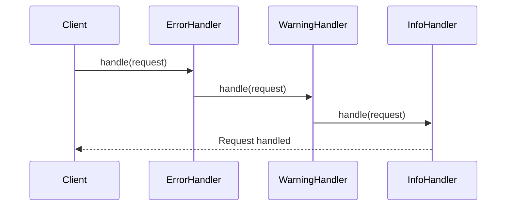

## 5.2.1 Intent and Motivation

In the realm of software design, the Chain of Responsibility pattern stands out as a powerful tool for managing the flow of requests through a series of handlers. This pattern is particularly useful in scenarios where multiple objects might handle a request, but the handler is not known in advance. By allowing a request to pass through a chain of potential handlers, the Chain of Responsibility pattern decouples the sender of a request from its receiver, promoting flexibility and maintainability in code.

### Understanding the Chain of Responsibility Pattern

The Chain of Responsibility pattern is a behavioral design pattern that allows an object to send a command without knowing which object will handle it. This is achieved by passing the request along a chain of potential handlers until one of them handles it. The pattern is particularly useful in scenarios where multiple handlers can process a request, but the specific handler is determined at runtime.

#### Real-World Analogy: Email Forwarding

Consider the analogy of an email being forwarded within an organization until it reaches the right department. When an email arrives, it might not be immediately clear which department should handle it. The email is passed from one department to another until it reaches the appropriate handler. This process ensures that the sender doesn't need to know the internal structure of the organization or which department will ultimately handle the request.

### Problems of Tight Coupling

Without the Chain of Responsibility pattern, a system might suffer from tight coupling between the sender and receiver of a request. In a tightly coupled system, the sender must know exactly which receiver will handle the request, leading to rigid code that is difficult to modify or extend. This can result in a system that is hard to maintain, as changes to the handling logic require changes to the sender as well.

#### Example of Tight Coupling

Imagine a logging system where different types of log messages (e.g., error, warning, info) are handled by different components. Without the Chain of Responsibility pattern, the logger would need to know exactly which component handles each type of message, leading to a complex and inflexible system.

### Promoting Flexibility with the Chain of Responsibility Pattern

The Chain of Responsibility pattern addresses the problem of tight coupling by allowing the sender to pass a request along a chain of handlers. Each handler in the chain has the opportunity to process the request or pass it to the next handler. This approach promotes flexibility, as new handlers can be added or removed without affecting the sender or other handlers in the chain.

#### Benefits of the Chain of Responsibility Pattern

1. **Decoupling**: The sender and receiver are decoupled, allowing for more flexible and maintainable code.
2. **Dynamic Assignment**: Handlers can be assigned dynamically at runtime, making it easy to change the handling logic without modifying the sender.
3. **Responsibility Sharing**: Multiple handlers can share the responsibility of processing a request, distributing the workload and improving system performance.

### Implementing the Chain of Responsibility Pattern

Let's explore how to implement the Chain of Responsibility pattern in JavaScript and TypeScript. We'll start by defining a simple example in JavaScript and then enhance it with TypeScript's type safety features.

#### JavaScript Implementation

```javascript
// Abstract Handler
class Handler {
  setNext(handler) {
    this.nextHandler = handler;
    return handler;
  }

  handle(request) {
    if (this.nextHandler) {
      return this.nextHandler.handle(request);
    }
    return null;
  }
}

// Concrete Handlers
class ErrorHandler extends Handler {
  handle(request) {
    if (request.type === 'error') {
      console.log('ErrorHandler: Handling error request');
      return true;
    }
    return super.handle(request);
  }
}

class WarningHandler extends Handler {
  handle(request) {
    if (request.type === 'warning') {
      console.log('WarningHandler: Handling warning request');
      return true;
    }
    return super.handle(request);
  }
}

class InfoHandler extends Handler {
  handle(request) {
    if (request.type === 'info') {
      console.log('InfoHandler: Handling info request');
      return true;
    }
    return super.handle(request);
  }
}

// Client code
const errorHandler = new ErrorHandler();
const warningHandler = new WarningHandler();
const infoHandler = new InfoHandler();

errorHandler.setNext(warningHandler).setNext(infoHandler);

const requests = [
  { type: 'info', message: 'This is an info message' },
  { type: 'warning', message: 'This is a warning message' },
  { type: 'error', message: 'This is an error message' },
];

requests.forEach(request => {
  errorHandler.handle(request);
});
```

In this example, we define an abstract `Handler` class with a `setNext` method to set the next handler in the chain and a `handle` method to process the request. Concrete handlers (`ErrorHandler`, `WarningHandler`, `InfoHandler`) extend the `Handler` class and override the `handle` method to process specific types of requests.

#### TypeScript Implementation

Now, let's enhance the implementation with TypeScript to add type safety and improve code clarity.

```typescript
// Abstract Handler
abstract class Handler {
  private nextHandler: Handler | null = null;

  public setNext(handler: Handler): Handler {
    this.nextHandler = handler;
    return handler;
  }

  public handle(request: Request): boolean {
    if (this.nextHandler) {
      return this.nextHandler.handle(request);
    }
    return false;
  }
}

// Request type
interface Request {
  type: string;
  message: string;
}

// Concrete Handlers
class ErrorHandler extends Handler {
  public handle(request: Request): boolean {
    if (request.type === 'error') {
      console.log('ErrorHandler: Handling error request');
      return true;
    }
    return super.handle(request);
  }
}

class WarningHandler extends Handler {
  public handle(request: Request): boolean {
    if (request.type === 'warning') {
      console.log('WarningHandler: Handling warning request');
      return true;
    }
    return super.handle(request);
  }
}

class InfoHandler extends Handler {
  public handle(request: Request): boolean {
    if (request.type === 'info') {
      console.log('InfoHandler: Handling info request');
      return true;
    }
    return super.handle(request);
  }
}

// Client code
const errorHandler = new ErrorHandler();
const warningHandler = new WarningHandler();
const infoHandler = new InfoHandler();

errorHandler.setNext(warningHandler).setNext(infoHandler);

const requests: Request[] = [
  { type: 'info', message: 'This is an info message' },
  { type: 'warning', message: 'This is a warning message' },
  { type: 'error', message: 'This is an error message' },
];

requests.forEach(request => {
  errorHandler.handle(request);
});
```

In the TypeScript implementation, we define a `Request` interface to ensure that all requests have a `type` and `message` property. The `Handler` class and its subclasses are updated to use this interface, providing type safety and reducing the risk of runtime errors.

### Visualizing the Chain of Responsibility Pattern

To better understand the flow of requests through the chain of handlers, let's visualize the process using a sequence diagram.



This diagram illustrates the sequence of interactions between the client and the handlers. The client sends a request to the `ErrorHandler`, which passes it to the `WarningHandler`, and finally to the `InfoHandler`, which handles the request.

### Try It Yourself

Now that we've explored the Chain of Responsibility pattern, it's time to experiment with the code. Try modifying the code to add a new handler for a different type of request, such as `debug`. Observe how easy it is to extend the chain without modifying the existing handlers or client code.

### Knowledge Check

Before we wrap up, let's reinforce what we've learned with a few questions:

- What is the primary purpose of the Chain of Responsibility pattern?
- How does this pattern promote flexibility in handling requests?
- What are the benefits of decoupling the sender and receiver in a system?

### Embrace the Journey

Remember, mastering design patterns is a journey. As you continue to explore and implement these patterns, you'll gain a deeper understanding of how to create flexible, maintainable, and scalable software. Keep experimenting, stay curious, and enjoy the journey!

## Quiz Time!



### What is the primary purpose of the Chain of Responsibility pattern?

- [x] To decouple the sender and receiver of a request
- [ ] To ensure a request is handled by multiple handlers simultaneously
- [ ] To prioritize requests based on their importance
- [ ] To simplify the request handling process

> **Explanation:** The Chain of Responsibility pattern is designed to decouple the sender and receiver of a request, allowing the request to pass through a chain of handlers until one of them handles it.

### How does the Chain of Responsibility pattern promote flexibility?

- [x] By allowing handlers to be added or removed without affecting the sender
- [ ] By ensuring all requests are handled by a single handler
- [ ] By requiring the sender to know the exact handler for each request
- [ ] By limiting the number of handlers in the chain

> **Explanation:** The pattern promotes flexibility by allowing handlers to be added or removed without affecting the sender or other handlers, enabling dynamic assignment of responsibilities.

### Which of the following is a benefit of the Chain of Responsibility pattern?

- [x] Decoupling the sender and receiver
- [ ] Ensuring all requests are handled by the first handler
- [ ] Increasing the complexity of the request handling process
- [ ] Reducing the number of handlers needed

> **Explanation:** One of the key benefits of the Chain of Responsibility pattern is decoupling the sender and receiver, which enhances flexibility and maintainability.

### In the Chain of Responsibility pattern, what happens if no handler processes the request?

- [x] The request is not handled
- [ ] The request is automatically handled by the sender
- [ ] The request is sent back to the sender
- [ ] The request is logged as an error

> **Explanation:** If no handler processes the request, it remains unhandled, as the pattern relies on one of the handlers in the chain to take responsibility.

### What is a real-world analogy for the Chain of Responsibility pattern?

- [x] An email being forwarded until it reaches the right department
- [ ] A phone call being answered by multiple people simultaneously
- [ ] A letter being sent directly to the recipient
- [ ] A package being delivered by a single courier

> **Explanation:** The analogy of an email being forwarded until it reaches the right department illustrates how the Chain of Responsibility pattern allows a request to pass through a chain of handlers.

### How does the Chain of Responsibility pattern affect system performance?

- [x] It can improve performance by distributing the workload among multiple handlers
- [ ] It always decreases performance due to increased complexity
- [ ] It has no impact on performance
- [ ] It ensures all requests are processed faster

> **Explanation:** By distributing the workload among multiple handlers, the pattern can improve system performance, especially in scenarios with high request volumes.

### Which of the following best describes a handler in the Chain of Responsibility pattern?

- [x] An object that can process a request or pass it to the next handler
- [ ] An object that always processes every request
- [ ] An object that sends requests to the sender
- [ ] An object that logs requests without processing them

> **Explanation:** A handler in the Chain of Responsibility pattern is an object that can either process a request or pass it to the next handler in the chain.

### What is a potential drawback of the Chain of Responsibility pattern?

- [x] Requests may remain unhandled if no handler takes responsibility
- [ ] It requires the sender to know the exact handler for each request
- [ ] It limits the number of handlers that can be used
- [ ] It increases the coupling between sender and receiver

> **Explanation:** A potential drawback is that requests may remain unhandled if no handler in the chain takes responsibility for processing them.

### How can the Chain of Responsibility pattern be extended?

- [x] By adding new handlers to the chain
- [ ] By removing all existing handlers
- [ ] By modifying the sender to handle requests directly
- [ ] By ensuring all handlers process every request

> **Explanation:** The pattern can be extended by adding new handlers to the chain, allowing for greater flexibility and adaptability.

### True or False: The Chain of Responsibility pattern requires the sender to know the exact handler for each request.

- [ ] True
- [x] False

> **Explanation:** False. One of the key features of the Chain of Responsibility pattern is that it decouples the sender from the receiver, so the sender does not need to know which handler will process the request.


