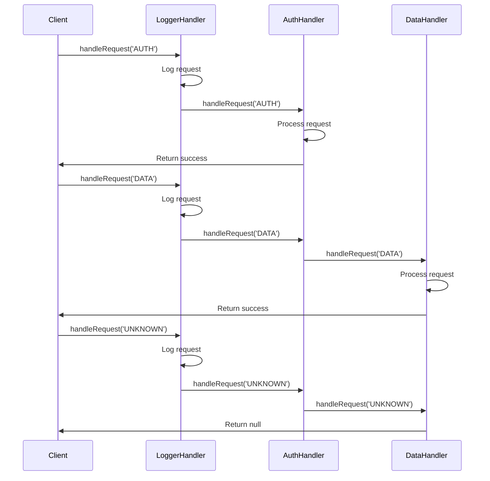

## 5.2.2 Implementation in JavaScript

The Chain of Responsibility pattern is a behavioral design pattern that allows an object to pass a request along a chain of potential handlers until one of them handles the request. This pattern promotes loose coupling and flexibility in assigning responsibilities to objects. In this section, we will explore how to implement the Chain of Responsibility pattern in JavaScript, providing code examples and explanations along the way.

### Understanding the Chain of Responsibility Pattern

Before diving into the implementation, let's briefly understand the core concepts of the Chain of Responsibility pattern:

- **Handler**: An object or class that processes requests. Each handler has a reference to the next handler in the chain.
- **Request**: The data or action that needs to be processed by the handlers.
- **Chain**: A series of handlers linked together, where each handler decides whether to process the request or pass it to the next handler.

The primary goal of this pattern is to decouple the sender of a request from its receiver, allowing multiple objects to handle the request without the sender needing to know which object will handle it.

### Implementing the Chain of Responsibility in JavaScript

Let's start by defining a simple handler class in JavaScript. We'll create a `Handler` class with a method to handle requests and a reference to the next handler.

```javascript
// Handler class definition
class Handler {
  constructor() {
    this.nextHandler = null; // Reference to the next handler in the chain
  }

  // Method to set the next handler
  setNext(handler) {
    this.nextHandler = handler;
    return handler; // Enable chaining
  }

  // Method to handle the request
  handleRequest(request) {
    if (this.nextHandler) {
      return this.nextHandler.handleRequest(request);
    }
    return null;
  }
}
```

In this basic setup, the `Handler` class has a `setNext` method to set the next handler in the chain and a `handleRequest` method to process the request. If the current handler cannot process the request, it passes it to the next handler.

### Creating Concrete Handlers

Next, let's create some concrete handlers that extend the `Handler` class. Each concrete handler will implement its own logic to determine whether it can handle the request.

```javascript
// Concrete handler for logging requests
class LoggerHandler extends Handler {
  handleRequest(request) {
    console.log(`Logging request: ${request}`);
    return super.handleRequest(request);
  }
}

// Concrete handler for authentication
class AuthHandler extends Handler {
  handleRequest(request) {
    if (request === 'AUTH') {
      console.log('Authentication successful!');
      return true;
    }
    return super.handleRequest(request);
  }
}

// Concrete handler for data processing
class DataHandler extends Handler {
  handleRequest(request) {
    if (request === 'DATA') {
      console.log('Processing data...');
      return true;
    }
    return super.handleRequest(request);
  }
}
```

In this example, we have three concrete handlers: `LoggerHandler`, `AuthHandler`, and `DataHandler`. Each handler checks if it can process the request and, if not, passes it to the next handler in the chain.

### Setting Up the Chain

Now that we have our handlers, let's set up the chain by linking them together. We'll create instances of each handler and use the `setNext` method to establish the chain.

```javascript
// Create instances of handlers
const logger = new LoggerHandler();
const auth = new AuthHandler();
const data = new DataHandler();

// Set up the chain of responsibility
logger.setNext(auth).setNext(data);
```

In this setup, the `LoggerHandler` is the first handler in the chain, followed by the `AuthHandler`, and finally the `DataHandler`. The `setNext` method allows us to chain the handlers together seamlessly.

### Processing Requests

With the chain set up, we can now process requests by passing them to the first handler in the chain. Each handler will decide whether to process the request or pass it to the next handler.

```javascript
// Process requests
console.log('Request: AUTH');
logger.handleRequest('AUTH');

console.log('\nRequest: DATA');
logger.handleRequest('DATA');

console.log('\nRequest: UNKNOWN');
logger.handleRequest('UNKNOWN');
```

**Output:**
```
Request: AUTH
Logging request: AUTH
Authentication successful!

Request: DATA
Logging request: DATA
Processing data...

Request: UNKNOWN
Logging request: UNKNOWN
```

In this example, when we pass the `AUTH` request, the `LoggerHandler` logs it, and the `AuthHandler` processes it. Similarly, the `DATA` request is logged and processed by the `DataHandler`. The `UNKNOWN` request is logged but not processed by any handler.

### JavaScript-Specific Considerations

When implementing the Chain of Responsibility pattern in JavaScript, consider the following:

- **Function Chaining**: JavaScript's ability to return `this` from methods allows for function chaining, which is useful when setting up the chain of handlers.
- **Prototype Inheritance**: JavaScript's prototype-based inheritance can be leveraged to create handler classes, as demonstrated in the examples above.

### Visualizing the Chain of Responsibility

To better understand the flow of requests through the chain, let's visualize the process using a sequence diagram.



**Diagram Description**: This sequence diagram illustrates how requests are passed along the chain of handlers. Each handler logs or processes the request and passes it to the next handler if necessary.

### Try It Yourself

Now that we've covered the basics, try modifying the code examples to experiment with different scenarios:

- **Add a new handler**: Create a new handler class that processes a specific type of request.
- **Reorder handlers**: Change the order of handlers in the chain to see how it affects request processing.
- **Handle multiple requests**: Modify the handlers to process multiple types of requests.

### Knowledge Check

Before we conclude, let's reinforce what we've learned with a few questions:

1. What is the primary purpose of the Chain of Responsibility pattern?
2. How does the `setNext` method contribute to the pattern's implementation?
3. What happens if none of the handlers in the chain can process a request?

### Conclusion

The Chain of Responsibility pattern is a powerful tool for creating flexible and decoupled systems in JavaScript. By allowing multiple handlers to process requests, this pattern promotes scalability and maintainability. Remember, this is just the beginning. As you progress, you'll build more complex and interactive systems. Keep experimenting, stay curious, and enjoy the journey!

## Quiz Time!



### What is the primary purpose of the Chain of Responsibility pattern?

- [x] To decouple the sender of a request from its receiver
- [ ] To ensure a single handler processes all requests
- [ ] To create a circular chain of handlers
- [ ] To prioritize handlers based on their processing speed

> **Explanation:** The Chain of Responsibility pattern decouples the sender of a request from its receiver, allowing multiple objects to handle the request without the sender needing to know which object will handle it.

### How does the `setNext` method contribute to the pattern's implementation?

- [x] It links handlers together to form a chain
- [ ] It processes requests directly
- [ ] It logs requests for debugging
- [ ] It terminates the chain

> **Explanation:** The `setNext` method links handlers together to form a chain, allowing requests to be passed from one handler to the next.

### What happens if none of the handlers in the chain can process a request?

- [x] The request is passed to the end of the chain and returns null
- [ ] The request is automatically processed by the first handler
- [ ] An error is thrown
- [ ] The request is logged and discarded

> **Explanation:** If none of the handlers can process a request, it is passed to the end of the chain and returns null, indicating that no handler was able to process it.

### Which JavaScript feature allows for function chaining in the Chain of Responsibility pattern?

- [x] Returning `this` from methods
- [ ] Using arrow functions
- [ ] Utilizing closures
- [ ] Implementing async/await

> **Explanation:** Returning `this` from methods allows for function chaining, which is useful when setting up the chain of handlers in the Chain of Responsibility pattern.

### In the provided example, which handler processes the 'AUTH' request?

- [x] AuthHandler
- [ ] LoggerHandler
- [ ] DataHandler
- [ ] None of the handlers

> **Explanation:** The `AuthHandler` processes the 'AUTH' request by checking if the request is of type 'AUTH' and then handling it.

### What is the role of the `handleRequest` method in a handler?

- [x] To process the request or pass it to the next handler
- [ ] To terminate the chain
- [ ] To log the request
- [ ] To set up the chain

> **Explanation:** The `handleRequest` method processes the request or passes it to the next handler if the current handler cannot process it.

### How can you add a new handler to the chain?

- [x] Create a new handler class and link it using `setNext`
- [ ] Modify the existing handlers to include the new logic
- [ ] Use a different design pattern
- [ ] Remove an existing handler and replace it

> **Explanation:** To add a new handler to the chain, create a new handler class and link it using the `setNext` method.

### What is the benefit of using the Chain of Responsibility pattern?

- [x] It promotes loose coupling and flexibility
- [ ] It ensures all requests are processed by a single handler
- [ ] It simplifies the code by removing all handlers
- [ ] It increases the complexity of the system

> **Explanation:** The Chain of Responsibility pattern promotes loose coupling and flexibility by allowing multiple handlers to process requests without the sender needing to know which handler will process it.

### Which handler logs the requests in the provided example?

- [x] LoggerHandler
- [ ] AuthHandler
- [ ] DataHandler
- [ ] None of the handlers

> **Explanation:** The `LoggerHandler` logs the requests by printing them to the console before passing them to the next handler.

### True or False: The Chain of Responsibility pattern can only be used for logging requests.

- [ ] True
- [x] False

> **Explanation:** False. The Chain of Responsibility pattern can be used for various purposes, such as logging, authentication, data processing, and more, by allowing multiple handlers to process requests.


