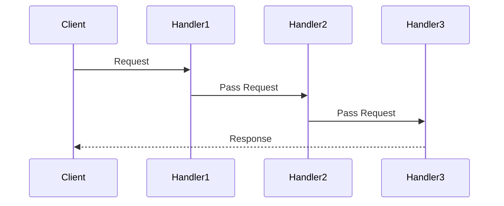

## 5.2.4 Use Cases and Examples

The Chain of Responsibility pattern is a powerful behavioral design pattern that allows an object to pass a request along a chain of potential handlers until the request is processed. This pattern is particularly useful in scenarios where multiple objects can handle a request, but the handler is not known beforehand. By decoupling the sender and receiver, the Chain of Responsibility pattern enhances modularity and flexibility in your code.

### Understanding the Chain of Responsibility Pattern

Before diving into practical examples, let's briefly recap the core concept of the Chain of Responsibility pattern. In this pattern, a series of handler objects are linked together to form a chain. Each handler decides either to process the request or to pass it along to the next handler in the chain. This approach allows multiple handlers to process the request without the sender needing to know which handler will ultimately handle it.

### Practical Use Cases

Let's explore some practical scenarios where the Chain of Responsibility pattern can be applied effectively:

1. **Logging Systems**
2. **Event Propagation in the DOM**
3. **Middleware Processing in Web Servers**

#### 1. Logging Systems

In a logging system, different log levels (e.g., DEBUG, INFO, WARNING, ERROR) might require different handling. The Chain of Responsibility pattern allows you to create a flexible logging system where each log level is handled by a separate handler.

##### JavaScript Example

```javascript
class Logger {
    constructor(level) {
        this.level = level;
        this.nextLogger = null;
    }

    setNextLogger(nextLogger) {
        this.nextLogger = nextLogger;
    }

    logMessage(level, message) {
        if (this.level <= level) {
            this.write(message);
        }
        if (this.nextLogger !== null) {
            this.nextLogger.logMessage(level, message);
        }
    }

    write(message) {
        // To be overridden by subclasses
    }
}

class ConsoleLogger extends Logger {
    write(message) {
        console.log("Console Logger: " + message);
    }
}

class FileLogger extends Logger {
    write(message) {
        console.log("File Logger: " + message);
    }
}

class ErrorLogger extends Logger {
    write(message) {
        console.log("Error Logger: " + message);
    }
}

// Usage
const errorLogger = new ErrorLogger(3);
const fileLogger = new FileLogger(2);
const consoleLogger = new ConsoleLogger(1);

consoleLogger.setNextLogger(fileLogger);
fileLogger.setNextLogger(errorLogger);

consoleLogger.logMessage(1, "This is an information.");
consoleLogger.logMessage(2, "This is a debug level information.");
consoleLogger.logMessage(3, "This is an error information.");
```

In this example, we have three types of loggers: `ConsoleLogger`, `FileLogger`, and `ErrorLogger`. Each logger checks if it can handle the log message based on the log level. If it can, it processes the message; otherwise, it passes the message to the next logger in the chain.

##### TypeScript Example

```typescript
abstract class Logger {
    protected level: number;
    protected nextLogger: Logger | null = null;

    constructor(level: number) {
        this.level = level;
    }

    public setNextLogger(nextLogger: Logger): void {
        this.nextLogger = nextLogger;
    }

    public logMessage(level: number, message: string): void {
        if (this.level <= level) {
            this.write(message);
        }
        if (this.nextLogger !== null) {
            this.nextLogger.logMessage(level, message);
        }
    }

    protected abstract write(message: string): void;
}

class ConsoleLogger extends Logger {
    protected write(message: string): void {
        console.log("Console Logger: " + message);
    }
}

class FileLogger extends Logger {
    protected write(message: string): void {
        console.log("File Logger: " + message);
    }
}

class ErrorLogger extends Logger {
    protected write(message: string): void {
        console.log("Error Logger: " + message);
    }
}

// Usage
const errorLogger = new ErrorLogger(3);
const fileLogger = new FileLogger(2);
const consoleLogger = new ConsoleLogger(1);

consoleLogger.setNextLogger(fileLogger);
fileLogger.setNextLogger(errorLogger);

consoleLogger.logMessage(1, "This is an information.");
consoleLogger.logMessage(2, "This is a debug level information.");
consoleLogger.logMessage(3, "This is an error information.");
```

In the TypeScript example, we use type annotations to ensure type safety. The structure remains similar to the JavaScript example, but with added benefits of TypeScript's static typing.

#### 2. Event Propagation in the DOM

The Chain of Responsibility pattern is inherently used in the DOM's event propagation mechanism, where an event can be handled by multiple elements in the DOM tree.

##### JavaScript Example

```javascript
// HTML structure
// <div id="parent">
//     <button id="child">Click Me!</button>
// </div>

document.getElementById('parent').addEventListener('click', function(event) {
    console.log('Parent clicked');
});

document.getElementById('child').addEventListener('click', function(event) {
    console.log('Child clicked');
    event.stopPropagation(); // Prevents the event from bubbling up to the parent
});

// Try clicking the button and observe the console output
```

In this example, clicking the button triggers the `click` event on both the button and its parent div. The `stopPropagation()` method is used to stop the event from bubbling up the DOM tree, demonstrating a manual intervention in the chain of responsibility.

##### TypeScript Example

```typescript
// HTML structure
// <div id="parent">
//     <button id="child">Click Me!</button>
// </div>

document.getElementById('parent')?.addEventListener('click', (event: MouseEvent) => {
    console.log('Parent clicked');
});

document.getElementById('child')?.addEventListener('click', (event: MouseEvent) => {
    console.log('Child clicked');
    event.stopPropagation(); // Prevents the event from bubbling up to the parent
});

// Try clicking the button and observe the console output
```

In the TypeScript example, we use optional chaining (`?.`) to ensure that the elements exist before attaching event listeners, adding a layer of type safety.

#### 3. Middleware Processing in Web Servers

Middleware in web servers, such as Express.js, is a classic example of the Chain of Responsibility pattern. Each middleware function can process a request, modify it, and pass it to the next middleware in the chain.

##### JavaScript Example

```javascript
const express = require('express');
const app = express();

app.use((req, res, next) => {
    console.log('First middleware');
    next();
});

app.use((req, res, next) => {
    console.log('Second middleware');
    next();
});

app.get('/', (req, res) => {
    res.send('Hello World!');
});

app.listen(3000, () => {
    console.log('Server is running on port 3000');
});
```

In this Express.js example, we have two middleware functions. Each middleware logs a message and then calls `next()` to pass control to the next middleware in the chain. This pattern allows for flexible request processing and response handling.

##### TypeScript Example

```typescript
import express, { Request, Response, NextFunction } from 'express';
const app = express();

app.use((req: Request, res: Response, next: NextFunction) => {
    console.log('First middleware');
    next();
});

app.use((req: Request, res: Response, next: NextFunction) => {
    console.log('Second middleware');
    next();
});

app.get('/', (req: Request, res: Response) => {
    res.send('Hello World!');
});

app.listen(3000, () => {
    console.log('Server is running on port 3000');
});
```

In the TypeScript example, we use type annotations for `Request`, `Response`, and `NextFunction` to ensure type safety and improve code readability.

### Enhancing Modularity and Flexibility

The Chain of Responsibility pattern enhances modularity by allowing each handler to focus on a specific aspect of request processing. This separation of concerns makes it easier to add, remove, or modify handlers without affecting the entire chain. Additionally, the pattern provides flexibility by allowing the chain to be dynamically configured at runtime.

### When to Use the Chain of Responsibility Pattern

The Chain of Responsibility pattern is preferred in situations where:

- Multiple objects can handle a request, but the handler is not known beforehand.
- You want to decouple the sender and receiver of a request.
- You need to dynamically configure the chain of handlers at runtime.

### Tips for Implementing and Debugging Handler Chains

- **Define Clear Responsibilities**: Ensure each handler has a specific responsibility to avoid overlap and confusion.
- **Use Descriptive Names**: Name your handlers and methods descriptively to make the chain easy to understand and maintain.
- **Log Handler Activity**: Implement logging within each handler to track the flow of requests through the chain.
- **Test Each Handler Independently**: Test each handler in isolation to ensure it functions correctly before integrating it into the chain.
- **Handle Errors Gracefully**: Implement error handling within each handler to prevent the chain from breaking unexpectedly.

### Try It Yourself

To deepen your understanding of the Chain of Responsibility pattern, try modifying the examples provided:

- **Logging System**: Add a new logger type, such as a `NetworkLogger`, that sends logs to a remote server.
- **Event Propagation**: Experiment with different DOM structures and event types to see how events propagate through the chain.
- **Middleware Processing**: Create custom middleware functions that perform tasks such as authentication or data validation.

### Visualizing the Chain of Responsibility Pattern

To better understand the flow of requests through a chain of handlers, let's visualize the Chain of Responsibility pattern using a sequence diagram.



In this diagram, the `Client` sends a request to `Handler1`. If `Handler1` cannot process the request, it passes it to `Handler2`, and so on, until a handler processes the request or the chain ends.

### Further Reading

For more information on the Chain of Responsibility pattern and its applications, consider exploring the following resources:

- [MDN Web Docs: Event Handling](https://developer.mozilla.org/en-US/docs/Web/Guide/Events/Event_handlers)
- [Express.js Middleware](https://expressjs.com/en/guide/using-middleware.html)
- [Refactoring Guru: Chain of Responsibility](https://refactoring.guru/design-patterns/chain-of-responsibility)

### Knowledge Check

To reinforce your understanding of the Chain of Responsibility pattern, consider the following questions:

- How does the Chain of Responsibility pattern enhance modularity in your code?
- What are some common use cases for the Chain of Responsibility pattern?
- How can you debug a chain of handlers effectively?

Remember, mastering design patterns is an ongoing journey. Keep experimenting, stay curious, and enjoy the process of learning and applying these powerful concepts in your projects!

## Quiz Time!



### Which design pattern allows an object to pass a request along a chain of potential handlers?

- [x] Chain of Responsibility
- [ ] Observer
- [ ] Strategy
- [ ] Singleton

> **Explanation:** The Chain of Responsibility pattern allows an object to pass a request along a chain of potential handlers until the request is processed.

### In a logging system, which pattern can be used to handle different log levels?

- [x] Chain of Responsibility
- [ ] Factory Method
- [ ] Adapter
- [ ] Proxy

> **Explanation:** The Chain of Responsibility pattern can be used in a logging system to handle different log levels by passing log messages through a chain of loggers.

### What method is used in the DOM to stop an event from propagating up the DOM tree?

- [x] stopPropagation()
- [ ] preventDefault()
- [ ] stopImmediatePropagation()
- [ ] cancelBubble()

> **Explanation:** The stopPropagation() method is used to stop an event from propagating up the DOM tree.

### Which of the following is a common use case for the Chain of Responsibility pattern?

- [x] Middleware processing in web servers
- [ ] Singleton instance creation
- [ ] Data encryption
- [ ] Sorting algorithms

> **Explanation:** Middleware processing in web servers is a common use case for the Chain of Responsibility pattern, where each middleware function can process a request and pass it to the next.

### What is a benefit of using the Chain of Responsibility pattern?

- [x] Enhances modularity and flexibility
- [ ] Ensures a single instance of a class
- [ ] Provides a simplified interface to a complex subsystem
- [ ] Allows incompatible interfaces to work together

> **Explanation:** The Chain of Responsibility pattern enhances modularity and flexibility by allowing each handler to focus on a specific aspect of request processing.

### How can you debug a chain of handlers effectively?

- [x] Implement logging within each handler
- [ ] Use global variables
- [ ] Avoid testing handlers in isolation
- [ ] Remove error handling

> **Explanation:** Implementing logging within each handler helps track the flow of requests through the chain and aids in debugging.

### What should you do to ensure each handler has a specific responsibility?

- [x] Define clear responsibilities for each handler
- [ ] Use generic names for handlers
- [ ] Overlap responsibilities between handlers
- [ ] Avoid testing handlers

> **Explanation:** Defining clear responsibilities for each handler ensures that each handler focuses on a specific task, avoiding overlap and confusion.

### Which of the following is NOT a use case for the Chain of Responsibility pattern?

- [ ] Logging systems
- [ ] Event propagation in the DOM
- [ ] Middleware processing in web servers
- [x] Singleton pattern implementation

> **Explanation:** The Singleton pattern implementation is not a use case for the Chain of Responsibility pattern. The Chain of Responsibility is used for scenarios where a request can be handled by multiple handlers.

### What is a key characteristic of the Chain of Responsibility pattern?

- [x] Decouples the sender and receiver of a request
- [ ] Couples the sender and receiver of a request
- [ ] Ensures a single handler processes the request
- [ ] Requires all handlers to process the request

> **Explanation:** A key characteristic of the Chain of Responsibility pattern is that it decouples the sender and receiver of a request, allowing for flexible request handling.

### True or False: The Chain of Responsibility pattern is preferred when the handler of a request is known beforehand.

- [ ] True
- [x] False

> **Explanation:** False. The Chain of Responsibility pattern is preferred when the handler of a request is not known beforehand, allowing multiple handlers to process the request.


