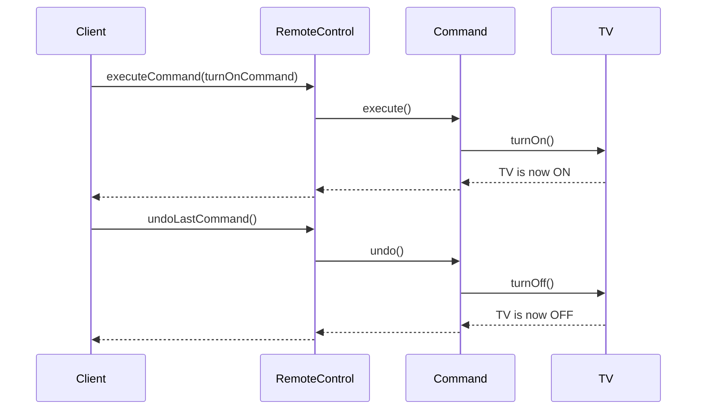

## 5.3.1 Intent and Motivation

In the realm of software design, the Command Pattern stands out as a powerful tool for encapsulating requests as objects. This design pattern is particularly useful in scenarios where you need to decouple the sender of a request from the receiver, allowing for greater flexibility and control over operations. In this section, we will delve into the intent and motivation behind the Command Pattern, exploring its purpose, benefits, and practical applications in JavaScript and TypeScript.

### Understanding the Command Pattern

The Command Pattern is a behavioral design pattern that turns a request into a stand-alone object containing all the information about the request. This transformation allows for parameterization of clients with queues, requests, and operations, as well as supporting undoable operations.

#### Definition and Purpose

At its core, the Command Pattern aims to decouple the object that invokes an operation from the one that knows how to perform it. This separation is achieved by encapsulating the request as an object, which can then be passed around, stored, or manipulated independently of the invoker.

Imagine a scenario where you have a remote control that can send commands to various devices like a TV, a stereo, or a DVD player. Each button on the remote control corresponds to a specific command, such as "turn on," "turn off," "volume up," or "volume down." The remote control itself doesn't know how to execute these commands; it merely sends the command to the appropriate device, which knows how to handle it. This analogy perfectly illustrates the Command Pattern's role in decoupling the invoker from the executor.

### Problems Solved by the Command Pattern

The Command Pattern addresses several common problems in software design, including:

1. **Decoupling Invoker and Receiver**: By encapsulating requests as objects, the Command Pattern separates the invoker (the entity that triggers the request) from the receiver (the entity that executes the request). This separation enhances modularity and allows for more flexible system architectures.

2. **Parameterization of Requests**: Commands can be parameterized with different data, enabling dynamic command execution based on runtime conditions.

3. **Queuing and Scheduling**: Commands can be queued for later execution, allowing for deferred processing and scheduling of operations.

4. **Undo and Redo Functionality**: By storing the state of a command, the Command Pattern facilitates undo and redo operations, which are crucial in applications like text editors and graphic design software.

5. **Logging and Auditing**: Commands can be logged for auditing purposes, providing a detailed history of operations performed within a system.

### Advantages of the Command Pattern

The Command Pattern offers several advantages that make it an attractive choice for software developers:

- **Flexibility**: The pattern allows for easy addition of new commands without altering existing code, promoting extensibility and adaptability to changing requirements.

- **Reusability**: Commands can be reused across different contexts, reducing code duplication and enhancing maintainability.

- **Simplified Code**: By encapsulating complex operations within command objects, the pattern simplifies the codebase, making it easier to understand and maintain.

- **Enhanced Control**: The pattern provides fine-grained control over command execution, enabling features like undo, redo, and logging.

### Implementing the Command Pattern in JavaScript

Let's explore how to implement the Command Pattern in JavaScript with a practical example. We'll create a simple application that simulates a remote control sending commands to a TV.

```javascript
// Command interface
class Command {
  execute() {}
  undo() {}
}

// Receiver class
class TV {
  turnOn() {
    console.log("TV is now ON");
  }

  turnOff() {
    console.log("TV is now OFF");
  }
}

// Concrete command classes
class TurnOnCommand extends Command {
  constructor(tv) {
    super();
    this.tv = tv;
  }

  execute() {
    this.tv.turnOn();
  }

  undo() {
    this.tv.turnOff();
  }
}

class TurnOffCommand extends Command {
  constructor(tv) {
    super();
    this.tv = tv;
  }

  execute() {
    this.tv.turnOff();
  }

  undo() {
    this.tv.turnOn();
  }
}

// Invoker class
class RemoteControl {
  constructor() {
    this.history = [];
  }

  executeCommand(command) {
    command.execute();
    this.history.push(command);
  }

  undoLastCommand() {
    const command = this.history.pop();
    if (command) {
      command.undo();
    }
  }
}

// Client code
const tv = new TV();
const turnOnCommand = new TurnOnCommand(tv);
const turnOffCommand = new TurnOffCommand(tv);
const remoteControl = new RemoteControl();

remoteControl.executeCommand(turnOnCommand); // Output: TV is now ON
remoteControl.executeCommand(turnOffCommand); // Output: TV is now OFF
remoteControl.undoLastCommand(); // Output: TV is now ON
```

In this example, we define a `Command` interface with `execute` and `undo` methods. The `TV` class acts as the receiver, with methods to turn the TV on and off. The `TurnOnCommand` and `TurnOffCommand` classes implement the `Command` interface, encapsulating the actions of turning the TV on and off, respectively. The `RemoteControl` class serves as the invoker, executing and undoing commands as needed.

### Implementing the Command Pattern in TypeScript

Now, let's implement the same example in TypeScript, leveraging its strong typing features.

```typescript
// Command interface
interface Command {
  execute(): void;
  undo(): void;
}

// Receiver class
class TV {
  turnOn(): void {
    console.log("TV is now ON");
  }

  turnOff(): void {
    console.log("TV is now OFF");
  }
}

// Concrete command classes
class TurnOnCommand implements Command {
  private tv: TV;

  constructor(tv: TV) {
    this.tv = tv;
  }

  execute(): void {
    this.tv.turnOn();
  }

  undo(): void {
    this.tv.turnOff();
  }
}

class TurnOffCommand implements Command {
  private tv: TV;

  constructor(tv: TV) {
    this.tv = tv;
  }

  execute(): void {
    this.tv.turnOff();
  }

  undo(): void {
    this.tv.turnOn();
  }
}

// Invoker class
class RemoteControl {
  private history: Command[] = [];

  executeCommand(command: Command): void {
    command.execute();
    this.history.push(command);
  }

  undoLastCommand(): void {
    const command = this.history.pop();
    if (command) {
      command.undo();
    }
  }
}

// Client code
const tv = new TV();
const turnOnCommand = new TurnOnCommand(tv);
const turnOffCommand = new TurnOffCommand(tv);
const remoteControl = new RemoteControl();

remoteControl.executeCommand(turnOnCommand); // Output: TV is now ON
remoteControl.executeCommand(turnOffCommand); // Output: TV is now OFF
remoteControl.undoLastCommand(); // Output: TV is now ON
```

In the TypeScript implementation, we define a `Command` interface with `execute` and `undo` methods. The `TV` class remains the same as in the JavaScript example. The `TurnOnCommand` and `TurnOffCommand` classes implement the `Command` interface, encapsulating the actions of turning the TV on and off. The `RemoteControl` class serves as the invoker, executing and undoing commands as needed.

### Visualizing the Command Pattern

To better understand the Command Pattern, let's visualize the interaction between the invoker, command, and receiver using a sequence diagram.



This diagram illustrates the flow of a command execution and undo operation. The client triggers the execution of a command through the remote control, which then delegates the request to the command object. The command object interacts with the receiver (TV) to perform the desired action. The undo operation follows a similar flow, reversing the action performed.

### Try It Yourself

Now that we've explored the Command Pattern in detail, it's time to experiment with the code examples. Try modifying the code to add new commands, such as "volume up" or "volume down," and observe how the pattern facilitates the addition of new functionality without altering existing code.

### Knowledge Check

To reinforce your understanding of the Command Pattern, consider the following questions:

- How does the Command Pattern decouple the invoker from the receiver?
- What are some practical applications of the Command Pattern in software development?
- How does the Command Pattern support undo and redo functionality?
- What are the advantages of using the Command Pattern in terms of flexibility and extensibility?

### Conclusion

The Command Pattern is a versatile design pattern that offers numerous benefits in software design. By encapsulating requests as objects, it decouples the invoker from the receiver, supports undo and redo functionality, and enhances the flexibility and extensibility of a system. Whether you're building a simple application or a complex system, the Command Pattern can help you achieve a more modular and maintainable codebase.

### Further Reading

For more information on the Command Pattern and other design patterns, consider exploring the following resources:

- [MDN Web Docs: Design Patterns](https://developer.mozilla.org/en-US/docs/Web/JavaScript/Guide/Design_Patterns)
- [Refactoring Guru: Command Pattern](https://refactoring.guru/design-patterns/command)
- [W3Schools: JavaScript Design Patterns](https://www.w3schools.com/js/js_design_patterns.asp)

Remember, this is just the beginning. As you progress, you'll build more complex and interactive applications. Keep experimenting, stay curious, and enjoy the journey!

## Quiz Time!



### What is the primary purpose of the Command Pattern?

- [x] To decouple the invoker from the receiver
- [ ] To enhance data encapsulation
- [ ] To improve algorithm efficiency
- [ ] To simplify user interface design

> **Explanation:** The Command Pattern's primary purpose is to decouple the invoker from the receiver by encapsulating requests as objects.

### Which of the following is NOT a benefit of the Command Pattern?

- [ ] Flexibility
- [ ] Extensibility
- [x] Increased memory usage
- [ ] Support for undo functionality

> **Explanation:** The Command Pattern provides flexibility, extensibility, and support for undo functionality, but it does not inherently increase memory usage.

### In the Command Pattern, what role does the invoker play?

- [x] It triggers the execution of commands
- [ ] It defines the command interface
- [ ] It executes the command logic
- [ ] It acts as the receiver of the command

> **Explanation:** The invoker is responsible for triggering the execution of commands, while the command object contains the logic and the receiver performs the action.

### How does the Command Pattern support undo functionality?

- [x] By storing the state of commands
- [ ] By using global variables
- [ ] By modifying the receiver directly
- [ ] By implementing a singleton pattern

> **Explanation:** The Command Pattern supports undo functionality by storing the state of commands, allowing them to be reversed.

### Which analogy best illustrates the Command Pattern?

- [x] A remote control sending commands to devices
- [ ] A chef preparing a meal
- [ ] A teacher giving a lecture
- [ ] A driver navigating a car

> **Explanation:** The analogy of a remote control sending commands to devices illustrates the Command Pattern's decoupling of invoker and receiver.

### What is a common use case for the Command Pattern?

- [x] Implementing undo and redo functionality
- [ ] Optimizing database queries
- [ ] Enhancing network communication
- [ ] Designing user interfaces

> **Explanation:** The Command Pattern is commonly used to implement undo and redo functionality by encapsulating actions as commands.

### How does the Command Pattern enhance flexibility?

- [x] By allowing new commands to be added easily
- [ ] By reducing the number of classes
- [ ] By minimizing code duplication
- [ ] By simplifying data structures

> **Explanation:** The Command Pattern enhances flexibility by allowing new commands to be added easily without altering existing code.

### What is the role of the receiver in the Command Pattern?

- [x] It performs the action requested by the command
- [ ] It triggers the command execution
- [ ] It defines the command interface
- [ ] It stores the command history

> **Explanation:** The receiver performs the action requested by the command, while the invoker triggers the execution.

### Which of the following is a key advantage of the Command Pattern?

- [x] It simplifies code maintenance
- [ ] It reduces memory usage
- [ ] It enhances algorithm efficiency
- [ ] It improves user interface design

> **Explanation:** The Command Pattern simplifies code maintenance by encapsulating requests as objects, making the codebase easier to manage.

### True or False: The Command Pattern can be used to queue and schedule operations.

- [x] True
- [ ] False

> **Explanation:** True. The Command Pattern can be used to queue and schedule operations by encapsulating requests as objects.


