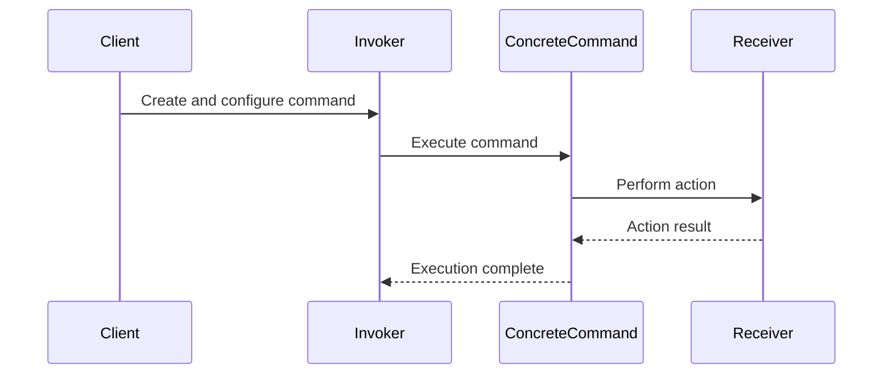

## 5.3.2 Implementation in JavaScript

The Command Pattern is a behavioral design pattern that turns a request into a stand-alone object containing all information about the request. This transformation allows for parameterizing methods with different requests, queuing or logging requests, and supporting undoable operations. In this section, we will delve into implementing the Command Pattern in JavaScript, leveraging its unique features such as first-class functions.

### Understanding the Command Pattern

Before diving into the implementation, let's break down the core components of the Command Pattern:

1. **Command**: An interface or abstract class defining the `execute` method.
2. **Concrete Command**: Implements the `Command` interface and defines the binding between a `Receiver` and an action.
3. **Receiver**: The component that performs the actual work when the `Command` is executed.
4. **Invoker**: Responsible for executing commands. It can also queue commands, log them, or provide undo functionality.
5. **Client**: Creates and configures the `ConcreteCommand` objects.

### Implementing the Command Pattern in JavaScript

#### Step 1: Define Command Interface

In JavaScript, we don't have interfaces like in TypeScript or Java, but we can define a common structure using classes or functions. Let's start by defining a simple `Command` interface using a class with an `execute` method.

```javascript
// Command Interface
class Command {
  execute() {
    throw new Error("Execute method should be implemented");
  }
}
```

#### Step 2: Create Concrete Commands

Concrete commands implement the `Command` interface and define the relationship between the `Receiver` and an action.

```javascript
// Receiver
class Light {
  turnOn() {
    console.log("The light is on");
  }

  turnOff() {
    console.log("The light is off");
  }
}

// Concrete Command for turning on the light
class LightOnCommand extends Command {
  constructor(light) {
    super();
    this.light = light;
  }

  execute() {
    this.light.turnOn();
  }
}

// Concrete Command for turning off the light
class LightOffCommand extends Command {
  constructor(light) {
    super();
    this.light = light;
  }

  execute() {
    this.light.turnOff();
  }
}
```

#### Step 3: Implement the Invoker

The `Invoker` is responsible for executing commands. It can also manage a history of commands for undo functionality.

```javascript
// Invoker
class RemoteControl {
  constructor() {
    this.history = [];
  }

  executeCommand(command) {
    command.execute();
    this.history.push(command);
  }

  // Optional: Undo last command
  undo() {
    const command = this.history.pop();
    if (command) {
      console.log("Undoing last command");
      // Implement undo logic if needed
    }
  }
}
```

#### Step 4: Client Code

The `Client` is responsible for creating and configuring commands.

```javascript
// Client
const light = new Light();
const lightOn = new LightOnCommand(light);
const lightOff = new LightOffCommand(light);

const remote = new RemoteControl();
remote.executeCommand(lightOn);  // Output: The light is on
remote.executeCommand(lightOff); // Output: The light is off
```

### Advanced Features: Queuing, Logging, and Undo

One of the strengths of the Command Pattern is its ability to queue, log, and undo commands. Let's explore these features further.

#### Queuing Commands

You can queue commands to be executed later. This is particularly useful in scenarios like task scheduling or batch processing.

```javascript
// Queueing commands
class CommandQueue {
  constructor() {
    this.queue = [];
  }

  addCommand(command) {
    this.queue.push(command);
  }

  processCommands() {
    this.queue.forEach(command => command.execute());
    this.queue = []; // Clear the queue after processing
  }
}

const commandQueue = new CommandQueue();
commandQueue.addCommand(lightOn);
commandQueue.addCommand(lightOff);
commandQueue.processCommands(); // Output: The light is on, The light is off
```

#### Logging Commands

Logging commands can help in debugging and auditing operations.

```javascript
// Logging commands
class LoggingRemoteControl extends RemoteControl {
  executeCommand(command) {
    console.log(`Executing command: ${command.constructor.name}`);
    super.executeCommand(command);
  }
}

const loggingRemote = new LoggingRemoteControl();
loggingRemote.executeCommand(lightOn);  // Output: Executing command: LightOnCommand, The light is on
```

#### Undoing Commands

Implementing undo functionality requires maintaining a history of executed commands and providing a way to reverse them.

```javascript
// Enhanced undo functionality
class UndoableLightOffCommand extends LightOffCommand {
  execute() {
    super.execute();
    this.light.turnOn(); // Reversing the action
  }
}

const undoableLightOff = new UndoableLightOffCommand(light);
remote.executeCommand(undoableLightOff); // Output: The light is off, The light is on
remote.undo(); // Output: Undoing last command
```

### Leveraging JavaScript's First-Class Functions

JavaScript's first-class functions allow us to simplify the implementation of the Command Pattern by using functions as commands.

```javascript
// Using functions as commands
const lightOnCommand = () => light.turnOn();
const lightOffCommand = () => light.turnOff();

const execute = (command) => command();

execute(lightOnCommand);  // Output: The light is on
execute(lightOffCommand); // Output: The light is off
```

### Visualizing the Command Pattern

To better understand the interaction between components in the Command Pattern, let's visualize the flow using a sequence diagram.



**Diagram Description**: This sequence diagram illustrates the flow of the Command Pattern. The `Client` creates and configures a `ConcreteCommand`, which is executed by the `Invoker`. The `ConcreteCommand` then instructs the `Receiver` to perform the action, and the result is communicated back to the `Invoker`.

### Try It Yourself

To solidify your understanding of the Command Pattern in JavaScript, try modifying the code examples:

- **Experiment with New Commands**: Create additional commands for different actions, such as dimming the light or changing its color.
- **Implement Undo Logic**: Enhance the undo functionality by implementing specific undo actions for each command.
- **Queue and Process Commands**: Extend the `CommandQueue` to handle priority or delayed execution of commands.

### References and Further Reading

- [MDN Web Docs: JavaScript Functions](https://developer.mozilla.org/en-US/docs/Web/JavaScript/Guide/Functions)
- [Refactoring Guru: Command Pattern](https://refactoring.guru/design-patterns/command)
- [JavaScript Design Patterns](https://www.patterns.dev/posts/classic-design-patterns/)

### Knowledge Check

Let's review some key concepts covered in this section:

- **Command Pattern Components**: Understand the roles of Command, Concrete Command, Receiver, Invoker, and Client.
- **JavaScript Features**: Leverage first-class functions to simplify command implementations.
- **Advanced Features**: Implement queuing, logging, and undo functionality.

Remember, mastering design patterns like the Command Pattern can significantly enhance your ability to write maintainable and scalable code. Keep experimenting, stay curious, and enjoy the journey!

## Quiz Time!



### What is the primary purpose of the Command Pattern?

- [x] To encapsulate a request as an object
- [ ] To manage object creation
- [ ] To define a one-to-many dependency
- [ ] To separate an abstraction from its implementation

> **Explanation:** The Command Pattern encapsulates a request as an object, allowing for parameterization and queuing of requests.

### Which component in the Command Pattern is responsible for performing the actual work?

- [ ] Invoker
- [x] Receiver
- [ ] Command
- [ ] Client

> **Explanation:** The Receiver is the component that performs the actual work when the Command is executed.

### How can JavaScript's first-class functions simplify the Command Pattern?

- [x] By using functions as commands
- [ ] By creating complex inheritance hierarchies
- [ ] By eliminating the need for receivers
- [ ] By enforcing strict typing

> **Explanation:** JavaScript's first-class functions allow us to use functions directly as commands, simplifying the implementation.

### What is the role of the Invoker in the Command Pattern?

- [x] To execute commands
- [ ] To perform the action
- [ ] To create commands
- [ ] To define the command interface

> **Explanation:** The Invoker is responsible for executing commands, and it can also manage command history for undo functionality.

### Which of the following is NOT a feature of the Command Pattern?

- [ ] Queuing requests
- [ ] Logging requests
- [ ] Undoing requests
- [x] Creating objects

> **Explanation:** The Command Pattern is not primarily concerned with object creation; it focuses on encapsulating requests.

### How can commands be queued in the Command Pattern?

- [x] By adding commands to a queue and processing them later
- [ ] By executing them immediately
- [ ] By storing them in a database
- [ ] By using inheritance

> **Explanation:** Commands can be added to a queue and processed later, allowing for deferred execution.

### What does the Client do in the Command Pattern?

- [x] Creates and configures commands
- [ ] Executes commands
- [ ] Performs the action
- [ ] Logs the requests

> **Explanation:** The Client is responsible for creating and configuring commands, which are then executed by the Invoker.

### How can logging be implemented in the Command Pattern?

- [x] By extending the Invoker to log command execution
- [ ] By modifying the Receiver
- [ ] By changing the Command interface
- [ ] By using a database

> **Explanation:** Logging can be implemented by extending the Invoker to log each command execution.

### What is the benefit of implementing undo functionality in the Command Pattern?

- [x] It allows reversing actions
- [ ] It simplifies command creation
- [ ] It eliminates the need for receivers
- [ ] It enforces strict typing

> **Explanation:** Undo functionality allows reversing actions, providing flexibility and control over executed commands.

### True or False: The Command Pattern can be used to support undoable operations.

- [x] True
- [ ] False

> **Explanation:** True. The Command Pattern can support undoable operations by maintaining a history of executed commands.


