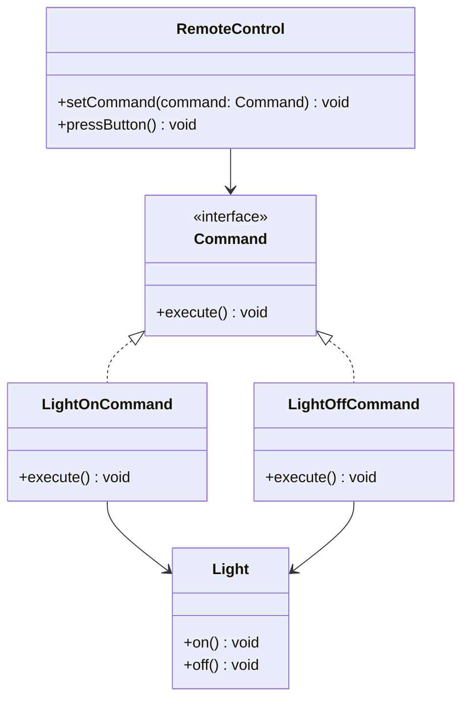

## 5.3.3 Implementation in TypeScript

The Command Pattern is a behavioral design pattern that turns a request into a stand-alone object that contains all information about the request. This transformation allows for parameterization of clients with queues, requests, and operations. In TypeScript, we can leverage its powerful type system to create robust and maintainable implementations of the Command Pattern.

### Understanding the Command Pattern

The Command Pattern encapsulates a request as an object, thereby allowing for parameterization of clients with queues, requests, and operations. This pattern is particularly useful for implementing undo/redo functionality, logging changes, or managing transactions.

#### Key Components of the Command Pattern

1. **Command Interface**: Declares an interface for executing an operation.
2. **Concrete Command**: Implements the command interface and defines the binding between a Receiver object and an action.
3. **Receiver**: Knows how to perform the operations associated with carrying out a request.
4. **Invoker**: Asks the command to carry out the request.
5. **Client**: Creates a ConcreteCommand object and sets its receiver.

### Implementing the Command Pattern in TypeScript

Let's dive into the implementation of the Command Pattern in TypeScript. We'll start by defining the necessary interfaces and classes, followed by a concrete example to illustrate the pattern in action.

#### Step 1: Define the Command Interface

In TypeScript, we can define an interface for commands that includes an `execute` method. This method will be implemented by all concrete command classes.

```typescript
// Command Interface
interface Command {
    execute(): void;
}
```

#### Step 2: Create Concrete Commands

Concrete commands implement the Command interface and define the relationship between the Receiver and the action to be performed. Each command will encapsulate a specific request.

```typescript
// Receiver
class Light {
    on(): void {
        console.log("The light is on");
    }

    off(): void {
        console.log("The light is off");
    }
}

// Concrete Command for turning on the light
class LightOnCommand implements Command {
    private light: Light;

    constructor(light: Light) {
        this.light = light;
    }

    execute(): void {
        this.light.on();
    }
}

// Concrete Command for turning off the light
class LightOffCommand implements Command {
    private light: Light;

    constructor(light: Light) {
        this.light = light;
    }

    execute(): void {
        this.light.off();
    }
}
```

#### Step 3: Implement the Invoker

The Invoker is responsible for initiating requests. It can store a command and execute it later.

```typescript
// Invoker
class RemoteControl {
    private command: Command;

    setCommand(command: Command): void {
        this.command = command;
    }

    pressButton(): void {
        this.command.execute();
    }
}
```

#### Step 4: Assemble the Components

Now, let's put everything together in a client that sets up the commands and invokes them.

```typescript
// Client
const light = new Light();
const lightOn = new LightOnCommand(light);
const lightOff = new LightOffCommand(light);

const remote = new RemoteControl();

// Turn the light on
remote.setCommand(lightOn);
remote.pressButton();

// Turn the light off
remote.setCommand(lightOff);
remote.pressButton();
```

### Benefits of Using TypeScript

TypeScript offers several advantages when implementing the Command Pattern:

- **Type Safety**: TypeScript's static type checking helps catch errors at compile time, making the code more robust.
- **Code Navigation**: With interfaces and type annotations, navigating the codebase becomes easier, as developers can quickly identify the relationships between components.
- **Refactoring Support**: TypeScript's type system facilitates safe and efficient refactoring, as changes in one part of the codebase are automatically reflected in other parts.

### Handling Commands with Different Parameters

In scenarios where commands require different parameters, TypeScript's generics and function overloading can be utilized to handle these variations.

#### Using Generics

Generics allow us to create reusable components that work with a variety of types. Let's see how we can use generics in our Command Pattern implementation.

```typescript
// Generic Command Interface
interface Command<T> {
    execute(param: T): void;
}

// Concrete Command with Generics
class PrintCommand implements Command<string> {
    execute(message: string): void {
        console.log(`Printing message: ${message}`);
    }
}

// Client
const printCommand = new PrintCommand();
printCommand.execute("Hello, TypeScript!");
```

#### Function Overloading

Function overloading enables us to define multiple signatures for a function, allowing it to handle different parameter types.

```typescript
class Calculator {
    add(a: number, b: number): number;
    add(a: string, b: string): string;
    add(a: any, b: any): any {
        return a + b;
    }
}

const calculator = new Calculator();
console.log(calculator.add(1, 2)); // Outputs: 3
console.log(calculator.add("Hello, ", "World!")); // Outputs: Hello, World!
```

### Visualizing the Command Pattern

To better understand the relationships and flow within the Command Pattern, let's visualize the components using a class diagram.



**Diagram Description**: This class diagram illustrates the structure of the Command Pattern. The `Command` interface is implemented by `LightOnCommand` and `LightOffCommand`, which interact with the `Light` receiver. The `RemoteControl` acts as the invoker, executing commands.

### Try It Yourself

Let's encourage some experimentation! Try modifying the code examples to add new commands or receivers. For instance, you could implement a `Fan` receiver with `FanOnCommand` and `FanOffCommand`. Experiment with different invoker setups to see how the pattern adapts to various scenarios.

### Knowledge Check

Before we wrap up, let's reinforce what we've learned:

- **What is the role of the Invoker in the Command Pattern?**
- **How does TypeScript's type system enhance the implementation of the Command Pattern?**
- **What are the benefits of using generics in command implementations?**

### Conclusion

Implementing the Command Pattern in TypeScript allows us to leverage the language's powerful features to create robust, maintainable, and type-safe code. By encapsulating requests as objects, we gain flexibility in parameterizing clients and managing operations. As you continue to explore design patterns, remember to experiment and adapt them to suit your specific needs.

## Quiz Time!



### What is the primary role of the Command Pattern?

- [x] Encapsulate a request as an object
- [ ] Manage database transactions
- [ ] Handle user authentication
- [ ] Optimize memory usage

> **Explanation:** The Command Pattern encapsulates a request as an object, allowing for parameterization of clients with queues, requests, and operations.

### Which component in the Command Pattern is responsible for executing the command?

- [ ] Client
- [x] Invoker
- [ ] Receiver
- [ ] Concrete Command

> **Explanation:** The Invoker is responsible for executing the command by calling its `execute` method.

### How does TypeScript enhance the implementation of the Command Pattern?

- [x] Provides type safety and refactoring support
- [ ] Increases runtime performance
- [ ] Simplifies syntax
- [ ] Reduces code size

> **Explanation:** TypeScript enhances the implementation by providing type safety, better code navigation, and refactoring support.

### What is the advantage of using generics in the Command Pattern?

- [x] Allows commands to handle different parameter types
- [ ] Increases code complexity
- [ ] Reduces code readability
- [ ] Limits command flexibility

> **Explanation:** Generics allow commands to handle different parameter types, making the code more flexible and reusable.

### In the Command Pattern, what is the role of the Receiver?

- [x] Knows how to perform the operations associated with carrying out a request
- [ ] Initiates the request
- [ ] Stores the command
- [ ] Creates the command object

> **Explanation:** The Receiver knows how to perform the operations associated with carrying out a request.

### What is the purpose of function overloading in TypeScript?

- [x] Define multiple signatures for a function
- [ ] Simplify function implementation
- [ ] Increase code execution speed
- [ ] Reduce memory usage

> **Explanation:** Function overloading allows defining multiple signatures for a function, enabling it to handle different parameter types.

### Which of the following is NOT a benefit of using the Command Pattern?

- [ ] Supports undo/redo functionality
- [x] Reduces network latency
- [ ] Facilitates logging changes
- [ ] Manages transactions

> **Explanation:** The Command Pattern does not inherently reduce network latency; it is used for encapsulating requests and managing operations.

### How can you handle commands with different parameters in TypeScript?

- [x] Use generics and function overloading
- [ ] Use only interfaces
- [ ] Use only abstract classes
- [ ] Use only concrete classes

> **Explanation:** Generics and function overloading allow handling commands with different parameters in TypeScript.

### What is the role of the Client in the Command Pattern?

- [x] Creates a ConcreteCommand object and sets its receiver
- [ ] Executes the command
- [ ] Knows how to perform the operation
- [ ] Stores the command for later execution

> **Explanation:** The Client creates a ConcreteCommand object and sets its receiver, preparing the command for execution.

### True or False: The Command Pattern can be used to implement undo/redo functionality.

- [x] True
- [ ] False

> **Explanation:** True. The Command Pattern is well-suited for implementing undo/redo functionality by encapsulating requests as objects.



Remember, this is just the beginning. As you progress, you'll build more complex and interactive applications. Keep experimenting, stay curious, and enjoy the journey!
