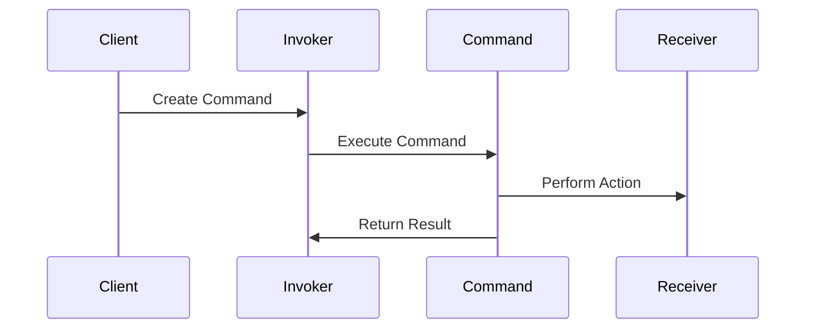

## 5.3.4 Use Cases and Examples

The Command pattern is a behavioral design pattern that turns a request into a stand-alone object containing all information about the request. This transformation allows for parameterization of methods with different requests, queuing of requests, and logging of the requests. It also provides support for undoable operations. In this section, we will explore various real-world applications of the Command pattern in JavaScript and TypeScript, including implementing menu actions, button clicks, and transaction systems. We will also discuss how the pattern supports undo/redo functionality and how commands can be stored and executed at a later time.

### Implementing Menu Actions

One of the most common use cases for the Command pattern is implementing menu actions in applications. Each menu item can be represented as a command object, encapsulating the action to be performed when the menu item is selected.

#### Example: Menu Actions in a Text Editor

Consider a simple text editor with menu options like "Copy", "Paste", and "Undo". Each of these actions can be encapsulated as a command.

```typescript
// Command interface
interface Command {
    execute(): void;
    undo(): void;
}

// Receiver class
class TextEditor {
    private text: string = '';

    copy(): void {
        console.log('Copying text');
    }

    paste(): void {
        console.log('Pasting text');
    }

    undo(): void {
        console.log('Undoing last action');
    }
}

// Concrete command classes
class CopyCommand implements Command {
    private editor: TextEditor;

    constructor(editor: TextEditor) {
        this.editor = editor;
    }

    execute(): void {
        this.editor.copy();
    }

    undo(): void {
        this.editor.undo();
    }
}

class PasteCommand implements Command {
    private editor: TextEditor;

    constructor(editor: TextEditor) {
        this.editor = editor;
    }

    execute(): void {
        this.editor.paste();
    }

    undo(): void {
        this.editor.undo();
    }
}

// Invoker class
class Menu {
    private commands: Command[] = [];

    addCommand(command: Command): void {
        this.commands.push(command);
    }

    executeCommands(): void {
        this.commands.forEach(command => command.execute());
    }

    undoLastCommand(): void {
        const command = this.commands.pop();
        if (command) {
            command.undo();
        }
    }
}

// Client code
const editor = new TextEditor();
const copyCommand = new CopyCommand(editor);
const pasteCommand = new PasteCommand(editor);

const menu = new Menu();
menu.addCommand(copyCommand);
menu.addCommand(pasteCommand);

menu.executeCommands(); // Output: Copying text, Pasting text
menu.undoLastCommand(); // Output: Undoing last action
```

In this example, the `TextEditor` class acts as the receiver, performing the actual operations. The `CopyCommand` and `PasteCommand` classes encapsulate the actions to be performed. The `Menu` class serves as the invoker, storing and executing commands.

### Button Clicks

The Command pattern is also useful for handling button clicks in graphical user interfaces (GUIs). Each button can be associated with a command object that defines the action to be performed when the button is clicked.

#### Example: Button Clicks in a GUI Application

Let's consider a GUI application with buttons for "Start", "Stop", and "Reset" operations.

```typescript
// Receiver class
class Timer {
    start(): void {
        console.log('Timer started');
    }

    stop(): void {
        console.log('Timer stopped');
    }

    reset(): void {
        console.log('Timer reset');
    }
}

// Concrete command classes
class StartCommand implements Command {
    private timer: Timer;

    constructor(timer: Timer) {
        this.timer = timer;
    }

    execute(): void {
        this.timer.start();
    }

    undo(): void {
        this.timer.stop();
    }
}

class StopCommand implements Command {
    private timer: Timer;

    constructor(timer: Timer) {
        this.timer = timer;
    }

    execute(): void {
        this.timer.stop();
    }

    undo(): void {
        this.timer.start();
    }
}

class ResetCommand implements Command {
    private timer: Timer;

    constructor(timer: Timer) {
        this.timer = timer;
    }

    execute(): void {
        this.timer.reset();
    }

    undo(): void {
        console.log('Reset cannot be undone');
    }
}

// Invoker class
class Button {
    private command: Command;

    constructor(command: Command) {
        this.command = command;
    }

    click(): void {
        this.command.execute();
    }

    undo(): void {
        this.command.undo();
    }
}

// Client code
const timer = new Timer();
const startCommand = new StartCommand(timer);
const stopCommand = new StopCommand(timer);
const resetCommand = new ResetCommand(timer);

const startButton = new Button(startCommand);
const stopButton = new Button(stopCommand);
const resetButton = new Button(resetCommand);

startButton.click(); // Output: Timer started
stopButton.click();  // Output: Timer stopped
resetButton.click(); // Output: Timer reset
startButton.undo();  // Output: Timer stopped
```

In this scenario, the `Timer` class is the receiver, and each button is associated with a command object that encapsulates the action to be performed.

### Transaction Systems

The Command pattern is particularly useful in transaction systems where operations need to be executed, undone, or redone. This pattern allows for encapsulating each transaction as a command object.

#### Example: Bank Transaction System

Consider a simple bank transaction system where you can deposit and withdraw money.

```typescript
// Receiver class
class BankAccount {
    private balance: number = 0;

    deposit(amount: number): void {
        this.balance += amount;
        console.log(`Deposited ${amount}, balance is now ${this.balance}`);
    }

    withdraw(amount: number): void {
        if (this.balance >= amount) {
            this.balance -= amount;
            console.log(`Withdrew ${amount}, balance is now ${this.balance}`);
        } else {
            console.log('Insufficient funds');
        }
    }

    getBalance(): number {
        return this.balance;
    }
}

// Concrete command classes
class DepositCommand implements Command {
    private account: BankAccount;
    private amount: number;

    constructor(account: BankAccount, amount: number) {
        this.account = account;
        this.amount = amount;
    }

    execute(): void {
        this.account.deposit(this.amount);
    }

    undo(): void {
        this.account.withdraw(this.amount);
    }
}

class WithdrawCommand implements Command {
    private account: BankAccount;
    private amount: number;

    constructor(account: BankAccount, amount: number) {
        this.account = account;
        this.amount = amount;
    }

    execute(): void {
        this.account.withdraw(this.amount);
    }

    undo(): void {
        this.account.deposit(this.amount);
    }
}

// Invoker class
class TransactionManager {
    private transactions: Command[] = [];

    executeTransaction(command: Command): void {
        command.execute();
        this.transactions.push(command);
    }

    undoLastTransaction(): void {
        const command = this.transactions.pop();
        if (command) {
            command.undo();
        }
    }
}

// Client code
const account = new BankAccount();
const depositCommand = new DepositCommand(account, 100);
const withdrawCommand = new WithdrawCommand(account, 50);

const transactionManager = new TransactionManager();
transactionManager.executeTransaction(depositCommand); // Output: Deposited 100, balance is now 100
transactionManager.executeTransaction(withdrawCommand); // Output: Withdrew 50, balance is now 50
transactionManager.undoLastTransaction(); // Output: Deposited 50, balance is now 100
```

In this example, the `BankAccount` class is the receiver, and each transaction is encapsulated as a command object. The `TransactionManager` class acts as the invoker, managing the execution and undoing of transactions.

### Supporting Undo/Redo Functionality

The Command pattern is ideal for implementing undo/redo functionality in applications. By storing executed commands in a stack, you can easily undo the last executed command and redo it if necessary.

#### Example: Undo/Redo in a Drawing Application

Let's consider a drawing application where users can draw shapes and undo or redo their actions.

```typescript
// Receiver class
class DrawingBoard {
    private shapes: string[] = [];

    addShape(shape: string): void {
        this.shapes.push(shape);
        console.log(`Added ${shape}`);
    }

    removeShape(): void {
        const shape = this.shapes.pop();
        if (shape) {
            console.log(`Removed ${shape}`);
        }
    }

    showShapes(): void {
        console.log(`Shapes on board: ${this.shapes.join(', ')}`);
    }
}

// Concrete command classes
class AddShapeCommand implements Command {
    private board: DrawingBoard;
    private shape: string;

    constructor(board: DrawingBoard, shape: string) {
        this.board = board;
        this.shape = shape;
    }

    execute(): void {
        this.board.addShape(this.shape);
    }

    undo(): void {
        this.board.removeShape();
    }
}

// Invoker class
class CommandManager {
    private executedCommands: Command[] = [];
    private undoneCommands: Command[] = [];

    executeCommand(command: Command): void {
        command.execute();
        this.executedCommands.push(command);
        this.undoneCommands = []; // Clear redo stack
    }

    undo(): void {
        const command = this.executedCommands.pop();
        if (command) {
            command.undo();
            this.undoneCommands.push(command);
        }
    }

    redo(): void {
        const command = this.undoneCommands.pop();
        if (command) {
            command.execute();
            this.executedCommands.push(command);
        }
    }
}

// Client code
const board = new DrawingBoard();
const addCircleCommand = new AddShapeCommand(board, 'Circle');
const addSquareCommand = new AddShapeCommand(board, 'Square');

const commandManager = new CommandManager();
commandManager.executeCommand(addCircleCommand); // Output: Added Circle
commandManager.executeCommand(addSquareCommand); // Output: Added Square
board.showShapes(); // Output: Shapes on board: Circle, Square

commandManager.undo(); // Output: Removed Square
board.showShapes(); // Output: Shapes on board: Circle

commandManager.redo(); // Output: Added Square
board.showShapes(); // Output: Shapes on board: Circle, Square
```

In this example, the `DrawingBoard` class is the receiver, and each shape addition is encapsulated as a command object. The `CommandManager` class manages the execution, undoing, and redoing of commands.

### Storing and Executing Commands Later

The Command pattern allows for storing commands and executing them at a later time. This is particularly useful in scenarios where operations need to be deferred or scheduled.

#### Example: Scheduled Task Execution

Consider a task scheduler that executes tasks at a specified time.

```typescript
// Receiver class
class Task {
    execute(): void {
        console.log('Executing task');
    }
}

// Concrete command class
class TaskCommand implements Command {
    private task: Task;

    constructor(task: Task) {
        this.task = task;
    }

    execute(): void {
        this.task.execute();
    }

    undo(): void {
        console.log('Undoing task');
    }
}

// Invoker class
class Scheduler {
    private scheduledTasks: { command: Command, time: number }[] = [];

    scheduleTask(command: Command, delay: number): void {
        console.log(`Task scheduled to execute in ${delay}ms`);
        this.scheduledTasks.push({ command, time: Date.now() + delay });
    }

    executeScheduledTasks(): void {
        const now = Date.now();
        this.scheduledTasks = this.scheduledTasks.filter(task => {
            if (task.time <= now) {
                task.command.execute();
                return false;
            }
            return true;
        });
    }
}

// Client code
const task = new Task();
const taskCommand = new TaskCommand(task);

const scheduler = new Scheduler();
scheduler.scheduleTask(taskCommand, 2000); // Schedule task to execute in 2000ms

setTimeout(() => {
    scheduler.executeScheduledTasks(); // Output: Executing task
}, 2500);
```

In this example, the `Task` class is the receiver, and each task execution is encapsulated as a command object. The `Scheduler` class manages the scheduling and execution of tasks.

### Best Practices and Performance Considerations

When implementing the Command pattern, consider the following best practices and performance considerations:

- **Decouple Command and Receiver**: Ensure that command objects are decoupled from the receiver classes. This allows for greater flexibility and reusability of commands.
- **Use Command Queues**: For applications that require deferred execution or batch processing, consider using command queues to manage and execute commands.
- **Optimize Memory Usage**: Be mindful of memory usage when storing commands, especially in applications with a large number of commands or frequent undo/redo operations.
- **Implement Logging**: Consider implementing logging for command execution, which can be useful for debugging and auditing purposes.
- **Handle Exceptions Gracefully**: Ensure that exceptions during command execution are handled gracefully to prevent application crashes.

### Try It Yourself

To deepen your understanding of the Command pattern, try modifying the code examples provided. For instance, you can:

- Add new commands to the text editor or drawing application.
- Implement additional undo/redo functionality.
- Experiment with scheduling tasks at different intervals.

### Visualizing the Command Pattern

To better understand the flow of the Command pattern, let's visualize the interaction between the invoker, command, and receiver using a sequence diagram.



This diagram illustrates how the client creates a command and passes it to the invoker, which then executes the command. The command interacts with the receiver to perform the desired action.

### Knowledge Check

- How does the Command pattern support undo/redo functionality?
- What are some real-world applications of the Command pattern?
- How can commands be stored and executed at a later time?

### Embrace the Journey

Remember, mastering design patterns is a journey. As you continue to explore and implement the Command pattern in your projects, you'll gain a deeper understanding of its benefits and applications. Keep experimenting, stay curious, and enjoy the journey!

## Quiz Time!



### What is a common use case for the Command pattern?

- [x] Implementing menu actions
- [ ] Managing database connections
- [ ] Rendering graphics
- [ ] Parsing JSON data

> **Explanation:** The Command pattern is commonly used to implement menu actions by encapsulating each action as a command object.

### How does the Command pattern support undo functionality?

- [x] By storing executed commands in a stack
- [ ] By using global variables
- [ ] By creating multiple instances of the receiver
- [ ] By modifying the receiver's state directly

> **Explanation:** The Command pattern supports undo functionality by storing executed commands in a stack, allowing the last executed command to be undone.

### In a GUI application, what role does the button play in the Command pattern?

- [x] Invoker
- [ ] Receiver
- [ ] Command
- [ ] Client

> **Explanation:** In a GUI application, the button acts as the invoker, triggering the execution of the associated command when clicked.

### What is the benefit of decoupling command objects from the receiver classes?

- [x] Greater flexibility and reusability of commands
- [ ] Improved network performance
- [ ] Faster execution time
- [ ] Reduced memory usage

> **Explanation:** Decoupling command objects from the receiver classes allows for greater flexibility and reusability of commands across different contexts.

### How can commands be executed at a later time?

- [x] By storing them in a queue
- [ ] By using synchronous execution
- [ ] By modifying the command interface
- [ ] By creating additional receiver instances

> **Explanation:** Commands can be executed at a later time by storing them in a queue and executing them when needed.

### What is a potential performance consideration when using the Command pattern?

- [x] Memory usage when storing commands
- [ ] Network latency
- [ ] Database access speed
- [ ] Rendering time

> **Explanation:** Memory usage can be a consideration when storing a large number of commands, especially in applications with frequent undo/redo operations.

### Which class in the Command pattern is responsible for executing the command?

- [x] Invoker
- [ ] Receiver
- [ ] Client
- [ ] Command

> **Explanation:** The invoker is responsible for executing the command by calling its `execute` method.

### What is a best practice when implementing the Command pattern?

- [x] Implement logging for command execution
- [ ] Use global variables for command storage
- [ ] Directly modify the receiver's state
- [ ] Avoid using interfaces

> **Explanation:** Implementing logging for command execution is a best practice that can aid in debugging and auditing.

### How can the Command pattern be used in a transaction system?

- [x] By encapsulating each transaction as a command object
- [ ] By using global variables for transaction data
- [ ] By directly modifying the database
- [ ] By creating multiple transaction instances

> **Explanation:** In a transaction system, each transaction can be encapsulated as a command object, allowing for execution, undoing, and redoing of transactions.

### True or False: The Command pattern can only be used in desktop applications.

- [ ] True
- [x] False

> **Explanation:** False. The Command pattern can be used in a variety of applications, including web, desktop, and mobile applications.


