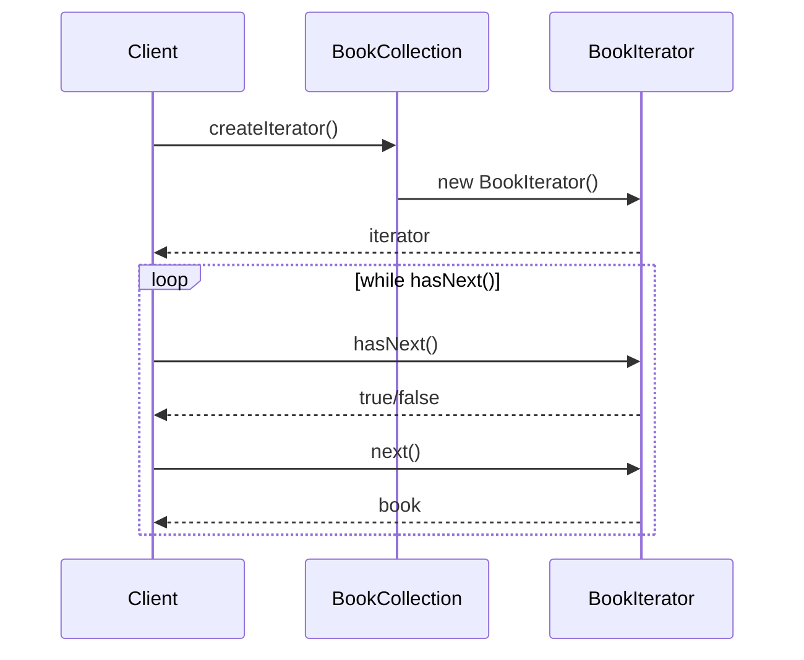

## 5.4.1 Intent and Motivation

In the world of software development, particularly when dealing with collections of data, the need to traverse and access elements in a structured manner is paramount. This is where the Iterator Pattern comes into play. The Iterator Pattern is a behavioral design pattern that provides a way to access the elements of an aggregate object sequentially without exposing its underlying representation. This pattern is akin to using a bookmark in a book, allowing us to navigate through pages without needing to understand the book's binding or structure.

### Defining the Iterator Pattern

The Iterator Pattern is designed to provide a standard way to traverse a collection of objects. It abstracts the traversal process, allowing us to access elements without needing to know the details of the collection's structure. This is particularly useful when dealing with complex data structures like trees, graphs, or custom collections where direct access to elements could compromise encapsulation and lead to tight coupling between components.

#### Key Components of the Iterator Pattern

1. **Iterator**: This is an interface or abstract class that defines the methods for accessing and traversing elements. Common methods include `next()`, `hasNext()`, and `current()`.

2. **Concrete Iterator**: This implements the Iterator interface and provides the actual mechanism for traversing the collection.

3. **Aggregate**: This is an interface or abstract class that defines the method to create an iterator object.

4. **Concrete Aggregate**: This implements the Aggregate interface and returns an instance of the Concrete Iterator.

### Usefulness in Traversal

The primary utility of the Iterator Pattern lies in its ability to separate the traversal logic from the collection itself. This separation promotes flexibility and reusability. For instance, if we have a collection of books in a library, the Iterator Pattern allows us to traverse the collection without needing to know whether the books are stored in an array, a linked list, or any other data structure.

#### Analogy: Bookmarks in a Book

Consider a bookmark in a book. The bookmark allows you to mark your current position and return to it later without needing to remember the page number or the chapter. Similarly, an iterator acts as a bookmark for a collection, allowing you to traverse the elements sequentially without needing to understand the underlying data structure.

### Promoting Encapsulation and Abstraction

One of the significant advantages of the Iterator Pattern is its ability to promote encapsulation and abstraction. By providing a standard interface for traversal, it hides the internal representation of the collection from the client code. This means that changes to the collection's structure do not affect the code that uses the iterator, thus promoting a loose coupling between components.

#### Encapsulation

Encapsulation is a fundamental principle of object-oriented design that involves hiding the internal state and behavior of an object. The Iterator Pattern encapsulates the traversal logic, ensuring that the client code does not need to know the details of the collection's structure.

#### Abstraction

Abstraction involves providing a simplified interface to a complex system. The Iterator Pattern abstracts the traversal process, allowing the client code to interact with the collection through a simple interface without needing to understand the complexities of the underlying data structure.

### Problems of Accessing Collection Elements Directly

Direct access to collection elements can lead to several problems, including:

1. **Tight Coupling**: When client code accesses collection elements directly, it becomes tightly coupled to the collection's structure. This makes it difficult to change the collection's implementation without affecting the client code.

2. **Lack of Flexibility**: Direct access limits the flexibility of the collection. For instance, if the collection is implemented as an array, changing it to a linked list would require significant changes to the client code.

3. **Violation of Encapsulation**: Direct access to collection elements can violate the principle of encapsulation by exposing the internal state and behavior of the collection.

4. **Complexity**: Traversing complex data structures like trees or graphs can be challenging without a standard traversal mechanism.

### Implementing the Iterator Pattern in JavaScript

Let's explore how to implement the Iterator Pattern in JavaScript. We'll create a simple collection of books and an iterator to traverse them.

```javascript
// Book Collection
class BookCollection {
  constructor() {
    this.books = [];
  }

  addBook(book) {
    this.books.push(book);
  }

  createIterator() {
    return new BookIterator(this.books);
  }
}

// Book Iterator
class BookIterator {
  constructor(books) {
    this.index = 0;
    this.books = books;
  }

  next() {
    return this.books[this.index++];
  }

  hasNext() {
    return this.index < this.books.length;
  }
}

// Usage
const myBooks = new BookCollection();
myBooks.addBook('JavaScript: The Good Parts');
myBooks.addBook('Eloquent JavaScript');
myBooks.addBook('You Don’t Know JS');

const iterator = myBooks.createIterator();
while (iterator.hasNext()) {
  console.log(iterator.next());
}
```

In this example, the `BookCollection` class represents the aggregate, and the `BookIterator` class represents the iterator. The `createIterator` method in `BookCollection` returns an instance of `BookIterator`, which provides the mechanism for traversing the collection.

### Implementing the Iterator Pattern in TypeScript

TypeScript, with its strong typing and interfaces, provides an excellent platform for implementing the Iterator Pattern. Let's see how we can implement the same example in TypeScript.

```typescript
// Book Collection
class BookCollection {
  private books: string[] = [];

  addBook(book: string): void {
    this.books.push(book);
  }

  createIterator(): Iterator<string> {
    return new BookIterator(this.books);
  }
}

// Book Iterator
class BookIterator implements Iterator<string> {
  private index: number = 0;
  private books: string[];

  constructor(books: string[]) {
    this.books = books;
  }

  next(): IteratorResult<string> {
    if (this.index < this.books.length) {
      return { value: this.books[this.index++], done: false };
    } else {
      return { value: null, done: true };
    }
  }
}

// Usage
const myBooks = new BookCollection();
myBooks.addBook('JavaScript: The Good Parts');
myBooks.addBook('Eloquent JavaScript');
myBooks.addBook('You Don’t Know JS');

const iterator = myBooks.createIterator();
let result = iterator.next();
while (!result.done) {
  console.log(result.value);
  result = iterator.next();
}
```

In this TypeScript example, we define an `Iterator` interface with a `next` method that returns an `IteratorResult`. The `BookIterator` class implements this interface, providing a type-safe way to traverse the collection.

### Visualizing the Iterator Pattern

To better understand the Iterator Pattern, let's visualize the interaction between the components using a sequence diagram.



This diagram illustrates the interaction between the client, the `BookCollection`, and the `BookIterator`. The client requests an iterator from the collection and uses it to traverse the elements sequentially.

### Try It Yourself

Now that we've explored the Iterator Pattern, let's try modifying the code examples to deepen our understanding. Here are a few suggestions:

1. **Add More Methods**: Extend the iterator to include methods like `reset()` to start the traversal from the beginning.

2. **Implement Reverse Traversal**: Modify the iterator to traverse the collection in reverse order.

3. **Use Different Data Structures**: Implement the iterator for different data structures like linked lists or trees.

4. **TypeScript Enhancements**: Use TypeScript's advanced features like generics to create a more flexible iterator.

### References and Links

- [MDN Web Docs: Iterators and Generators](https://developer.mozilla.org/en-US/docs/Web/JavaScript/Guide/Iterators_and_Generators)
- [W3Schools: JavaScript Iterators](https://www.w3schools.com/js/js_iterables.asp)

### Knowledge Check

To reinforce what we've learned, let's pose a few questions and challenges:

1. **What is the primary purpose of the Iterator Pattern?**
   - To provide a way to access elements sequentially without exposing the underlying representation.

2. **How does the Iterator Pattern promote encapsulation?**
   - By hiding the collection's structure and providing a standard interface for traversal.

3. **What are the key components of the Iterator Pattern?**
   - Iterator, Concrete Iterator, Aggregate, Concrete Aggregate.

4. **Why is direct access to collection elements problematic?**
   - It leads to tight coupling, lack of flexibility, violation of encapsulation, and increased complexity.

5. **How can we implement reverse traversal in an iterator?**
   - By modifying the `next()` method to decrement the index and adjusting the `hasNext()` logic.

### Embrace the Journey

Remember, this is just the beginning. As you progress, you'll build more complex and interactive applications using the Iterator Pattern. Keep experimenting, stay curious, and enjoy the journey!

## Quiz Time!



### What is the primary purpose of the Iterator Pattern?

- [x] To provide a way to access elements sequentially without exposing the underlying representation.
- [ ] To modify the elements of a collection.
- [ ] To sort elements in a collection.
- [ ] To delete elements from a collection.

> **Explanation:** The Iterator Pattern is designed to provide a way to access elements of a collection sequentially without exposing its underlying representation.

### How does the Iterator Pattern promote encapsulation?

- [x] By hiding the collection's structure and providing a standard interface for traversal.
- [ ] By modifying the elements directly.
- [ ] By exposing the internal state of the collection.
- [ ] By allowing direct access to collection elements.

> **Explanation:** The Iterator Pattern promotes encapsulation by hiding the collection's structure and providing a standard interface for traversal, thus preventing direct access to the collection's elements.

### What are the key components of the Iterator Pattern?

- [x] Iterator, Concrete Iterator, Aggregate, Concrete Aggregate.
- [ ] Iterator, Collection, Element, Node.
- [ ] Traverser, Collection, Element, Node.
- [ ] Iterator, Collection, Node, Element.

> **Explanation:** The key components of the Iterator Pattern are Iterator, Concrete Iterator, Aggregate, and Concrete Aggregate.

### Why is direct access to collection elements problematic?

- [x] It leads to tight coupling, lack of flexibility, violation of encapsulation, and increased complexity.
- [ ] It simplifies the code.
- [ ] It enhances performance.
- [ ] It improves readability.

> **Explanation:** Direct access to collection elements can lead to tight coupling, lack of flexibility, violation of encapsulation, and increased complexity, making the code harder to maintain and modify.

### How can we implement reverse traversal in an iterator?

- [x] By modifying the `next()` method to decrement the index and adjusting the `hasNext()` logic.
- [ ] By adding a `reverse()` method.
- [ ] By using a different data structure.
- [ ] By modifying the collection directly.

> **Explanation:** Reverse traversal can be implemented by modifying the `next()` method to decrement the index and adjusting the `hasNext()` logic accordingly.

### What is the role of the Concrete Iterator?

- [x] To implement the traversal mechanism for the collection.
- [ ] To define the collection structure.
- [ ] To modify the elements of the collection.
- [ ] To delete elements from the collection.

> **Explanation:** The Concrete Iterator implements the traversal mechanism for the collection, providing methods to access elements sequentially.

### What is the benefit of using TypeScript for implementing the Iterator Pattern?

- [x] TypeScript provides strong typing and interfaces, which enhance type safety and flexibility.
- [ ] TypeScript allows direct access to collection elements.
- [ ] TypeScript simplifies the code.
- [ ] TypeScript improves performance.

> **Explanation:** TypeScript provides strong typing and interfaces, which enhance type safety and flexibility when implementing the Iterator Pattern.

### How does the Iterator Pattern enhance flexibility?

- [x] By allowing the collection's structure to change without affecting the client code.
- [ ] By exposing the internal state of the collection.
- [ ] By allowing direct access to collection elements.
- [ ] By modifying the elements directly.

> **Explanation:** The Iterator Pattern enhances flexibility by allowing the collection's structure to change without affecting the client code, as the traversal logic is separated from the collection.

### What is an example of a real-world analogy for the Iterator Pattern?

- [x] A bookmark in a book.
- [ ] A table of contents.
- [ ] An index in a book.
- [ ] A glossary.

> **Explanation:** A bookmark in a book is a real-world analogy for the Iterator Pattern, as it allows you to navigate through pages without needing to understand the book's binding or structure.

### True or False: The Iterator Pattern is only useful for simple data structures like arrays.

- [ ] True
- [x] False

> **Explanation:** False. The Iterator Pattern is useful for both simple and complex data structures, such as trees and graphs, where it abstracts the traversal process and promotes encapsulation.


