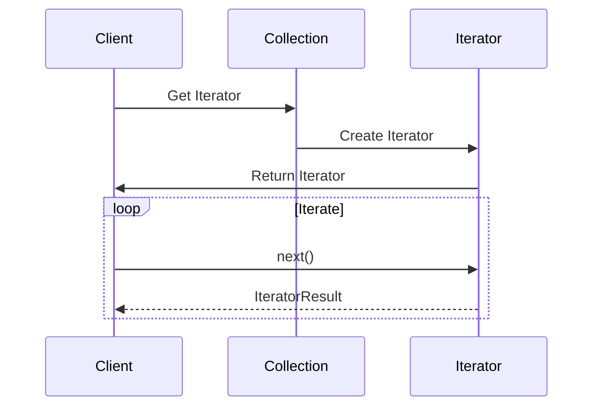

## 5.4.3 Implementation in TypeScript

The Iterator pattern is a powerful design pattern that provides a way to access the elements of an aggregate object sequentially without exposing its underlying representation. In TypeScript, the implementation of the Iterator pattern is enhanced by the language's strong typing capabilities, which help prevent common iteration errors and improve code maintainability. In this section, we will delve into the details of implementing the Iterator pattern in TypeScript, exploring both synchronous and asynchronous iterators, and leveraging type annotations to create robust and error-free code.

### Understanding the Iterator Pattern

Before we dive into the implementation, let's briefly revisit the core concept of the Iterator pattern. The pattern is used to traverse a collection of objects in a standardized way, providing a uniform interface for iteration. This allows the client code to iterate over different types of collections without needing to know their internal structure.

### Defining Iterator Interfaces in TypeScript

TypeScript provides built-in `Iterator` and `Iterable` interfaces that we can use to define our iterators. These interfaces help us create strongly typed iterators that can be used with various collections.

#### Iterator Interface

The `Iterator` interface in TypeScript defines the contract for an object that can be iterated over. It includes a `next()` method that returns an object with two properties: `value` and `done`. The `value` property holds the current element, while the `done` property indicates whether the iteration is complete.

```typescript
interface Iterator<T> {
  next(): IteratorResult<T>;
}

interface IteratorResult<T> {
  value: T;
  done: boolean;
}
```

#### Iterable Interface

The `Iterable` interface represents an object that can be iterated over using a `for...of` loop. It includes a `Symbol.iterator` method that returns an `Iterator`.

```typescript
interface Iterable<T> {
  [Symbol.iterator](): Iterator<T>;
}
```

### Implementing a Simple Iterator

Let's start by implementing a simple iterator for an array of numbers. We'll define a `NumberIterator` class that implements the `Iterator<number>` interface.

```typescript
class NumberIterator implements Iterator<number> {
  private index = 0;
  private numbers: number[];

  constructor(numbers: number[]) {
    this.numbers = numbers;
  }

  next(): IteratorResult<number> {
    if (this.index < this.numbers.length) {
      return { value: this.numbers[this.index++], done: false };
    } else {
      return { value: null, done: true };
    }
  }
}
```

In this example, the `NumberIterator` class takes an array of numbers and provides a `next()` method to iterate over them. The `next()` method returns the current number and advances the index, or indicates that the iteration is complete when all numbers have been iterated over.

### Creating an Iterable Collection

To make our collection iterable using a `for...of` loop, we need to implement the `Iterable<number>` interface. Let's create a `NumberCollection` class that implements this interface.

```typescript
class NumberCollection implements Iterable<number> {
  private numbers: number[];

  constructor(numbers: number[]) {
    this.numbers = numbers;
  }

  [Symbol.iterator](): Iterator<number> {
    return new NumberIterator(this.numbers);
  }
}
```

The `NumberCollection` class implements the `Iterable<number>` interface by providing a `Symbol.iterator` method that returns a `NumberIterator`. This allows us to use the `for...of` loop to iterate over the collection.

### Handling Generic Collections

One of the key advantages of TypeScript is its support for generics, which allows us to create reusable and type-safe components. Let's extend our implementation to handle generic collections.

#### Generic Iterator Interface

We can define a generic `Iterator` interface that works with any type of elements.

```typescript
interface GenericIterator<T> {
  next(): IteratorResult<T>;
}
```

#### Generic Iterable Interface

Similarly, we can define a generic `Iterable` interface.

```typescript
interface GenericIterable<T> {
  [Symbol.iterator](): GenericIterator<T>;
}
```

#### Implementing a Generic Iterator

Let's implement a generic iterator for a collection of any type.

```typescript
class GenericCollection<T> implements GenericIterable<T> {
  private items: T[];

  constructor(items: T[]) {
    this.items = items;
  }

  [Symbol.iterator](): GenericIterator<T> {
    return new GenericIteratorImpl(this.items);
  }
}

class GenericIteratorImpl<T> implements GenericIterator<T> {
  private index = 0;
  private items: T[];

  constructor(items: T[]) {
    this.items = items;
  }

  next(): IteratorResult<T> {
    if (this.index < this.items.length) {
      return { value: this.items[this.index++], done: false };
    } else {
      return { value: null, done: true };
    }
  }
}
```

In this implementation, the `GenericCollection` class can hold items of any type, and the `GenericIteratorImpl` class provides a way to iterate over them.

### Benefits of Type-Checking

TypeScript's type-checking capabilities offer several benefits when implementing the Iterator pattern:

1. **Error Prevention**: Type-checking helps catch errors at compile time, such as passing an incorrect type to the iterator.
2. **Code Readability**: Type annotations make the code more readable and self-documenting, as they clearly indicate the types of elements being iterated over.
3. **Refactoring Safety**: Strong typing ensures that changes to the codebase do not introduce type-related errors, making refactoring safer and more efficient.

### Synchronous and Asynchronous Iterators

TypeScript supports both synchronous and asynchronous iterators. While synchronous iterators are used for collections that can be iterated over immediately, asynchronous iterators are useful for collections that require asynchronous operations, such as fetching data from a server.

#### Synchronous Iterator Example

We've already seen examples of synchronous iterators in the previous sections. Let's now explore asynchronous iterators.

#### Asynchronous Iterator Interface

The asynchronous iterator interface is similar to the synchronous one, but the `next()` method returns a `Promise` of `IteratorResult`.

```typescript
interface AsyncIterator<T> {
  next(): Promise<IteratorResult<T>>;
}

interface AsyncIterable<T> {
  [Symbol.asyncIterator](): AsyncIterator<T>;
}
```

#### Implementing an Asynchronous Iterator

Let's implement an asynchronous iterator for a collection of numbers that simulates fetching data asynchronously.

```typescript
class AsyncNumberIterator implements AsyncIterator<number> {
  private index = 0;
  private numbers: number[];

  constructor(numbers: number[]) {
    this.numbers = numbers;
  }

  async next(): Promise<IteratorResult<number>> {
    if (this.index < this.numbers.length) {
      // Simulate an asynchronous operation
      await new Promise(resolve => setTimeout(resolve, 1000));
      return { value: this.numbers[this.index++], done: false };
    } else {
      return { value: null, done: true };
    }
  }
}

class AsyncNumberCollection implements AsyncIterable<number> {
  private numbers: number[];

  constructor(numbers: number[]) {
    this.numbers = numbers;
  }

  [Symbol.asyncIterator](): AsyncIterator<number> {
    return new AsyncNumberIterator(this.numbers);
  }
}
```

In this example, the `AsyncNumberIterator` class simulates an asynchronous operation by using a `setTimeout` to delay the iteration. The `AsyncNumberCollection` class implements the `AsyncIterable<number>` interface, allowing us to use the `for await...of` loop to iterate over the collection asynchronously.

### Try It Yourself

Now that we've covered the basics of implementing the Iterator pattern in TypeScript, it's time to experiment with the code. Here are a few suggestions for modifications you can try:

1. **Different Data Types**: Modify the `GenericCollection` class to handle different data types, such as strings or custom objects.
2. **Custom Iteration Logic**: Implement a custom iteration logic that skips certain elements based on a condition.
3. **Error Handling**: Add error handling to the asynchronous iterator to handle potential errors during iteration.

### Visualizing the Iterator Pattern

To better understand the flow of the Iterator pattern, let's visualize the interaction between the iterator and the collection using a sequence diagram.



**Diagram Description**: This sequence diagram illustrates the interaction between the client, the collection, and the iterator. The client requests an iterator from the collection, which creates and returns an iterator. The client then iterates over the collection using the `next()` method until the iteration is complete.

### References and Links

For further reading on the Iterator pattern and TypeScript, check out the following resources:

- [MDN Web Docs: Iteration protocols](https://developer.mozilla.org/en-US/docs/Web/JavaScript/Reference/Iteration_protocols)
- [TypeScript Handbook: Generics](https://www.typescriptlang.org/docs/handbook/generics.html)
- [MDN Web Docs: for...of](https://developer.mozilla.org/en-US/docs/Web/JavaScript/Reference/Statements/for...of)

### Knowledge Check

To reinforce your understanding of the Iterator pattern in TypeScript, consider the following questions:

1. What is the purpose of the `Iterator` interface in TypeScript?
2. How does the `Iterable` interface differ from the `Iterator` interface?
3. What are the benefits of using generics in the implementation of the Iterator pattern?
4. How can asynchronous iterators be useful in real-world applications?
5. What are some potential modifications you can make to the provided code examples?

### Embrace the Journey

Remember, mastering design patterns is a journey, not a destination. As you continue to explore and implement different patterns, you'll gain a deeper understanding of how they can be applied to solve complex problems in software development. Keep experimenting, stay curious, and enjoy the journey!

## Quiz Time!



### What is the primary purpose of the Iterator pattern?

- [x] To provide a way to access elements of a collection sequentially without exposing its underlying representation.
- [ ] To sort elements in a collection.
- [ ] To modify elements in a collection.
- [ ] To delete elements from a collection.

> **Explanation:** The Iterator pattern is designed to provide a standardized way to traverse a collection of objects without revealing its internal structure.

### Which TypeScript interface is used to define an object that can be iterated over?

- [ ] Iterator
- [x] Iterable
- [ ] Collection
- [ ] Sequence

> **Explanation:** The `Iterable` interface represents an object that can be iterated over using a `for...of` loop.

### What does the `next()` method of an `Iterator` return?

- [ ] An array of elements.
- [x] An object with `value` and `done` properties.
- [ ] A boolean indicating if the iteration is complete.
- [ ] A string representation of the current element.

> **Explanation:** The `next()` method returns an `IteratorResult` object containing `value` and `done` properties.

### How does TypeScript's type-checking benefit the implementation of the Iterator pattern?

- [x] It helps catch errors at compile time and improves code readability.
- [ ] It automatically optimizes the iteration process.
- [ ] It allows for dynamic typing of elements.
- [ ] It provides runtime error handling.

> **Explanation:** TypeScript's type-checking helps prevent errors by ensuring that the types of elements being iterated over are correct, making the code more readable and maintainable.

### What is the key difference between synchronous and asynchronous iterators?

- [x] Synchronous iterators operate immediately, while asynchronous iterators handle collections requiring asynchronous operations.
- [ ] Synchronous iterators are faster than asynchronous iterators.
- [ ] Asynchronous iterators can only be used with numbers.
- [ ] Synchronous iterators require more memory.

> **Explanation:** Synchronous iterators are used for collections that can be iterated over immediately, while asynchronous iterators are useful for collections that involve asynchronous operations.

### Which method must be implemented to make a collection iterable using a `for...of` loop?

- [ ] `next()`
- [x] `Symbol.iterator`
- [ ] `getIterator()`
- [ ] `iterate()`

> **Explanation:** The `Symbol.iterator` method must be implemented to return an iterator, allowing the collection to be used with a `for...of` loop.

### What is the purpose of using generics in the implementation of the Iterator pattern?

- [x] To create reusable and type-safe components.
- [ ] To increase the speed of iteration.
- [ ] To allow for dynamic typing.
- [ ] To reduce memory usage.

> **Explanation:** Generics allow the creation of reusable and type-safe components, enabling iterators to work with any type of elements.

### How can you simulate an asynchronous operation in an asynchronous iterator?

- [ ] By using a `for` loop.
- [x] By using a `setTimeout` or `Promise`.
- [ ] By using a `while` loop.
- [ ] By using a `try...catch` block.

> **Explanation:** Asynchronous operations can be simulated using `setTimeout` or `Promise` to delay the iteration process.

### What is the role of the `done` property in the `IteratorResult` object?

- [x] It indicates whether the iteration is complete.
- [ ] It holds the current element being iterated over.
- [ ] It specifies the total number of elements.
- [ ] It provides a string description of the iteration state.

> **Explanation:** The `done` property is a boolean that indicates whether the iteration has completed.

### True or False: The `for await...of` loop can be used with synchronous iterators.

- [ ] True
- [x] False

> **Explanation:** The `for await...of` loop is specifically designed for asynchronous iterators and cannot be used with synchronous iterators.


