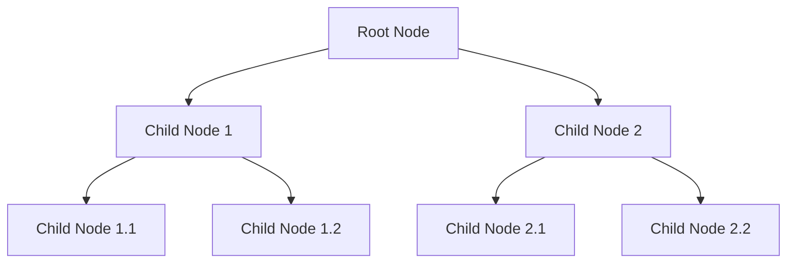

## 5.4.4 Use Cases and Examples

The Iterator Pattern is a powerful tool in the realm of software design, particularly when dealing with collections and sequences. It provides a way to access elements of an aggregate object sequentially without exposing its underlying representation. In this section, we will explore various practical scenarios where the Iterator Pattern is applied, including traversing tree structures, processing collections, and streaming data. We will also discuss how iterators can simplify code that processes sequences, integrate with other patterns, and offer tips on optimizing iteration for performance.

### Traversing Tree Structures

One of the most common use cases for the Iterator Pattern is traversing tree structures. Trees are hierarchical data structures that can represent various entities, such as file systems, organizational charts, or DOM elements in a web page. The Iterator Pattern allows us to traverse these structures in a consistent manner.

#### Example: Traversing a DOM Tree

Let's consider a scenario where we need to traverse a DOM tree. The DOM (Document Object Model) is a tree-like structure representing the elements of a web page. We can use the Iterator Pattern to iterate over the nodes of this tree.

```javascript
class DOMIterator {
  constructor(root) {
    this.stack = [root];
  }

  next() {
    if (this.stack.length === 0) {
      return { done: true };
    }

    const node = this.stack.pop();
    if (node.children) {
      for (let i = node.children.length - 1; i >= 0; i--) {
        this.stack.push(node.children[i]);
      }
    }

    return { value: node, done: false };
  }
}

// Usage
const rootElement = document.getElementById('root');
const iterator = new DOMIterator(rootElement);

let result = iterator.next();
while (!result.done) {
  console.log(result.value);
  result = iterator.next();
}
```

In this example, we define a `DOMIterator` class that takes a root node as input. The `next` method returns the next node in the tree, using a stack to keep track of nodes to be visited. This approach allows us to traverse the tree without exposing its internal structure.

#### Visualizing the DOM Tree Traversal



The diagram above represents a simple DOM tree structure. The `DOMIterator` traverses this tree depth-first, visiting each node in sequence.

### Processing Collections

Collections, such as arrays, lists, and sets, are fundamental data structures in programming. The Iterator Pattern provides a uniform way to access elements in these collections, making it easier to process them.

#### Example: Iterating Over a Custom Collection

Consider a custom collection class that stores a list of items. We can implement an iterator to traverse this collection.

```typescript
class CustomCollection<T> {
  private items: T[] = [];

  addItem(item: T) {
    this.items.push(item);
  }

  getIterator(): Iterator<T> {
    let index = 0;
    const items = this.items;

    return {
      next(): IteratorResult<T> {
        if (index < items.length) {
          return { value: items[index++], done: false };
        } else {
          return { value: null, done: true };
        }
      }
    };
  }
}

// Usage
const collection = new CustomCollection<number>();
collection.addItem(1);
collection.addItem(2);
collection.addItem(3);

const iterator = collection.getIterator();
let result = iterator.next();
while (!result.done) {
  console.log(result.value);
  result = iterator.next();
}
```

In this TypeScript example, we define a `CustomCollection` class with a `getIterator` method that returns an iterator for the collection. The iterator provides a `next` method to access each item in the collection sequentially.

### Streaming Data

The Iterator Pattern is also useful for streaming data, where data is processed as it becomes available. This is particularly relevant in scenarios involving large datasets or real-time data processing.

#### Example: Streaming Data from an API

Let's consider a scenario where we need to process data from an API that returns data in chunks. We can use an iterator to handle this streaming data efficiently.

```javascript
async function* fetchData(url) {
  let response = await fetch(url);
  let reader = response.body.getReader();
  let decoder = new TextDecoder('utf-8');

  while (true) {
    const { done, value } = await reader.read();
    if (done) break;
    yield decoder.decode(value);
  }
}

// Usage
(async () => {
  const url = 'https://api.example.com/data';
  for await (const chunk of fetchData(url)) {
    console.log(chunk);
  }
})();
```

In this example, we define an asynchronous generator function `fetchData` that fetches data from a URL and yields each chunk of data as it becomes available. The `for await...of` loop is used to process each chunk sequentially.

### Simplifying Code with Iterators

Iterators can significantly simplify code that processes sequences by abstracting the iteration logic. This leads to cleaner, more maintainable code.

#### Example: Simplifying Array Processing

Consider a scenario where we need to process an array of numbers and perform various operations, such as filtering, mapping, and reducing. Using iterators, we can simplify this process.

```javascript
const numbers = [1, 2, 3, 4, 5];

function* filter(iterator, predicate) {
  for (const value of iterator) {
    if (predicate(value)) {
      yield value;
    }
  }
}

function* map(iterator, transform) {
  for (const value of iterator) {
    yield transform(value);
  }
}

function reduce(iterator, reducer, initialValue) {
  let accumulator = initialValue;
  for (const value of iterator) {
    accumulator = reducer(accumulator, value);
  }
  return accumulator;
}

// Usage
const iterator = numbers[Symbol.iterator]();
const filtered = filter(iterator, x => x % 2 === 0);
const mapped = map(filtered, x => x * 2);
const result = reduce(mapped, (acc, x) => acc + x, 0);

console.log(result); // Output: 12
```

In this example, we define generator functions `filter`, `map`, and `reduce` to process an array of numbers using iterators. This approach abstracts the iteration logic, resulting in cleaner and more modular code.

### Integration with Other Patterns

The Iterator Pattern can be integrated with other design patterns to enhance functionality and flexibility. One common integration is with the Composite Pattern.

#### Example: Integrating with the Composite Pattern

The Composite Pattern allows us to compose objects into tree structures and treat individual objects and compositions uniformly. By integrating the Iterator Pattern, we can traverse these structures efficiently.

```typescript
interface Component {
  getName(): string;
  getIterator(): Iterator<Component>;
}

class Leaf implements Component {
  constructor(private name: string) {}

  getName(): string {
    return this.name;
  }

  getIterator(): Iterator<Component> {
    return {
      next(): IteratorResult<Component> {
        return { value: null, done: true };
      }
    };
  }
}

class Composite implements Component {
  private children: Component[] = [];

  constructor(private name: string) {}

  getName(): string {
    return this.name;
  }

  add(component: Component) {
    this.children.push(component);
  }

  getIterator(): Iterator<Component> {
    let index = 0;
    const children = this.children;

    return {
      next(): IteratorResult<Component> {
        if (index < children.length) {
          return { value: children[index++], done: false };
        } else {
          return { value: null, done: true };
        }
      }
    };
  }
}

// Usage
const root = new Composite('root');
const child1 = new Leaf('child1');
const child2 = new Composite('child2');
const child3 = new Leaf('child3');

root.add(child1);
root.add(child2);
child2.add(child3);

const iterator = root.getIterator();
let result = iterator.next();
while (!result.done) {
  console.log(result.value.getName());
  result = iterator.next();
}
```

In this TypeScript example, we define `Leaf` and `Composite` classes implementing a `Component` interface. The `Composite` class can contain child components, and both classes provide an iterator to traverse their elements. This integration allows us to treat individual components and compositions uniformly.

### Optimizing Iteration for Performance

When dealing with large datasets or performance-critical applications, optimizing iteration is crucial. Here are some tips for optimizing iteration:

1. **Lazy Evaluation**: Use lazy evaluation techniques, such as generators, to process data only when needed. This reduces memory usage and improves performance.

2. **Batch Processing**: Process data in batches to minimize the overhead of individual operations. This is particularly useful when dealing with network requests or disk I/O.

3. **Parallel Processing**: Utilize parallel processing techniques to distribute the workload across multiple threads or processes. This can significantly improve performance for computationally intensive tasks.

4. **Efficient Data Structures**: Choose data structures that provide efficient access and iteration. For example, use linked lists for sequential access and hash tables for random access.

5. **Avoid Unnecessary Copies**: Minimize the creation of unnecessary copies of data during iteration. This reduces memory usage and improves performance.

### Try It Yourself

Now that we've explored various use cases and examples of the Iterator Pattern, it's time to experiment with the code. Here are some suggestions for modifications:

- **Modify the DOM Iterator**: Extend the `DOMIterator` to support different traversal orders, such as breadth-first traversal.
- **Enhance the Custom Collection**: Add methods to the `CustomCollection` class to support additional operations, such as removing items or finding specific elements.
- **Stream Data from Multiple Sources**: Modify the `fetchData` function to stream data from multiple URLs concurrently.
- **Integrate with Other Patterns**: Experiment with integrating the Iterator Pattern with other design patterns, such as the Observer Pattern or the Strategy Pattern.

### Knowledge Check

Let's reinforce our understanding of the Iterator Pattern with some questions:

1. What are the benefits of using the Iterator Pattern for traversing tree structures?
2. How does the Iterator Pattern simplify code that processes sequences?
3. What are some common scenarios where the Iterator Pattern is applied?
4. How can the Iterator Pattern be integrated with other design patterns?
5. What are some tips for optimizing iteration for performance?

### Summary

In this section, we've explored various use cases and examples of the Iterator Pattern in JavaScript and TypeScript. We've seen how the pattern can be applied to traverse tree structures, process collections, and stream data. We've also discussed how iterators can simplify code, integrate with other patterns, and optimize iteration for performance. Remember, the Iterator Pattern is a powerful tool that can enhance the flexibility and maintainability of your code. Keep experimenting, stay curious, and enjoy the journey!

## Quiz Time!



### What is one of the primary benefits of using the Iterator Pattern?

- [x] It allows sequential access to elements without exposing the underlying representation.
- [ ] It increases the speed of data processing.
- [ ] It reduces the memory footprint of applications.
- [ ] It simplifies the creation of new data structures.

> **Explanation:** The Iterator Pattern provides a way to access elements of an aggregate object sequentially without exposing its underlying representation, making it easier to traverse complex data structures.

### How does the Iterator Pattern help in processing collections?

- [x] By providing a uniform way to access elements.
- [ ] By reducing the size of the collection.
- [ ] By automatically sorting the collection.
- [ ] By converting the collection into a different data type.

> **Explanation:** The Iterator Pattern provides a uniform way to access elements in a collection, simplifying the process of iterating over and processing the collection.

### In the context of streaming data, how can the Iterator Pattern be utilized?

- [x] To handle data as it becomes available.
- [ ] To compress data before transmission.
- [ ] To encrypt data for security.
- [ ] To convert data into a visual format.

> **Explanation:** The Iterator Pattern can be used to handle streaming data by processing data as it becomes available, which is particularly useful for large datasets or real-time data processing.

### What is a common integration of the Iterator Pattern with other design patterns?

- [x] Integration with the Composite Pattern for traversing tree structures.
- [ ] Integration with the Singleton Pattern for managing single instances.
- [ ] Integration with the Factory Pattern for creating objects.
- [ ] Integration with the Observer Pattern for event handling.

> **Explanation:** The Iterator Pattern is commonly integrated with the Composite Pattern to traverse tree structures, allowing uniform treatment of individual objects and compositions.

### Which of the following is a tip for optimizing iteration for performance?

- [x] Use lazy evaluation techniques.
- [ ] Increase the size of data structures.
- [ ] Avoid using generators.
- [ ] Process data sequentially without batching.

> **Explanation:** Lazy evaluation techniques, such as using generators, can optimize iteration by processing data only when needed, reducing memory usage and improving performance.

### What is the role of the `next` method in an iterator?

- [x] To return the next element in the sequence.
- [ ] To reset the iterator to the beginning.
- [ ] To remove the current element from the collection.
- [ ] To sort the elements in the collection.

> **Explanation:** The `next` method in an iterator is responsible for returning the next element in the sequence, allowing sequential access to the elements.

### How can the Iterator Pattern simplify code that processes sequences?

- [x] By abstracting the iteration logic.
- [ ] By automatically optimizing the code.
- [ ] By converting sequences into arrays.
- [ ] By reducing the number of lines of code.

> **Explanation:** The Iterator Pattern simplifies code by abstracting the iteration logic, leading to cleaner, more maintainable code that is easier to understand and modify.

### What is a potential modification to try with the `DOMIterator` example?

- [x] Extend it to support different traversal orders.
- [ ] Convert it into a synchronous function.
- [ ] Remove the stack data structure.
- [ ] Limit it to only traverse leaf nodes.

> **Explanation:** A potential modification to the `DOMIterator` example is to extend it to support different traversal orders, such as breadth-first traversal, enhancing its flexibility.

### True or False: The Iterator Pattern can only be used with arrays.

- [ ] True
- [x] False

> **Explanation:** False. The Iterator Pattern can be used with various data structures, including arrays, lists, sets, and tree structures, providing a uniform way to access elements.

### Which of the following is NOT a benefit of using the Iterator Pattern?

- [ ] Simplifies code that processes sequences.
- [ ] Provides a uniform way to access elements.
- [ ] Allows integration with other design patterns.
- [x] Automatically optimizes data processing speed.

> **Explanation:** The Iterator Pattern does not automatically optimize data processing speed. Its primary benefits include simplifying code, providing a uniform way to access elements, and allowing integration with other design patterns.


