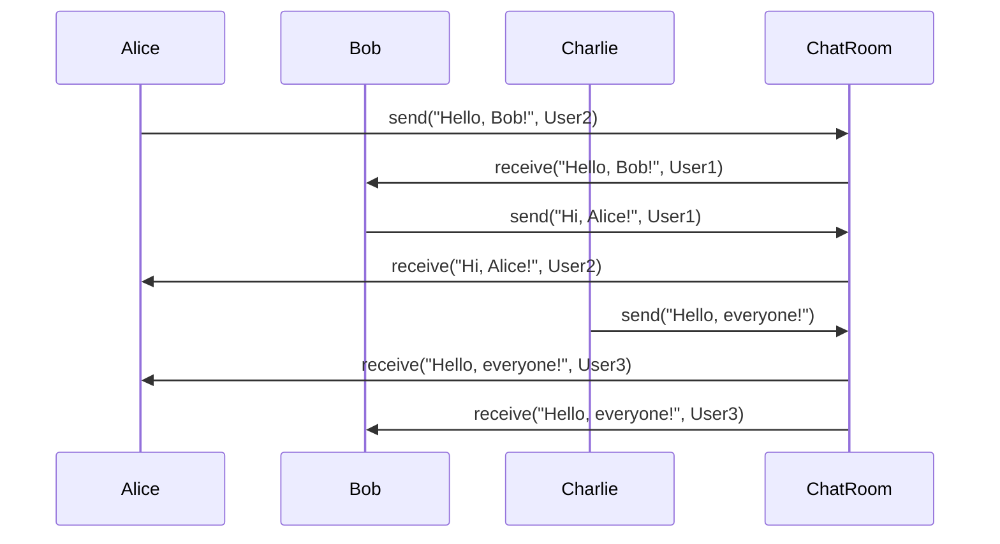

## 5.5.1 Intent and Motivation

In the world of software design, managing interactions between objects can become increasingly complex as systems grow. The Mediator pattern offers a solution by defining an intermediary object that encapsulates how a set of objects interact. This pattern promotes loose coupling by preventing objects from referring to each other explicitly, simplifying communication and preventing chaos in complex systems.

### Understanding the Mediator Pattern

The Mediator pattern is a behavioral design pattern that centralizes communication between objects, allowing them to interact without being tightly coupled. Instead of having objects communicate directly, they send messages to a mediator, which handles the communication logic. This approach reduces dependencies between objects, making the system more flexible and easier to maintain.

#### The Problem of Tightly Coupled Communication

In a tightly coupled system, objects are directly dependent on each other. This can lead to several issues:

- **Complexity**: As the number of interacting objects increases, the complexity of managing their interactions grows exponentially.
- **Maintenance Challenges**: Changes in one object may require changes in others, making the system difficult to maintain.
- **Lack of Flexibility**: Adding or removing objects can be cumbersome, as it may require significant changes in the communication logic.

Consider a chat application where users can send messages to each other. If each user object directly communicates with every other user object, the system becomes difficult to manage as the number of users grows.

### Real-World Analogy: The Air Traffic Controller

A classic analogy for the Mediator pattern is an air traffic controller. In an airport, multiple airplanes need to coordinate their actions, such as landing, taking off, and taxiing. If each airplane were to communicate directly with every other airplane, the situation would quickly become chaotic.

Instead, an air traffic controller acts as a mediator, coordinating the actions of the airplanes. Each airplane communicates with the controller, who then manages the interactions. This centralization simplifies communication and ensures that the system operates smoothly.

### Benefits of the Mediator Pattern

The Mediator pattern offers several benefits:

- **Decoupling Objects**: By centralizing communication, objects are decoupled from each other, reducing dependencies and making the system more modular.
- **Simplified Communication**: The mediator handles the communication logic, simplifying the interactions between objects.
- **Improved Maintainability**: Changes to the communication logic are isolated within the mediator, making the system easier to maintain.
- **Enhanced Flexibility**: Adding or removing objects is straightforward, as the mediator manages the interactions.

### Scenarios Where the Mediator Pattern is Useful

The Mediator pattern is particularly useful in scenarios where:

- **Complex Interactions**: Systems with complex interactions between multiple objects can benefit from centralized communication.
- **Dynamic Systems**: Systems where objects are frequently added or removed can leverage the flexibility of the Mediator pattern.
- **Decoupling Requirements**: When decoupling objects is a priority, the Mediator pattern provides a structured approach.

### Implementing the Mediator Pattern in JavaScript

Let's explore how to implement the Mediator pattern in JavaScript with a simple example. We'll create a chat room where users can send messages to each other through a mediator.

```javascript
// Mediator class
class ChatRoom {
  constructor() {
    this.users = {};
  }

  register(user) {
    this.users[user.name] = user;
    user.chatRoom = this;
  }

  sendMessage(message, from, to) {
    if (to) {
      // Direct message
      to.receive(message, from);
    } else {
      // Broadcast message
      for (let key in this.users) {
        if (this.users[key] !== from) {
          this.users[key].receive(message, from);
        }
      }
    }
  }
}

// User class
class User {
  constructor(name) {
    this.name = name;
    this.chatRoom = null;
  }

  send(message, to) {
    this.chatRoom.sendMessage(message, this, to);
  }

  receive(message, from) {
    console.log(`${from.name} to ${this.name}: ${message}`);
  }
}

// Usage
const chatRoom = new ChatRoom();

const user1 = new User('Alice');
const user2 = new User('Bob');
const user3 = new User('Charlie');

chatRoom.register(user1);
chatRoom.register(user2);
chatRoom.register(user3);

user1.send('Hello, Bob!', user2);
user2.send('Hi, Alice!', user1);
user3.send('Hello, everyone!');
```

In this example, the `ChatRoom` class acts as the mediator, managing the communication between `User` objects. Users can send messages to each other through the chat room, which handles the delivery of messages.

### Implementing the Mediator Pattern in TypeScript

Now, let's see how to implement the Mediator pattern in TypeScript, leveraging its strong typing features.

```typescript
// Mediator interface
interface ChatRoomMediator {
  sendMessage(message: string, from: User, to?: User): void;
  register(user: User): void;
}

// Concrete Mediator class
class ChatRoom implements ChatRoomMediator {
  private users: { [key: string]: User } = {};

  register(user: User): void {
    this.users[user.name] = user;
    user.setChatRoom(this);
  }

  sendMessage(message: string, from: User, to?: User): void {
    if (to) {
      // Direct message
      to.receive(message, from);
    } else {
      // Broadcast message
      for (let key in this.users) {
        if (this.users[key] !== from) {
          this.users[key].receive(message, from);
        }
      }
    }
  }
}

// Colleague class
class User {
  private chatRoom: ChatRoomMediator | null = null;

  constructor(public name: string) {}

  setChatRoom(chatRoom: ChatRoomMediator): void {
    this.chatRoom = chatRoom;
  }

  send(message: string, to?: User): void {
    this.chatRoom?.sendMessage(message, this, to);
  }

  receive(message: string, from: User): void {
    console.log(`${from.name} to ${this.name}: ${message}`);
  }
}

// Usage
const chatRoom = new ChatRoom();

const user1 = new User('Alice');
const user2 = new User('Bob');
const user3 = new User('Charlie');

chatRoom.register(user1);
chatRoom.register(user2);
chatRoom.register(user3);

user1.send('Hello, Bob!', user2);
user2.send('Hi, Alice!', user1);
user3.send('Hello, everyone!');
```

In this TypeScript example, we define a `ChatRoomMediator` interface to enforce the contract for the mediator. The `ChatRoom` class implements this interface, providing the communication logic. The `User` class interacts with the mediator to send and receive messages.

### Visualizing the Mediator Pattern

To better understand the Mediator pattern, let's visualize the interactions between objects using a sequence diagram.



**Diagram Description**: This sequence diagram illustrates the communication flow in the chat room. Users send messages to the `ChatRoom` mediator, which then delivers the messages to the appropriate recipients.

### Try It Yourself

To deepen your understanding of the Mediator pattern, try modifying the code examples:

- **Add a New User**: Register a new user and send messages to them.
- **Implement Group Messaging**: Modify the `sendMessage` method to support group messaging.
- **Enhance the User Interface**: Add methods to display the list of users in the chat room.

### References and Further Reading

- [MDN Web Docs: Design Patterns](https://developer.mozilla.org/en-US/docs/Web/JavaScript/Guide/Design_Patterns)
- [Refactoring Guru: Mediator Pattern](https://refactoring.guru/design-patterns/mediator)
- [W3Schools: JavaScript Objects](https://www.w3schools.com/js/js_objects.asp)

### Knowledge Check

Before moving on, let's reinforce what we've learned:

- **What is the primary purpose of the Mediator pattern?**
- **How does the Mediator pattern promote loose coupling?**
- **Can you think of other real-world scenarios where the Mediator pattern would be beneficial?**

### Embrace the Journey

Remember, mastering design patterns is a journey. The Mediator pattern is just one tool in your toolbox. As you continue to explore and apply design patterns, you'll gain a deeper understanding of how to build robust and maintainable systems. Keep experimenting, stay curious, and enjoy the journey!

## Quiz Time!



### What is the primary role of the Mediator pattern?

- [x] To centralize communication between objects
- [ ] To increase coupling between objects
- [ ] To replace all direct object interactions
- [ ] To simplify object creation

> **Explanation:** The Mediator pattern centralizes communication between objects, reducing dependencies and promoting loose coupling.

### How does the Mediator pattern promote loose coupling?

- [x] By preventing objects from referring to each other explicitly
- [ ] By increasing the number of direct interactions
- [ ] By making objects dependent on each other
- [ ] By creating more complex communication paths

> **Explanation:** The Mediator pattern prevents objects from referring to each other explicitly, reducing dependencies and promoting loose coupling.

### Which real-world analogy is commonly used to explain the Mediator pattern?

- [x] An air traffic controller
- [ ] A teacher in a classroom
- [ ] A conductor in an orchestra
- [ ] A manager in a company

> **Explanation:** An air traffic controller is a common analogy for the Mediator pattern, as it coordinates interactions between airplanes.

### What is a benefit of using the Mediator pattern?

- [x] Simplified communication between objects
- [ ] Increased complexity in object interactions
- [ ] More direct dependencies between objects
- [ ] Reduced flexibility in the system

> **Explanation:** The Mediator pattern simplifies communication between objects by centralizing interaction logic.

### In which scenario is the Mediator pattern particularly useful?

- [x] Systems with complex interactions between multiple objects
- [ ] Systems with only a few objects
- [ ] Systems that require direct object interactions
- [ ] Systems with no need for communication

> **Explanation:** The Mediator pattern is useful in systems with complex interactions between multiple objects, as it centralizes communication.

### What is a potential downside of the Mediator pattern?

- [x] The mediator can become a complex monolith
- [ ] Objects remain tightly coupled
- [ ] Communication becomes more complex
- [ ] It increases the number of objects

> **Explanation:** If not managed properly, the mediator can become a complex monolith, handling too much logic.

### How can the Mediator pattern improve maintainability?

- [x] By isolating communication logic within the mediator
- [ ] By increasing dependencies between objects
- [ ] By making changes to all objects simultaneously
- [ ] By reducing the number of objects

> **Explanation:** The Mediator pattern improves maintainability by isolating communication logic within the mediator, making it easier to manage.

### What is a key characteristic of the Mediator pattern?

- [x] Centralized control logic
- [ ] Direct object interactions
- [ ] Increased dependencies
- [ ] Reduced number of objects

> **Explanation:** The Mediator pattern is characterized by centralized control logic, which manages interactions between objects.

### Can the Mediator pattern be used in dynamic systems?

- [x] Yes
- [ ] No

> **Explanation:** The Mediator pattern is well-suited for dynamic systems where objects are frequently added or removed.

### True or False: The Mediator pattern always reduces the number of objects in a system.

- [ ] True
- [x] False

> **Explanation:** The Mediator pattern does not necessarily reduce the number of objects; it centralizes communication, reducing dependencies.




