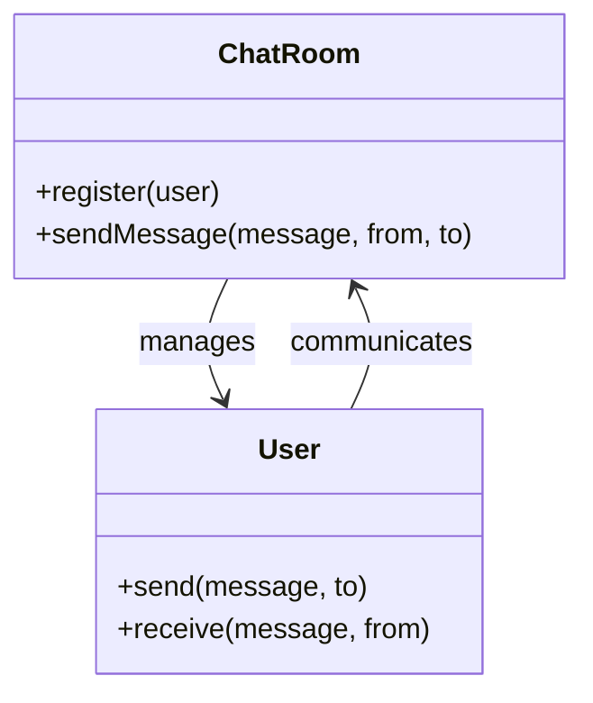

## 5.5.2 Implementation in JavaScript

In this section, we'll explore the Mediator pattern, a behavioral design pattern that facilitates communication between objects, known as Colleagues, by introducing a Mediator object. This pattern is particularly useful in scenarios where direct communication between objects would result in a tangled web of dependencies, making the system difficult to manage and extend. By centralizing communication, the Mediator pattern promotes loose coupling and enhances the maintainability of the code.

### Understanding the Mediator Pattern

The Mediator pattern defines an object that encapsulates how a set of objects interact. This pattern is especially useful in complex systems where multiple objects need to communicate with each other, but direct communication would lead to tight coupling and reduced flexibility.

#### Key Components

1. **Mediator**: The central hub that manages communication between Colleague objects.
2. **Colleagues**: The objects that communicate with each other through the Mediator.

### Implementing the Mediator Pattern in JavaScript

Let's dive into the implementation of the Mediator pattern in JavaScript. We'll build a simple chat room application where users (Colleagues) communicate through a central chat room (Mediator).

#### Step 1: Define the Mediator

First, we'll create a `ChatRoom` class that will act as the Mediator. This class will manage the registration of users and facilitate message exchange between them.

```javascript
class ChatRoom {
  constructor() {
    this.users = {};
  }

  register(user) {
    this.users[user.name] = user;
    user.chatRoom = this;
  }

  sendMessage(message, from, to) {
    if (to) {
      // Direct message to a specific user
      to.receive(message, from);
    } else {
      // Broadcast message to all users
      for (let key in this.users) {
        if (this.users[key] !== from) {
          this.users[key].receive(message, from);
        }
      }
    }
  }
}
```

**Explanation:**

- The `ChatRoom` class maintains a list of users.
- The `register` method adds a user to the chat room and assigns the chat room to the user.
- The `sendMessage` method allows a user to send a message either to a specific user or broadcast it to all users.

#### Step 2: Define the Colleague

Next, we'll create a `User` class that represents a participant in the chat room. Each user can send and receive messages through the chat room.

```javascript
class User {
  constructor(name) {
    this.name = name;
    this.chatRoom = null;
  }

  send(message, to) {
    this.chatRoom.sendMessage(message, this, to);
  }

  receive(message, from) {
    console.log(`${from.name} to ${this.name}: ${message}`);
  }
}
```

**Explanation:**

- The `User` class has a `name` and a reference to the `chatRoom`.
- The `send` method allows the user to send a message through the chat room.
- The `receive` method is called by the chat room to deliver a message to the user.

#### Step 3: Demonstrate the Mediator Pattern

Let's see how the `ChatRoom` and `User` classes work together to facilitate communication.

```javascript
// Create a chat room
const chatRoom = new ChatRoom();

// Create users
const alice = new User('Alice');
const bob = new User('Bob');
const charlie = new User('Charlie');

// Register users to the chat room
chatRoom.register(alice);
chatRoom.register(bob);
chatRoom.register(charlie);

// Users send messages
alice.send('Hello, Bob!', bob);
bob.send('Hi, Alice! How are you?', alice);
charlie.send('Hey everyone!');
```

**Output:**

```
Alice to Bob: Hello, Bob!
Bob to Alice: Hi, Alice! How are you?
Charlie to Alice: Hey everyone!
Charlie to Bob: Hey everyone!
```

**Explanation:**

- We create a `ChatRoom` instance and several `User` instances.
- Each user is registered with the chat room.
- Users send messages to each other through the chat room, demonstrating both direct and broadcast communication.

### JavaScript-Specific Considerations

When implementing the Mediator pattern in JavaScript, consider the following:

- **Event-Driven Architecture**: JavaScript's event-driven nature makes it a natural fit for the Mediator pattern. You can use event listeners and emitters to implement the pattern.
- **Callback Functions**: Use callbacks to handle asynchronous communication between objects.
- **Loose Coupling**: The Mediator pattern helps achieve loose coupling by centralizing communication, which is crucial in JavaScript applications where components often need to interact dynamically.

### Visualizing the Mediator Pattern

To better understand how the Mediator pattern works, let's visualize the communication flow between the Mediator and Colleagues.



**Diagram Explanation:**

- The `ChatRoom` class manages multiple `User` instances.
- Users communicate with each other through the `ChatRoom`, which acts as the Mediator.

### Try It Yourself

Now that we've covered the basics of implementing the Mediator pattern in JavaScript, try modifying the code to add new features:

- **Private Messages**: Implement a feature where users can send private messages that are not broadcasted to all users.
- **User Status**: Add a status feature that shows whether a user is online or offline.
- **Message History**: Implement a message history feature that stores all messages sent in the chat room.

### Knowledge Check

Before we wrap up, let's review some key concepts:

- What is the primary role of the Mediator in the Mediator pattern?
- How does the Mediator pattern promote loose coupling?
- What are some JavaScript-specific considerations when implementing the Mediator pattern?

### Summary

In this section, we've explored the Mediator pattern and its implementation in JavaScript. We've seen how the pattern centralizes communication between objects, promoting loose coupling and enhancing maintainability. By using a Mediator, we can manage complex interactions between objects without creating a tangled web of dependencies.

Remember, this is just the beginning. As you progress, you'll discover more ways to apply the Mediator pattern to build scalable and maintainable applications. Keep experimenting, stay curious, and enjoy the journey!

## Quiz Time!



### What is the primary role of the Mediator in the Mediator pattern?

- [x] To centralize communication between Colleague objects
- [ ] To act as a Colleague object
- [ ] To replace Colleague objects
- [ ] To eliminate the need for communication

> **Explanation:** The Mediator centralizes communication, allowing Colleague objects to interact without knowing each other's details.

### How does the Mediator pattern promote loose coupling?

- [x] By centralizing communication in a single object
- [ ] By eliminating the need for communication
- [ ] By increasing dependencies between objects
- [ ] By making objects communicate directly

> **Explanation:** The Mediator pattern centralizes communication, reducing dependencies between Colleague objects and promoting loose coupling.

### Which method in the ChatRoom class is responsible for sending messages?

- [x] sendMessage
- [ ] register
- [ ] receive
- [ ] send

> **Explanation:** The `sendMessage` method in the ChatRoom class is responsible for sending messages between users.

### What is the purpose of the register method in the ChatRoom class?

- [x] To add a user to the chat room and assign the chat room to the user
- [ ] To send messages between users
- [ ] To remove a user from the chat room
- [ ] To broadcast messages to all users

> **Explanation:** The `register` method adds a user to the chat room and assigns the chat room to the user, enabling communication.

### What is a JavaScript-specific consideration when implementing the Mediator pattern?

- [x] Using event listeners and emitters
- [ ] Using global variables
- [ ] Avoiding asynchronous communication
- [ ] Directly coupling objects

> **Explanation:** JavaScript's event-driven nature makes it suitable for using event listeners and emitters in the Mediator pattern.

### In the provided code example, how do users communicate with each other?

- [x] Through the ChatRoom, which acts as the Mediator
- [ ] Directly, without any intermediary
- [ ] By modifying each other's properties
- [ ] By using global variables

> **Explanation:** Users communicate through the ChatRoom, which acts as the Mediator, centralizing communication.

### What is the benefit of using the Mediator pattern in complex systems?

- [x] It reduces dependencies between objects
- [ ] It increases the complexity of the system
- [ ] It eliminates the need for communication
- [ ] It makes objects communicate directly

> **Explanation:** The Mediator pattern reduces dependencies between objects, making complex systems more manageable.

### Which of the following is NOT a component of the Mediator pattern?

- [ ] Mediator
- [ ] Colleagues
- [x] Singleton
- [ ] Communication

> **Explanation:** The Singleton is not a component of the Mediator pattern. The pattern consists of a Mediator and Colleagues.

### How can the Mediator pattern enhance maintainability?

- [x] By centralizing communication and reducing dependencies
- [ ] By increasing the number of dependencies
- [ ] By making objects communicate directly
- [ ] By eliminating the need for communication

> **Explanation:** Centralizing communication and reducing dependencies enhances maintainability by making the system easier to manage.

### True or False: The Mediator pattern eliminates the need for communication between objects.

- [ ] True
- [x] False

> **Explanation:** The Mediator pattern does not eliminate communication; it centralizes it to reduce dependencies and enhance maintainability.




