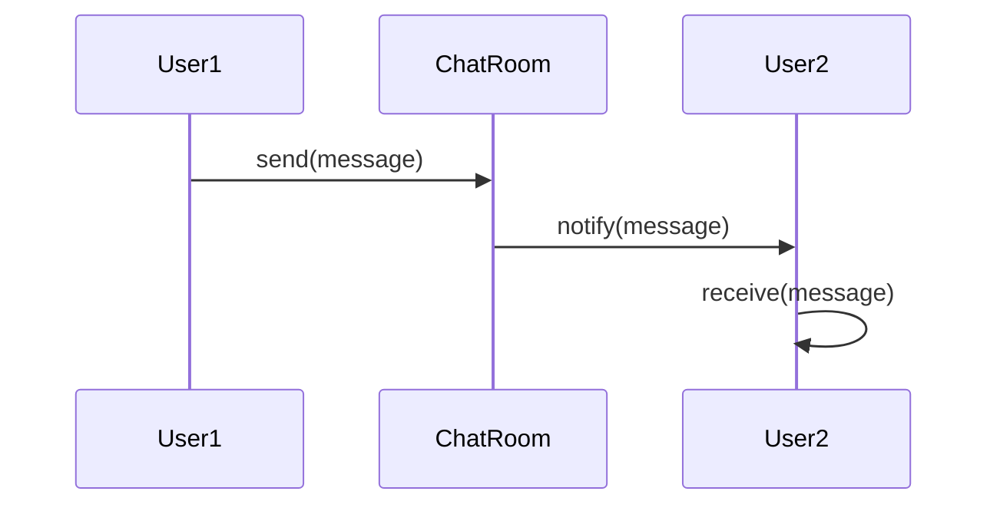

## 5.5.3 Implementation in TypeScript

The Mediator pattern is a behavioral design pattern that facilitates communication between different components (or objects) in a system by introducing a mediator object. This pattern helps reduce the dependencies between communicating components, promoting loose coupling and enhancing maintainability. In this section, we will explore how to implement the Mediator pattern in TypeScript, leveraging its strong typing and interface capabilities.

### Understanding the Mediator Pattern

Before diving into the implementation, let's briefly recap the Mediator pattern. The pattern involves three main components:

1. **Mediator**: The central hub that facilitates communication between different components.
2. **Colleagues**: The components that communicate with each other through the mediator.
3. **Communication Protocol**: The rules and methods through which colleagues interact with the mediator.

By using the Mediator pattern, we can centralize communication logic, making it easier to manage and modify.

### Defining Interfaces for the Mediator and Colleagues

In TypeScript, interfaces play a crucial role in defining contracts between different parts of the system. Let's start by defining interfaces for the Mediator and Colleague components.

```typescript
// Define the Mediator interface
interface Mediator {
    notify(sender: Colleague, event: string): void;
}

// Define the Colleague interface
interface Colleague {
    setMediator(mediator: Mediator): void;
}
```

In the above code, the `Mediator` interface declares a `notify` method that takes a `Colleague` and an event string as parameters. The `Colleague` interface declares a `setMediator` method to establish a connection with the mediator.

### Implementing the Mediator Pattern in TypeScript

Let's implement a simple chat room example using the Mediator pattern. In this example, the chat room acts as the mediator, and users are the colleagues.

#### Step 1: Create the Concrete Mediator

We'll start by creating a `ChatRoom` class that implements the `Mediator` interface.

```typescript
class ChatRoom implements Mediator {
    private users: Map<string, User> = new Map();

    public registerUser(user: User): void {
        this.users.set(user.getName(), user);
        user.setMediator(this);
    }

    public notify(sender: Colleague, event: string): void {
        this.users.forEach((user) => {
            if (user !== sender) {
                user.receive(event);
            }
        });
    }
}
```

In the `ChatRoom` class, we maintain a list of users and provide a `registerUser` method to add users to the chat room. The `notify` method sends messages to all users except the sender.

#### Step 2: Create the Concrete Colleague

Next, we'll create a `User` class that implements the `Colleague` interface.

```typescript
class User implements Colleague {
    private mediator: Mediator | null = null;
    private name: string;

    constructor(name: string) {
        this.name = name;
    }

    public setMediator(mediator: Mediator): void {
        this.mediator = mediator;
    }

    public getName(): string {
        return this.name;
    }

    public send(message: string): void {
        console.log(`${this.name} sends: ${message}`);
        if (this.mediator) {
            this.mediator.notify(this, message);
        }
    }

    public receive(message: string): void {
        console.log(`${this.name} receives: ${message}`);
    }
}
```

The `User` class has methods to send and receive messages. When a user sends a message, it is passed to the mediator, which then notifies other users.

### TypeScript's Type System and Contract Enforcement

TypeScript's type system ensures that the contracts defined by interfaces are adhered to by the implementing classes. This provides several advantages:

- **Clarity**: Interfaces clearly define the expected behavior of components, making the code easier to understand and maintain.
- **Error Checking**: TypeScript's compiler checks for type mismatches and missing implementations, reducing runtime errors.
- **Refactoring**: Strong typing makes it easier to refactor code, as changes to interfaces are propagated throughout the codebase.

### Advantages of Using TypeScript for the Mediator Pattern

Using TypeScript to implement the Mediator pattern offers several benefits:

1. **Strong Typing**: Ensures that all components adhere to the defined interfaces, reducing the likelihood of errors.
2. **Readability**: Interfaces and type annotations improve the readability and maintainability of the code.
3. **Tooling Support**: TypeScript provides excellent tooling support, including autocompletion and error highlighting, which enhances the development experience.

### Enhancing the Mediator with Generics

We can further enhance our mediator implementation by using generics. This allows us to create more flexible and reusable components.

```typescript
// Define a generic Mediator interface
interface GenericMediator<T> {
    notify(sender: T, event: string): void;
}

// Define a generic Colleague interface
interface GenericColleague<T> {
    setMediator(mediator: GenericMediator<T>): void;
}

// Implement a generic ChatRoom
class GenericChatRoom<T extends GenericColleague<T>> implements GenericMediator<T> {
    private colleagues: Set<T> = new Set();

    public registerColleague(colleague: T): void {
        this.colleagues.add(colleague);
        colleague.setMediator(this);
    }

    public notify(sender: T, event: string): void {
        this.colleagues.forEach((colleague) => {
            if (colleague !== sender) {
                colleague.receive(event);
            }
        });
    }
}

// Implement a generic User
class GenericUser implements GenericColleague<GenericUser> {
    private mediator: GenericMediator<GenericUser> | null = null;
    private name: string;

    constructor(name: string) {
        this.name = name;
    }

    public setMediator(mediator: GenericMediator<GenericUser>): void {
        this.mediator = mediator;
    }

    public getName(): string {
        return this.name;
    }

    public send(message: string): void {
        console.log(`${this.name} sends: ${message}`);
        if (this.mediator) {
            this.mediator.notify(this, message);
        }
    }

    public receive(message: string): void {
        console.log(`${this.name} receives: ${message}`);
    }
}
```

In this generic implementation, the `GenericMediator` and `GenericColleague` interfaces use a type parameter `T` to specify the type of colleagues they work with. This allows us to create more flexible and reusable mediator components.

### Try It Yourself

To deepen your understanding, try modifying the code examples:

- **Add a new type of Colleague**: Implement a new class, such as `AdminUser`, that has additional methods or properties.
- **Extend the Mediator**: Add new methods to the `ChatRoom` class, such as private messaging between users.
- **Experiment with Generics**: Create a more complex mediator system using generics to handle different types of events or messages.

### Visualizing the Mediator Pattern

To better understand the flow of communication in the Mediator pattern, let's visualize it using a sequence diagram.



**Diagram Description**: This sequence diagram illustrates the communication flow in the Mediator pattern. When `User1` sends a message, it is passed to the `ChatRoom` (mediator), which then notifies `User2`.

### References and Further Reading

- [MDN Web Docs: TypeScript](https://developer.mozilla.org/en-US/docs/Web/JavaScript/Reference/Global_Objects/TypeScript)
- [TypeScript Handbook](https://www.typescriptlang.org/docs/handbook/intro.html)
- [Design Patterns: Elements of Reusable Object-Oriented Software](https://en.wikipedia.org/wiki/Design_Patterns)

### Knowledge Check

- **What is the primary role of the Mediator in the Mediator pattern?**
- **How does TypeScript's type system enhance the implementation of the Mediator pattern?**
- **What are the benefits of using generics in the Mediator pattern?**

### Embrace the Journey

Remember, mastering design patterns is a journey. As you continue to explore and implement these patterns, you'll gain a deeper understanding of how to create robust and maintainable software systems. Keep experimenting, stay curious, and enjoy the process!

## Quiz Time!



### What is the primary role of the Mediator in the Mediator pattern?

- [x] To facilitate communication between different components
- [ ] To store data for components
- [ ] To create instances of components
- [ ] To enforce security policies

> **Explanation:** The Mediator acts as a central hub that facilitates communication between different components, reducing dependencies and promoting loose coupling.

### How does TypeScript's type system enhance the implementation of the Mediator pattern?

- [x] By ensuring adherence to defined interfaces
- [ ] By increasing runtime performance
- [ ] By automatically generating documentation
- [ ] By simplifying syntax

> **Explanation:** TypeScript's type system ensures that all components adhere to the defined interfaces, reducing the likelihood of errors and improving code clarity.

### What are the benefits of using generics in the Mediator pattern?

- [x] Flexibility and reusability
- [ ] Increased execution speed
- [ ] Simplified syntax
- [ ] Reduced memory usage

> **Explanation:** Generics allow for more flexible and reusable components by enabling the mediator to handle different types of colleagues or events.

### Which method in the `Colleague` interface is responsible for establishing a connection with the mediator?

- [x] setMediator
- [ ] notify
- [ ] send
- [ ] receive

> **Explanation:** The `setMediator` method is responsible for establishing a connection between a colleague and the mediator.

### What is a key advantage of using TypeScript for implementing design patterns?

- [x] Strong typing and error checking
- [ ] Faster execution time
- [ ] Automatic code generation
- [ ] Built-in design patterns

> **Explanation:** TypeScript provides strong typing and error checking, which helps ensure that the code adheres to defined interfaces and reduces runtime errors.

### In the provided code example, what does the `notify` method do?

- [x] Sends messages to all users except the sender
- [ ] Registers a new user in the chat room
- [ ] Receives messages from users
- [ ] Deletes a user from the chat room

> **Explanation:** The `notify` method sends messages to all users except the sender, facilitating communication between users.

### What is the purpose of the `registerUser` method in the `ChatRoom` class?

- [x] To add users to the chat room and set their mediator
- [ ] To send messages to users
- [ ] To remove users from the chat room
- [ ] To log user activities

> **Explanation:** The `registerUser` method adds users to the chat room and sets their mediator, establishing the communication channel.

### How can you extend the functionality of the `ChatRoom` class?

- [x] By adding new methods for private messaging
- [ ] By changing the `notify` method to return a value
- [ ] By removing the `registerUser` method
- [ ] By using a different programming language

> **Explanation:** You can extend the functionality of the `ChatRoom` class by adding new methods, such as private messaging between users.

### What is the main benefit of using interfaces in TypeScript?

- [x] They define clear contracts for components
- [ ] They improve runtime performance
- [ ] They simplify syntax
- [ ] They automatically generate documentation

> **Explanation:** Interfaces define clear contracts for components, ensuring that they adhere to expected behaviors and improving code maintainability.

### True or False: The Mediator pattern increases the coupling between components.

- [ ] True
- [x] False

> **Explanation:** False. The Mediator pattern reduces the coupling between components by centralizing communication logic in a mediator, promoting loose coupling.


