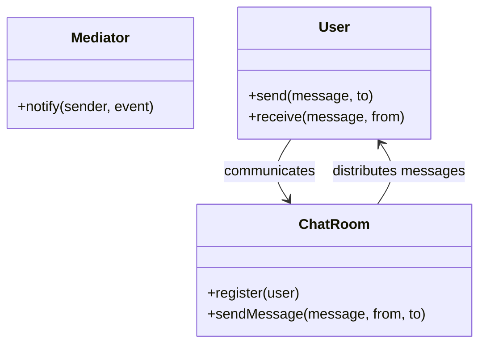

## 5.5.4 Use Cases and Examples

The Mediator pattern is a behavioral design pattern that facilitates communication between different components in a system without them being directly coupled. This pattern is particularly useful in scenarios where multiple objects need to interact with each other, but you want to avoid creating a tangled web of dependencies. By introducing a mediator, you can centralize the communication, making the system easier to manage and extend.

### Simplifying Complex Interactions

The primary advantage of the Mediator pattern is its ability to simplify complex interactions between objects. In a system with many components, direct communication between every pair of components can lead to a maintenance nightmare. The Mediator pattern addresses this by introducing a single point of communication, the mediator, which handles the interactions between components.

**Impact on Code Maintainability and Extensibility**

- **Maintainability**: By reducing the dependencies between components, the Mediator pattern makes the system easier to understand and modify. Changes to one component do not necessitate changes to others, as long as the mediator's interface remains consistent.
- **Extensibility**: Adding new components or modifying existing ones becomes simpler, as you only need to update the mediator to accommodate the new interactions.

### When to Choose the Mediator Pattern

Consider using the Mediator pattern when:

- You have a complex set of interactions between components that are difficult to manage.
- You want to decouple components to improve maintainability and extensibility.
- You need to centralize control over how components interact.

### Practical Applications

Let's explore some practical applications of the Mediator pattern, including chat room implementations, form validation mechanisms, and UI component coordination.

#### Chat Room Implementation

A chat room is a classic example of the Mediator pattern. In a chat application, users send messages to a chat room, which then distributes the messages to all other users. The chat room acts as the mediator, handling the communication between users.

**JavaScript Example**

```javascript
// User class
class User {
  constructor(name, chatRoom) {
    this.name = name;
    this.chatRoom = chatRoom;
  }

  send(message, to) {
    this.chatRoom.sendMessage(message, this, to);
  }

  receive(message, from) {
    console.log(`${from.name} to ${this.name}: ${message}`);
  }
}

// ChatRoom class acting as the Mediator
class ChatRoom {
  constructor() {
    this.users = {};
  }

  register(user) {
    this.users[user.name] = user;
  }

  sendMessage(message, from, to) {
    if (to) {
      // Direct message
      to.receive(message, from);
    } else {
      // Broadcast message
      for (let key in this.users) {
        if (this.users[key] !== from) {
          this.users[key].receive(message, from);
        }
      }
    }
  }
}

// Usage
const chatRoom = new ChatRoom();

const alice = new User('Alice', chatRoom);
const bob = new User('Bob', chatRoom);

chatRoom.register(alice);
chatRoom.register(bob);

alice.send('Hello Bob!', bob);
bob.send('Hey Alice!');
```

**Explanation**: In this example, the `ChatRoom` class acts as the mediator. It manages the registration of users and the sending of messages. Users communicate through the chat room, which handles the distribution of messages.

#### Form Validation Mechanism

In a complex form with multiple fields, validation logic can become cumbersome if each field directly interacts with others. The Mediator pattern can centralize validation logic, making it easier to manage.

**TypeScript Example**

```typescript
// Field interface
interface Field {
  validate(): boolean;
}

// Concrete field classes
class TextField implements Field {
  constructor(private value: string) {}

  validate(): boolean {
    return this.value.trim().length > 0;
  }
}

class EmailField implements Field {
  constructor(private value: string) {}

  validate(): boolean {
    const emailRegex = /^[^\s@]+@[^\s@]+\.[^\s@]+$/;
    return emailRegex.test(this.value);
  }
}

// FormMediator class
class FormMediator {
  private fields: Field[] = [];

  registerField(field: Field) {
    this.fields.push(field);
  }

  validate(): boolean {
    return this.fields.every(field => field.validate());
  }
}

// Usage
const formMediator = new FormMediator();

const nameField = new TextField('John Doe');
const emailField = new EmailField('john.doe@example.com');

formMediator.registerField(nameField);
formMediator.registerField(emailField);

console.log('Form valid:', formMediator.validate());
```

**Explanation**: In this example, the `FormMediator` class acts as the mediator, managing the validation of multiple form fields. Each field implements the `Field` interface, and the mediator coordinates the validation process.

#### UI Component Coordination

In a user interface with multiple components, such as buttons, sliders, and input fields, coordinating interactions can become complex. The Mediator pattern can help manage these interactions by centralizing control.

**JavaScript Example**

```javascript
// UI components
class Button {
  constructor(mediator) {
    this.mediator = mediator;
  }

  click() {
    this.mediator.notify(this, 'click');
  }
}

class Slider {
  constructor(mediator) {
    this.mediator = mediator;
  }

  slide() {
    this.mediator.notify(this, 'slide');
  }
}

// Mediator class
class UIMediator {
  notify(sender, event) {
    if (event === 'click') {
      console.log('Button clicked');
    } else if (event === 'slide') {
      console.log('Slider moved');
    }
  }
}

// Usage
const uiMediator = new UIMediator();

const button = new Button(uiMediator);
const slider = new Slider(uiMediator);

button.click();
slider.slide();
```

**Explanation**: In this example, the `UIMediator` class manages the interactions between UI components. When a component triggers an event, it notifies the mediator, which handles the response.

### Visualizing the Mediator Pattern

To better understand how the Mediator pattern works, let's visualize the interactions between components and the mediator.



**Diagram Explanation**: This diagram illustrates the relationship between users and the chat room in a chat application. The chat room acts as the mediator, facilitating communication between users.

### Try It Yourself

To deepen your understanding of the Mediator pattern, try modifying the examples:

- **Chat Room**: Add a feature to allow users to join or leave the chat room dynamically.
- **Form Validation**: Implement additional field types, such as password or phone number fields, and update the mediator to handle their validation.
- **UI Coordination**: Introduce new UI components, such as checkboxes or dropdowns, and modify the mediator to manage their interactions.

### Knowledge Check

Let's reinforce what we've learned with some questions and exercises.

- **Question**: What are the benefits of using the Mediator pattern in a complex system?
- **Exercise**: Implement a simple chat application using the Mediator pattern in TypeScript.

### Summary

The Mediator pattern is a powerful tool for managing complex interactions between components in a system. By centralizing communication, it simplifies the system's architecture, making it more maintainable and extensible. Whether you're building a chat application, managing form validation, or coordinating UI components, the Mediator pattern can help you achieve a cleaner, more organized codebase.

Remember, this is just the beginning. As you progress, you'll find more opportunities to apply the Mediator pattern and other design patterns to create robust, scalable applications. Keep experimenting, stay curious, and enjoy the journey!

## Quiz Time!



### What is the primary role of the Mediator pattern?

- [x] To centralize communication between components
- [ ] To increase coupling between components
- [ ] To replace all direct interactions with a single object
- [ ] To remove the need for any communication between components

> **Explanation:** The Mediator pattern centralizes communication between components, reducing dependencies and simplifying interactions.

### Which of the following is a benefit of using the Mediator pattern?

- [x] Improved maintainability
- [x] Enhanced extensibility
- [ ] Increased complexity
- [ ] Direct communication between components

> **Explanation:** The Mediator pattern improves maintainability and extensibility by reducing dependencies and centralizing control.

### In a chat application using the Mediator pattern, what role does the chat room play?

- [x] Mediator
- [ ] User
- [ ] Message
- [ ] Observer

> **Explanation:** The chat room acts as the mediator, managing communication between users.

### How does the Mediator pattern affect code complexity?

- [x] It reduces complexity by centralizing interactions
- [ ] It increases complexity by adding more components
- [ ] It has no effect on complexity
- [ ] It simplifies code by removing all interactions

> **Explanation:** The Mediator pattern reduces complexity by centralizing interactions, making the system easier to manage.

### When should you consider using the Mediator pattern?

- [x] When you have complex interactions between components
- [x] When you want to decouple components
- [ ] When you need direct communication between components
- [ ] When you want to increase dependencies

> **Explanation:** The Mediator pattern is useful for managing complex interactions and decoupling components.

### What is a common use case for the Mediator pattern?

- [x] Chat room implementation
- [ ] Singleton pattern
- [ ] Factory pattern
- [ ] Observer pattern

> **Explanation:** A chat room implementation is a common use case for the Mediator pattern, where the chat room acts as the mediator.

### How does the Mediator pattern impact extensibility?

- [x] It enhances extensibility by reducing dependencies
- [ ] It reduces extensibility by increasing dependencies
- [ ] It has no impact on extensibility
- [ ] It limits extensibility by centralizing control

> **Explanation:** The Mediator pattern enhances extensibility by reducing dependencies and centralizing control.

### In a form validation mechanism using the Mediator pattern, what role does the mediator play?

- [x] It coordinates the validation of form fields
- [ ] It acts as a form field
- [ ] It replaces the form
- [ ] It handles user input directly

> **Explanation:** The mediator coordinates the validation of form fields, centralizing the validation logic.

### What is the impact of the Mediator pattern on maintainability?

- [x] It improves maintainability by reducing dependencies
- [ ] It reduces maintainability by increasing dependencies
- [ ] It has no impact on maintainability
- [ ] It complicates maintainability by adding more components

> **Explanation:** The Mediator pattern improves maintainability by reducing dependencies and centralizing control.

### True or False: The Mediator pattern is useful for managing direct communication between components.

- [ ] True
- [x] False

> **Explanation:** The Mediator pattern is used to manage indirect communication between components, reducing dependencies and simplifying interactions.


